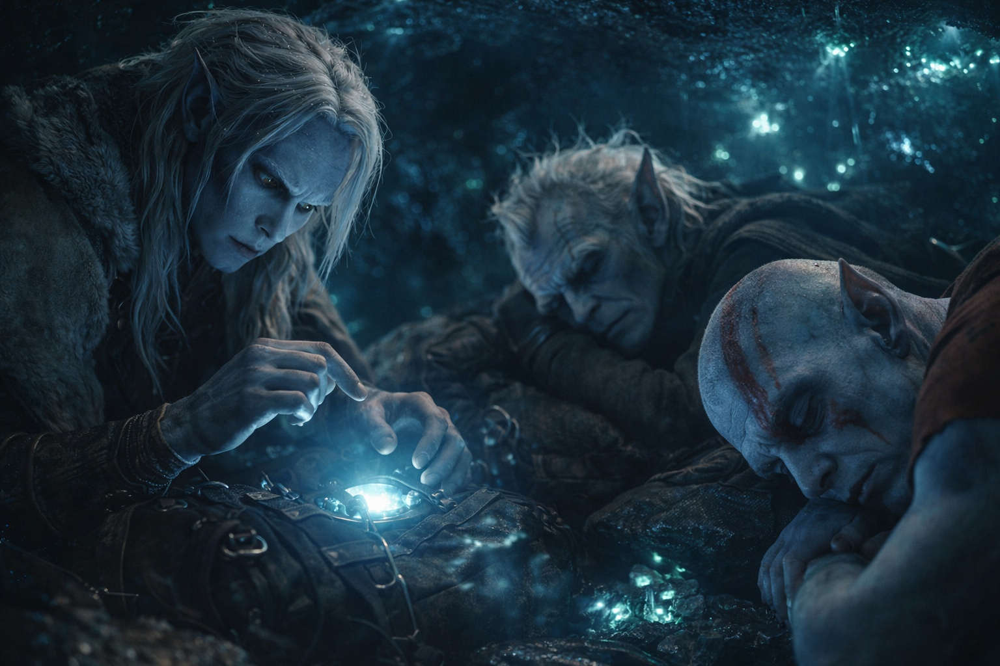
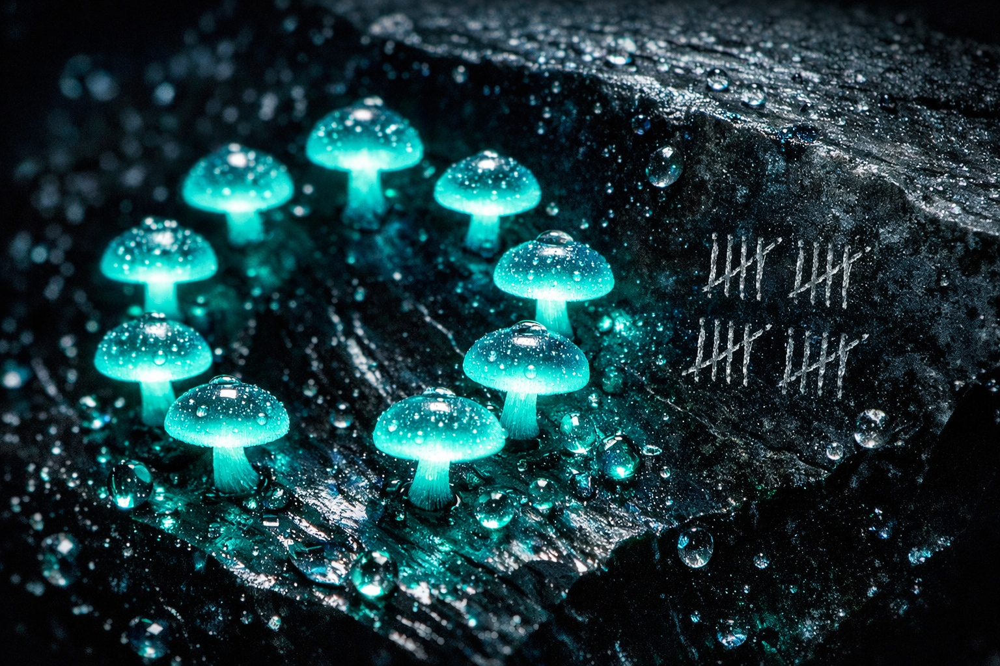
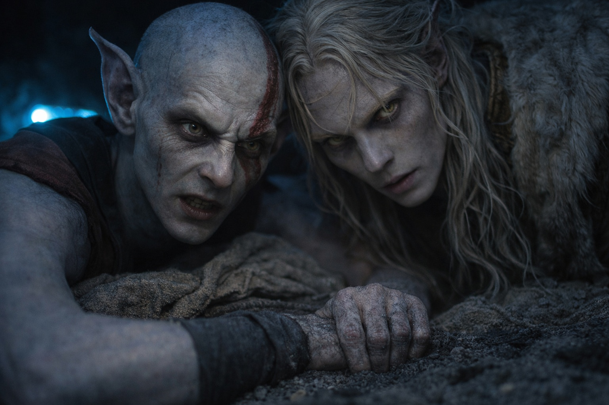
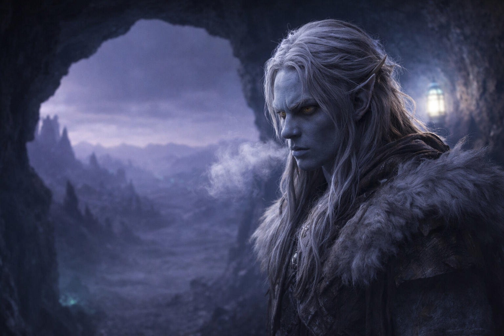

## Capítulo 19 | Parte 1

--- 

Tres días.

Drusniel había contado cada hora. Setenta y dos de ellas, cada una marcada por el pulso lento de hongos bioluminiscentes en las paredes de la cueva, por el sonido rasposo de la respiración de Elion mientras dormía, por los cálculos murmurados de Srietz mientras inventariaba sus provisiones por cuarta vez.

Se turnaban para recoger agua y vigilar la entrada. Entre guardias, Drusniel comprobaba si Elion estaba despierto.

—El color de Elion está mejor. —Drusniel no lo enmarcó como pregunta. Había aprendido que Srietz respondía mejor a observaciones que a consultas.

—Srietz está de acuerdo. Ayer: gris. Hoy: pálido. Mañana, quizás, algo que se acerque a lo normal. —Los largos dedos del goblin separaban carne seca en pilas precisas—. Dos días más. Quizás menos. Luego camina, y nos vamos.

—Cuarenta y ocho horas. —Drusniel miró hacia la luz tenue de la entrada—. Ya llevamos demasiado tiempo aquí.

—Srietz nota la impaciencia. Srietz también nota la sabiduría de esperar. Un explorador recuperado es más valioso que uno muerto.

Elion abrió los ojos. Seguía teniendo las mejillas hundidas, pero ya podía seguir la conversación sin perder el hilo.

—Están hablando de mí.

—Estamos hablando de la partida. —Drusniel se acercó—. ¿Puedes viajar?

—Todavía no. —La voz de Elion era ronca—. Otro día. Quizás dos. La transformación— —Se detuvo, pareció buscar palabras—. Es como ser vuelto del revés y tener que recordar qué partes van dónde. El cuerpo lo sabe, eventualmente. Pero toma tiempo.

—No tenemos tiempo.

—Entonces déjame. —Sin amargura en las palabras. Solo hechos—. Los alcanzaré cuando pueda. Si puedo.

—Eso no va a pasar.

Elion le sostuvo la mirada y después volvió a apoyarse contra la pared.

—Entonces esperamos —dijo Elion—. Y me dices adónde vamos mientras lo hacemos.

Drusniel vaciló. Había aplazado contarles adónde lo había enviado Zaelar. Ahora necesitaban un destino.

—Szoravel. —El nombre se sintió extraño en su lengua—. Un mago drow. Alguien que podría tener respuestas.

—¿Podría?

—Zaelar me envió a buscarlo. —Drusniel observó el rostro de Elion—. El mago que me enseñó. No me fío de él.

—Y sin embargo vas.

—No tengo otras opciones.

Srietz alzó la vista de su inventario. —Srietz conoce a Szoravel. Solo por reputación. El mago drow tiene... protección. Protección poderosa. Srietz no sabe de qué tipo.

—Protegido. —Drusniel dejó que la palabra se asentara. Debería haber sido reconfortante. No lo era—. ¿Qué más sabes?

—Que Szoravel está al este. Que los territorios orientales están en disputa. Que viajar allí requiere pasar por tierras donde tres señores luchan por la dominación. —La voz de Srietz era plana, clínica—. Srietz sobrevivió evitando esas tierras. Srietz no hacía preguntas sobre qué las gobernaba.

—Pero sobreviviste.

—Srietz conocía rutas donde desaparecían menos viajeros. —Le temblaron las orejas—. Las recorría solo. Con dos compañeros cuesta más esconderse.

Elion había cerrado los ojos de nuevo, pero Drusniel podía decir que no estaba dormido. Solo escuchando. Procesando.

—Cuando estés listo —dijo Drusniel—, nos movemos al este. Hacia Szoravel. Hacia cualquier respuesta que espere allí.

—¿Y si las respuestas no son lo que quieres?

—Entonces al menos serán respuestas.

Se acercó a la entrada de la cueva y miró hacia el este.

Más allá de las cuevas vivía un mago que quizá supiera qué le había ocurrido en el mar. Drusniel solo tenía el nombre que le había dado Zaelar y las indicaciones de Srietz.

*Szoravel. El nombre que Zaelar le dio. El destino que se sentía más como una trampa cada vez que pensaba en ello.*

Srietz volvió a contar las raciones. Drusniel permaneció junto a la entrada hasta que Elion pidió agua.

Dirección, al menos. La dirección era algo.

---

**Fin de Capítulo 19.1 —> 19.2: [Dirección: Información](/direccion-informacion/)**
