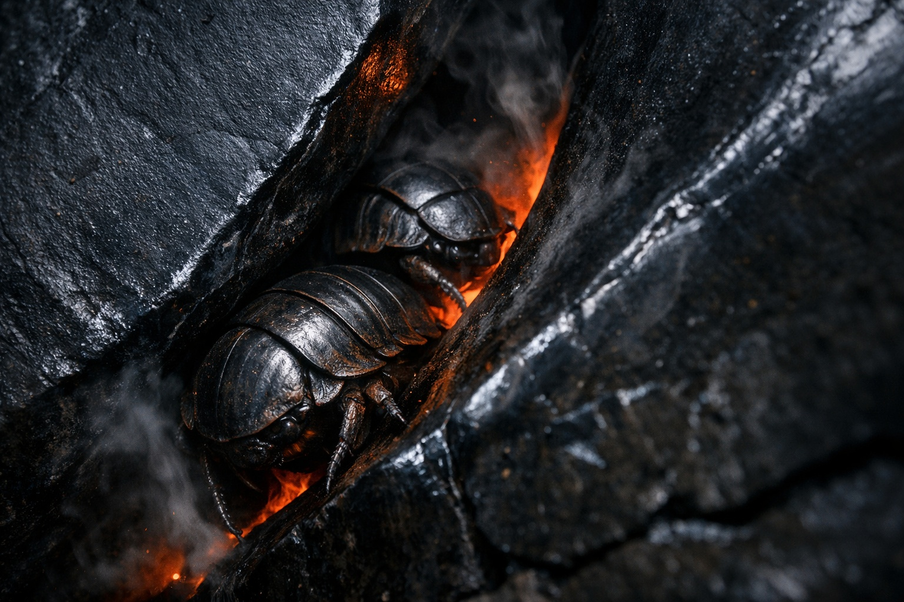
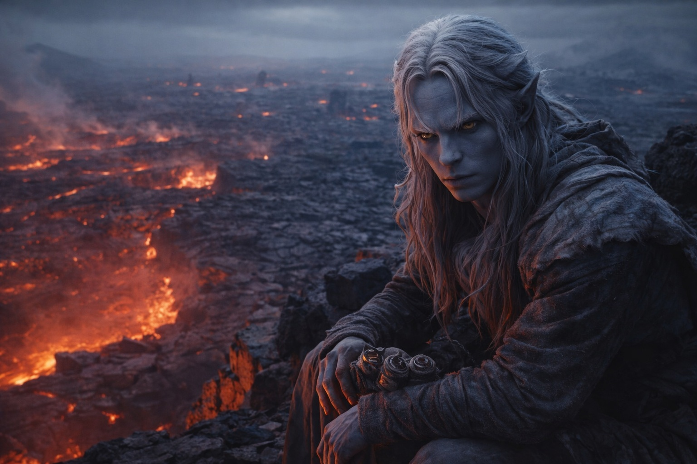

## Capítulo 25 | Parte 2 | El Recuerdo

---

Los observó durante seis horas antes de que regresara el primer fragmento.

Drusniel yacía sobre la cresta con la barbilla en los brazos, observando a los Escoricáscaras. Contaba las entradas que usaban y medía cuánto tardaban en refugiarse antes de cada temblor.

Srietz estaba agachado junto a él, más bajo, casi invisible contra la piedra oscura. Elion se había posicionado en una cresta paralela al este, cubriendo la aproximación desde atrás mientras Drusniel estudiaba el campo adelante.

Las entradas de los túneles eran irregulares. Algunas eran huecos entre placas inclinadas donde la plataforma volcánica se había agrietado y separado, dejando canales apenas más anchos que un torso. Otras eran aberturas propiamente dichas, desgastadas hasta quedar lisas por siglos de tráfico de caparazones, sus bordes pulidos hasta un acabado de vidrio negro por el paso de cuerpos acorazados. Drusniel había identificado nueve entradas en las primeras dos horas. Para la cuarta hora, había encontrado catorce. Los Escoricáscaras las usaban todas, pero no por igual. Tres entradas veían tráfico pesado. El resto eran rutas secundarias, usadas por rezagados o criaturas solitarias moviéndose contra el flujo.

En la quinta hora, el suelo se estremeció.

No el chasquido agudo de una placa partiéndose. Un pulso bajo y ondulante que viajó a través del basalto como un latido, profundo y lento, durando cuatro o cinco segundos antes de desvanecerse. Los Escoricáscaras reaccionaron antes de que el temblor alcanzara su pico. Cada criatura en la superficie se giró hacia la entrada de túnel más cercana y se movió, no con pánico sino con propósito, sus patas segmentadas llevándolas sobre el terreno roto con la certeza fluida de animales siguiendo una rutina que habían ejecutado diez mil veces. A los noventa segundos del inicio del temblor, el campo de placas estaba vacío. Cada caparazón bajo tierra. Cada entrada inmóvil.

Drusniel contó.

El silencio duró once minutos. Luego el primer Escoricáscara emergió de una entrada principal, probó el aire con sus patas delanteras y comenzó a cruzar el campo de nuevo. Otros siguieron. En tres minutos, la superficie estaba poblada otra vez, las columnas reformándose como si nada hubiera pasado.

—Lo sabían —dijo Drusniel.

—Srietz ha estado observando el mismo patrón. —La voz del goblin era apenas superior a un susurro—. Las criaturas sienten el temblor antes de que alcance su intensidad máxima. Se retiran. Esperan. Emergen cuando el ciclo pasa. Srietz cuenta un promedio de doce minutos bajo tierra por evento.

Drusniel observó una columna de Escoricáscaras fluir hacia una entrada secundaria. Las criaturas se movían en fila india a través de un hueco entre dos placas, cada una pausando en el umbral durante medio segundo antes de comprometerse con el descenso. El hueco era estrecho. Apenas lo bastante ancho para un caparazón del tamaño de dos puños juntos. Apenas lo bastante ancho para una persona, de lado, con la mochila quitada.

El fragmento emergió entonces. No gradualmente, no como un recuerdo lento. Llegó completo, del modo en que un nombre vuelve horas después de que has dejado de intentar recordarlo.

*Sigue a los pequeños por los caminos de fuego. Ellos conocen los senderos que se enfrían.*

Observó cómo las criaturas entraban en los túneles. Si aquellos eran los caminos de fuego, la inscripción describía una forma de cruzar el campo.

Seguirlos.

Recordó la siguiente línea que había logrado leer.

*...cuando cambie el calor, muévete. La piedra respira y se cierra...*

La inscripción no daba tiempos. Tendría que medir las pausas y comprobar si los túneles se enfriaban al mismo tiempo que la superficie.

—Srietz.

—Srietz escucha.

—La poción de velocidad que preparaste después de las cuevas. ¿Cuánto dura?

El goblin se quedó callado. Sus orejas rotaron hacia adelante, lo que en Srietz significaba que el cálculo había pasado de observación a preocupación personal. —De doce a quince minutos, dependiendo de la masa corporal y la tasa metabólica. Drusniel es más grande que los sujetos para los que Srietz calibró originalmente. Doce minutos es la estimación segura.

Doce minutos podían bastar para cruzar si encontraba una ruta lo bastante corta.

—¿Y el compuesto de salto?

—Salva fisuras de hasta dos metros y medio en horizontal, uno y medio en vertical, con una sola dosis. Srietz lo formuló para exactamente los huecos descritos en... —El goblin se detuvo. Sus ojos amarillos se abrieron—. Srietz los preparó después de que Drusniel encontrara los escritos de las cavernas.

—Sí.

—Los escritos que Srietz no leyó. Los escritos que Drusniel memorizó y sobre los que Srietz eligió no preguntar, porque Srietz recomendó enfocarse en la supervivencia primero y los misterios cósmicos después.

—Sí.

Drusniel buscó en su mochila. Los viales estaban donde los había guardado semanas atrás, envueltos en tela entre la vejiga de agua y los estabilizadores de cristal de Nyxara. Dos recipientes de vidrio, sellados con cera, uno ámbar y uno verde pálido. Los había cargado a través del jardín negro, a través del territorio de Nyxara, a través de cuatro días de vigilancia de Talryn. Los había cargado sin saber cuándo importarían. Srietz los había preparado después de leer la lista de ingredientes que Drusniel proporcionó, ingredientes encontrados en el sistema de cuevas, procesados sin preguntas sobre su propósito previsto.

Los levantó. El líquido ámbar atrapó el brillo rojo de las fisuras debajo, tornándose del color de sangre vieja.

Srietz miró fijamente los viales del modo en que miraba los libros de cuentas que no cuadraban. —Esos son trabajo de Srietz. Srietz recuerda la formulación. Pero Srietz no sabía para qué eran.

—Yo tampoco. No hasta ahora.

El tercer fragmento completó el cuadro.

*...donde la cornisa negra se divide, no tomes el camino inferior...*

Estudió las aberturas de abajo. Alguien había dejado advertencias sobre un lugar como aquel. Aún tenía que encontrar la cornisa partida y averiguar qué hacía peligroso el camino inferior.

Las notas estaban incompletas. Tendría que comprobarlas una a una.

Las pociones podían ayudarlo a cruzar huecos por los que las criaturas trepaban sin esfuerzo. Pero antes necesitaba saber adónde llevaban los túneles.

Elion apareció en la cresta. Se movió sin sonido, asentándose junto a Drusniel y escaneando el campo de placas con la evaluación serena de alguien catalogando amenazas.

—Sistema de túneles —dijo Elion—. Conté once entradas desde mi posición. Las criaturas bajan antes de los temblores y vuelven a subir después.

—Catorce entradas desde aquí. Y sé cómo usarlas.

Elion lo miró. La expresión del cambiaformas era difícil de leer en el mejor de los casos. Ahora llevaba algo cercano a la cautela.

—¿Desde cuándo lo sabes?

—No lo sabía. No hasta ahora. —Drusniel giró uno de los viales entre sus dedos—. Los escritos de las cavernas. Los que encontré mientras tú estabas explorando. Los fragmentos que memoricé.

La mandíbula de Elion se tensó. —Nunca los mencionaste.

—Sigue a las criaturas pequeñas. Muévete cuando cambie el calor. Evita el camino inferior donde se divide la cornisa. —Señaló hacia abajo—. Esas eran las advertencias. Creo que hablan de un lugar como este.

Elion absorbió esto en silencio. Observó una columna de Escoricáscaras entrar en un túnel principal, cada criatura pausando en el umbral antes de descender. Luego miró los viales en la mano de Drusniel.

—Velocidad y salto.

—Srietz los preparó con ingredientes que encontramos en las cuevas. Después de que yo describiera los escritos.

—Srietz no sabía para qué eran.

—Yo tampoco. Pensé que podían servirnos si encontrábamos el terreno que describían las notas.

Srietz se había arrastrado más cerca durante el intercambio. Las orejas del goblin estaban pegadas, sus dedos trabajando unos contra otros en el gesto inconsciente que hacía cuando los costos excedían las proyecciones.

—Srietz señala un problema. —Señaló hacia una entrada secundaria donde dos Escoricáscaras se apretaban para pasar en secuencia, cada uno inclinando su caparazón para caber por el hueco—. Los túneles se estrechan. Las criaturas comprimen sus caparazones para pasar por restricciones que detendrían cualquier cosa más grande. Srietz estima que los puntos más estrechos permiten el paso para una persona. De lado. Sin equipo.

Drusniel ya lo había visto. Los puntos estrechos, las secciones de compresión donde el ancho del túnel bajaba a lo que parecían cuarenta y cinco centímetros de espacio libre. Una persona. No un grupo. No tres viajeros moviéndose juntos a través de un cruce coordinado.

Una carrera en solitario.

Archivó ese hecho junto con los demás y no dijo lo que significaba. No todavía.

Debajo de la cresta, una figura se movió al otro extremo del campo de placas. No era un Escoricáscara. Una persona, encorvada bajo una mochila pesada, eligiendo una ruta a lo largo del perímetro donde las fisuras eran poco profundas y el suelo era mayormente estable. Un viajero, dirigiéndose al sur, bordeando la zona volcánica en lugar de cruzarla.

El viajero los notó en la cresta. Se detuvo. Evaluó. Luego alteró ligeramente el curso, acercándose lo suficiente para hablar pero no lo suficiente para amenazar. La aproximación de un comerciante, cautelosa y calculada. Srietz reconoció la postura antes que Drusniel.

La extraña era una medio-orco, ancha y curtida por el viento, vestida con cueros remendados que habían visto más reparaciones que costura original. Se detuvo a diez metros debajo de la cresta y los miró con los ojos cansados de alguien que había estado caminando durante días.

—El territorio de Szoravel comienza a una legua al norte —dijo sin saludar—. Si es ahí adonde se dirigen.

—¿Qué sabe de él? —preguntó Drusniel.

La medio-orco se acomodó la mochila. —Depende de quién pregunta y qué ha oído. —Los estudió por un momento, leyendo al grupo del modo en que los viajeros en Wyrmreach siempre se leen entre sí: rápido, a fondo, buscando aquello que podría matarlos—. Ayuda a los que llegan hasta él. Esa es la historia. Sana a los enfermos. Comercia justamente. Mantiene la paz en su territorio.

—¿Y?

—Y la gente que lo visita regresa diferente. —Su mandíbula trabajó alrededor de la palabra—. No mal. No dañada. Solo diferente. Más callada. Como si hubieran dejado algo atrás y todavía no lo extrañaran. —Miró el campo de placas—. ¿Planean cruzar por los túneles?

—Lo estamos considerando.

—No lo consideren mucho. Los ciclos se están acortando. Hace dos días el intervalo entre temblores era de veinte minutos. Ayer fue de quince. Hoy parece que es doce. —Se echó la mochila al hombro—. Lo que sea que hay debajo se está despertando. O se está acomodando. Difícil distinguir la diferencia aquí abajo.

Se marchó sin despedirse, dirigiéndose al sur por el perímetro, su silueta encogiéndose contra el basalto gris hasta que la reverberación del calor la tragó.

Drusniel miró el campo de placas. A los Escoricáscaras moviéndose en sus columnas pacientes. A las entradas de los túneles, bocas oscuras en piedra más oscura. A los viales en su mano, ámbar y verde, preparados con ingredientes de caverna por un goblin que no había preguntado por qué.

Las advertencias le habían dado un punto de partida. No le dirían cuándo era seguro entrar en aquel túnel.

Y las direcciones conducían a través del fuego.

Drusniel envolvió los viales en tela y los devolvió a su mochila. Los necesitaría pronto. Los ciclos se estaban acortando. La ventana se estaba cerrando.

Tendría que hacer el primer cruce solo.

Volvió a medir los intervalos.

Abajo, los Escoricáscaras entraron en los túneles. Drusniel esperó a que saliera el primero.

---

**Fin del Capítulo 25.2  —> 25.3: [El Acercamiento: La Preparación](/el-acercamiento-la-preparacion/)**
