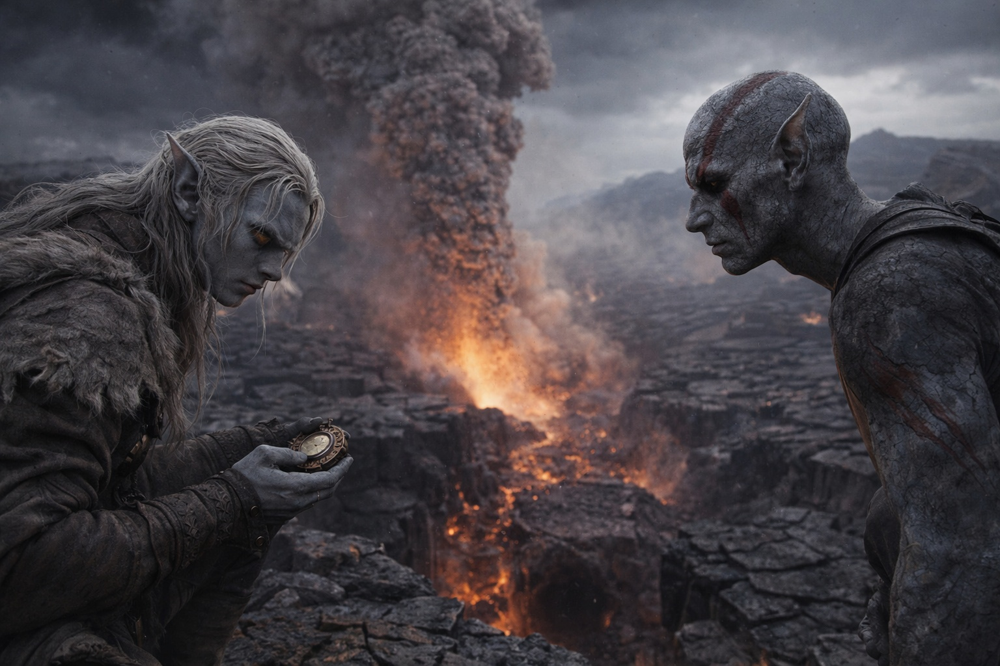
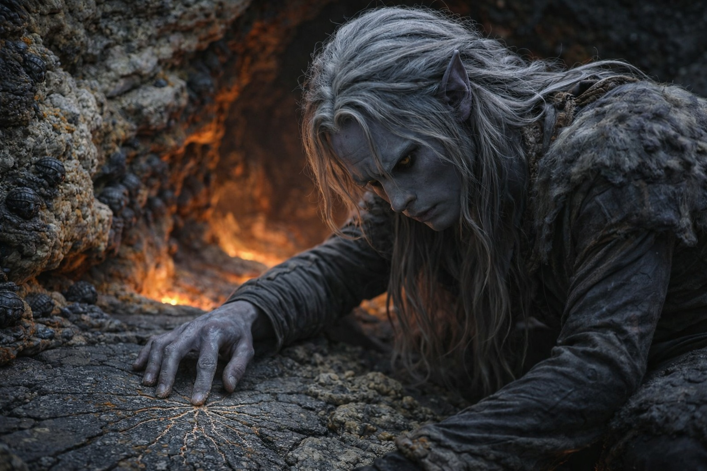
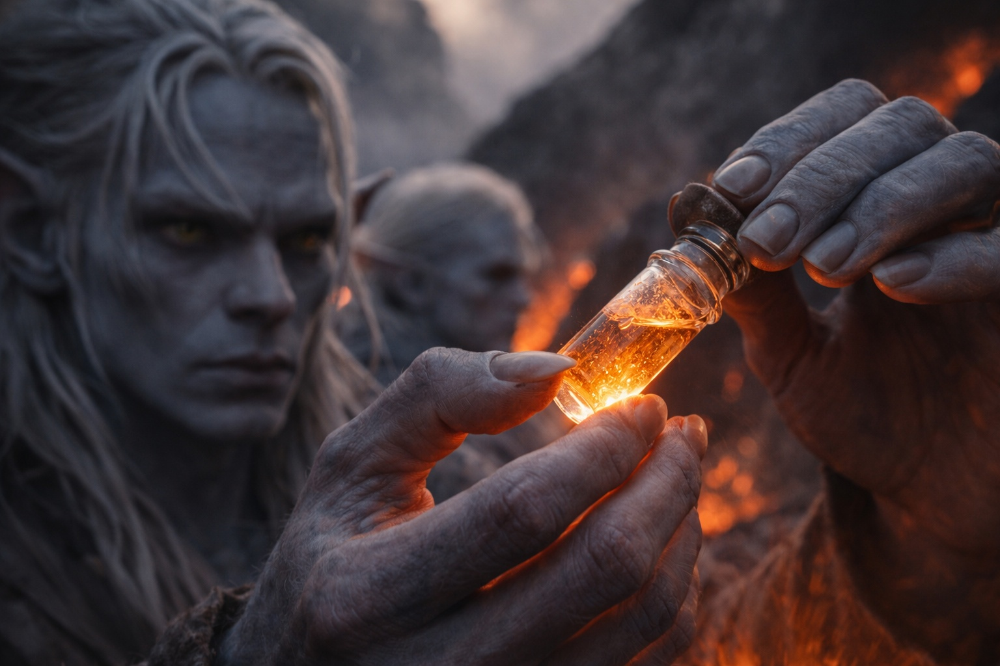
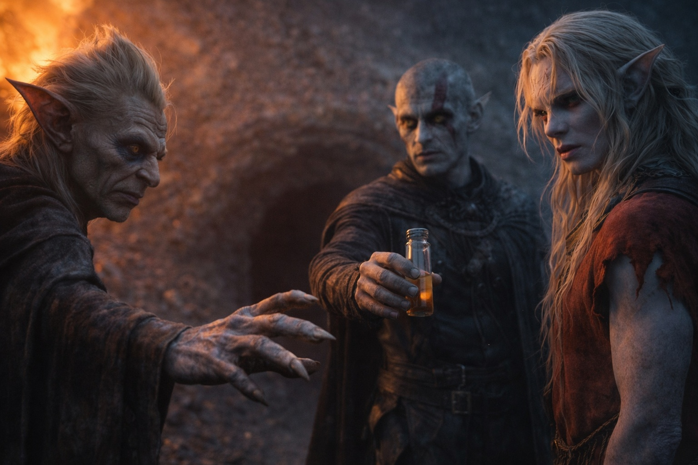
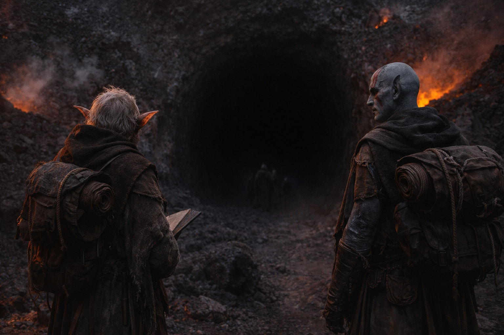

## Capítulo 25 | Parte 4 | El Umbral

---

El extraño vino del sur, solo, sin cargar nada más que un odre de agua y un cuchillo de cinturón desgastado hasta la astilla.

Los encontró en su campamento sobre la entrada del túnel, donde habían pasado dos días cronometrando el ciclo de respiración del volcán y mapeando las rutas de los Caparazones de Fuego a través del basalto. Entró a la luz de la fogata sin anunciarse, lo cual en Wyrmreach era o confianza o agotamiento. Sus botas estaban agrietadas y pálidas por el polvo mineral. Sus ojos recorrieron a los tres, catalogaron los suministros, las bobinas de cuerda, los viales en el portaviales del cinturón de Srietz, y se posaron en la boca del túnel abajo.

—¿Van a entrar? —preguntó.

Drusniel no respondió. Elion cambió su peso para ponerse entre el extraño y las mochilas.

—Entonces van hacia Szoravel. —El hombre se sentó sin ser invitado, del modo en que lo hacen los viajeros cuando han caminado lo suficiente como para que la cortesía se vuelva opcional. Miró al volcán—. No son los primeros.

Las orejas de Srietz se inclinaron hacia adelante. —Srietz agradecería los detalles.

El extraño bebió de su odre. Se limpió la boca. Miró al goblin como decidiendo si los detalles valían el esfuerzo.

—Vengo de un asentamiento al este de aquí. Doce días atrás. Comerciábamos con gente que había estado en el territorio de Szoravel. —Hizo una pausa—. Algunos de ellos hablaban bien del lugar. Decían que Szoravel acoge a cualquiera que haga el cruce. Los alimenta. Les da alojamiento. Los pone a trabajar, pero trabajo justo. Decían que ayuda a quienes llegan hasta él.

La pluma de Srietz rascó contra su cuaderno. Drusniel observaba las manos del extraño. Estaban firmes. La información salía plana, entregada sin inversión emocional.

—Otros decían otra cosa —continuó el extraño—. Decían que los que volvían estaban cambiados. Más callados. Decían que Szoravel usa a la gente hasta que están gastados. Toma lo que saben, lo que pueden hacer, y cuando no queda nada que tomar, se van. Si se van. —Se encogió de hombros—. Yo no fui. Voy hacia el oeste.

—¿Cuál versión cree el extraño? —preguntó Srietz.

—Ambas. Ninguna. —El hombre se puso de pie. Había estado sentado menos de dos minutos—. Creo que la gente ve lo que necesita ver. Los que querían un salvador encontraron uno. Los que esperaban un depredador encontraron eso también. —Miró a Drusniel por primera vez con verdadera atención—. Eres drow.

—Sí.

—Entonces ya sabes lo que es cuando todos los que describen un lugar se están describiendo a sí mismos.

Se marchó por donde había venido. Al sur, hacia la oscuridad, el polvo mineral en sus botas atrapando el tenue brillo anaranjado de las grietas en el basalto hasta que la distancia lo tragó. No había querido nada. No se había llevado nada. Había dejado atrás dos versiones de un lugar que no podían ser ambas verdaderas, y podían ser ambas acertadas.

Srietz miró fijamente su cuaderno. Había escrito dos líneas. No tachó ninguna.

—Ayuda a quienes llegan hasta él —repitió el goblin. Luego, más bajo—: Usa a la gente hasta que están gastados.

—¿Importa? —dijo Elion. Su voz era tranquila. No miraba a ninguno de los dos. Estaba observando la entrada del túnel abajo, la boca oscura en el basalto donde las rutas de los Caparazones de Fuego convergían—. Vamos de todos modos.

Nadie discutió. No había nada que discutir.

Drusniel se paró en la cresta sobre el túnel y observó al volcán respirar.

El ciclo se había vuelto familiar tras dos días de observación. La presión se acumulaba en oleadas que podía sentir a través de las suelas de sus botas, un lento tensarse de la piedra, el calor subiendo en las grietas entre las losas hasta que el aire sobre ellas temblaba y apestaba a azufre. Luego la erupción: no la clase catastrófica, no la montaña desgarrándose, sino una exhalación controlada de gas supercalentado y ceniza que rugía a través del sistema de respiraderos durante entre tres y siete minutos. El suelo temblaba. Los Caparazones de Fuego se retiraban a sus túneles más profundos. El aire se volvía irrespirable.

Luego se detenía. La presión caía. Los temblores se desvanecían hasta la nada, y por una ventana que duraba entre once y catorce minutos, el sistema de túneles se enfriaba lo suficiente para sobrevivir. Los Caparazones de Fuego emergían primero, fluyendo desde sus refugios profundos hacia los pasajes de nivel medio, probando la piedra con sus patas acorazadas, leyendo temperaturas a través de un contacto que ampollaba cualquier piel expuesta.

Cuando los Caparazones de Fuego se movían, la ventana estaba abierta.

Se arrodilló junto a la entrada del túnel una última vez. La piedra alrededor de la abertura estaba cubierta de depósitos minerales, blancos y amarillos y rojo herrumbre, firmas químicas de lo que el volcán exhalaba. Trazó las grietas con los dedos. El basalto aquí era viejo, fracturado en un patrón radial que sugería que esta abertura había existido durante siglos, ensanchada y estrechada por innumerables ciclos pero nunca sellada. Los Caparazones de Fuego habían desgastado el interior hasta dejarlo liso con generaciones de paso. Sus rutas estaban talladas en la roca como venas.

El túnel descendía en un ángulo suave durante los primeros diez metros, luego giraba a la izquierda y hacia abajo. Más allá de la curva, oscuridad. El tráfico de Caparazones de Fuego se movía a través de esa oscuridad por senderos que había mapeado desde fuera, senderos en los que tendría que confiar una vez que la luz de la entrada se desvaneciera a sus espaldas.

Se puso de pie y miró al este, hacia el territorio que no podía ver. Szoravel. Lo que fuera eso. Quienquiera que fuera. Un ayudante o un cosechador o algo para lo que la palabra aún no se había inventado.

Zaelar lo había enviado aquí.

El pensamiento llegó como siempre llegaba, sin invitación, asentándose en el espacio silencioso entre una decisión y la siguiente. Zaelar, que medía todo, que gastaba palabras como moneda y nunca pagaba de más. Zaelar lo había señalado hacia Szoravel. Le había dado la ruta, los consejos de preparación, las advertencias que no eran del todo advertencias. Había empaquetado el viaje como necesario y dejado que Drusniel sacara sus propias conclusiones sobre lo que necesario significaba.

¿Había sido bondad? ¿Descarte? ¿La evaluación honesta de un pragmático que veía un camino y una persona adecuada para recorrerlo?

Drusniel no lo sabía. La pregunta se asentó en su pecho junto a todo lo demás que cargaba, un peso más entre muchos, y la dejó estar. No cambiaba el túnel. No cambiaba la ventana. No cambiaba el hecho de que en unos minutos el volcán exhalaría, y después de que exhalara, él iría.

La montaña rugió.

Bajo al principio, una vibración más sentida que oída, subiendo a través de la plataforma de piedra donde estaban hasta que le zumbó en los dientes y la grava suelta alrededor de la entrada del túnel danzó contra el basalto. Los Caparazones de Fuego desaparecieron. Todos ellos, idos en segundos, retirándose a los refugios profundos con una precisión coordinada que hacía que la retirada pareciera ensayada. La superficie del campo de placas se vació. El calor brotó de las grietas en oleadas visibles, y el rugido comenzó, distante y creciendo, el sonido de la presión encontrando su liberación a través de canales tallados por diez mil erupciones anteriores.

Esperaron. Srietz tenía su reloj fuera, contando. Elion estaba inmóvil, observando la entrada del túnel del modo en que observaba a los depredadores, con la atención concentrada de alguien que comprendía que aquello que estudiaba podía matarlo.

La erupción alcanzó su pico. El suelo tembló con la fuerza suficiente para que Drusniel ampliara su postura y pusiera una mano contra la pared de la cresta. La ceniza brotó del sistema de respiraderos, gris y amarilla, apestando a huevos podridos y hierro caliente. El sonido llenó el mundo durante cuatro minutos y treinta segundos según el conteo de Srietz.

Luego se detuvo.

El silencio cayó sobre el campo de placas como un aliento contenido. La piedra quedó quieta bajo sus botas mientras el calor menguaba rápido, y desde los túneles profundos los primeros Caparazones de Fuego emergieron, probando, degustando, fluyendo hacia los pasajes que se enfriaban.

—Ahora —dijo Srietz. Su voz era firme pero sus orejas estaban pegadas contra su cráneo, presionadas tan fuerte que desaparecían en su cabeza. No miraba la montaña—. La ventana está abierta. Once minutos como mínimo. Trece si el ciclo anterior es predictivo.

Drusniel sacó el primer vial de su cinturón. Trabajo de Srietz. El compuesto de velocidad, mezclado de reactivos que el goblin había estado refinando durante días, calibrado para la fisiología drow tan cercano como las condiciones de campo lo permitían. El líquido dentro era ámbar pálido, viscoso, y atrapaba el brillo anaranjado de los respiraderos que se enfriaban como una brasa atrapada.

—Srietz ha revisado la dosificación. —El goblin habló sin mirar arriba. Estaba revisando su reloj de nuevo, recontando, recalibrando—. Un vial. Efecto completo en noventa segundos. Duración aproximada de ocho minutos a eficacia máxima, disminuyendo durante tres. Los efectos secundarios incluyen frecuencia cardíaca elevada, visión periférica reducida, y un período de recuperación durante el cual Drusniel será en gran parte inútil. —Una pausa—. Srietz no aprueba.

—Anotado.

—A Srietz le gustaría registrar, para el expediente, que enviar a una persona a un sistema de túneles volcánicos con una sola dosis de un compuesto no probado y un mapa basado en el comportamiento de insectos no es un plan. Es un acto de fe disfrazado de logística.

Drusniel descorchó el vial. El compuesto olía agudo, herbal por debajo y químico por encima, con una amargura que llegó al fondo de su garganta antes de que el líquido tocara sus labios.

—Si no regreso —dijo.

—Srietz pensará en algo. —La voz del goblin era áspera—. Srietz siempre lo hace.

Por un momento ninguno de los dos se movió. Srietz extendió la mano hacia el brazo de Drusniel. Sus dedos con garras se detuvieron a un centímetro de la manga, se mantuvieron ahí, luego se retiraron. Guardó la mano en el bolsillo de su chaleco como si esa hubiera sido la intención todo el tiempo.

Elion no dijo nada. El cambiaformas estaba tres pasos atrás, su piel gris del color de la piedra a su alrededor, sus ojos ámbar anaranjados fijos en Drusniel con una expresión que no contenía palabras porque las palabras habrían requerido admitir lo que esto era. El que abrió la jaula caminaba hacia la oscuridad, y Elion no podía seguir. Sus manos colgaban a los costados. No se movió para detenerlo. No deseó suerte ni ofreció consejo ni dijo ninguna de las cosas que la gente dice cuando alguien con quien ha caminado está a punto de caminar a donde ellos no pueden ir.

Observó. Eso era suficiente. Eso era todo lo que tenía.

Drusniel bebió.

El compuesto golpeó su torrente sanguíneo en una oleada que comenzó en la base de su cráneo y se extendió hacia afuera como una grieta propagándose a través del vidrio. Su frecuencia cardíaca se disparó. El mundo se afiló, los bordes endureciéndose, los colores intensificándose hasta que el brillo anaranjado de los respiraderos parecía casi blanco y cada fractura en el basalto resaltaba en relieve como si estuviera tallada a dos centímetros de profundidad. El sonido se clarificó. Podía oír a los Caparazones de Fuego en el túnel abajo, el chasquido de patas acorazadas sobre piedra, docenas de ellos moviéndose por pasajes en los que estaba a punto de entrar.

Noventa segundos. Sintió el compuesto alcanzar su efecto completo como una llave girando en una cerradura, sus músculos inundándose de una disposición que bordeaba el dolor.

Miró a Srietz. El goblin se había girado, su cuaderno abierto, escribiendo algo que nunca le mostraría a nadie.

Miró a Elion. El cambiaformas encontró sus ojos y los sostuvo. Una respiración. Dos.

Luego Drusniel se giró, saltó por la cresta y corrió.

La boca del túnel lo engulló en tres zancadas. La luz de la entrada se encogió detrás de él mientras el pasaje giraba, anaranjado desvaneciéndose a gris desvaneciéndose a negro, y la oscuridad se cerró sobre él como agua sobre una piedra lanzada. Sus botas golpeaban el basalto desgastado por los Caparazones de Fuego en un ritmo que emparejaba su latido, rápido y acelerando, y las criaturas se dispersaban de su camino en olas de chirridos, y el calor subía a su alrededor, y la piedra tragaba cada sonido excepto el martilleo de su propia sangre.

Detrás de él, en la boca del túnel, Srietz y Elion observaron la entrada hasta que el último eco de sus pasos murió.

La oscuridad se lo llevó todo.

La montaña inhaló.

---

**Fin del Capítulo 25.4  —> 26.1: [La Grieta: La Duda](/la-grieta-la-duda/)**
