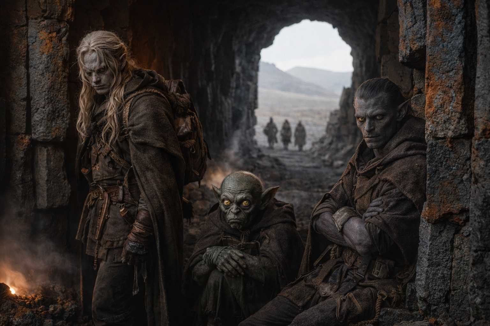

## Capítulo 25 | Parte 3 | La Preparación

---

Elion regresó al anochecer, que en Wyrmreach significaba que el rojo ambiental se oscurecía medio tono y el vapor de las fisuras atrapaba menos luz. Se dejó caer en cuclillas junto al saliente donde habían acampado y dibujó tres líneas en la ceniza volcánica con el dedo.

—Tres bocas de túnel. Todas en la cara sur, espaciadas aproximadamente cuarenta pasos entre sí. —Señaló la línea de la izquierda—. Los Escoricáscaras favorecen esta. Tráfico constante, siempre la misma dirección. Entran por la izquierda, salen por el centro. La de más a la derecha está fría. Nada la usa.

—Fría significando qué —preguntó Drusniel.

—Sin actividad térmica cerca de la entrada. Sin criaturas. Sin condensación en las paredes. —Elion hizo una pausa—. En Wyrmreach, frío generalmente significa que algo mató el calor. Yo no me acercaría.

Srietz ya estaba agachado sobre su mochila, clasificando viales al tacto mientras escuchaba. Sus orejas estaban hacia adelante, rastreando la conversación como siempre hacían cuando se intercambiaban datos. —Srietz señala que los Escoricáscaras han sobrevivido en este terreno durante generaciones. Su selección de rutas constituye lo más cercano a un camino probado.

—De acuerdo. —Drusniel miró más allá del saliente hacia el terreno abierto entre su campamento y la base de la montaña. Cuatrocientos metros de basalto plano, roto solo por fisuras poco profundas y la ocasional columna de ventilación. Sin muros. Sin crestas. Sin espacios contenidos.

Su mano derecha se movió antes de que lo notara, los dedos buscando el borde de piedra del saliente. Nada ahí. El labio del saliente era liso, desgastado por el calor y el viento, y las yemas de sus dedos se deslizaron por él sin agarrarse. Retiró la mano y la presionó plana contra su muslo.

El terreno abierto no ofrecía nada que leer. Sin fracturas que seguir, sin líneas ramificadas que trazar, sin geometría en la que asentarse. Por cuatrocientos metros en cada dirección el suelo era plano y sin rasgos y sus manos no tenían nada que hacer consigo mismas.

—Necesito ver la entrada —dijo.

Cruzaron el terreno abierto sin tener dónde ocultarse. Drusniel mantuvo la vista en las entradas de los túneles y contuvo las ganas de mirar atrás, hacia el saliente.

La boca del túnel izquierdo tenía tres metros de ancho y dos y medio de alto, estrechándose bruscamente después de los primeros metros. Columnas de basalto la enmarcaban como dientes rotos, y el aire que salía era cálido y húmedo y olía a hierro y a algo orgánico que no podía nombrar. Depósitos minerales incrustaban las paredes inferiores en patrones que parecían casi deliberados.

Drusniel entró.

El cambio fue inmediato. Paredes. Espacio contenido. Piedra presionando desde ambos lados, y cada superficie era un mapa. Sus dedos encontraron la grieta más cercana antes de que el pensamiento consciente pudiera intervenir. Una fractura capilar corriendo diagonalmente desde la altura del hombro hasta el suelo, ramificándose una vez cerca del punto medio. La trazó con el pulgar, sintiendo los bordes, leyendo la profundidad.

La grieta era superficial. Había seguido suficientes fracturas desde el Mar de las Pesadillas para reconocer los bordes desgastados. Aquella parecía estable, aunque no podía saber hasta dónde llegaba dentro de la roca.

Se adentró más, siguiendo las líneas de fractura. Sus dedos leían el túnel como un ciego lee un texto. Aquí, un patrón de tensión radiando desde un punto de impacto, viejo, los bordes desgastados hasta quedar lisos. Allí, una grieta fresca donde la expansión térmica había partido el basalto en los últimos ciclos, los bordes aún lo bastante afilados para cortar. Presionó la palma plana y sintió la débil vibración del calor moviéndose a través de la roca.

—Las paredes son estables durante los primeros diez metros. —Habló sin girarse—. Después de eso, las grietas cambian. Más tensión térmica, menos fractura por impacto. La piedra es más delgada.

—¿Cuánto? —La voz de Elion llegó desde la entrada, donde se había detenido. Sus hombros eran demasiado anchos para el pasaje que se estrechaba.

—Diez centímetros en algunos lugares. Quizá menos. —Drusniel trazó una larga grieta vertical que corría de techo a suelo. Los bordes eran paralelos, limpios, el tipo de fisura que ocurría cuando la roca se expandía y contraía repetidamente alrededor de una fuente de calor—. Pero consistente. Ciclos térmicos regulares. La piedra se contrae y expande, se contrae y expande. No ha colapsado porque la presión es predecible.

Las paredes se movían con el calor. Tendría que entrar cuando cesaran los respiraderos y salir antes de que volvieran a activarse.

Un Escoricáscara pasó junto a su bota haciendo chasquear las patas y desapareció por una grieta junto al pasaje.

Drusniel cabía. Apenas.

Srietz no cabría. No con su mochila. Elion no cabría en absoluto.

Volvió a la entrada donde estaban esperando. Elion se apoyaba contra la columna de basalto, brazos cruzados, ya sabiendo lo que Drusniel iba a decir. Srietz había dejado de clasificar viales.

—He tenido que ponerme de lado en el punto más estrecho. Puede que se cierre más adelante. —Drusniel miró a Elion—. No puedes pasar.

—Con esta forma, no. Y después de hoy no podría mantener otra durante todo el cruce.

—Srietz, sin la mochila, podrías caber en los primeros estrechamientos. Pero las secciones térmicas después de eso serán demasiado calientes para exposición sostenida. Tus pociones consumirían su duración antes de que llegaras al otro lado.

Con cualquiera habría discutido una conclusión así. No lo hizo.

Las orejas de Srietz se pegaron contra su cráneo. —Srietz no aprueba la conclusión a la que se aproxima este análisis.

—La aprobación de Srietz no es requerida.

El goblin lo miró fijamente. Luego, con calma deliberada, dejó el vial que había estado sosteniendo y juntó las manos en su regazo. Sus orejas permanecieron pegadas.

—Lo exploraré solo —dijo Drusniel—. Si tengo que retroceder en un paso estrecho, necesito tener libre el camino de vuelta.

—Y si el túnel se desplaza mientras estás dentro. —Srietz no lo formuló como pregunta.

—Entonces lo resuelvo o no.

—Srietz encuentra esa respuesta inadecuada.

Elion se despegó de la columna. Miró la boca del túnel, luego a Drusniel, luego al terreno abierto y plano que habían cruzado para llegar aquí. Sus ojos ámbar anaranjados atraparon la luz roja del interior del túnel, y por un momento las marcas en su cara parecían grietas en su propia piel.

—Si tienes razón sobre los túneles, nadie más cabe. —Su voz era plana, el tono que usaba cuando ya había aceptado algo y simplemente estaba estableciendo los términos—. ¿Cuál es el plan?

Drusniel explicó el plan. Medirían más ciclos antes de que entrara. Seguiría a los Escoricáscaras durante una pausa, usaría la poción de velocidad en los tramos calientes y el compuesto de salto para las fisuras anchas. Después volvería con una ruta para los otros, si encontraba alguna.

—Srietz, las pociones.

El goblin ya estaba buscando en su mochila, sus objeciones archivadas pero no retiradas. Sacó dos viales y los levantó, uno ámbar, uno verde pálido.

—El compuesto de velocidad proporciona de doce a quince minutos de movimiento mejorado. La duración exacta depende del peso corporal, el esfuerzo y la temperatura ambiental. —Giró el vial ámbar lentamente—. En un túnel volcánico con temperaturas elevadas, Srietz estima doce minutos. Posiblemente once.

—¿Y el compuesto de salto?

—Tres dosis. Cada una permite un salto de hasta dos metros y medio de largo o algo más de un metro de alto. Hay que usarla antes de noventa segundos. —Srietz dejó los viales—. No cuentes con veinte minutos de piedra fría. La mercader dijo que las pausas se acortan. Srietz quiere volver a medirlas.

—Margen estrecho —dijo Elion.

—Los márgenes estrechos son los únicos que Wyrmreach ofrece.

Srietz no miraba la montaña. Sus ojos permanecían en los viales, en la piedra, en sus propias manos ordenando suministros con una precisión que no tenía nada que ver con la organización y todo que ver con no mirar hacia arriba.

—Si no has vuelto en un día —dijo el goblin—, Srietz asumirá el fracaso y procederá a identificar rutas alternativas. Srietz no entrará en ese túnel.

—Bien.

—Srietz no había terminado. —La voz del goblin estaba tensa—. Srietz también registrará los datos observados y los dejará en la boca del túnel en un contenedor sellado, para que quien venga después tenga mejor información de la que tuvimos nosotros. —Hizo una pausa—. Srietz no pretende venir después. Srietz pretende ser práctico.

Drusniel esperó, pero Srietz había terminado.

Elion se sentó junto al túnel y revisó su hoja. Pasó el pulgar dos veces por el mismo tramo del filo.

Drusniel recordó cómo había abierto la jaula de Elion. Ahora el cambiaformas era libre de marcharse y, aun así, seguía sentado junto al túnel.

Drusniel apartó la vista antes de que Elion lo sorprendiera observándolo.

Srietz selló el último vial y lo puso junto a los demás. Elion pasó el pulgar por el filo de la espada una vez más y la enfundó. Drusniel flexionó los dedos, aún sintiendo las impresiones fantasma de cada fractura que había trazado dentro del túnel.

Ninguno de ellos dijo lo que era obvio. Cada uno había hecho la parte que solo él podía hacer, y ahora las partes estaban terminadas, y lo que quedaba era un túnel que cabía una persona.

Drusniel recogió los dos viales y los deslizó en la bolsa de su cinturón. El vidrio estaba caliente por las manos de Srietz.

Salió vapor del túnel. Drusniel se apartó y lo observó pasar.

Entraría cuando hubieran comprobado los tiempos.

Por ahora, esperó con ellos.

Se sentó en la boca del túnel y esperó a que la montaña exhalara.

---

**Fin del Capítulo 25.3  —> 25.4: [El Acercamiento: El Umbral](/el-acercamiento-el-umbral/)**
