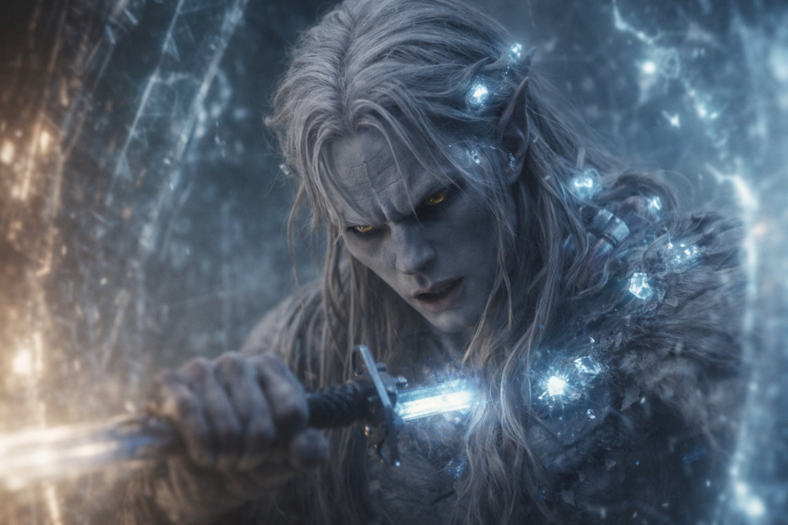
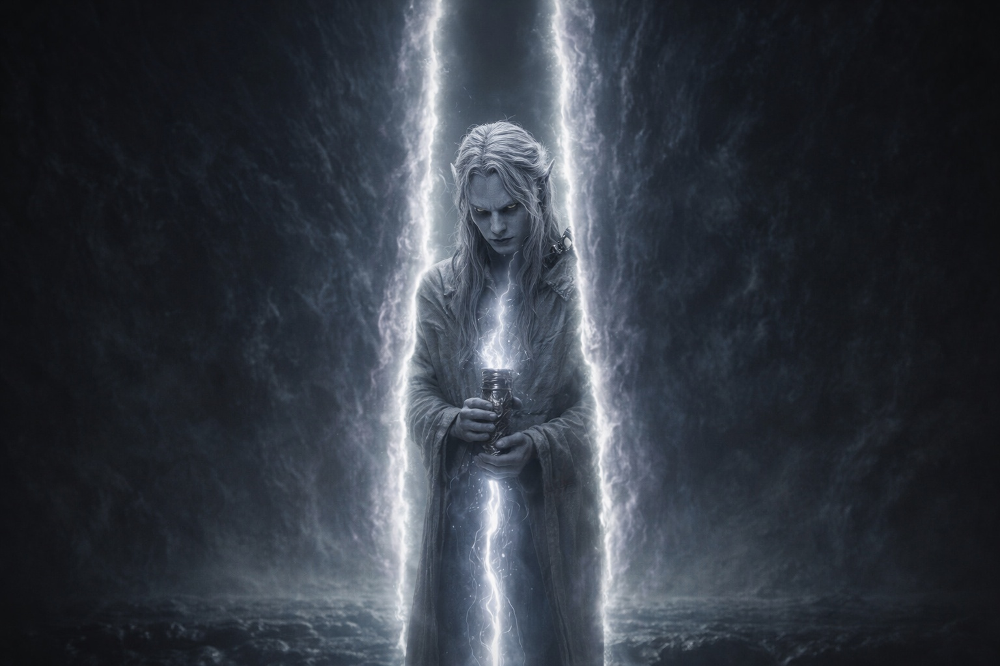

## Capítulo 42 | Parte 1 | Contacto

---

El Nulo tocó la interfaz.

Calor. Inmediato. La temperatura del artefacto se disparó de tibia a incandescente cuando el componente del Nexus hizo contacto con el puerto de mantenimiento de la barrera, los dos sistemas acoplados como un enchufe a una toma de corriente: con precisión, mecánicamente, con la eficiencia de componentes que habían sido fabricados para esta conexión. La luz recorrió la superficie del artefacto. Blanca. Luego dorada. Luego un color que existía fuera del espectro para el que sus ojos estaban calibrados, una frecuencia que sus cristales procesaban como información y su nervio óptico procesaba como dolor.

La luz viajó por sus muñecas. A través de su piel. Por sus brazos. Recorrió la adaptación cristalina como un circuito recorre el cobre; la modificación que la Voz había instalado se convirtió en el conducto a través del cual el sistema de la barrera recibía los datos del artefacto. Sus venas brillaron. No era metáfora. La sangre adaptada en sus antebrazos se hizo visible a través de su piel obsidiana, líneas de luz trazando el camino desde el artefacto en sus manos hasta los cristales en su cinturón hasta el suelo pulsante de la barrera bajo sus pies.

El sistema leyó.

Portador compatible. Afinidad dual. Adaptado al cristal. Portador del Nexus. Los datos llegaron a él no como palabras sino como estados: casillas que se cerraban, clasificaciones que se archivaban, el proceso administrativo de un mecanismo que recibía una entrada esperada y la verificaba contra una lista de criterios milenaria. Cada verificación aterrizó en su cuerpo como una vibración, una frecuencia que sus cristales igualaron, una confirmación que su biología adaptada procesó como pertenencia.

Luego la comprobación temporal.

El sistema buscó la ventana de degradación de la forma en que un funcionario busca un calendario. La comprobación no fue dramática. Fue burocrática. Un proceso verificando un cronograma. Y el cronograma decía: ahora no. La ventana no se había abierto. La alineación estacional era incorrecta. El ciclo de degradación no había alcanzado el umbral que autorizaba la intervención de mantenimiento.

La verificación se detuvo.

Drusniel lo sintió como un cese. El flujo constante de confirmaciones se detuvo. El sistema en suspenso, recalculando, ejecutando la comprobación de nuevo porque el primer resultado debía haber sido un error. Ningún portador autorizado se acercaría en el momento equivocado. Los constructores no habían imaginado esta contingencia como real. El sistema ejecutó la comprobación temporal una segunda vez. Una tercera. Cada comprobación devolvió el mismo resultado.

Fuera de la ventana.

La reclasificación no fue dramática. No fue una decisión. Fue una sentencia condicional ejecutándose: SI portador compatible Y momento incorrecto ENTONCES reclasificar como amenaza. La lógica había sido escrita en la arquitectura del sistema mil años atrás por constructores que consideraron el escenario teórico, que no habían instalado una anulación porque no podían concebir una circunstancia en la que el portador correcto llegara en el momento equivocado portando la herramienta correcta con la intención correcta.

La reclasificación golpeó a Drusniel del mismo modo que la compatibilidad lo había golpeado: como un cambio de estado. Pero este estado no se sentía como pertenencia. Se sentía como una hoja insertada entre sus costillas y girada noventa grados. Su estatus en el sistema cambió de componente a intrusión, de mantenimiento a amenaza, de aquello a lo que el mecanismo servía a aquello que el mecanismo necesitaba eliminar.

El protocolo de defensa de la barrera se activó.

La respuesta fue abrirse.

La barrera no se rompió. Funcionó. Hizo exactamente aquello para lo que había sido diseñada cuando se enfrentaba a una amenaza en el punto de contacto: abrió una brecha. La lógica era simple. La brecha permitiría que lo que estaba sellado detrás de la barrera se hiciera cargo de la amenaza directamente. Lo sellado eliminaría al intruso. La brecha se cerraría. El sistema se reiniciaría. Este era el mecanismo de defensa. Así es como siempre había sido diseñado para funcionar.

La luz recorrió el artefacto, subió por sus muñecas, y llegó al lugar donde la cúpula interior se encontraba con el punto de convergencia. La brecha se abrió. No amplia. No dramática. Solo una costura en el mundo, limpia como un corte, localizada con precisión en el punto donde Drusniel estaba de pie con el artefacto fusionado a la interfaz. La costura se extendió verticalmente, del suelo a la cúpula, dividiendo el tejido de la barrera con la precisión quirúrgica de un sistema que ejecutaba su respuesta diseñada.

A través de la costura, sintió la montaña.

A través de la costura, la montaña sintió todo lo demás.

---

**Fin del Capítulo 42.1 —>  42.2: [El Acto: La Brecha](/el-acto-la-brecha/)**

