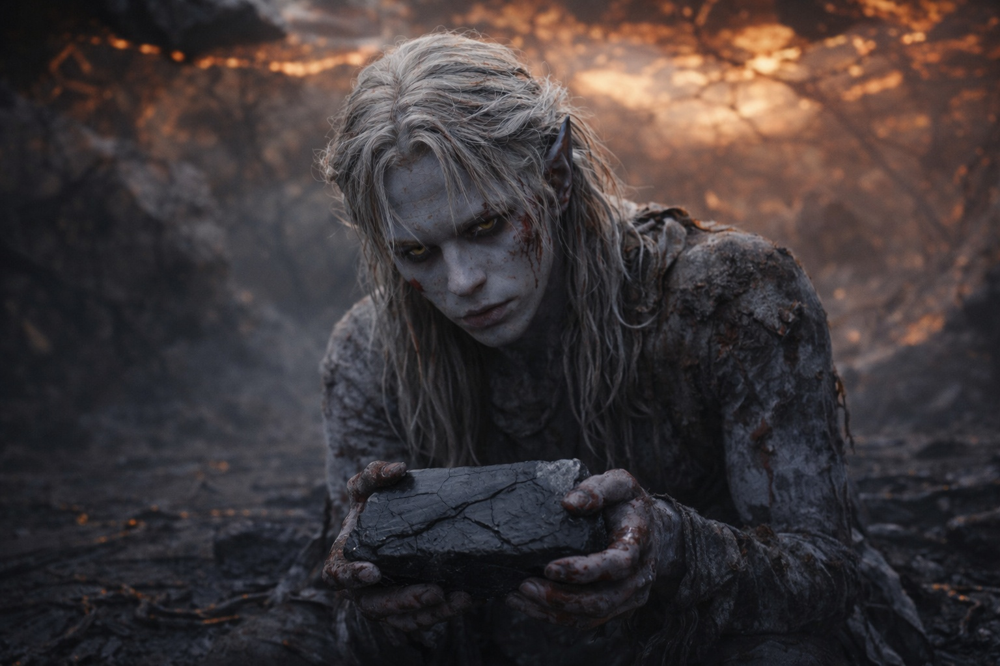
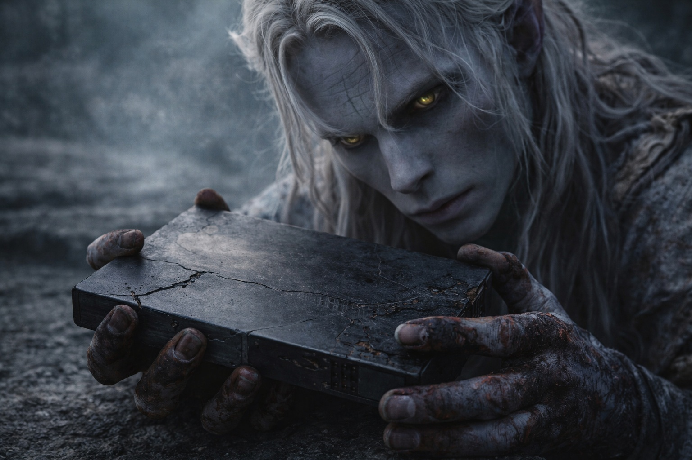
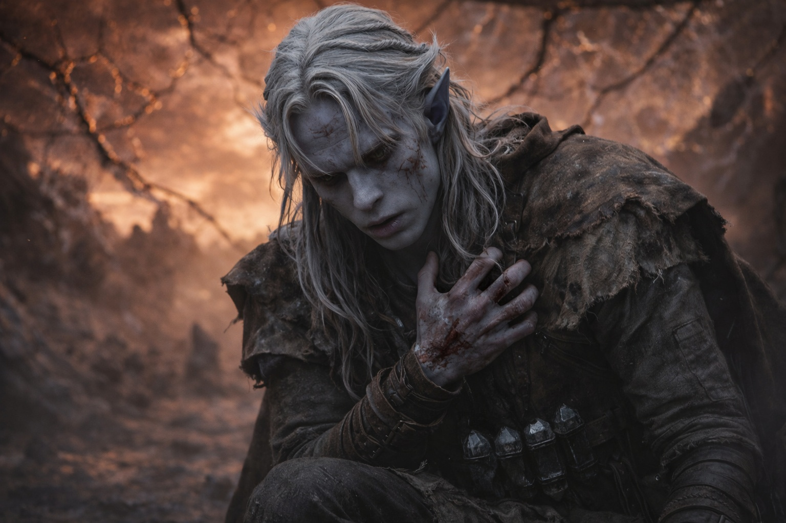
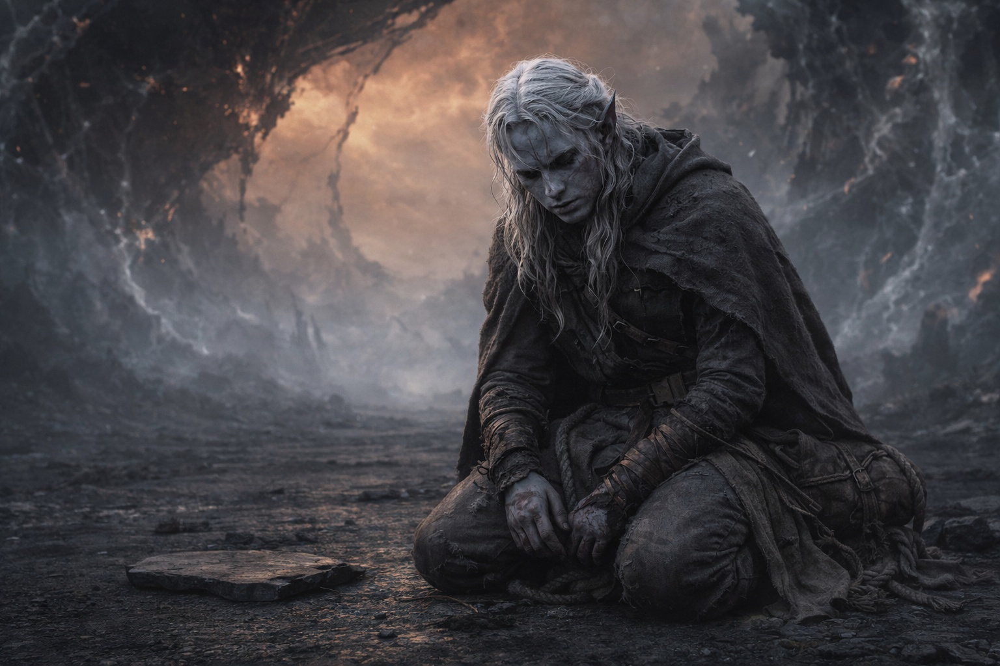
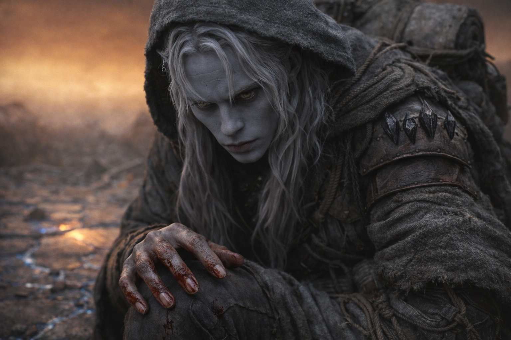

---
order: 1325
title: "El Acto: El Costo"
description: "El sistema había terminado con él."
date: 2024-11-07
language: es
chapter: 42
subchapter: 3
storyline: drusniel
canon_phase: main
canon_sequence: D-042-003
narrative_weight: high
category: Wyrmreach
author: Drusniel
type: Main
tags: ['#el acto', '#drusniel', '#wyrmreach']
thumbnail: image.jpg
featured: false
counterpart_path: site/content/posts/en/wyrmreach/the-act-the-cost/index.mdx
counterpart_title: "The Act: The Cost"
---

## Capítulo 42 | Parte 3 | El Costo

---

La brecha comenzó a cerrarse.

No completamente. La respuesta automatizada de la barrera, el protocolo que debería haber sellado la apertura después de que la amenaza fuera abordada, se ejecutó y se detuvo y se ejecutó de nuevo y se detuvo de nuevo, el mecanismo luchando por completar una secuencia que requería infraestructura operativa que ya no existía en la forma que necesitaba. Las venas de energía en el suelo estaban oscuras. La cúpula estaba fracturada. El sistema estaba intentando cerrar una puerta con bisagras rotas, y la puerta se cerró parcialmente y se atascó.

La barrera resistió. Dañada. Comprometida. Un muro con una grieta que nunca volvería a ser un muro, no como había sido, no como mil años de mantenimiento drow lo habían conservado. Lo sellado al otro lado ya no estaba completamente sellado. La presencia de la entidad se había filtrado no como criatura, no como invasión, sino como condición. El aire de este lado de la barrera era diferente ahora. La luz era diferente. El campo mágico era diferente. La contaminación era ambiental, como la radiación es ambiental: presente en todo, cambiándolo todo, no porque tenga un plan sino porque su naturaleza es el cambio.

Las rodillas de Drusniel golpearon el suelo.

No un colapso. Una subsidencia. Su cuerpo, que había resistido durante el contacto, durante la brecha, durante la descompresión, la presencia, la falla en cascada y los segundos que reescribieron el mundo, finalmente reconoció el costo de resistir. Su fisiología adaptada había procesado lo que la fisiología no adaptada no podía, pero el procesamiento había consumido todo lo que tenía para consumir, y lo que quedaba era un cuerpo que había sido usado como conducto y ahora había terminado de conducir.

La sangre vino de su nariz. De sus oídos. De los lugares donde la sobrecarga había encontrado los puntos más débiles en la arquitectura del conducto y se había filtrado. La sangre estaba caliente en su rostro, una temperatura que notó porque todo lo demás estaba frío, el frío posterior a la brecha de un mundo que había perdido un componente alrededor del cual estaba organizado.

El artefacto estaba oscuro.

Lo miró en sus manos. El Nulo. El componente del Nexus que lo había guiado y rastreado y vibrado contra su columna durante semanas. Yacía en sus palmas como una piedra. Oscuro. Agotado. La superficie que había brillado ahora era mate, los componentes cristalinos que se habían acoplado a la barrera quemados hasta la opacidad, la carcasa de metal moldeado agrietada a lo largo de líneas que seguían los caminos de circuito por los que la sobrecarga había viajado. El artefacto estaba muerto de la manera particular en que las herramientas mueren cuando han sido utilizadas para el único propósito para el que fueron construidas: completa, irrevocablemente, con el agotamiento de la realización total.

Lo colocó en el suelo. El suelo no pulsó. Las venas de energía estaban oscuras. El Nulo yacía sobre piedra muerta como cualquier piedra yace sobre cualquier piedra.

Su magia se había ido.

Buscó el acceso como siempre lo había buscado: hacia adentro, hacia el lugar donde sus afinidades de aire y agua vivían, la configuración dual que lo había hecho compatible con la barrera y valioso para la Voz y útil como conducto. El lugar estaba vacío. No silencioso. No latente. Vacío. Las afinidades que habían estado respondiendo a la barrera sin su permiso se habían ido, quemadas por la sobrecarga, consumidas por el mismo circuito que había consumido el artefacto. Su magia había sido el conducto a través del cual el grito de muerte de la barrera viajó, y el conducto había sido destruido por la señal que transportó.

La Voz se había ido.

No silenciosa. No retirada. No contraída detrás de su esternón, esperando. Ida. El espacio donde la Voz había vivido, donde las deudas se habían acumulado, donde la presencia había ocupado la arquitectura de su mente como un inquilino, estaba vacante. Las deudas estaban pagadas. La inversión había madurado y sido cobrada y la cuenta estaba cerrada. No quedaba nada que reclamar y nadie que lo reclamara. La Voz lo había necesitado para un acto. El acto estaba hecho. La Voz no tenía más asuntos aquí.

El silencio fue la peor parte. No porque fuera quieto. Porque sonaba completo. El sistema había terminado con él. La barrera había ejecutado su protocolo. La Voz había cobrado su retorno. El artefacto había cumplido su propósito. Cada mecanismo que lo había impulsado, guiado, obligado, adaptado, había terminado, y el terminar dejó un silencio que no era ausencia sino conclusión. El silencio de un libro de cuentas saldado. El silencio de una transacción completada. El silencio de una vida que había cumplido su función y ahora sobraba.

Drusniel se arrodilló en la ceniza.

No ceniza literal. El residuo de lo que el interior de la barrera había sido antes de la brecha. El suelo pulsante estaba inmóvil. Las venas de energía estaban oscuras. La cúpula sobre él estaba agrietada, el cielo ámbar-óxido del mundo cambiado visible a través de las fracturas como heridas en un techo que nunca sanaría. El aire portaba la contaminación, la presencia de la entidad distribuida a través de la atmósfera como una condición permanente, y Drusniel la respiró porque sus pulmones adaptados aún funcionaban incluso si nada más lo hacía.

Estaba vivo. La adaptación cristalina por la que la Voz había pagado lo protegió de la descompresión, de la presencia, del colapso del campo mágico. Estaba vivo en medio de la catástrofe porque la inversión de la Voz había sido calibrada para mantenerlo vivo durante el evento que la inversión estaba destinada a causar. La supervivencia se sentía como un descuido que nadie corregiría.

El cielo adelante era de un color para el que los drow no tenían palabra, porque los drow nunca habían esperado necesitar una.

No habló. No había nada que decir a la barrera dañada y al artefacto muerto y al silencio vacante donde la Voz había estado. Había sabido antes de hacerlo. Había nombrado lo que estaba perdiendo antes de perderlo. Había caminado hacia esto con los ojos abiertos, sus convicciones intactas, y todo el peso de su análisis que le decía el resultado, y el resultado era exactamente lo que el análisis había predicho, y tener razón sobre la catástrofe no era consuelo, no era virtud, no era nada excepto preciso.

Su pulgar se movió. Contra su muslo. Uno, dos, tres, cuatro. El conteo aún ahí. Lo único que aún estaba ahí.

Uno, dos, tres, cuatro. En la ceniza de un mundo que había sido diferente un momento antes. En el silencio de un sistema que había terminado con él. En la vacancia donde su magia había estado y la Voz había vivido y las deudas se habían acumulado.

Uno, dos, tres, cuatro. Drusniel contó, y el conteo era todo lo que quedaba, y el conteo era suficiente para probar que aún era una persona y no un conducto, aún estaba vivo y no era un mecanismo, aún presente en un mundo que había cambiado y no podía revertir.

---

**Fin del Capítulo 42.3 —> 43.1: [Después de la Luz: Las Consecuencias](/despues-de-la-luz-las-consecuencias/)**

