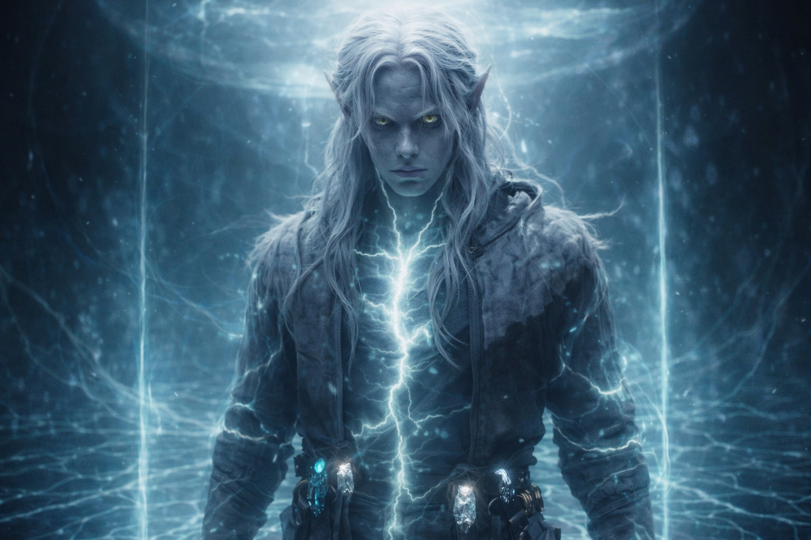

## Capítulo 40 | Parte 2 | El Cuerpo

---

La barrera hizo contacto como un oficial de aduanas hace contacto: leyendo documentos y marcando casillas.

Lo sintió llegar. No como una presencia, no como una voz, no como nada que tuviera intención o conciencia. Un proceso. El sistema de la barrera extendiendo una verificación hacia la cosa que había entrado en su espacio operativo, como un sistema inmunológico extiende anticuerpos hacia un cuerpo extraño: automáticamente, impersonalmente, con la eficiencia de algo que había desempeñado esta función durante mil años.

Leyó sus afinidades primero. La verificación se movió a través de él como una corriente, comenzando en sus pies donde las venas de energía se conectaban con su adaptación cristalina y viajando hacia arriba por sus espinillas, sus caderas, su pecho, su cráneo. Afinidad de aire: presente. Afinidad de agua: presente. Configuración dual: confirmada. Sintió al sistema archivar esta información como sentía el pulso del suelo: como una sensación que eludía sus sentidos y se registraba directamente en la parte adaptada de su biología que la Voz había instalado.

Compatible. La clasificación aterrizó en su pecho. No una palabra. Un estado. Su cuerpo lo reconoció como su cuerpo reconocía la respiración: como una condición que era verdadera y no requería confirmación.

La verificación continuó. Adaptación cristalina: presente. Cuatro nodos activos, montados en el cinturón, frecuencias alineadas con el ciclo operativo de la barrera. El sistema archivó esto. El Nulo: componente del Nexus, intacto, activado, interfazando a través de conducto adaptado. El sistema archivó esto. Estado de portador: confirmado. La acumulación de verificaciones construyendo un perfil que el mecanismo reconocía como autorizado para mantenimiento.

Luego la verificación temporal.

Drusniel lo sintió como un cuchillo siente el hueso contra el que golpea: una parada repentina, una resistencia, un momento donde el movimiento hacia adelante de un proceso encuentra algo que no puede procesar sin reclasificación. La verificación temporal se ejecutó y el resultado no fue lo que el sistema esperaba. La ventana de degradación: no abierta. El ciclo de mantenimiento: no activado. La alineación estacional que los constructores antiguos habían calibrado como el período de aproximación autorizado: ausente.

El sistema se detuvo.

Drusniel sintió la pausa en su columna. El Nulo se enfrió durante un latido, luego se calentó, luego se enfrió de nuevo. Sus cristales tartamudearon, su ritmo constante se rompió durante dos latidos, tres, antes de reanudarse a una frecuencia diferente. Las venas de energía de la barrera bajo sus pies se atenuaron. La luz de monitoreo que había estado viajando horizontalmente se detuvo, se mantuvo, luego invirtió su dirección.

El sistema estaba reconsiderando.

Portador compatible. Afinidades correctas. Herramienta correcta. Momento incorrecto.

La reclasificación llegó como la clasificación de compatibilidad había llegado: como un estado, no una palabra. Pero este estado no aterrizó en su pecho como la respiración. Aterrizó como una hoja girando dentro de él, la rotación lenta de un cuchillo que entra limpio y sale cortando. La evaluación del sistema cambió. No mantenimiento. No aproximación autorizada. El sistema sabía cómo lucía una aproximación autorizada, y esto no lo era. Las variables coincidían, pero el momento era la variable que más importaba, y el momento era incorrecto.

Amenaza. Intrusión potencial. El protocolo de defensa de la barrera se activó.

Drusniel sintió el protocolo de defensa como había sentido la verificación de compatibilidad: sistémicamente, impersonalmente, sin malicia. La barrera no lo odiaba. La barrera no lo conocía. La barrera lo procesó como una represa procesa una grieta: respondiendo a las implicaciones estructurales de su presencia según las reglas que sus constructores habían inscrito.

La respuesta fue abrirse.

No para dejarlo pasar. No para darle la bienvenida. Para evaluar la amenaza creando una abertura en el punto de contacto a través de la cual el lado sellado pudiera abordar la intrusión. Los constructores antiguos habían asumido que este escenario era imposible. Ningún portador autorizado se aproximaría en el momento incorrecto. El protocolo de defensa existía para una contingencia que consideraban teórica: ¿qué pasaría si los propios componentes del mecanismo llegaran fuera de calendario?

La respuesta: abrir la abertura. Dejar que lo sellado se encargue del intruso. Cerrar después.

La costura apareció en el tejido del interior de la barrera, dos metros adelante de Drusniel, extendiéndose verticalmente desde el suelo pulsante hasta la cúpula de luz arriba. No ancha. Del grosor de un cabello. Una fractura en la separación entre lo que la barrera contenía y lo que la barrera protegía. La costura no era visual. Era dimensional. Un lugar donde el tejido del mecanismo se adelgazaba de impenetrable a permeable, de muro a membrana, de barrera a sugerencia.

A través de la costura, Drusniel sintió la cosa de la montaña.

No el volcán. No la entidad que había sentido en el pasaje, la presencia que la Voz había usado para amenazar y obligar. Esto era esa presencia sin el intermediario, sin la amortiguación de la barrera, sin los mil años de contención reduciendo su señal a un susurro que solo la Voz podía traducir. Esta era la señal cruda. La transmisión sin filtrar de algo que había estado sellado al otro lado de este mecanismo durante más tiempo del que la especie de Drusniel había existido.

No estaba observando. Observar implicaba ojos, dirección, atención. Esto era presionar. Como el agua presiona contra una represa. Como la atmósfera presiona contra un casco. Constante, omnidireccional, inconsciente del modo en que la presión es inconsciente: no porque carezca de inteligencia, sino porque su inteligencia se expresa como fuerza en lugar de pensamiento.

La costura se ensanchó. Una molécula. Drusniel sintió el ensanchamiento como una vibración en sus cristales, una frecuencia adicional única sumada al coro que su cuerpo adaptado estaba conduciendo. Una molécula de separación eliminada. La presión del otro lado aumentó en una cantidad que sus sentidos podían medir y su mente no podía comprender.

Luego otra molécula. Otra frecuencia. Otro incremento de presión.

Su presencia era el cincel. El protocolo de defensa de la barrera era el martillo. Cada momento que permanecía en este espacio, el sistema procesaba su presencia de momento incorrecto como una amenaza que requería evaluación, y la evaluación requería apertura, y la apertura dejaba pasar presión, y la presión ensanchaba la apertura, y el ensanchamiento dejaba pasar más presión.

Szoravel había tenido razón. El mecanismo respondería al momento incorrecto abriéndose. La apertura sería catastrófica. El viejo había muerto a mitad de frase tratando de proteger este momento, y el momento estaba sucediendo de todas formas, porque la Voz había eliminado la pausa que habría dejado a Drusniel dudar, y Nyxara había eliminado el obstáculo que habría dejado a Szoravel intervenir, y los constructores antiguos habían eliminado la seguridad que habría impedido que su propio protocolo de defensa destruyera lo que protegía.

La costura se ensanchó. Drusniel lo catalogó. Sus pies no se movieron. Su mente no apartó la mirada.

La barrera se estaba abriendo, y su presencia era la razón, y la cosa del otro lado presionaba más cerca con cada molécula de separación eliminada.

---

**Fin del Capítulo 40.2 —>  40.3: [El Camino Abierto: La Aproximación](/el-camino-abierto-la-aproximacion/)**
