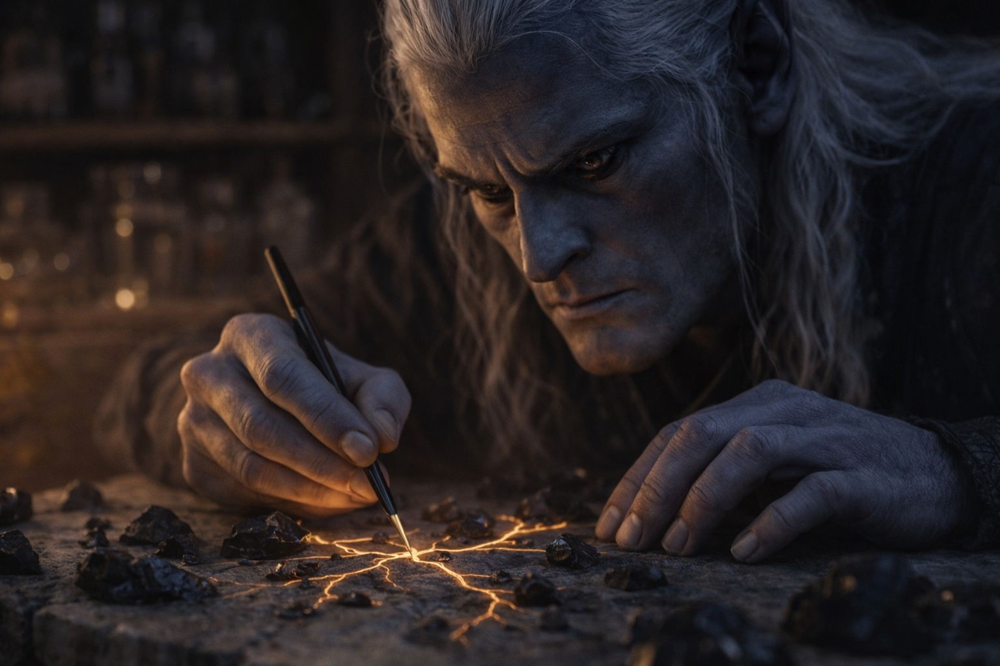
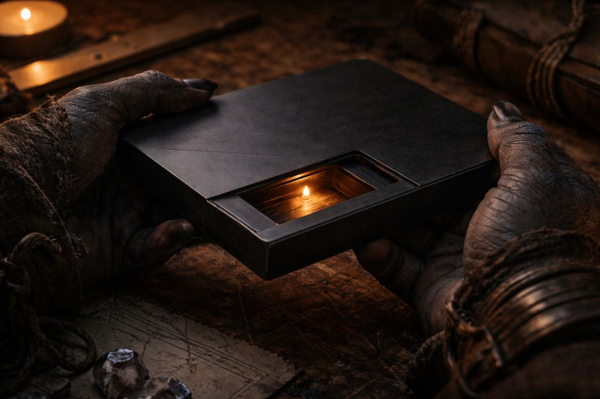
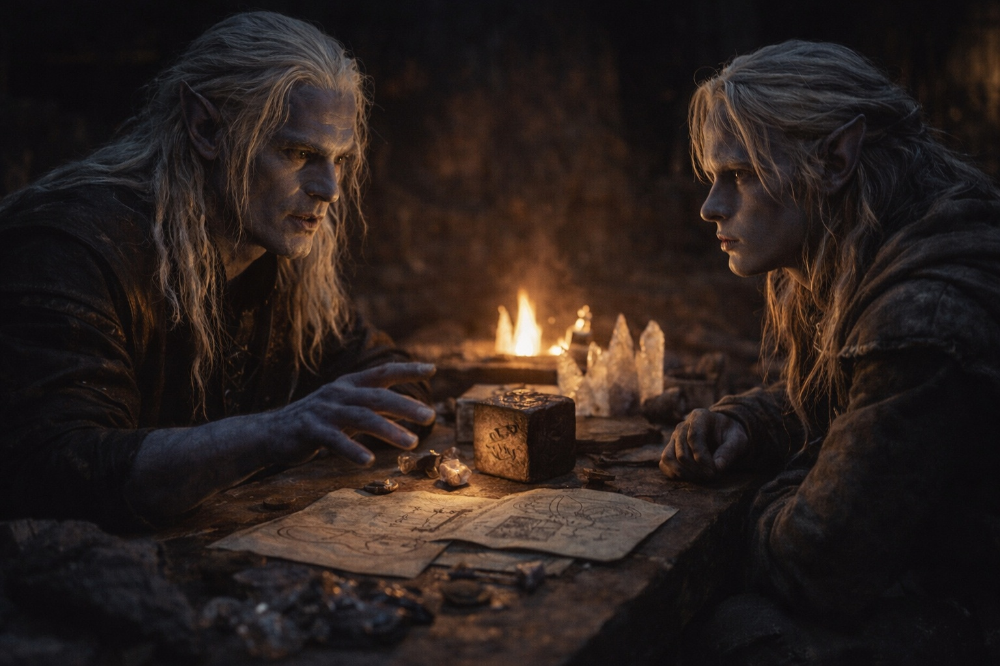
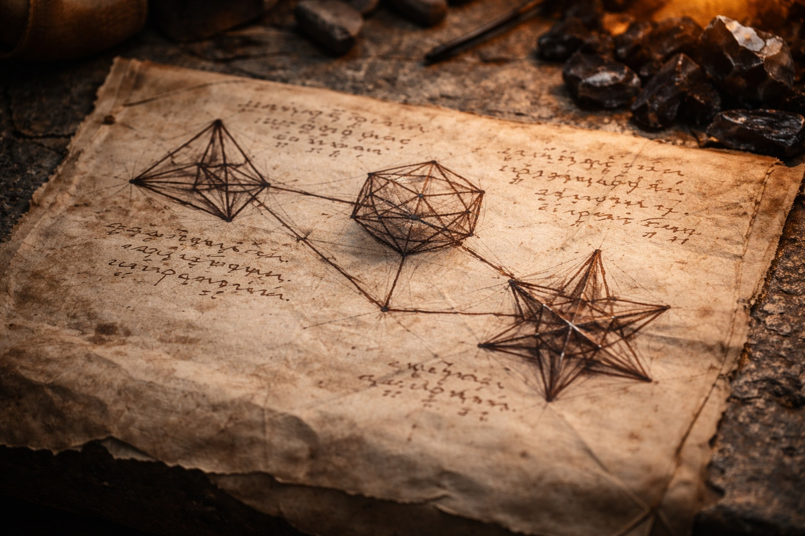

# Capítulo 29.2 | El Drow en la Torre: El Intercambio

---

Cada respuesta que Szoravel daba costaba una pregunta a cambio.

—¿Cuánto tiempo llevas en Wyrmreach? —preguntó Szoravel. Había apartado el séptimo cristal de los demás y estaba trazando líneas entre ellos sobre el banco de trabajo con un pincel fino mojado en algo que parecía tinta diluida pero olía a ozono.

—Once semanas. —Drusniel observaba las líneas. Conectaban los cristales en un patrón que no era geométrico. Orgánico, como la ramificación de raíces o los caminos que el agua encuentra al descender por una ladera—. Mi turno. ¿Cómo conoces a Zaelar?

—Trabajamos juntos. Hace mucho tiempo. En los mismos sistemas. Conclusiones diferentes. —El pincel se detuvo—. ¿Quién te envió a la montaña?

—Nadie me envió. La dirección llegó después de la cámara de cristal en los túneles del norte. Antes de eso, me dirigía al oeste hacia los asentamientos costeros. —Sostuvo la mirada de Szoravel—. ¿Qué sistemas?

—Los que evitan que este lugar se convierta en lo que intenta convertirse. —Szoravel dejó el pincel—. Eso es impreciso. Permíteme reformularlo. Wyrmreach tiene una tendencia estructural hacia el colapso. Los sistemas que retrasan ese colapso requieren mantenimiento. Zaelar y yo discrepamos sobre el calendario de mantenimiento. —Giró su taburete para enfrentar a Drusniel completamente—. Las deudas. ¿Cuándo te contactó la Voz por primera vez?

Drusniel sopesó el coste de responder. Szoravel ya sabía de las deudas, las había leído en él como un médico lee síntomas. Retener costaría más de lo que preservaría.

—Las cuevas de la Concha Calcinada. Semana tres. Srietz se estaba muriendo. No me quedaban opciones.

—Y aceptaste.

—Acepté la primera deuda para salvarle la vida. La segunda fue en los túneles bajo la cordillera norte, cuando el pasaje colapsó. Ofreció un camino a través.

—Y aceptaste. —La repetición era clínica. No acusatoria. El tono de alguien registrando datos—. La Voz no negocia. No ofrece términos. Presenta un coste y espera a que lo aceptes porque la alternativa es peor. Sabes esto.

—Lo sé.

—Bien. Entonces también sabes que no puedes auditar esas deudas. Son abiertas por diseño. La Voz las reclamará cuando elija, con un propósito que no explica, y cumplirás porque el cumplimiento fue la condición de la transacción original. —Se reclinó—. Zaelar no te habló de la Voz antes de enviarte aquí.

—No.

—Por supuesto que no. —La expresión de Szoravel permaneció neutra, pero algo en la alineación de su mandíbula sugería una opinión deliberadamente retenida—. ¿Qué sabes sobre el artefacto?

—El Null. Zaelar me lo entregó como herramienta de mensajería. Dijo que debía llegar a Wyrmreach. Que era parte de algo más grande.

—Te dijo eso. —Szoravel extendió una mano—. ¿Puedo?

Drusniel sacó el Null de su macuto. La placa era más pesada de lo que parecía, una propiedad que había notado antes y aún no podía explicar. Su superficie era piedra oscura lisa, sin rasgos excepto por costuras finas como cabellos que aparecían bajo cierta luz, sugiriendo paneles que podían desplazarse o abrirse si se aplicaba la presión correcta.

Szoravel lo tomó con ambas manos. El fuego ámbar en el pozo central titubeó por primera vez desde que Drusniel había entrado, la llama estable parpadeando una vez, con fuerza, antes de reanudarse. Szoravel lo notó. Drusniel notó que Szoravel lo notaba.

—El Null. —Lo giró en sus manos—. El nombre de Zaelar. El nombre de función es Borrar. Fase Administrativa II. Elimina presencia mágica. Firma. Rastro. —Presionó algo en la superficie de la placa que Drusniel nunca había encontrado. Un panel se deslizó con un chasquido que sonaba mecánico y antiguo. Dentro, una cámara hueca, pequeña, no mayor que una nuez. Vacía—.

Aquí es donde va la piedra.

—¿Qué piedra?

—La que no tienes. La que Zaelar no mencionó. La que convierte este artefacto en una herramienta en lugar de un pisapapeles. —Szoravel cerró el panel—. El Null borra. Esa es su función. Sin la piedra resonante, borra en un radio de unos tres pies, lo cual es útil para cubrir tus huellas pero no mucho más. Con la piedra, borra a escala. Edificios. Protecciones. Redes de detección. —Hizo una pausa—. La barrera.

El fuego ardía. La palabra se posó entre ellos como un objeto físico.

—No sabes lo que llevas. —Szoravel colocó el Null sobre el banco de trabajo junto a los cristales—. Zaelar te dio una llave y no mencionó la puerta. El Null es parte de un sistema mayor. Tres artefactos. Tres funciones. Sentir, Borrar, Alterar. Juntos forman lo que los textos antiguos llaman el Chasis del Nexo. Separados, son herramientas. Juntos, son capaces de modificar los parámetros fundamentales de la barrera.

—¿Modificar cómo?

—Esa es la pregunta en la que Zaelar y yo nunca pudimos ponernos de acuerdo. —Se levantó, cruzó hasta una estantería y regresó con un paño enrollado que extendió sobre el banco de trabajo. Dentro, diagramas dibujados a mano en tinta que se había desvanecido hasta un marrón. Tres formas conectadas por líneas. Anotaciones en un alfabeto drow que era arcaico pero legible—. El Chasis fue diseñado para mantener la barrera. O para desmantelarla. O ambas cosas. Los textos no son claros porque las personas que los escribieron están muertas y las personas que los copiaron tenían intereses.

Cada respuesta creaba dos preguntas nuevas. Szoravel sabía más de lo que decía. Eso era evidente. Por qué lo retenía era la pregunta que importaba.

—¿Por qué me envió Zaelar a ti?

—Porque yo tengo la tercera pieza. —Szoravel lo dijo sin énfasis, sin drama, con la lisura de alguien que enuncia un hecho que llevaba siendo cierto tanto tiempo que se había vuelto irrelevante—. Fase Administrativa III: Alterar. La he tenido durante cuarenta y siete años. Zaelar tiene Sentir. Tú llevas Borrar. Tres piezas, tres portadores, un sistema. La pregunta siempre ha sido qué hacer con él.

—¿Y qué deberíamos hacer con él?

—Mantener. —La respuesta fue inmediata—. La barrera está fallando. Lleva siglos haciéndolo. El Chasis puede ralentizar ese fallo. Posiblemente revertirlo. Zaelar cree lo contrario. Cree que la barrera ha causado más daño existiendo que el que causaría al fallar. Cree que las cosas que contiene pueden gestionarse sin contención. Cree que la propia contención es un sistema de control que nunca fue legítimo. —La voz de Szoravel era perfectamente uniforme—. Puede que no esté equivocado en todo. Está equivocado en lo suficiente.

—¿Y tu papel?

—Recibo el Null. Yo tengo Alterar. Cuando las tres fases del Chasis se reúnan, se calibren y se activen en el punto de resonancia primario de la barrera, el sistema puede extender la vida operativa de la barrera. Por cuánto tiempo, no lo sé. Décadas. Siglos. Posiblemente más. Las matemáticas superan mi capacidad de modelado sin los datos de activación reales. —Hizo una pausa—. Fuiste elegido porque puedes cruzar. Tu afinidad dual, aire y agua, es la combinación más rara entre los drow. El punto de resonancia de la barrera está ubicado en un lugar que requiere esa afinidad para ser alcanzado. No fuerza. No conocimiento. Compatibilidad.

Srietz, que había estado en silencio e inmóvil junto a la puerta, habló.

—Srietz tiene una pregunta sobre la parte en la que Drusniel ha estado cargando un artefacto que rompe mundos sin saberlo. A Srietz le gustaría saber cuántas otras cosas no sabe Drusniel de las que Srietz debería preocuparse.

Szoravel miró a la goblin con lo que podría haber sido el primer destello de diversión que Drusniel había visto cruzar su rostro. Duró menos de un segundo.

—Todas —dijo—. Absolutamente todas.

---

*Siguiente: El Drow en la Torre: La Certeza*

**Fin del Capítulo 29.2 — continúa en el Capítulo 29.3: [El Drow en la Torre: La Certeza](/el-drow-en-la-torre-la-certeza/)**
