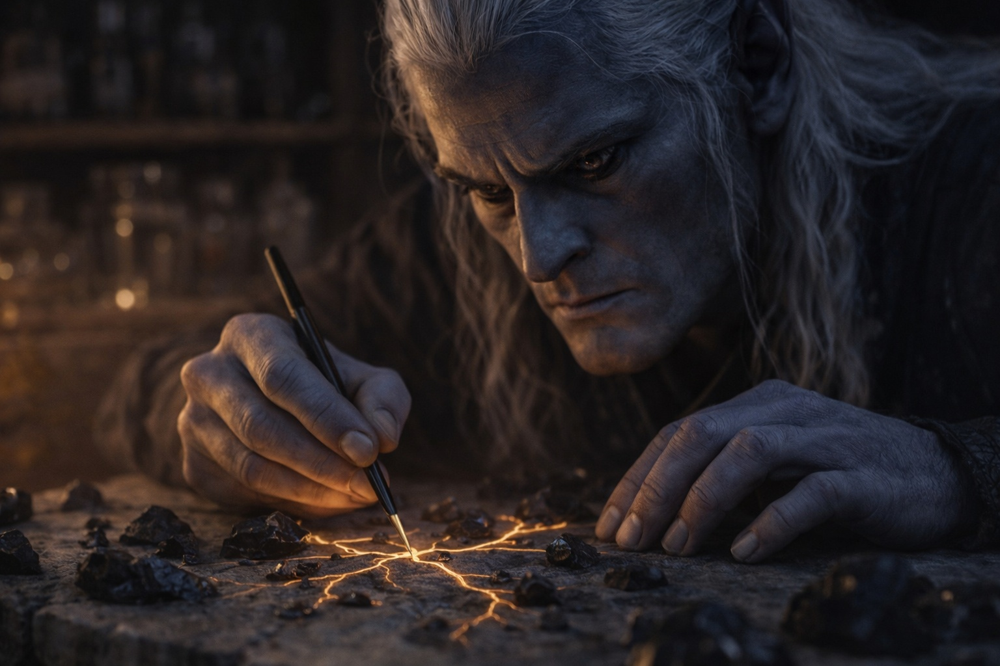
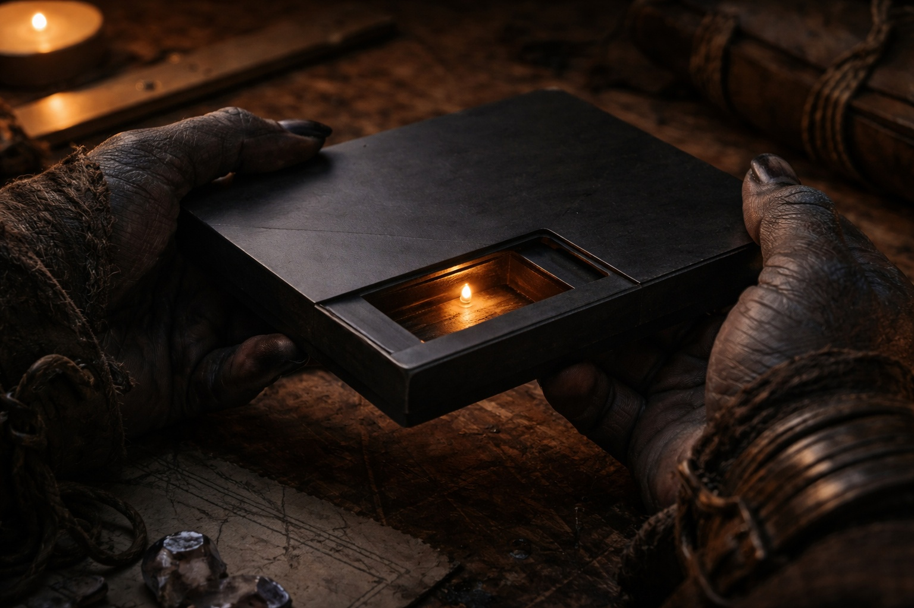
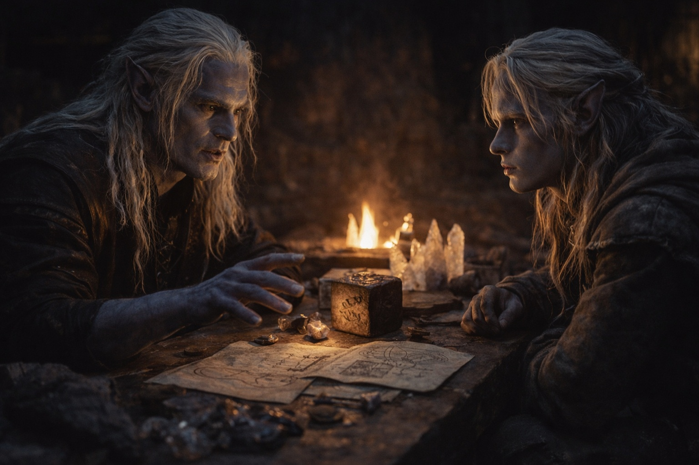

## Capítulo 29 | Parte 2 | El Intercambio

---

Cada respuesta que Szoravel daba costaba una pregunta a cambio.

—¿Cuánto tiempo llevas en Wyrmreach? —preguntó Szoravel. Había apartado el séptimo cristal de los demás y estaba trazando líneas entre ellos sobre el banco de trabajo con un pincel fino mojado en algo que parecía tinta diluida pero olía a ozono.

—Unas catorce semanas. —Drusniel observó cómo el pincel conectaba los cristales—. Mi turno. ¿Cómo conoces a Zaelar?

—Trabajamos juntos. Hace mucho tiempo. En los mismos sistemas. Conclusiones diferentes. —El pincel se detuvo—. ¿Quién te envió a la montaña?

—Nadie. Intentaba cruzar los campos volcánicos. Vi tu torre dentro de la montaña. —Sostuvo la mirada de Szoravel—. ¿Qué sistemas?

—Mantenimiento de la barrera. —Szoravel dejó el pincel—. La primera deuda. Lugar y circunstancias.

Szoravel había anotado las deudas sin reaccionar. Drusniel decidió contarle las circunstancias y ver qué sacaba de ellas.

—El Mar de las Pesadillas. Me estaba ahogando.

—Y aceptaste.

—La segunda fue en las cuevas. Necesitaba un camino para cruzarlas. Cuando Srietz cayó después, la Voz no respondió. Elion lo trajo de vuelta.

—Dos aceptaciones. Ningún tercer contacto. —Szoravel hizo una marca en la página.

—Ninguno —confirmó Drusniel.

—Las deudas siguen pendientes. —Apartó el pincel—. ¿Información previa de Zaelar?

—No.

—Registrado. Expón lo que sabes del artefacto.

—El Null. Zaelar me lo entregó como herramienta de mensajería. Dijo que debía llegar a Wyrmreach. Que era parte de algo más grande.

—Te dijo eso. —Szoravel extendió una mano—. ¿Puedo?

Drusniel sacó el Null de debajo de la camisa. Estaba frío contra su mano. Lo pasó por encima de la mesa sin soltarlo hasta que Szoravel sostuvo su peso.

Szoravel orientó la placa inerte hacia el fuego y examinó sus juntas.

—Fase II. Borrar. El Null. —Presionó una junta; un panel se deslizó y dejó al descubierto un hueco vacío.

—Aquí va el soporte elemental.

—¿Qué piedra necesita?

—Agua o Aire. Sin soporte, la activación es letal. Con soporte se puede sobrevivir; no es seguro. —Cerró el panel—. Ninguna prueba contra la barrera.

Drusniel miró el panel cerrado y luego a Szoravel.

—Borrar es una fase. —Szoravel dejó el Null junto a los cristales—. El chasis es independiente. El conjunto sigue incompleto.

—¿Qué hace el conjunto completo?

Szoravel desenrolló una tela con diagramas. Drusniel pudo leer los rótulos en drow antiguo: Sentir, Borrar, Alterar. Las líneas continuaban hasta el borde rasgado. —Lee lo que queda. Da las secciones que faltan por desconocidas.

Cada respuesta creaba dos preguntas nuevas. Szoravel sabía más de lo que decía. Eso era evidente. Por qué lo retenía era la pregunta que importaba.

—¿Por qué me envió Zaelar a ti?

—Tengo Alterar. Desde hace cuarenta y siete años. —Szoravel tocó el dibujo correspondiente—. Evaluación antes de la entrega.

—¿Y qué deberíamos hacer con él?

—La tarea asignada es el mantenimiento. Ningún desmantelamiento. Ninguna activación sin una lectura completa.

Srietz, que había estado en silencio e inmóvil junto a la puerta, habló.

—Srietz tiene una pregunta sobre la parte en la que Drusniel ha estado cargando un artefacto que rompe mundos sin saberlo. A Srietz le gustaría saber cuántas otras cosas no sabe Drusniel de las que Srietz debería preocuparse.

Szoravel miró a Srietz.

—Todas —dijo—. Absolutamente todas.

---

**Fin del Capítulo 29.2  —> 29.3: [El Drow en la Torre: La Certeza](/el-drow-en-la-torre-la-certeza/)**
