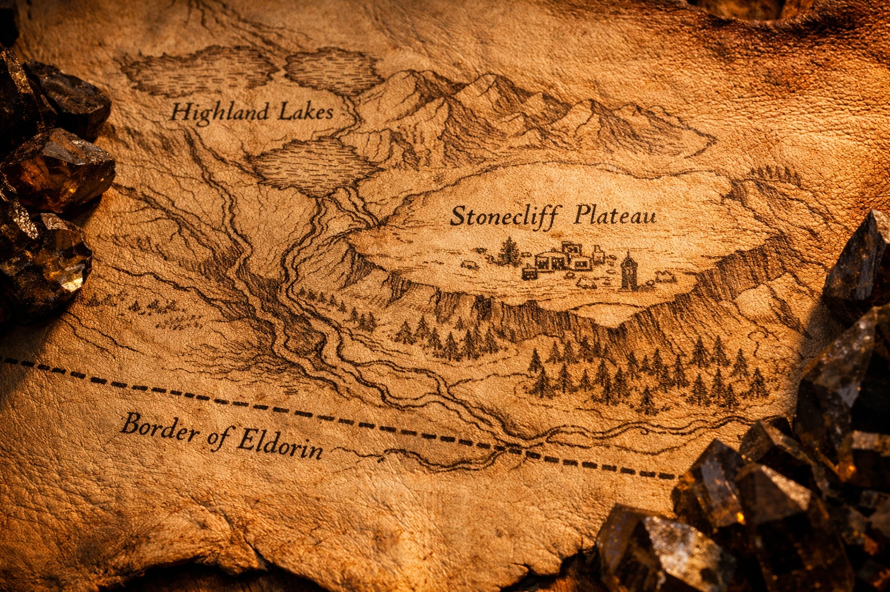
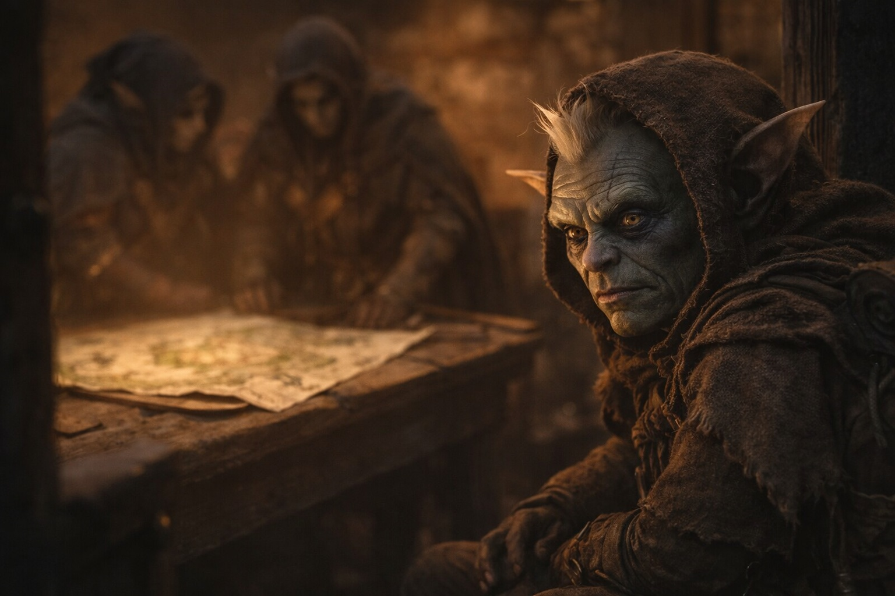

## Capítulo 29 | Parte 3 | La Certeza

---

Szoravel hablaba de Nyxara como los cartógrafos hablan del mar sin cartografiar.

—Controla la meseta central y todo lo que queda a tres días de marcha de ella. Autoridad política. Infraestructura militar. El tipo de poder que se sostiene a sí mismo mediante la administración en lugar de la violencia, aunque la violencia está disponible cuando la administración falla. —Había sacado un mapa de un cajón de su banco de trabajo, dibujado a mano sobre cuero tratado, las líneas lo bastante precisas como para haber sido trazadas con instrumentos. Lo extendió entre los cristales y los diagramas—. Tu ruta hacia el este te lleva por el borde sur de su esfera de influencia. Eso es inevitable. El terreno canaliza todo a través de los corredores del valle, y los corredores pasan por su territorio.

Drusniel estudió el mapa. Los puntos de referencia que reconocía eran escasos. Podía ubicar la región volcánica que habían cruzado, el bosque muerto, la ubicación aproximada de la torre de Szoravel. Al este de eso, el mapa mostraba rasgos del terreno que no había visto: un sistema fluvial que se ramificaba desde lagos de tierras altas, una meseta marcada con símbolos de asentamientos y una frontera etiquetada en la letra precisa de Szoravel: Thornfield.

—¿Qué es ella?

—Una señora de la guerra. Disciplinada. Paciente. Trata la conquista como algunas personas tratan la agricultura: por estaciones, con rotación, con la comprensión de que la tierra necesita recuperarse entre cosechas. —Szoravel trazó una línea en el mapa con un dedo—. Tiene agentes por toda la región. Redes de inteligencia que impresionarían a la mayoría de las naciones de la superficie. Y sabe del Chasis.

—¿Cómo?

—Porque yo se lo dije. Hace veinte años, cuando creía que la transparencia prevendría el conflicto. —Su expresión no cambió. La admisión no le costó nada visible—. Me equivoqué respecto a la transparencia. No me equivoqué respecto a la información. Sabe lo que hace el Chasis. Quiere que se ensamble. No por la barrera. Por influencia.

—Y sabe que yo tengo el Null.

—Sabía que Zaelar enviaba a alguien. Lleva meses vigilando los pasos de montaña. Tu cruce por el volcán no estaba en su lista de rutas probables, razón por la cual llegaste aquí sin su gente pisándote los talones. Esa ventaja no durará.

Drusniel miró el mapa. La ruta hacia el este pasaba por los valles fluviales, más allá de los asentamientos, hacia la frontera marcada como Thornfield. Más allá de eso, el mapa mostraba menos detalle: símbolos dispersos, líneas tentativas, el lenguaje visual de «hace tiempo que no paso por aquí».

—La frontera de Thornfield —dijo—. ¿Qué hay allí?

—Nada de importancia. Territorio de matorral. Pequeños asentamientos que no responden a nadie en particular. La influencia de Nyxara termina en la boca del valle. Considera la región de Thornfield por debajo de su interés. Población dispersa, recursos pobres, ningún valor estratégico. Sus agentes no la patrullan. Su red de inteligencia no llega hasta allí. —Szoravel golpeó la línea fronteriza con un dedo—. Una vez cruces Thornfield, estás fuera de su esfera. Esa es tu ventana. Muévete rápido por los valles, mantén la cabeza baja, cruza la frontera. Después de eso, el terreno se abre y su alcance no sigue.

Lo dijo con certeza. No la certeza tentativa de alguien que se cubre, sino la certeza estructural de alguien que había calculado las variables, sopesado la evidencia y llegado a una conclusión que consideraba fiable. Su voz llevaba el peso particular de un hombre que rara vez se equivocaba y lo sabía.

Drusniel recordaría esa certeza más tarde. Recordaría cómo el dedo de Szoravel descansaba sobre la frontera de Thornfield como si la línea en el mapa fuera un muro. Recordaría que Srietz había mirado el mapa y no había dicho nada, lo cual era inusual, porque Srietz siempre tenía algo que decir sobre rutas y territorio y la probabilidad de morir.

Pero eso fue después. Ahora, simplemente asintió.

—¿Cuánto tiempo tenemos?

—Días. No semanas. Nyxara se mueve con deliberación, pero no es lenta. Cuando se entere de que viniste por la montaña en vez de los pasos, se ajustará. Sus agentes en el corredor del valle estarán buscando a un drow que viaja al este con acompañantes. Esa descripción encaja con exactamente un grupo en Wyrmreach en este momento.

—¿Qué quiere de mí específicamente?

—Una conversación. —Szoravel dijo la palabra como si fuera un instrumento financiero con interés variable—. Le debes una conversación. Ese fue el acuerdo que Zaelar hizo en tu nombre antes de que dejaras Umbra'kor. Zaelar intercambió tu tiempo por su no interferencia durante el cruce. Se olvidó de mencionártelo, naturalmente.

Otra deuda. No del tipo de la Voz, no abierta y cósmica. Una deuda política, específica y cobrable. Zaelar había vendido una hora de la atención de Drusniel a una señora de la guerra sin mencionarlo.

—¿Qué pasa durante esta conversación?

—Ella hace preguntas. Tú las respondes. Ella evalúa si eres útil, peligroso, o ambas cosas. Luego toma una decisión sobre si dejarte continuar al este o retenerte hasta que ella misma haya ensamblado el Chasis. —Szoravel hizo una pausa—. Mi consejo: no tengas la conversación. No ahora. No mientras lleves el Null y ella tenga la infraestructura para tomarlo. Corre al este, cruza Thornfield y lidia con la decepción de Nyxara cuando estés fuera de su alcance.

—Vendrá tras nosotros.

—Enviará gente. Seguirán la ruta. Para cuando lleguen a la frontera de Thornfield, tú deberías estar tres días más allá. Nyxara no perseguirá más allá de Thornfield. Considera que no vale los recursos. He caminado ese territorio yo mismo. Está vacío.

Srietz miró a Drusniel. Él miró a Srietz. Ella no habló. Sus enormes ojos amarillos recorrieron el mapa, la ruta, la línea fronteriza, y algo en su expresión calculaba y algo más era la mirada que ponía cuando la información no encajaba y aún no podía nombrar por qué.

Drusniel se volvió hacia Szoravel. El drow mayor estaba enrollando el mapa, el gesto definitivo. El consejo había sido dado. La certeza estaba completa. La ruta era al este, rápido, a través de los valles, más allá de la frontera de Thornfield, y fuera.

—¿Nos vamos mañana?

—Os vais al amanecer. Habéis descansado suficiente y tenéis más información de la que os habéis ganado. Os abastecerré para diez días de viaje. Después de eso, estáis solos.

Drusniel asintió. El consejo sonaba correcto. No tenía forma de verificarlo. La frontera de Thornfield era una línea en un mapa dibujado por un hombre al que conocía desde hacía horas. La certeza detrás del consejo era de Szoravel, no suya.

Lo aceptó porque la alternativa era quedarse quieto.

---

**Fin del Capítulo 29.3  —> 29.4: [El Drow en la Torre: La Medida](/el-drow-en-la-torre-la-medida/)**
