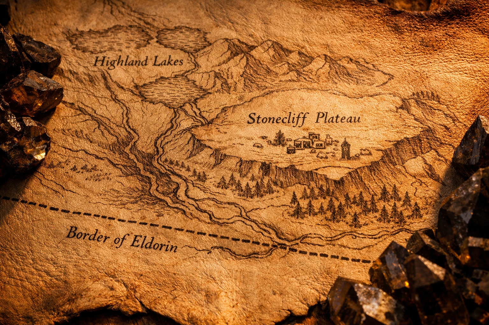

## Capítulo 29 | Parte 3 | La Certeza

---

Szoravel extendió un mapa entre los cristales y los diagramas.

—Al este, por los valles fluviales. —Trazó la ruta—. Nyxara controla los accesos del sur. Ninguna parada en sus asentamientos.

Drusniel estudió el mapa. Los puntos de referencia que reconocía eran escasos. Podía ubicar la región volcánica que habían cruzado, el bosque muerto, la ubicación aproximada de la torre de Szoravel. Al este de eso, el mapa mostraba rasgos del terreno que no había visto: un sistema fluvial que se ramificaba desde lagos de tierras altas, una meseta marcada con símbolos de asentamientos y una frontera etiquetada en la letra precisa de Szoravel: Thornfield.

—Ya la conocemos. ¿Qué controla por aquí?

—Los cruces. Las patrullas. Da por hecho que recibe todos los mensajes. —Szoravel mantuvo el dedo sobre la ruta.

—¿Sabe lo del Chasis?

—Sí. Información previa. Hace veinte años.

—Y sabe que yo tengo el Null.

—Entonces da por hecho que lo rastrea. Usa la ruta de la montaña como punto de partida.

Drusniel miró el mapa. La ruta hacia el este pasaba por los valles fluviales, más allá de los asentamientos, hacia la frontera marcada como Thornfield. Más allá de eso, el mapa mostraba menos detalle: símbolos dispersos, líneas tentativas, el lenguaje visual de «hace tiempo que no paso por aquí».

—La frontera de Thornfield —dijo—. ¿Qué hay allí?

—Sus patrullas terminan en la boca del valle. —Szoravel tocó la frontera—. Cruza Thornfield. Sigue hacia el este.

Lo dijo sin consultar sus notas.

Srietz estudió la frontera. Por una vez no comentó nada sobre la ruta.

Drusniel esperó y luego volvió a mirar a Szoravel.

—¿Cuánto tiempo tenemos?

—Días. Sus agentes estarán vigilando el corredor del valle.

—¿Qué quiere de mí específicamente?

—Acceso al Null. Cuenta con que te convoque.

Drusniel había aceptado un paso vigilado hasta la frontera. Nyxara no tenía derecho a disponer de su tiempo más allá.

—Ya tuvo la conversación que pidió. No prometí ningún servicio más.

—Entonces rechaza la convocatoria. Cruza Thornfield antes de que pueda retenerte.

—Vendrá tras nosotros.

—No más allá de Thornfield. Bastará con tres días de marcha después de la frontera.

Srietz miró a Drusniel y después otra vez el mapa. No había relajado las orejas.

Szoravel enrolló el mapa antes de que Drusniel pudiera estudiar los asentamientos más al este.

—¿Nos vamos mañana?

—Cuando coincidan las lecturas. Provisiones para diez días. Nada más.

Drusniel asintió. El consejo sonaba correcto. No tenía forma de verificarlo. La frontera de Thornfield era una línea en un mapa dibujado por un hombre al que conocía desde hacía horas. La certeza detrás del consejo era de Szoravel, no suya.

Lo aceptó porque la alternativa era quedarse quieto.

---

**Fin del Capítulo 29.3  —> 29.4: [El Drow en la Torre: La Medida](/el-drow-en-la-torre-la-medida/)**
