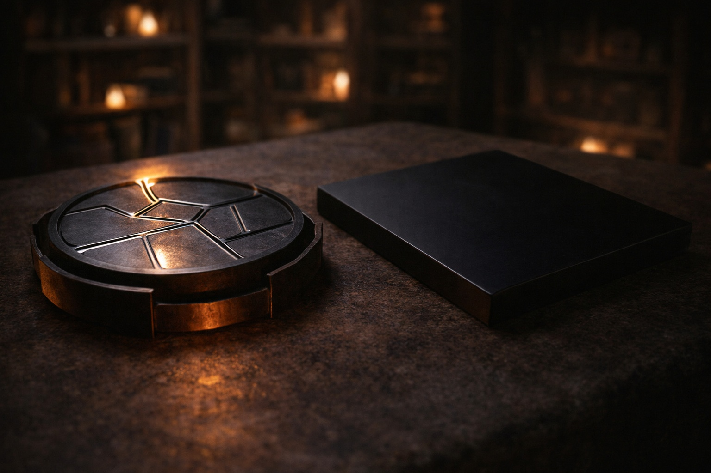
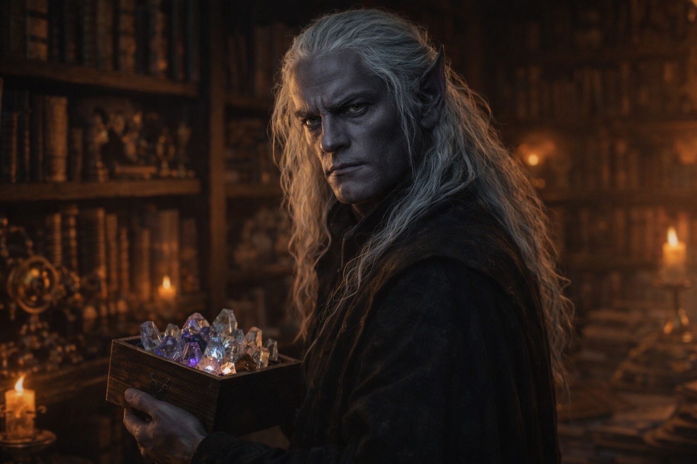

## Capítulo 29 | Parte 5 | La Forma

---

La barrera estaba fallando como fallan las montañas: tan lentamente que solo la piedra lo notaba.

Szoravel retiró los diagramas de la mesa.

—Mantenimiento de la barrera. Esa es la tarea. Su origen queda fuera de esta evaluación.

Había despejado el banco de trabajo de todo excepto el disco relleno de mercurio y el Null. El disco zumbaba a una frecuencia que resonaba en los molares de Drusniel. El Null descansaba junto a él, inerte, su superficie absorbiendo la luz ámbar del fuego sin reflejo.

—Secuencia requerida: Sentir para la lectura. Borrar para la eliminación. Alterar para el acceso. —Tocó el disco—. Este modelo no demuestra ninguna reparación. La estabilización sigue sin resolverse.

—Has dicho que la barrera está fallando. ¿Cómo?

—Distorsión creciente. Distancias inestables. Colores desplazados. Registra cada caso.

Drusniel pensó en el volcán. La entidad en la cámara de cristal. La sensación de algo vasto y antiguo y paciente, existiendo en una dirección que no era ninguna de las direcciones que conocía.

—¿Qué se está conteniendo?

—No hay un inventario de lo contenido. Trabaja con las lecturas.

—¿Qué autorizó Zaelar?

—Entrega. Evaluación. Ninguna activación.

—¿Y tu papel?

—Recibir el Null. Evaluar la compatibilidad. Retener Alterar hasta que se cumplan los requisitos. —Miró a Drusniel—. Aire y Agua. Hay que comprobar ambos.

Drusniel miró los diagramas. Zaelar lo había enviado a formarse. Szoravel comprobaba si podía utilizarlo.

Ninguno le había preguntado qué quería obtener del viaje.

—Resultado sin verificar —dijo Szoravel—. Ninguna garantía de reparación. Ninguna prueba de desmantelamiento.

—Me estás diciendo que he estado cargando algo que podría reparar la barrera o destruirla, y nadie sabe cuál.

—Correcto. Ninguna activación basada en una suposición. —Szoravel se levantó—. Borrar y Alterar no bastan. Localiza los componentes que faltan.

—Zaelar pretendía que recogiera Alterar aquí.

—Entrega retenida hasta completar la evaluación. —Szoravel bajó la caja de cristales—. Tu llegada no cumple ningún otro requisito.

El Null estaba junto al disco que zumbaba. Drusniel lo mantuvo a su alcance.

Había cruzado la montaña para obtener respuestas. Szoravel le había dado otra lista de condiciones.

Cerró las manos. Las abrió. Miró a Szoravel.

—¿Qué necesitas de mí?

—Tiempo. Lecturas completas. Ninguna prueba sin supervisión.

---

**Fin del Capítulo 29.5  —> 29.6: [El Drow en la Torre: Las Fracturas](/el-drow-en-la-torre-las-fracturas/)**
