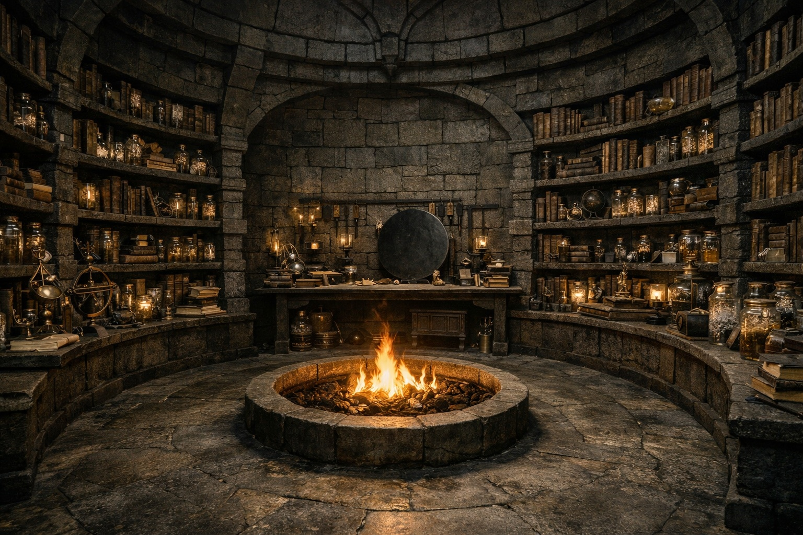
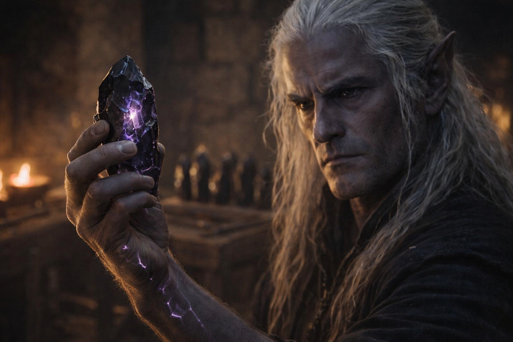
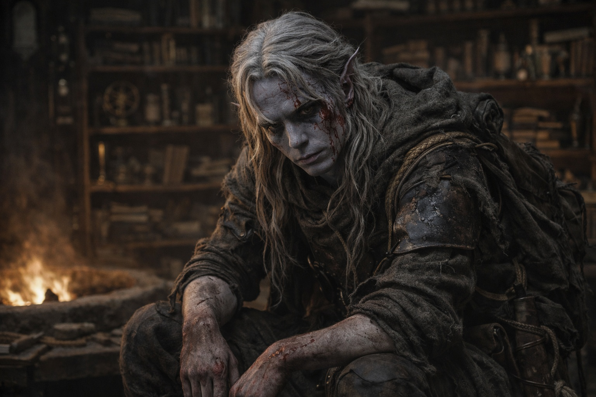
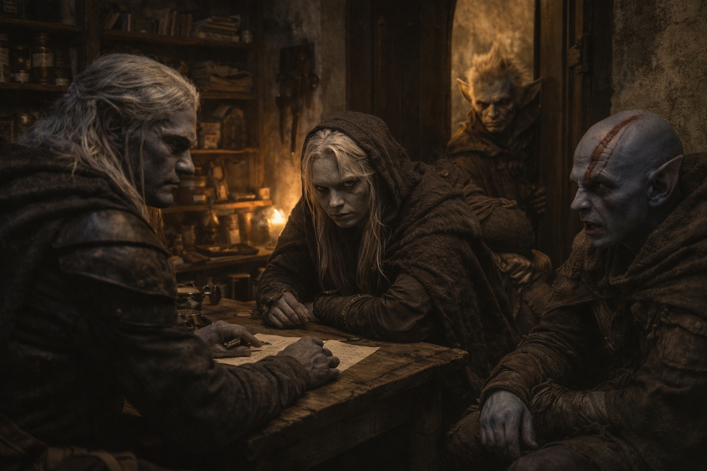

## Capítulo 29 | Parte 1 | La Lección

---

Szoravel no levantó la vista cuando Drusniel entró.

El interior de la torre era una habitación única que crecía hacia arriba en lugar de hacia los lados, con las paredes forradas de estanterías que ascendían en espiral siguiendo la arquitectura, cada superficie cargando algo: libros, frascos de compuestos con sedimento cristalino, instrumentos que Drusniel no reconocía pero cuya precisión podía leer en sus ensamblajes. El suelo era piedra desnuda, barrido con esmero, marcado por décadas de muebles arrastrados y pasos cuidadosos. Un fuego ardía en un pozo en el centro de la sala sin combustible ni humo, la llama un ámbar constante que no proyectaba sombras oscilantes, lo cual estaba mal, lo cual significaba que aquello no era fuego en absoluto.

Szoravel estaba de pie ante un banco de trabajo contra la pared del fondo, de espaldas a la entrada, las manos ocupadas con algo que Drusniel no podía ver. La postura del drow mayor era la postura de un hombre que sabía exactamente quién había entrado en su hogar y ya había decidido cuánta atención merecía el visitante.

No mucha, al parecer.

—Deja el macuto. Contra la pared oeste. No toques nada entre aquí y allí.

Drusniel cruzó la estancia. El suelo estaba cálido bajo los pies, calor ascendiendo desde algún lugar debajo, geotérmico o mágico o ambos. Dejó el macuto contra la pared indicada. Los cristales en su interior se desplazaron y vibraron contra la piedra, y algo en el banco de trabajo respondió, una vibración tenue que hizo que los frascos de vidrio en la estantería más cercana tintinearan entre sí.

Las manos de Szoravel dejaron de moverse.

—Los trajiste. —No sorpresa. Confirmación. Se giró, y por primera vez Drusniel vio en qué había estado trabajando: un disco plano de piedra oscura con canales geométricos tallados en su superficie, rellenos de un líquido que atrapaba la luz del fuego como mercurio. El disco descansaba en una cuna de hierro que era más antigua que la mesa. Más antigua que la torre, probablemente—. Los cristales de la cámara central. ¿Cuántos?

—Siete.

—¿Cosechados o encontrados?

—Cosechados. El suelo de la cámara estaba cubierto de ellos. Estos fueron los que pude cargar.

Szoravel se acercó al macuto. No pidió permiso. Sus manos eran grandes, los dedos largos y de nudillos gruesos, las manos de alguien que había trabajado piedra y magia en igual medida durante más tiempo del que Drusniel llevaba vivo. Abrió el macuto, levantó el primer cristal y lo sostuvo a la distancia de un brazo.

El zumbido cambió. Más profundo. El cristal pulsó una vez, una tenue luz violeta que iluminó las venas en la muñeca de Szoravel antes de volver a su estado de reposo.

—Intacto. —Lo colocó sobre el banco de trabajo. Tomó el siguiente. Repitió el proceso. Su expresión no cambió mientras examinaba cada cristal, pero Drusniel podía ver los cambios mínimos en su atención, cómo sus ojos de obsidiana rastreaban detalles invisibles para cualquiera que no hubiera pasado siglos catalogando las propiedades de la piedra resonante.

Seis cristales examinados y colocados. El séptimo, Szoravel lo sostuvo más tiempo.

—Este es diferente. —Lo rotó entre sus dedos—. Algo lo usó. Recientemente. La frecuencia ha sido comprimida. —Miró a Drusniel por segunda vez. La evaluación fue clínica y completa y duró aproximadamente dos segundos—. La entidad en la cámara. Te tocó a través de este.

No era una pregunta.

—Algo me miró.

—Algo hizo más que mirarte. —Szoravel apartó el cristal de los demás—. Has estado emitiendo desde que dejaste los túneles. ¿Lo notaste? Probablemente no. Lo habrías atribuido a los propios cristales. Estos reducen la fricción entre planos de consciencia. No generan señal. La señal eres tú.

Drusniel procesó aquello. La dirección que había sentido desde que dejó la montaña. La certeza en su pecho. La brújula que lo había guiado hasta aquí. No eran los cristales guiándolo. Su propia mente, abierta por lo que fuera que había sucedido en la cámara, proyectándose hacia el exterior.

Szoravel lo había oído venir.

—Siéntate. —El drow mayor sacó un taburete de debajo del banco de trabajo y lo empujó hacia Drusniel con el pie. No ofreció comida ni agua ni descanso. Ofreció un asiento en un espacio de trabajo. La distinción era precisa e intencional—. Eres de Zaelar. Puedo notarlo por cómo cargas esa cosa. —Señaló con la cabeza hacia el macuto donde la placa Null aún descansaba—. Como si fuera un regalo en lugar de una correa.

—No soy nada de Zaelar.

—¿No? —Szoravel se acomodó en su propio taburete con la economía de un hombre que hacía tiempo había eliminado el movimiento innecesario—. Entonces, ¿por qué estás aquí? Zaelar te envió a mí. Zaelar te dio el Null. Zaelar te señaló hacia Wyrmreach. Cada paso que has dado desde que dejaste Umbra'kor ha sido por un camino que alguien más abrió. Lo recorriste tú mismo, te concedo eso. Recorrerlo no es lo mismo que elegirlo.

Las palabras aterrizaron con el peso de un golpe físico. No porque fueran crueles. Porque eran precisas, y Drusniel no había oído su situación descrita con tanta claridad desde que Srietz había dejado de intentar describirla.

—Sentiste algo en la cámara de cristal. —La voz de Szoravel era plana y factual—. Bien. Sobreviviste. La mayoría no lo logra. A la entidad no le importa lo que quieras. No le importa que hayas sobrevivido. Te notó porque llevaste el Null a su espacio y las frecuencias interactuaron. Eres una anomalía en un sistema al que no le gustan las anomalías. El hecho de que te dejara salir significa una de dos cosas: no valías el esfuerzo de retenerte, o no había terminado contigo.

—¿Cuál de las dos?

—Si lo supiera, te habría recibido en la puerta con algo distinto a una conversación. —Szoravel colocó las manos planas sobre el banco de trabajo. El disco relleno de mercurio entre ellas atrapó la luz del fuego y la retuvo—. Servirás. Apenas. La Voz ha estado trabajando en ti. Puedo ver las marcas. ¿Cuántas deudas?

Drusniel no dijo nada.

—Dos, entonces. Habrías dicho una si fuera una. Con tres no estarías lo bastante funcional para caminar hasta aquí. Dos. —Asintió para sí mismo—. Manejable. Si eres cuidadoso. Si dejas de aceptar cosas de entidades que no puedes auditar.

Srietz apareció en el umbral. Se detuvo en el dintel con una mano en el marco y la otra en su bolsa del cinturón, las orejas pegadas, sus enormes ojos amarillos asimilando el interior de la torre con la eficiencia concentrada de alguien catalogando salidas.

—Srietz esperará afuera —anunció.

—Tu goblin puede entrar —dijo Szoravel sin girarse—. La puerta queda abierta. El cambiaformas también, cuando decida dejar de fingir que es un árbol.

Srietz miró a Drusniel. Él asintió. Ella entró, eligiendo una posición cerca de la puerta que mantenía su línea de retirada despejada, y se sentó en el suelo con el macuto contra la pared y las piernas cruzadas bajo ella.

Elion entró treinta segundos después. Olió la habitación primero. Viejo hábito. Luego encontró un rincón y se plegó en él con la economía fluida de alguien cuyo cuerpo se adaptaba a los espacios como el agua se adapta a los recipientes.

Szoravel miró a los tres como alguien mira un envío que ha llegado en peores condiciones de las esperadas pero aún funcional.

—Tenemos trabajo que hacer —dijo—. Y vosotros tenéis preguntas. Veamos cuál de esas cosas importa más.

Desde algún lugar debajo de la torre, la piedra respondió con un único golpe.

---

**Fin del Capítulo 29.1  —> 29.2: [El Drow en la Torre: El Intercambio](/el-drow-en-la-torre-el-intercambio/)**
