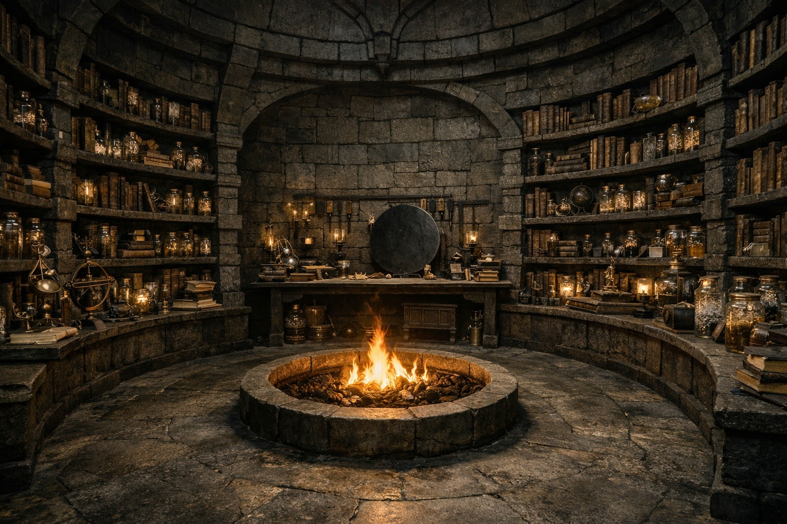
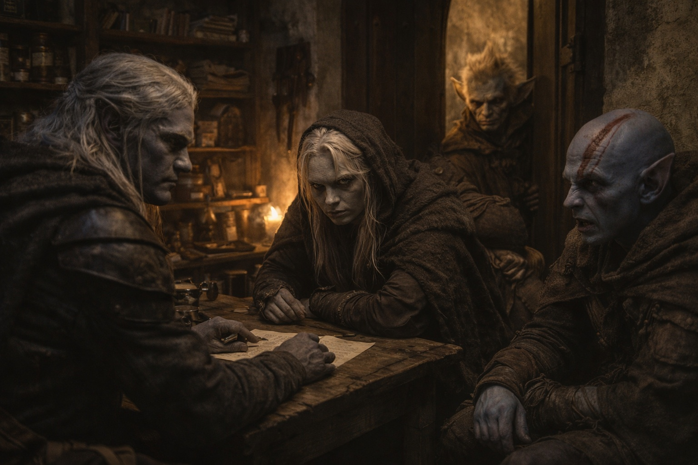

## Capítulo 29 | Parte 1 | La Lección

---

Szoravel no levantó la vista cuando Drusniel entró.

Las estanterías subían por las paredes de la torre, llenas de libros, frascos e instrumentos. El suelo de piedra estaba barrido. Una llama ámbar ardía en el pozo central sin humo ni combustible visible. Drusniel se mantuvo lejos de ella.

Szoravel trabajaba en la mesa del fondo, de espaldas a la puerta. No se había vuelto cuando la mochila de Drusniel golpeó el marco.

No mucha, al parecer.

—Deja el macuto. Contra la pared oeste. No toques nada entre aquí y allí.

Drusniel cruzó la estancia. El suelo estaba cálido bajo los pies, calor ascendiendo desde algún lugar debajo, geotérmico o mágico o ambos. Dejó el macuto contra la pared indicada. Los cristales en su interior se desplazaron y vibraron contra la piedra, y algo en el banco de trabajo respondió, una vibración tenue que hizo que los frascos de vidrio en la estantería más cercana tintinearan entre sí.

Las manos de Szoravel dejaron de moverse.

—Los trajiste. —No sorpresa. Confirmación. Se giró, y por primera vez Drusniel vio en qué había estado trabajando: un disco plano de piedra oscura con canales geométricos tallados en su superficie, rellenos de un líquido que atrapaba la luz del fuego como mercurio. El disco descansaba en una cuna de hierro que era más antigua que la mesa. Más antigua que la torre, probablemente—. Los cristales de la cámara central. ¿Cuántos?

—Siete.

—¿Cosechados o encontrados?

—Cosechados. El suelo de la cámara estaba cubierto de ellos. Estos fueron los que pude cargar.

Szoravel se acercó al macuto. No pidió permiso. Sus manos eran grandes, los dedos largos y de nudillos gruesos, las manos de alguien que había trabajado piedra y magia en igual medida durante más tiempo del que Drusniel llevaba vivo. Abrió el macuto, levantó el primer cristal y lo sostuvo a la distancia de un brazo.

Una luz violeta pulsó en el cristal. Los dedos de Szoravel se agarrotaron a su alrededor; lo dejó sobre la mesa y los flexionó una vez.

—Intacto. —Lo colocó sobre el banco de trabajo. Tomó el siguiente. Repitió el proceso. Su expresión no cambió mientras examinaba cada cristal, pero Drusniel podía ver los cambios mínimos en su atención, cómo sus ojos de obsidiana rastreaban detalles invisibles para cualquiera que no hubiera pasado siglos catalogando las propiedades de la piedra resonante.

Seis cristales examinados y colocados. El séptimo, Szoravel lo sostuvo más tiempo.

—Este es diferente. —Lo rotó entre sus dedos—. Algo lo usó. Recientemente. La frecuencia ha sido comprimida. —Miró a Drusniel por segunda vez. La evaluación fue clínica y completa y duró aproximadamente dos segundos—. La entidad en la cámara. Te tocó a través de este.

No era una pregunta.

—Algo me miró.

—La señal procede de ti. —Szoravel apartó el cristal—. Quédate dentro de la torre hasta que la mida.

Drusniel miró la puerta abierta. Había creído que los cristales lo guiaban. ¿Había estado atrayendo atención durante todo el camino?

Szoravel lo había oído venir.

—Siéntate. —Szoravel le acercó un taburete con el pie. Su mirada se detuvo en la forma bajo la camisa de Drusniel—. La entrega de Zaelar. Ponla en la mesa.

—No soy nada de Zaelar.

—Entonces fija tus condiciones. —Szoravel ocupó el otro taburete.

—Sigue siendo mío hasta que sepa qué pretendes hacer con él. —Drusniel mantuvo la mano sobre el Null.

—Primero la evaluación. Después, la entrega. —Szoravel miró la sangre seca de su cara—. El encuentro en la cámara: ¿contacto breve o prolongado?

—No sabría decirlo. ¿Cómo iba a medirlo?

—Registro insuficiente. —Szoravel apoyó las manos en la mesa—. La Voz. ¿Cuántas deudas?

—Dos. —Drusniel esperó alguna reacción.

Szoravel anotó el número. —Registrado.

Srietz se quedó en el umbral, con una mano en la bolsa del cinturón. Examinó la sala antes de entrar.

—Srietz esperará afuera —anunció.

—Tu goblin puede entrar —dijo Szoravel sin girarse—. La puerta queda abierta. El cambiaformas también, cuando decida dejar de fingir que es un árbol.

Cuando Drusniel asintió, Srietz se sentó junto a la puerta con la mochila al lado.

Elion entró el último. Se detuvo a oler el aire y luego eligió un rincón.

Szoravel comprobó dónde se había colocado cada uno.

—Tenemos trabajo que hacer —dijo—. Y vosotros tenéis preguntas. Veamos cuál de esas cosas importa más.

Desde algún lugar debajo de la torre, la piedra respondió con un único golpe.

---

**Fin del Capítulo 29.1  —> 29.2: [El Drow en la Torre: El Intercambio](/el-drow-en-la-torre-el-intercambio/)**
