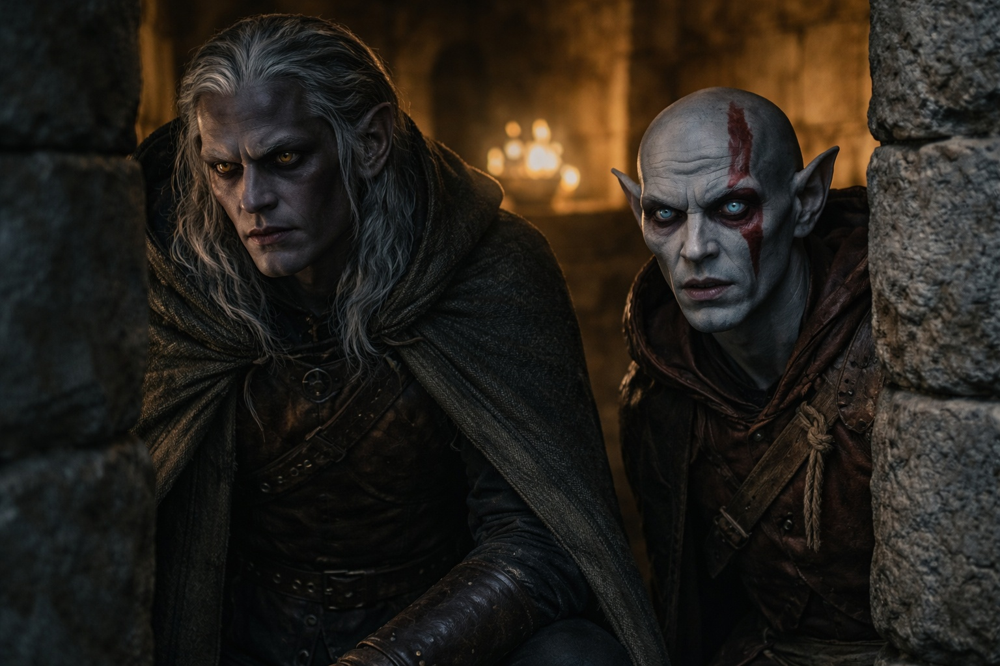
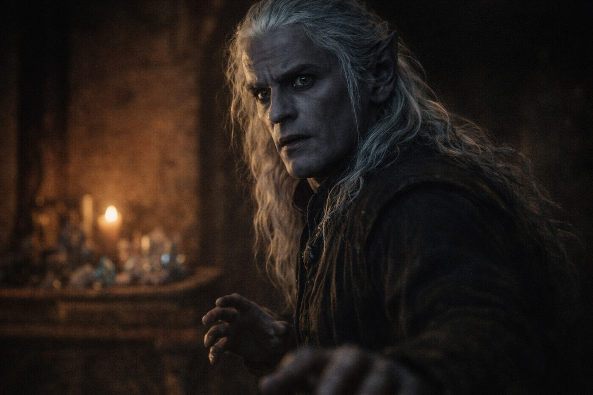
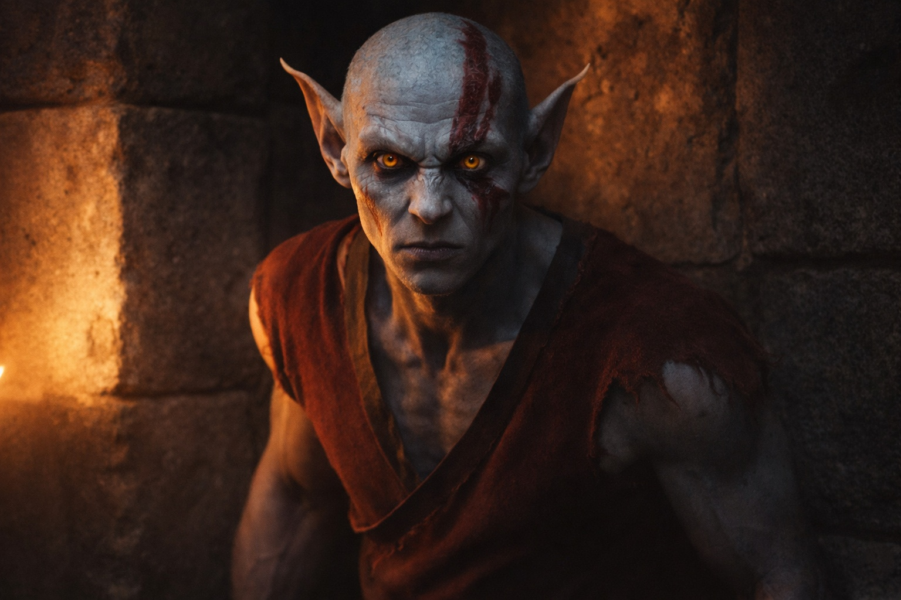
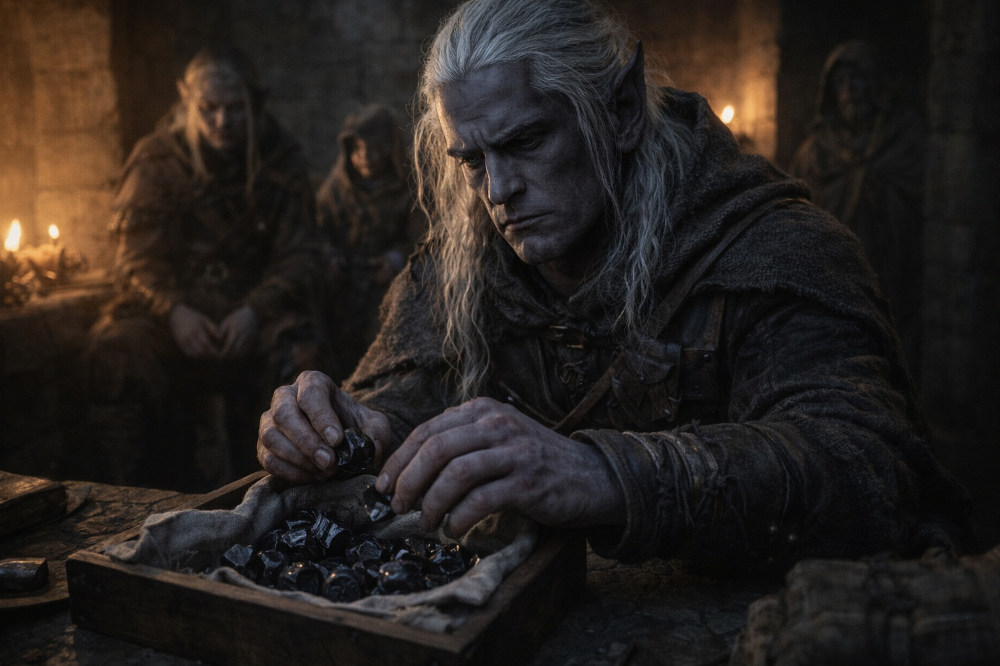

# Capítulo 29.4 | El Drow en la Torre: La Medida

---

Szoravel examinó a Srietz como un albañil examina unos cimientos.

—Alquimista. Autodidacta, a juzgar por las quemaduras de ácido en tu mano izquierda. Diestra, lo que significa que compensas el daño en lugar de adaptar tu técnica. Torre de Vexrath, por el patrón de cicatrices. —Estaba de pie a tres pasos de donde Srietz se sentaba, y no se había acercado más. No había necesitado hacerlo. Su evaluación operaba a una distancia que no requería contacto y no lo invitaba—. ¿Cuánto tiempo?

Las orejas de Srietz estaban rígidas. No pegadas contra su cráneo sino erguidas y fijas, la postura de una goblin cuyos cálculos de lucha o huida habían devuelto una tercera opción: esperar.

—Tres años —dijo.

—Tres años al servicio de Vexrath y saliste con la mente intacta. Eso es inusual. La mayoría de sus sujetos se deterioran después de dieciocho meses. —Szoravel dirigió su atención a la bolsa del cinturón de ella. Sin alcanzarla. Solo mirando—. ¿Qué hay en la bolsa?

—Asunto de Srietz.

—Compuestos. Al menos cuatro tipos distintos, por las manchas. Algo volátil, algo ácido, algo que huele a azufre, y algo que no puedo identificar desde aquí. —Inclinó la cabeza—. El cuarto. ¿Qué es?

—Srietz dijo que es asunto de Srietz.

Szoravel hizo una pausa. La pausa fue breve, calibrada, y servía un propósito que Drusniel reconoció: estaba probando si la insistencia produciría información o resistencia. Eligió seguir adelante. Eso también era información.

—Eres el componente de supervivencia —le dijo a Srietz—. No combate. No magia. Logística, redes, resolución química de problemas. La que se asegura de que el grupo coma y no camine hacia algo que los mate antes de que el enemigo lo haga. —Lo dijo sin condescendencia. Szoravel no condescendía. Clasificaba—. Útil. No mueras.

Las orejas de Srietz se relajaron un grado. —Srietz tomará eso en consideración.

Entonces Szoravel se volvió hacia Elion.

El cambio fue inmediato. No en el cuerpo de Szoravel, que mantuvo la misma quietud controlada, sino en la calidad de su atención. Con Srietz, la evaluación había sido profesional. Rápida. La catalogación de una cantidad conocida. Con Elion, algo más se activó. Algo detrás de los ojos de obsidiana que había estado dormido durante el examen anterior.

Elion estaba de pie en su rincón. Había permanecido inmóvil desde que entró, la quietud particular de alguien cuyo cuerpo podía ser cualquier cosa y había elegido, por el momento, ser esto. Piel gris como piedra erosionada. Ojos ámbar anaranjados que observaban a Szoravel observándolo. Marcas rojas cruzando su rostro, pintura o algo más, la mirada de Szoravel las rastreó.

El drow mayor cruzó la estancia. Se detuvo a dos pasos de Elion. Luego dejó de moverse por completo, de una forma que iba más allá de la quietud física hacia algo que Drusniel solo podía describir como perceptual. Szoravel estaba mirando a Elion con algo más que ojos.

Un silencio se extendió. El fuego ámbar zumbaba. Los cristales en el banco de trabajo vibraban a una frecuencia que había sido constante desde que Drusniel entró y ahora cambió, subiendo de tono como una cuerda que se tensa.

Szoravel retrocedió. Retrocedió de verdad. Un solo paso, deliberado, y lo deliberado del gesto era más revelador que el movimiento en sí. Szoravel no retrocedía ante las cosas. Se reposicionaba. La distinción importaba.

—¿Dónde encontraste a este?

La pregunta iba dirigida a Drusniel pero sus ojos permanecieron en Elion.

—Él me encontró a mí —dijo Drusniel—. En la costa este, tres semanas adentro. Estaba enjaulado.

—Enjaulado. —Szoravel repitió la palabra como saboreándola—. ¿Tienes idea de lo que lleva dentro?

Elion se quedó muy quieto. No la quietud que había mantenido. Una quietud más profunda, la que viene antes de la decisión de luchar o cambiar de forma y huir.

—¿Qué hay dentro de mí? —Su voz era tranquila. Concreta. La voz de alguien que había pasado una vida entera oyendo que era algo sin que nunca le dijeran qué.

Szoravel miró a Elion tres segundos más. Luego se volvió. El movimiento fue preciso y definitivo. —Después. O nunca. No he decidido cuánta verdad puedes sobrevivir. —Regresó a su banco de trabajo y comenzó a recoger los cristales—. Tu cambiaformas lleva un pasajero. El pasajero está dormido. El pasajero lleva dormido mucho tiempo, y no está dormido por accidente.

—Un pasajero —dijo Drusniel.

—Un término que uso porque el término preciso crearía preguntas que no estoy dispuesto a responder delante del sujeto. —Lanzó una mirada a Elion—. Sin ánimo de ofender. Pero el conocimiento cambiaría tu comportamiento, y tu comportamiento actual es lo que mantiene al pasajero dormido. Mejor dejarlo.

Los ojos ámbar de Elion no habían dejado a Szoravel. Sus manos estaban a los costados. Su mandíbula apretada. Drusniel podía ver la tensión recorriendo su cuerpo como una corriente, el esfuerzo de alguien cuyo instinto era huir siendo anulado por la necesidad de comprender.

—Interesante. —Szoravel dijo la palabra a su banco de trabajo, no a nadie en la sala—. Zaelar me ha enviado un portador con deudas, una goblin alquimista, y un recipiente cuyo contenido podría complicarlo todo. —Colocó los cristales en una caja de madera forrada con tela—. Siempre tuvo talento para la mesura.

Srietz habló desde la puerta. —A Srietz le gustaría señalar que Srietz ha estado viajando con estos dos individuos durante semanas y no ha recibido ninguna advertencia sobre pasajeros, recipientes ni complicaciones.

—Eso es porque estabas vigilando las cosas equivocadas. —Szoravel cerró la caja—. Vigilabas las mentiras. Las cosas peligrosas son las verdades que nadie sabe que lleva.

El fuego ardía. Los cristales, ahora dentro de la caja, enmudecieron. Elion permanecía en su rincón y no dijo nada, y el silencio a su alrededor había cambiado de cómodo a la quietud particular de alguien reevaluando cada suposición que había tenido sobre su propio cuerpo.

Drusniel miró a Szoravel. El drow mayor le sostuvo la mirada con la paciencia plana de alguien que había revelado exactamente lo que pretendía y no revelaría más sin importar la calidad de las preguntas.

«Interesante» era todo lo que había dicho sobre Elion. Sin explicación. Sin seguimiento. Y Drusniel vio a Elion cargar esa única palabra como un hombre carga una piedra de la que le han dicho que es o una gema o una granada.

---

*Siguiente: El Drow en la Torre: La Forma*

**Fin del Capítulo 29.4 — continúa en el Capítulo 29.5: [El Drow en la Torre: La Forma](/el-drow-en-la-torre-la-forma/)**
