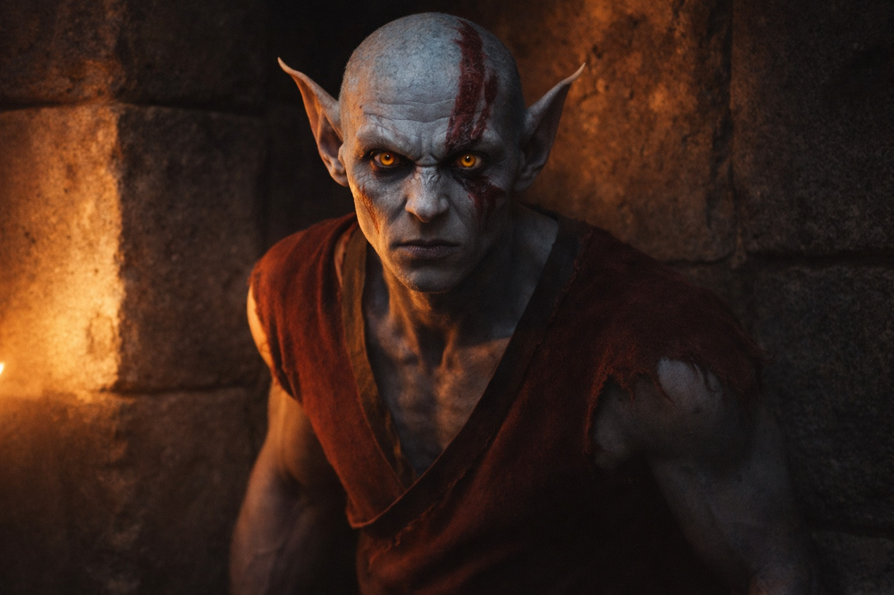
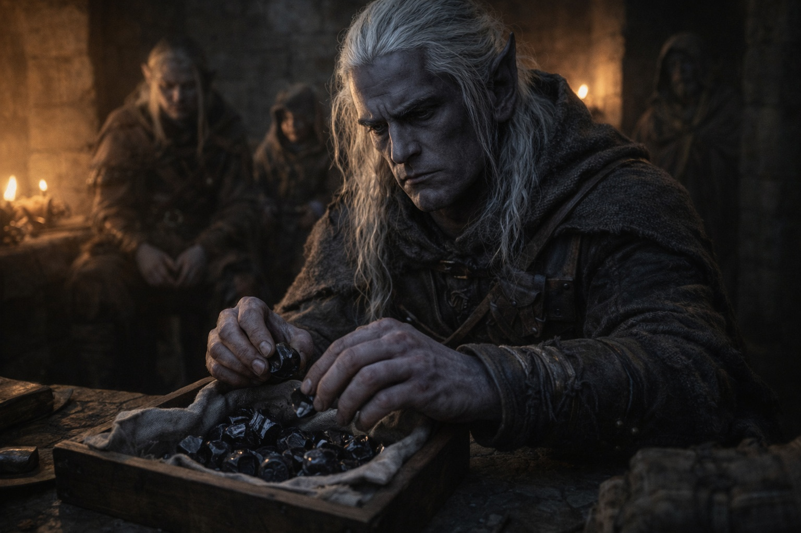

## Capítulo 29 | Parte 4 | La Medida

---

Szoravel examinó a Srietz como un albañil examina unos cimientos.

—Alquimista. Quemaduras en la mano izquierda. Torre de Vexrath. —Szoravel se detuvo a tres pasos de Srietz—. ¿Duración del servicio?

Srietz mantenía las orejas rígidas y las manos sobre las rodillas.

—Tres años —dijo.

—Registrado. —Szoravel miró la bolsa del cinturón—. ¿Contenido?

—Asunto de Srietz.

—Compuestos. Al menos cuatro tipos distintos, por las manchas. Algo volátil, algo ácido, algo que huele a azufre, y algo que no puedo identificar desde aquí. —Inclinó la cabeza—. El cuarto. ¿Qué es?

—Srietz dijo que es asunto de Srietz.

Szoravel esperó. Srietz mantuvo la mano sobre la bolsa.

—Mantén los compuestos volátiles lejos de la mesa. Haz un inventario de tus provisiones antes de partir.

Las orejas de Srietz se relajaron un grado. —Srietz tomará eso en consideración.

Entonces Szoravel se volvió hacia Elion.

Se demoró más con Elion. Su mirada se detuvo en las marcas del rostro del elfo.

Elion estaba en el rincón, con las marcas rojas bien visibles sobre la piel blanca de tono azulado. Sus ojos ámbar anaranjados siguieron a Szoravel.

Szoravel se detuvo a dos pasos y alzó una mano. Le temblaban los dedos mientras la mantenía en alto. Elion retrocedió contra la pared.

Un silencio se extendió. El fuego ámbar zumbaba. Los cristales en el banco de trabajo vibraban a una frecuencia que había sido constante desde que Drusniel entró y ahora cambió, subiendo de tono como una cuerda que se tensa.

Szoravel bajó la mano y dio un paso atrás.

—¿Dónde encontraste a este?

La pregunta iba dirigida a Drusniel pero sus ojos permanecieron en Elion.

—Él me encontró a mí —dijo Drusniel—. En la costa este, tres semanas adentro. Estaba enjaulado.

—Enjaulado. —Szoravel repitió la palabra como saboreándola—. ¿Tienes idea de lo que lleva dentro?

Elion desplazó el peso hacia la puerta.

—¿Qué hay dentro de mí?

—Una presencia dormida. —Szoravel volvió a la mesa—. Ningún examen más hoy.

—Una presencia —repitió Drusniel.

—Sin clasificar. Ningún intento de despertarla.

Elion permaneció junto a la pared. Observó cómo Szoravel empezaba a guardar los cristales.

—Portador. Alquimista. Cambiaformas. —Szoravel dejó el último cristal en una caja forrada de tela—. Evaluación del grupo incompleta.

Srietz habló desde la puerta. —A Srietz le gustaría señalar que Srietz ha estado viajando con estos dos individuos durante semanas y no ha recibido ninguna advertencia sobre pasajeros, recipientes ni complicaciones.

—Ahora tienes el registro. —Szoravel cerró la caja.

El zumbido cesó al cerrarse la tapa. Elion se tocó una de las marcas de la cara.

Drusniel miró a Szoravel. El drow mayor le sostuvo la mirada con la paciencia plana de alguien que había revelado exactamente lo que pretendía y no revelaría más sin importar la calidad de las preguntas.

Drusniel esperó otra pregunta de Elion. No llegó.

---

**Fin del Capítulo 29.4  —> 29.5: [El Drow en la Torre: La Forma](/el-drow-en-la-torre-la-forma/)**
