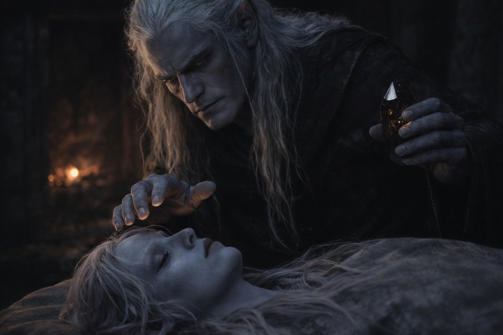
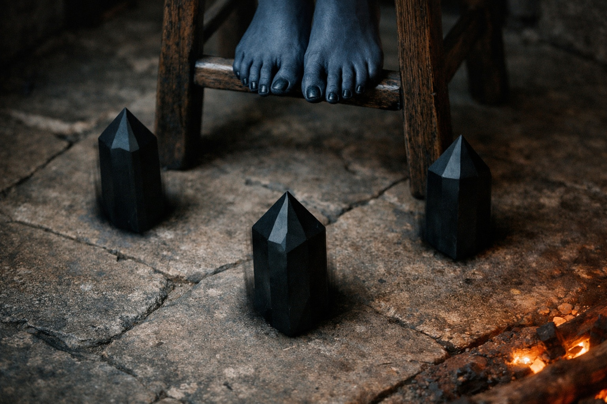
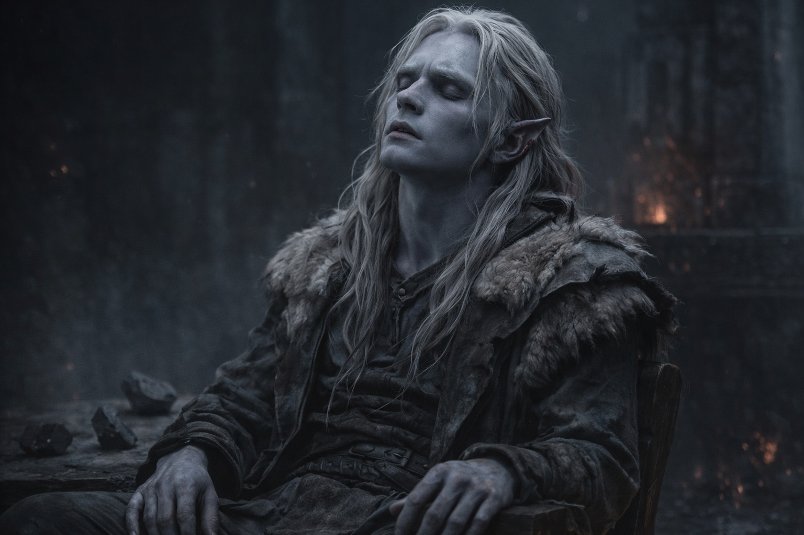
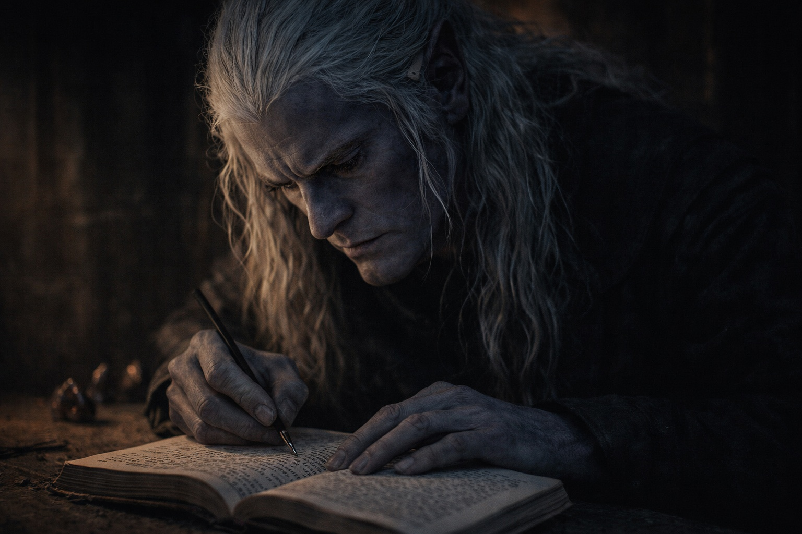
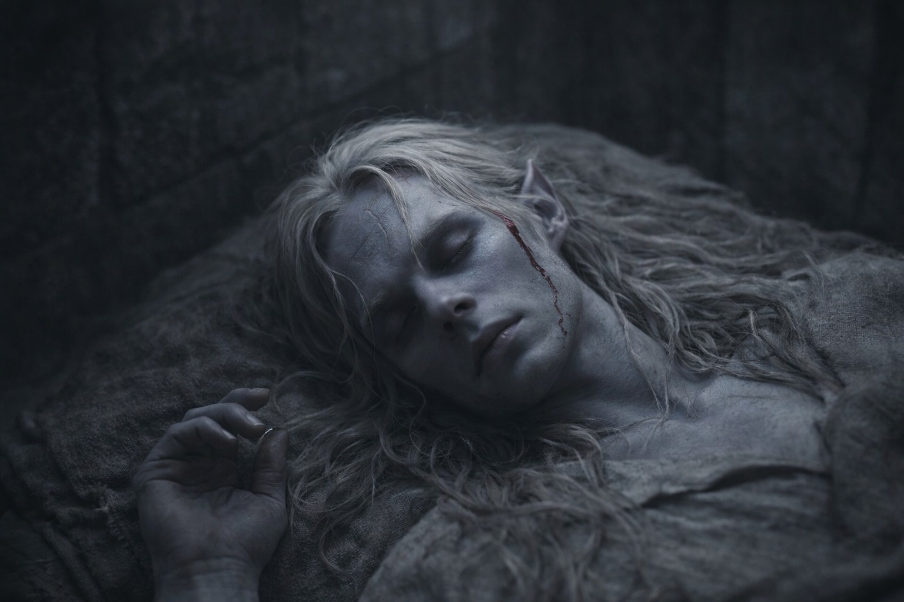

## Capítulo 29 | Parte 6 | Las Fracturas

---

Drusniel despertó con Szoravel de pie sobre él.

No observando. Comprobando. Sus dedos flotaban a cinco centímetros de la frente de Drusniel, trazando algo invisible. El cristal negro en su otra mano captaba una luz tenue de las brasas al otro lado de la sala. Srietz estaba despierta junto a la puerta, orejas pegadas y fijas hacia delante. Elion dormía en su rincón, o eso parecía.

—¿Cuánto llevas ahí?

—Lo suficiente. —Szoravel retiró la mano y guardó el cristal en el bolsillo. No se sentó—. La cosa en tu cabeza estaba activa mientras dormías. El evento de la cámara de cristal abrió un canal. Has estado proyectando desde los túneles. ¿Lo sabías?

Drusniel se incorporó. Le dolía el cuello. —¿Proyectando qué?

—A ti mismo. Fragmentos de consciencia. Imágenes parciales, residuo emocional, datos espaciales. Has estado emitiendo como un fuego emite calor. Sin control. Persistente. Cualquier persona o cosa sensible a las frecuencias te habría detectado hace semanas. —Szoravel cruzó hasta el banco de trabajo y colocó el cristal junto al disco de mercurio—. Los cristales en tu sistema redujeron la fricción entre tu consciencia y el plano adyacente. No crearon la habilidad. Eliminaron la resistencia. Has estado deslizándote a través mientras dormías.

—¿Deslizándome hacia qué?

Szoravel hizo una pausa del modo en que la hacía cuando medía cuánta respuesta ayudaría frente a cuánta paralizaría. —Las Tierras del Sueño. El tejido conectivo entre cada mente que alguna vez ha soñado. No es un lugar físico. Un plano donde el pensamiento subconsciente se entreteje. Deseos, miedos, recuerdos, proyecciones. Todo enmarañado. Todo accesible para cualquier cosa que sepa navegar las fracturas.

—Y yo he estado yendo allí. Mientras duermo.

—Has estado filtrándote hacia allí. Hay una diferencia. Ir implica dirección. Tú has estado derramando consciencia como una tubería agrietada derrama agua. Los sueños que has tenido, los vívidos, los que se sentían como algo más que sueño. No eran sueños. Eran observaciones. Tuyas, mirando un plano que no puedes nombrar. Y el plano, mirando de vuelta.

El fuego se había consumido hasta las brasas. La torre estaba fría. Las manos de Drusniel estaban firmes pero su mandíbula apretada.

—¿Se puede controlar?

—Eso depende de si puedes aprender a leer fracturas en un medio que no obedece la física que conoces. —Szoravel arrastró un taburete hasta el centro de la sala y se sentó en él. Colocó tres cristales negros en el suelo formando un triángulo alrededor del taburete—. Siéntate.

Drusniel miró a Srietz. Las orejas de la goblin estaban rígidas. Sus ojos amarillos se movían entre Drusniel y Szoravel con el cálculo concentrado de alguien decidiendo si correr o quedarse y contar los daños después.

—A Srietz no le gusta esto —dijo la goblin.

—Anotado. —Szoravel no la miró.

Drusniel se sentó en el taburete.

—Cierra los ojos. Los cristales facilitarán la transición. Piensa en cómo lees las grietas en la piedra. Los patrones, los puntos de estrés, cómo las fracturas se propagan por el material. Ese instinto. Las Tierras del Sueño también tienen fracturas. No son piedra. No son nada físico. Pero los principios se traducen. El estrés crea líneas. Las líneas crean caminos. Los caminos pueden seguirse.

Drusniel cerró los ojos. Los cristales zumbaron. No de forma audible. En algún lugar detrás de su esternón, donde el sonido se convertía en sensación.

—No busques. Deja que venga a ti. El plano ya está ahí. Lo has estado tocando cada noche. Esta vez, observa.

La oscuridad detrás de sus párpados cambió.

No fue gradual. Un momento estaba sentado en un taburete en una torre con brasas ámbar tras él. Al siguiente, la oscuridad tenía textura. Capas. Estaba tejida con cosas que no podía nombrar. No luz, no sombra. Algo que existía entre la percepción y el pensamiento, una tela hecha del peso colectivo de cada mente que jamás había sido lo bastante consciente para soñar.

Podía sentirlas. No individualmente. Como un hombre bajo la lluvia no siente cada gota pero sabe que la lluvia está ahí. Mentes. Miles. Millones. Un océano de actividad subconsciente, enmarañado y agitado, ninguna parte consciente de sí misma.

Las fracturas aparecieron.

No eran grietas en piedra. Pero su instinto para leerlas se activó de todos modos, el reconocimiento de patrones que lo había mantenido vivo en cuevas donde un paso en falso significaba derrumbe. Líneas de estrés en la tela. Puntos donde la trama era delgada. Direcciones que no eran norte, sur, este u oeste sino algo más antiguo. Algo que precedía a la dirección.

Siguió una.

Lo arrastró de lado. No físicamente. La sensación se parecía más a recordar un lugar en el que nunca había estado. La línea de fractura lo condujo a través de capas de pensamiento enmarañado, más allá de impresiones que no eran suyas: una mujer contando monedas en una ciudad que jamás había visitado, un niño mirando cómo la nieve caía sobre el agua, algo vasto y paciente girando en un espacio que no tenía suelo. Pasó a través de ellas como la luz pasa a través del vidrio. Sin cambios, pero no sin ser notado.

La fractura se bifurcó. Eligió la que se sentía como piedra, la que portaba la resonancia de mineral y presión y tierra profunda. Su instinto, traducido a un medio que debería haberlo rechazado.

Algo coalescó.

No una voz. No una visión. Una colección de impresiones ensambladas en un patrón que su consciencia podía interpretar. Una cresta de piedra negra bajo un cielo del color del cobre magullado. Un río que fluía al revés. Una torre, no la de Szoravel, más alta y más oscura y medio consumida por la tierra a su alrededor. Tres caminos partiendo de ella: uno bloqueado por algo que respiraba, uno inundado de una luz que quemaba, uno abierto y silencioso y erróneo.

El silencioso. Esa era la dirección.

Intentó retenerlo. La impresión se deshilachó. La trama de las Tierras del Sueño tiró de los bordes de su atención, disolviendo el patrón como el agua disuelve la sal. Lo buscó y el buscar lo empeoró.

Algo lo notó.

Muy abajo. Muy adentro. Algo vasto desplazó su atención en la dirección de la perturbación que su presencia había creado. La misma presencia que había sentido en la cámara de cristal. Paciente. Antigua. Ni hostil, ni benévola. Consciente de una forma que hacía que la propia consciencia se sintiera insuficiente como descripción.

Se retiró.

El regreso fue peor que la entrada. El taburete se materializó bajo él con la violencia de una caída desde las alturas. Su cuerpo recordó la gravedad de golpe. La torre irrumpió: paredes de piedra, aire frío, el olor a fuego muerto y libros viejos. Su oído derecho estaba húmedo. Cuando se lo tocó, los dedos salieron rojos.

Szoravel estaba escribiendo.

No miraba a Drusniel. Escribía en un libro encuadernado en cuero a una velocidad que sugería que había estado registrando desde que la proyección comenzó. Su caligrafía era pequeña y precisa. Los cristales en el suelo se habían oscurecido.

—¿Cuánto tiempo?

—Siete minutos. Más de lo que esperaba para un primer intento controlado. Menos de lo útil. —Szoravel terminó su anotación y levantó la vista—. ¿Qué viste?

Drusniel lo describió. La cresta. El río. La torre. Los tres caminos. Szoravel escuchó sin interrumpir, luego giró a una página limpia y dibujó lo que Drusniel describía. Los bocetos eran rápidos y precisos, el trabajo de alguien que había hecho esto antes.

—La cresta existe. El río, no puedo verificarlo. La torre no coincide con nada en mis registros, lo que significa que o está más adentro de la zona de la barrera o es algo que las Tierras del Sueño ensamblaron a partir de tus expectativas. —Golpeó el boceto de los tres caminos—. Uno bloqueado, uno ardiendo, uno silencioso. Elegiste el silencioso.

—Se sentía correcto.

—Eso es instinto o manipulación. Las Tierras del Sueño no mienten, pero tampoco dicen la verdad. Reflejan. Lo que ves está filtrado a través de cada consciencia que alguna vez ha soñado sobre el mismo territorio. Miles de interpretaciones superpuestas sobre la realidad que exista debajo. Tu instinto para leer grietas te da ventaja porque lees estrés estructural, no contenido. Pero incluso las lecturas estructurales pueden engañar si la propia estructura ha sido comprometida.

Cerró el libro. —Trajiste direcciones. Si son precisas o las Tierras del Sueño reflejan el deseo de alguien más de que vayas por ese camino, no puedo determinarlo con una sola proyección. Tendrás que entrar de nuevo. Lecturas múltiples. Referencia cruzada. Como leerías un sistema de cuevas: desde diferentes ángulos, diferentes puntos de entrada, buscando las líneas que permanecen consistentes cuando la perspectiva cambia.

—¿Y el coste?

Szoravel miró la oreja de Drusniel. La sangre le había llegado al cuello. —Notaste a la entidad.

—Ella me notó a mí.

—Sí. Ese es el coste. Cada proyección pone tu consciencia en un espacio donde la entidad existe. Los cristales reducen la fricción de entrada pero no te ocultan. Cuanto más proyectes, más visible te vuelves. El sangrado es tu cuerpo protestando por la separación. Empeorará con la repetición antes de mejorar. Si mejora.

—¿Y si no mejora?

—Entonces aprenderás tus límites empíricamente. —Szoravel se levantó y devolvió el taburete a su esquina—. Aprenderás a controlarlo. O consumirá tu capacidad de distinguir entre pensamiento despierto y pensamiento soñado. De cualquier modo, datos útiles.

Drusniel se limpió la oreja con la manga. La sangre ya se detenía. Siete minutos en las Tierras del Sueño. Una cresta, un río, una torre. Tres caminos. Direcciones que podían ser reales o el eco distorsionado de mil otras mentes que habían mirado el mismo territorio y soñado sus propios caminos a través de él.

No un mapa. Ni siquiera pistas fiables. Impresiones filtradas a través de un plano que reflejaba más de lo que revelaba, interpretadas por un instinto que había sido entrenado para la piedra y ahora se aplicaba a la consciencia.

Miró el libro cerrado de Szoravel. Los bocetos que no podía ver.

—¿Cuándo volvemos a entrar?

—No volvemos. Lo haces tú. Mañana por la noche. Luego la noche siguiente. Construye un compuesto. Busca las líneas de fractura que se repiten. Esas son las estructurales. Las direcciones que persisten cuando todo lo demás cambia. Esa es tu ruta. —Szoravel guardó el libro—. Duerme ahora. Tu cuerpo necesita reintegrarse. La oreja sanará. La desorientación no.

Drusniel se recostó en el jergón. El techo de la torre era alto y oscuro y no se movía, cosa que confirmó dos veces antes de confiar en ello. Su oído derecho palpitaba. Sus pensamientos se sentían sueltos, como si hubieran sido desmontados y reensamblados en aproximadamente el orden correcto pero con pequeños errores que solo notaría después.

Srietz observaba desde el umbral. No había hablado desde su única protesta. Sus orejas no se habían relajado.

—Srietz. —La voz de Drusniel salió más ronca de lo esperado—. ¿Sigues ahí?

—Srietz no duerme cerca de gente que abandona su cuerpo mientras duerme. —Lo dijo como decía todo: como evaluación práctica—. Srietz dormirá en el corredor.

Se fue. La puerta quedó abierta.

Elion estaba despierto. Había estado despierto todo el tiempo, probablemente. Sus ojos ámbar anaranjados observaban a Drusniel desde el rincón con una expresión que contenía demasiadas capas para leerla en este estado. Reconocimiento, quizá. O algo más cercano a la compasión. O algo para lo que Drusniel no tenía palabra porque las Tierras del Sueño habían desorganizado temporalmente su vocabulario para emociones.

—Sabes lo que fue eso —dijo Drusniel. No una pregunta.

Elion no respondió. Cerró los ojos. Su quietud no era sueño.

El fuego estaba muerto. La torre estaba fría. Afuera, Wyrmreach continuaba su lenta y mesurada anomalía, indiferente al hecho de que alguien dentro de sus fronteras acababa de aprender a deslizarse entre las costuras de la consciencia, y había traído direcciones que podían no conducir a ningún sitio, y había atraído la atención de algo que no podía permitirse atraer, y sangraba por el oído, y lo iba a hacer de nuevo mañana.

Cerró los ojos. El sueño llegó como una puerta cerrándose de golpe.

---

**Fin del Capítulo 29.6  —> 30.1: [Las Semillas de la Convergencia: La Dirección](/las-semillas-de-la-convergencia-la-direccion/)**
