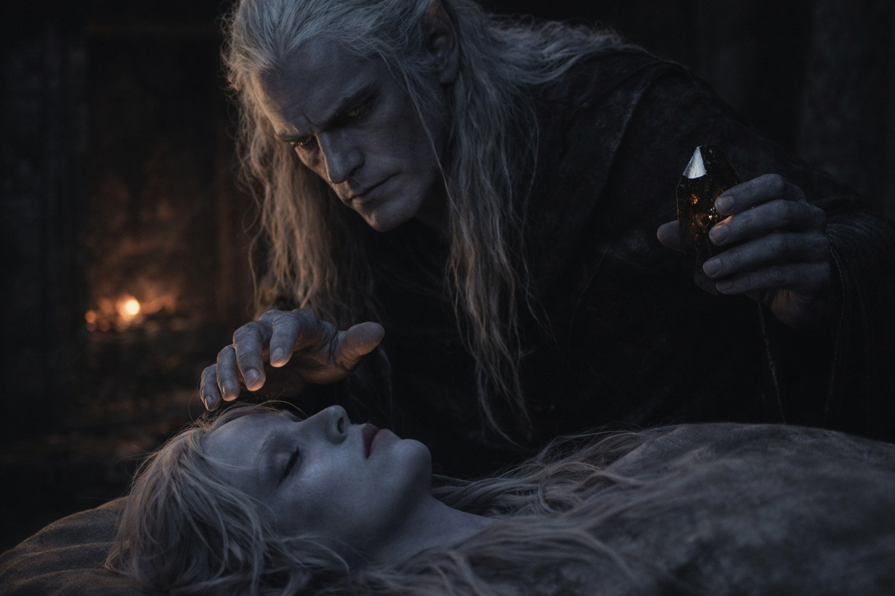
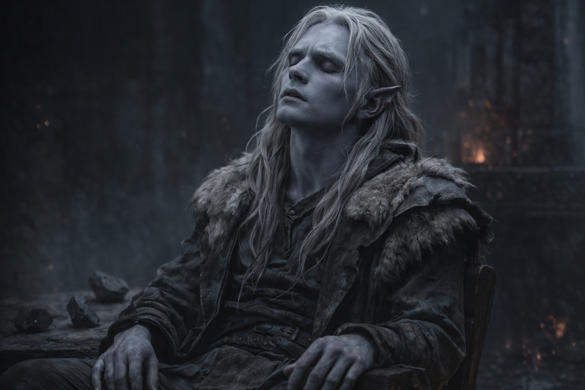
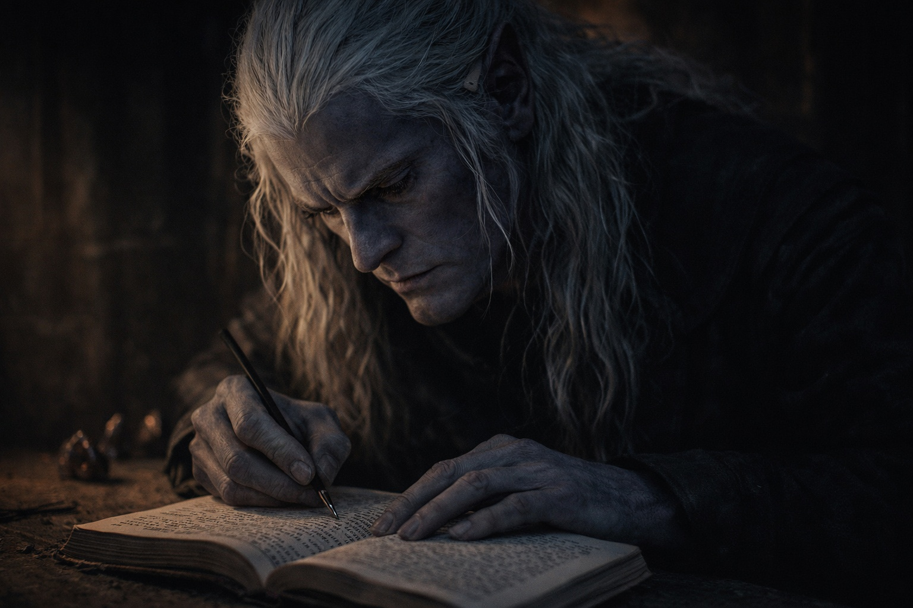
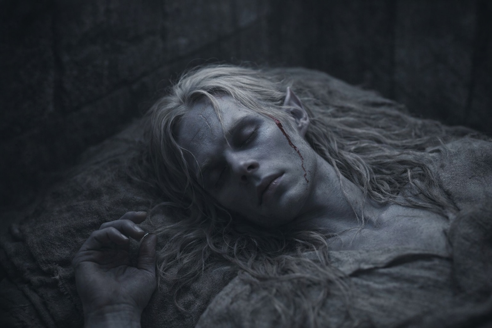

## Capítulo 29 | Parte 6 | Las Fracturas

---

Drusniel despertó con Szoravel de pie sobre él.

Szoravel sostenía un cristal cerca de la frente de Drusniel. Le temblaba la otra mano al trazar una línea en el aire. Srietz observaba desde la puerta. Elion yacía en su rincón con los ojos cerrados.

—¿Cuánto llevas ahí?

—Evaluación completa. —Szoravel guardó el cristal—. Proyección detectada durante el sueño.

Drusniel se incorporó. Le dolía el cuello. —¿Proyectando qué?

—Imágenes. Lugares. Fragmentos de pensamiento. Ningún control registrado. —Dejó el cristal junto al disco—. Se requieren más pruebas.

—¿Deslizándome hacia qué?

—Las Tierras del Sueño. Registra solo lo que observes allí.

—Y yo he estado yendo allí. Mientras duermo.

—Contacto sin control. Ninguna ruta verificada.

El fuego se había consumido hasta las brasas. La torre estaba fría. Las manos de Drusniel estaban firmes pero su mandíbula apretada.

—¿Se puede controlar?

—Demuéstralo. —Szoravel colocó tres cristales alrededor de un taburete vacío—. Siéntate.

Drusniel miró a Srietz. El goblin no se había apartado de la puerta.

—A Srietz no le gusta esto —dijo el goblin.

—Anotado. —Szoravel mantuvo la mirada en Drusniel.

Drusniel se sentó en el taburete.

—Cierra los ojos. Busca una fractura. Síguela. Recuerda las bifurcaciones.

Los cristales zumbaron cuando Drusniel cerró los ojos. Las manos se le enfriaron sobre las rodillas. Intentó levantar un dedo y no pudo.

—Observa. No fuerces la entrada.

La oscuridad detrás de sus párpados cambió.

La oscuridad se dividió en formas superpuestas. Ya no sentía el taburete debajo.

Unos pensamientos se apretaban contra los suyos, demasiados para distinguirlos. Intentó encontrar uno que reconociera.

Las fracturas aparecieron.

Reconoció las ramificaciones antes de entender qué veía. Algunas líneas terminaban de golpe. Una continuaba más allá de las formas que lo rodeaban.

Siguió una.

Lo arrastró de lado. No físicamente. La sensación se parecía más a recordar un lugar en el que nunca había estado. La línea de fractura lo condujo a través de capas de pensamiento enmarañado, más allá de impresiones que no eran suyas: una mujer contando monedas en una ciudad que jamás había visitado, un niño mirando cómo la nieve caía sobre el agua, algo vasto y paciente girando en un espacio que no tenía suelo. Pasó a través de ellas como la luz pasa a través del vidrio. Sin cambios, pero no sin ser notado.

La fractura se bifurcó. Eligió la que se sentía como piedra, la que portaba la resonancia de mineral y presión y tierra profunda. Su instinto, traducido a un medio que debería haberlo rechazado.

Algo coalescó.

Apareció una cresta de piedra negra bajo un cielo cobrizo. Debajo, un río corría cuesta arriba. Una torre medio enterrada se alzaba en un cruce de tres caminos. Algo que respiraba bloqueaba uno. Una luz ardía sobre otro. El tercero estaba vacío.

El silencioso. Esa era la dirección.

Intentó retener la imagen. Se desdibujó y, cuanto más se concentraba, menos veía.

Algo lo notó.

Sintió la presión que había conocido en la cámara de cristal. Se acercaba.

Se retiró.

El regreso fue peor que la entrada. El taburete se materializó bajo él con la violencia de una caída desde las alturas. Su cuerpo recordó la gravedad de golpe. La torre irrumpió: paredes de piedra, aire frío, el olor a fuego muerto y libros viejos. Su oído derecho estaba húmedo. Cuando se lo tocó, los dedos salieron rojos.

Szoravel estaba escribiendo.

No miraba a Drusniel. Escribía en un libro encuadernado en cuero a una velocidad que sugería que había estado registrando desde que la proyección comenzó. Su caligrafía era pequeña y precisa. Los cristales en el suelo se habían oscurecido.

—¿Cuánto tiempo?

—Siete minutos. Más de lo que esperaba para un primer intento controlado. Menos de lo útil. —Szoravel terminó su anotación y levantó la vista—. ¿Qué viste?

Drusniel lo describió. La cresta. El río. La torre. Los tres caminos. Szoravel escuchó sin interrumpir, luego giró a una página limpia y dibujó lo que Drusniel describía. Los bocetos eran rápidos y precisos, el trabajo de alguien que había hecho esto antes.

—Cresta confirmada. Río y torre sin verificar. —Szoravel tocó el dibujo—. Elegiste el camino vacío.

—Se sentía correcto.

—Insuficiente. Compruébalo con una segunda lectura.

Cerró el libro. —Repite desde otro punto de entrada. Registra qué líneas permanecen.

—¿Y el coste?

Szoravel miró la oreja de Drusniel. La sangre le había llegado al cuello. —Notaste a la entidad.

—Ella me notó a mí.

—Mayor exposición con cada proyección. Sangrado registrado. Recuperación sin verificar.

—¿Y si no mejora?

—Entonces registra la pérdida de función. —Szoravel apartó el taburete.

Drusniel se limpió la oreja con la manga. La sangre ya se detenía. Siete minutos en las Tierras del Sueño. Una cresta, un río, una torre. Tres caminos. Direcciones que podían ser reales o el eco distorsionado de mil otras mentes que habían mirado el mismo territorio y soñado sus propios caminos a través de él.

No podía llevar a Srietz y Elion por un camino solo porque pareciera vacío.

Miró el libro cerrado de Szoravel. Los bocetos que no podía ver.

—¿Cuándo volvemos a entrar?

—Entras tú. Mañana por la noche. Repite hasta que coincidan las lecturas. —Szoravel guardó el libro—. Descansa. Informa de cualquier cambio en el oído.

Drusniel se recostó en el jergón. El techo de la torre era alto y oscuro y no se movía, cosa que confirmó dos veces antes de confiar en ello. Su oído derecho palpitaba. Sus pensamientos se sentían sueltos, como si hubieran sido desmontados y reensamblados en aproximadamente el orden correcto pero con pequeños errores que solo notaría después.

Srietz observaba desde el umbral. No había hablado desde su única protesta. Sus orejas no se habían relajado.

—Srietz. —La voz de Drusniel salió más ronca de lo esperado—. ¿Sigues ahí?

—Srietz no duerme cerca de gente que abandona su cuerpo mientras duerme. —Lo dijo como decía todo: como evaluación práctica—. Srietz dormirá en el corredor.

Se fue. La puerta quedó abierta.

Elion lo observaba desde el rincón. Había estado despierto todo el tiempo, comprendió Drusniel.

—Sabes lo que fue eso —dijo Drusniel. No una pregunta.

Elion no respondió. Cerró los ojos. Su quietud no era sueño.

Drusniel se apretó la manga contra el oído que sangraba. Volvería a entrar mañana. Necesitaba una ruta de la que pudiera fiarse.

Cerró los ojos. Esta vez no sintió nada más allá del jergón frío.

---

**Fin del Capítulo 29.6  —> 30.1: [Las Semillas de la Convergencia: La Dirección](/las-semillas-de-la-convergencia-la-direccion/)**
