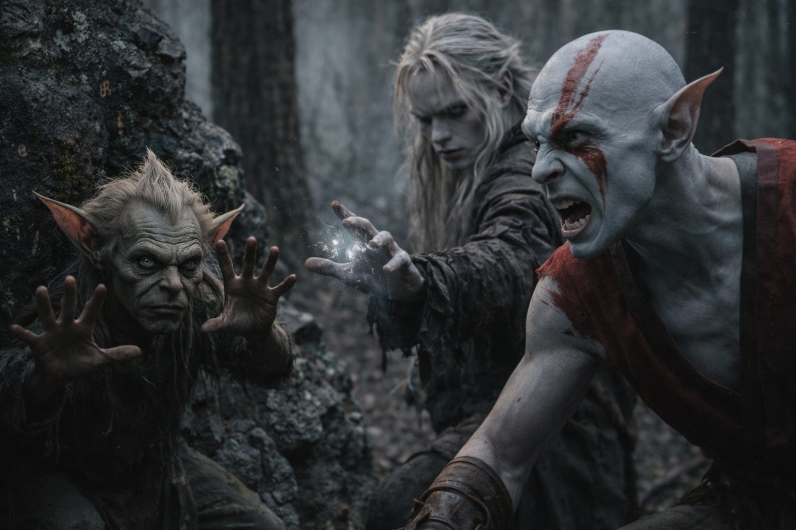
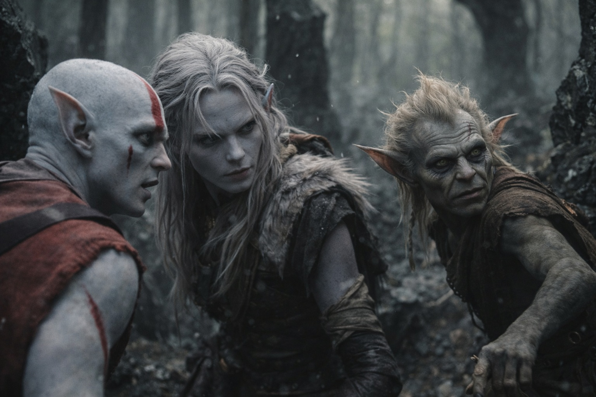

## Capítulo 15 | Parte 2

---

Una piedra suelta chasqueó junto al sendero.

Drusniel se volvió. Una figura pequeña de piel gris verdosa estaba agachada junto a la roca, con una mano contra el pecho. Miró más allá de ellos, hacia los árboles.

—Perdidos —dijo—. Y perseguidos. Srietz los ha visto empeorar las dos cosas.

Drusniel levantó la mano. Elion se le puso delante, con los pies separados sobre el sendero.

—Esperen. —El goblin mostró las palmas—. A Srietz también lo persiguen. Conoce la salida, pero no puede llegar solo. Necesitan un guía. Srietz necesita compañía.

—¿Por qué deberíamos confiar en ti? —preguntó Drusniel.

—¿Confiar? —Srietz soltó una risa seca y áspera—. Demasiado caro. Srietz propone un trato.

—Srietz sabe qué los caza. Sabe cómo seguir vivo aquí. —Señaló a Drusniel y después a Elion—. Ustedes protegen mientras Srietz guía.

Otro chillido resonó a través de los árboles, más cerca ahora.

—¿Qué nos caza? —exigió saber Elion.

—Coatly. —La voz de Srietz bajó—. Criaturas de Vexrath. Primero el sonido. Firmas extrañas cuando están cerca. —Señaló a Drusniel—. Tu magia deja una. —Después a Elion—. Tú dejas otra. Srietz no sabe qué es la tuya.

—¿Qué tan cerca?

—Lo suficiente para que correr importe. Lanzar magia es peor. Si lanzas, ya no necesitan buscar.

—¿Conoces a Vexrath?

El goblin aferró la correa de su mochila. —Srietz trabajaba para él. Se fue sin permiso. —Señaló una calavera tallada—. Sigue siendo su territorio. Srietz preferiría hablar de esto en otro sitio.

Los chillidos se superponían hasta que ya no podía distinguirlos.

—¿Cuál es tu oferta? —preguntó Drusniel, volviéndose hacia un grito que había sonado detrás.

—Los mantienen lejos de Srietz. Srietz los saca de aquí. Después nos separamos. Sin deuda.

Elion miró a Drusniel y volvió la vista a los árboles. —Decide. Están cerca.

Drusniel ya no distinguía el tronco bifurcado. Srietz había elegido un hueco entre las rocas y empezaba a acercarse.

—Llévenme con ustedes. —A Srietz se le agudizó la voz—. No dejen a Srietz cuando el camino se ponga difícil. Ese es el precio.

—Guíanos —dijo Drusniel—. Pero si nos traicionas...

—La traición es mal negocio. —Srietz ya se estaba moviendo—. Srietz es bueno en negocios. Ahora corran. Vienen.

---

**Fin de Capítulo 15.2 —> 15.3: [El Goblin Que Cuenta Costos: Los Cazadores](/el-goblin-que-cuenta-costos-los-cazadores/)**
