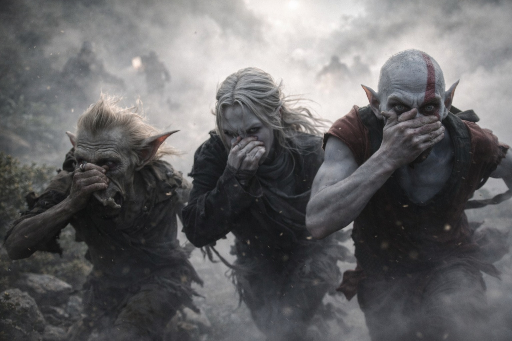

## Capítulo 15 | Parte 6

---

Los Coatly los encontraron al final del tercer día.

El primer chillido llegó desde atrás. Elion se volvió bajando el hombro sano, mientras Srietz buscaba a tientas la mochila.

—Nos encontraron. —La voz del goblin estaba tensa.

Drusniel levantó la mano hacia el aire en movimiento.

—NO. —Srietz agarró su brazo con fuerza sorprendente—. Lanza magia y cada Coatly a leguas recibe una dirección.

—¿Entonces qué sugieres?

Srietz rebuscó entre los separadores acolchados de su mochila maltrecha. —Humo. Ningún hechizo que puedan seguir.

Sacó un vial. Líquido claro que atrapaba la luz tenue de manera extraña.

—¿Qué es eso? —preguntó Elion, con los ojos todavía fijos en las formas que se acercaban.

—El compuesto dispersa su ecosentido. El humo lo transporta. —Las manos de Srietz temblaron alrededor del vial—. El último. Tres semanas para reemplazarlo.

—Úsalo.

—Tres semanas...

—Úsalo.

Srietz arrojó el vial.

El vial se rompió contra una roca. El humo blanco cubrió el sendero y los chillidos se dispersaron con él. Un Coatly chocó contra un tronco con fuerza suficiente para hacer caer las hojas.

—¡CORRAN! —Srietz desapareció entre el humo.

Corrieron encorvados entre el humo que les quemaba los ojos. El bulto de Drusniel se enganchó en una rama; la correa se rompió y el odre y la manta cayeron al suelo. Los dejó allí. Delante, Elion volvió a estrecharse el hombro para pasar entre dos troncos muy juntos y tropezó con tanta fuerza que Srietz tuvo que sujetarlo.

Más allá del humo, una abertura baja cortaba la ladera de una cresta negra. Elion señaló con la mano sana.

Se lanzaron adentro.

<video controls playsInline preload="metadata" poster="./obsidian-cave-after-flight_sora.jpg" width="100%">
	<source src="./Caves.mp4" type="video/mp4" />
</video>

Los Coatly no los siguieron.

Elion se dejó caer contra la pared, temblando. Drusniel se dobló sobre las rodillas hasta poder respirar sin toser. La comida se había acabado aquella mañana; ahora el agua estaba fuera, junto al bulto roto.

Srietz miró el hueco vacío en su estuche de viales.

—Dijiste que nosotros te protegíamos.

Srietz cerró el estuche. —Cuesta cobrarles a los cadáveres.

Las cuevas de obsidiana brillaban a su alrededor exactamente donde Elion las había recordado.

Srietz miró hacia la oscuridad. —¿Y ahora adónde?

—Al este —dijo Drusniel.

---

**Fin de Capítulo 15.6 —> 16.1: [La Advertencia del Vidente: El Peso](/la-advertencia-del-vidente-el-peso/)**
