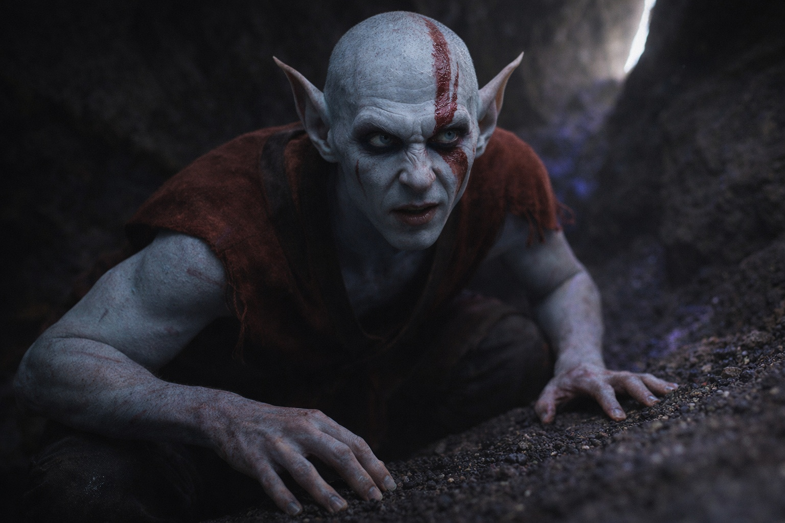

## Capítulo 15 | Parte 4

---

Se detuvieron en una caverna donde algo más vivía.

Un roce recorrió la piedra bajo sus botas. Elion se volvió hacia él, dilatando las aletas de la nariz. Los Coatly habían callado a sus espaldas.

—Descansen. —Srietz se dejó caer contra la pared, respirando con dificultad—. No pasarán junto a lo que vive aquí. Se marcha al amanecer. Nosotros salimos antes.

Elion se agachó junto a la entrada y fue devolviendo el hombro a su sitio. Mantuvo el brazo sano apartado de la pared.

Drusniel siguió de pie, lo bastante cerca de la entrada para ver más allá de Elion.

—Nos guiaste bien —admitió—. Conoces este territorio.

—Srietz sabe lo suficiente para seguir vivo aquí. —Los ojos del goblin brillaron en la oscuridad—. Estar solo empieza a salir caro. Ustedes son aliados potenciales.

—Potenciales.

—Todavía no te sientas. —Srietz mostró los dientes—. Bien. Alguien debería vigilar esa entrada mientras Srietz recupera el aliento.

—¿Qué quieres? —preguntó Elion desde su posición agachada.

—Una habitación donde Srietz pueda trabajar y nadie sea dueño de la puerta. Lejos de Vexrath. —Miró hacia el roce de la pared—. Lejos de esto también. ¿Qué quieren ustedes?

—Llegar a un mago llamado Szoravel —dijo Drusniel—. Al este, más allá de las tierras en disputa.

—Szoravel. Antes pagaban bien por noticias suyas. —Srietz se frotó la palma con el pulgar manchado—. Un ermitaño poderoso en el yermo. Peligroso, si aún vive. El camino al este cruza varios territorios; Srietz conoce algunos.

—¿A cambio de?

—Mantengan vivo a Srietz hasta que estemos fuera del alcance de Vexrath. Más allá, hablaremos de otro precio.

Drusniel lo consideró. Srietz los necesitaba vivos. Por ahora. Merrik también lo había necesitado vivo, hasta que cambió el precio.

—Nos avisas antes de que cambien los términos —dijo Drusniel—. Nosotros decidimos si seguimos.

—Srietz recuerda quién paga justo —añadió el goblin en voz baja—. Srietz también recuerda quién no.

—Tenemos un trato —dijo Drusniel.

Srietz se recostó contra la piedra. —Bien. Despierten a Srietz para la siguiente guardia. Si se queja, despiértenlo otra vez.

---

**Fin de Capítulo 15.4 —> 15.5: [El Goblin Que Cuenta Costos: El Recuerdo](/el-goblin-que-cuenta-costos-el-recuerdo/)**
