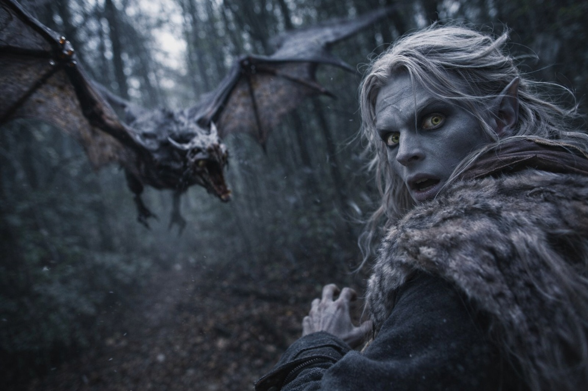
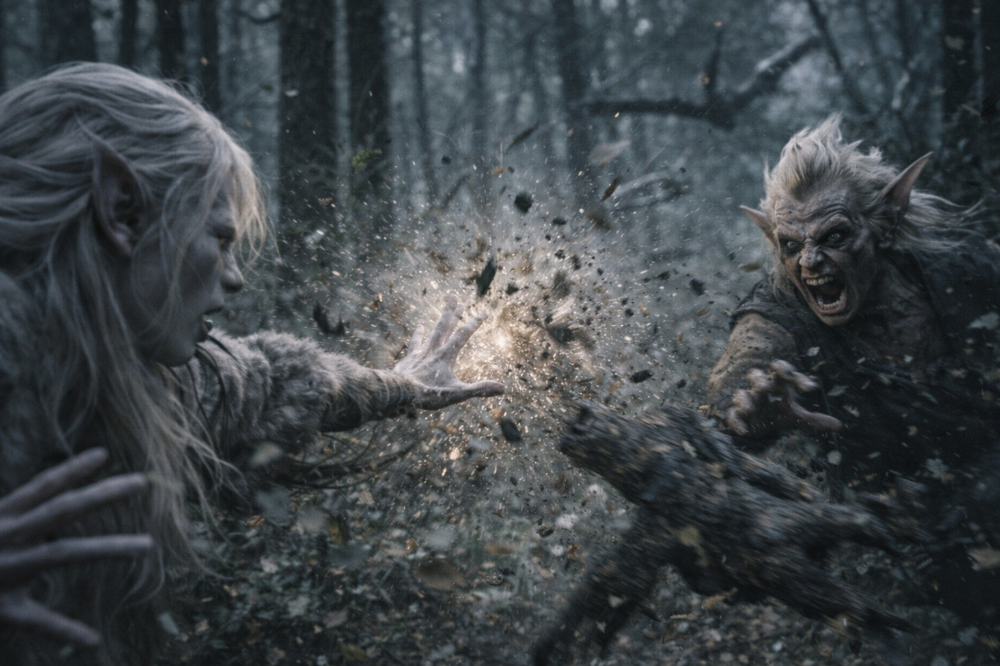
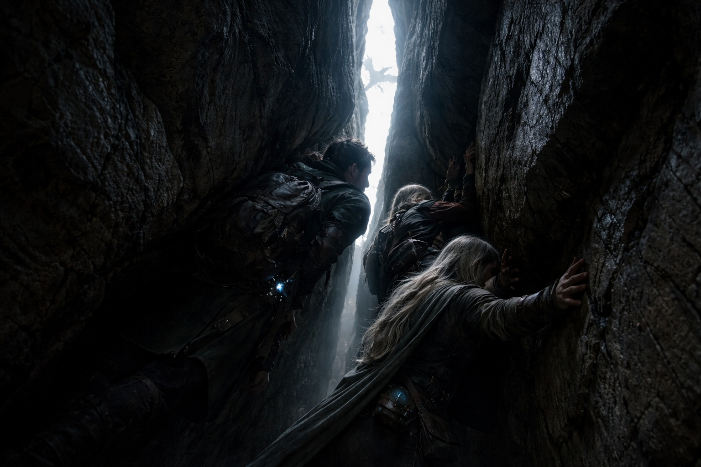
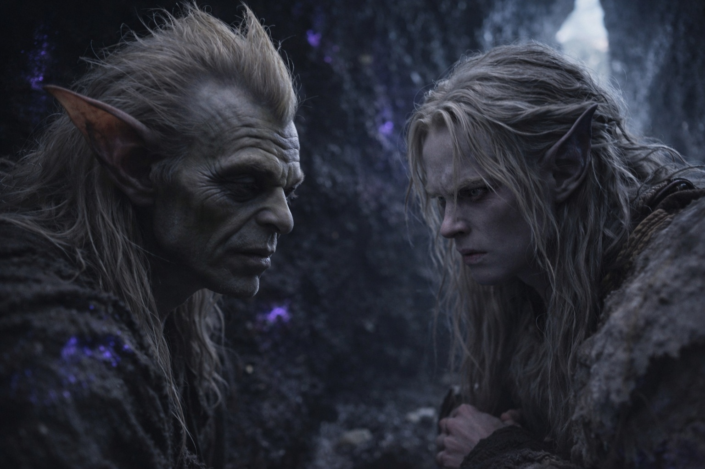

## Capítulo 15 | Parte 3

---

Corrieron.

Srietz los guió a través del bosque retorcido con una confianza que sugería conocimiento íntimo del terreno. Izquierda a través de una formación de cristal. Derecha alrededor de una roca que zumbaba con energía desagradable. Bajando por una pendiente que parecía existir solo cuando se aproximaba desde un ángulo específico.

Detrás de ellos, los chillidos se acercaban.

—No miren atrás —siseó Srietz—. Mirar los hace más lentos.

Drusniel miró atrás de todos modos.

Los Coatly tenían la silueta de murciélagos hasta que giraban. Entonces aparecían las articulaciones de más: alas que se plegaban dos veces donde solo debía haber una bisagra, cuerpos estrechos flexionándose en giros que ninguna columna debería soportar. Sus chillidos se agudizaban al acercarse.

Uno se lanzó hacia ellos.

Cada instinto le dijo a Drusniel que tomara el aire. Lo hizo. Una ráfaga de viento comprimido, apenas formada, atrapó a la criatura y la lanzó hacia atrás. El Coatly chilló, y esta vez las respuestas llegaron de inmediato.

Un grito de alerta, luego una llamada de localización: *Aquí. Objetivo aquí.*

—¡NO! —La voz de Srietz se quebró—. ¡Sin magia! ¡Acabas de decirle a cada uno de ellos exactamente dónde estamos!

Más chillidos respondieron desde todas direcciones. El aire se llenó de aleteos—sonidos de cuero mojado, demasiados para contar.

—Pueden seguir una firma cuando están cerca —dijo Srietz, corriendo más rápido—. Lanzar magia le dice a cada Coatly a leguas dónde estás.

El aire seguía allí para que Drusniel lo tomara. Apartó la mano de él. La presión hueca de la magia no usada se instaló detrás de sus costillas, pero la multiplicación de los chillidos era evidencia suficiente.

—¡Por aquí! —El goblin se metió en una grieta entre dos formaciones rocosas—. No les gustan los espacios cerrados. Muy difícil volar.

Se apretaron a través. Elion apenas cabía, su cuerpo contorsionándose de maneras que deberían haber sido imposibles. Detrás de ellos, los Coatly gritaron su frustración mientras la presa desaparecía en un espacio demasiado pequeño para seguir.

—Sigan moviéndose. —Srietz no redujo el paso—. La grieta nos compra minutos.

La grieta se abrió en un espacio más grande—una cueva, natural o tallada, Drusniel no podía distinguir. Srietz los guió más profundo, su pequeña forma navegando la oscuridad con certeza.

—Solías trabajar para la cosa que controla esas criaturas —dijo Drusniel entre respiraciones.

—Tres años. —La voz de Srietz era plana—. El alquimista de Vexrath. Haciendo compuestos, creando venenos, mejorando cosas que no deberían mejorarse. Srietz aprendió mucho. Srietz aprendió demasiado. Srietz se fue.

—Te están cazando específicamente.

—A Vexrath no le gusta cuando su propiedad se va.

Los chillidos se apagaron detrás de ellos, pero no cesaron.

Drusniel añadió una regla a las otras que había aprendido en Wyrmreach: la proximidad permitía a los Coatly buscar; la magia activa les daba dirección.

---

**Fin de Capítulo 15.3 —> 15.4: [El Goblin Que Cuenta Costos: El Trato](/el-goblin-que-cuenta-costos-el-trato/)**