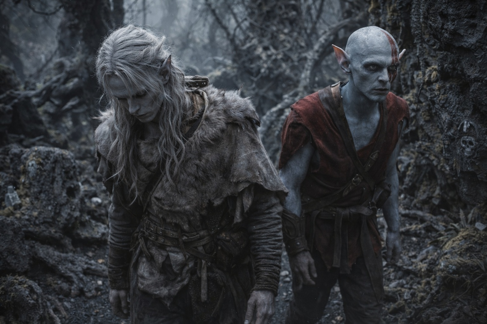

## Capítulo 15 | Parte 1

---

Estaban perdidos.

Habían pasado dos veces junto al mismo tronco negro bifurcado. Drusniel distinguía su propia huella en el polvo que recordaba haber dejado atrás.

Tres días desde las jaulas. Intentó desandar el último giro, pero junto a la roca inclinada detrás del árbol ya no había ningún paso.

—Algo nos está observando —dijo Elion.

Elion llevaba horas deteniéndose a escuchar. El blanco azulado de su piel había adquirido una palidez enfermiza, y no dejaba de frotarse debajo de la oreja, como si pudiera acallar aquello.

—Lo sé. —Drusniel siguió caminando. No había nada más que hacer—. ¿Puedes decir qué?

—No. Se mueve cuando nos movemos. Se detiene cuando nos detenemos. No está atacando, solo... observando.

Llevaban dos días encontrando calaveras talladas en la corteza. En la última, alguien había clavado fragmentos de cristal dentro de la boca.

Drusniel había intentado alejarlos de las marcas. Cada sendero nuevo los llevaba hasta otra.

—Aquí hay más —dijo—. Vamos por el camino equivocado.

Sentía una corriente débil entre los troncos. Al buscarla, le volvió el dolor conocido detrás de los ojos. La dejó en paz.

—El aire sabe a metal —dijo Elion—. Y las plantas siguen moviéndose.

Drusniel lo había notado. Las formaciones de piedra retorcidas proyectaban sombras en direcciones que no coincidían con la luz tenue. Hojas anchas giraban en lenta secuencia pese al aire inmóvil, una tras otra, como si siguieran algo que pasaba entre los árboles.

Entonces lo escuchó.

El chillido era tan agudo que le dolieron los dientes antes de poder localizarlo.

La cabeza de Elion giró hacia el sonido. —Eso es lo que nos ha estado observando. Y acaba de llamar a otros.

—¿Qué es?

—No lo sé. —La voz de Elion era plana, honesta—. Pero hay más de uno ahora. Y se están acercando.

Algo se movió en la línea de árboles. Pequeño y rápido, observando desde la maleza.

Drusniel contó tres movimientos distintos en la maleza.

Entonces un cuarto respondió a sus espaldas.

---

**Fin de Capítulo 15.1 —> 15.2: [El Goblin Que Cuenta Costos: El Goblin](/el-goblin-que-cuenta-costos-el-goblin/)**
