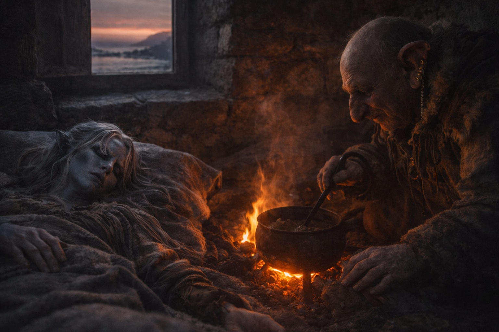

## Capítulo 11 | Parte 1

---

Drusniel despertó en un jergón delgado, en la casa de piedra de Merrik. La manta le raspaba las heridas de las palmas.

—Dos días desde la playa —dijo Merrik al verlo mirar hacia los postigos.

Drusniel se apoyó en un codo para incorporarse y tuvo que parar.

Ponerse de pie todavía no era posible.

La habitación era pequeña: un jergón, una mesa, un hogar, dos ventanas cerradas con postigos y una puerta. Su mochila descansaba contra la pared, a la vista. El Nulo estaba dentro, frío e inerte.

Merrik removía una olla sobre el fuego.

—Preguntaste por Szoravel en la playa —dijo.

Drusniel lo miró.

—¿Lo recuerdas?

—Lo suficiente.

—Bien.

Merrik sirvió caldo en un cuenco y lo dejó junto al jergón.

—Szoravel está al este. Protegido. Difícil acercarse a él sin una presentación.

—¿Qué tan difícil?

—Lo suficiente como para que quienes llegan a su puerta sin invitación no suelan poder quejarse del resultado.

Drusniel acercó el cuenco.

—¿Quién lo protege?

—Depende de a quién preguntes.

—¿A quién has preguntado tú?

Merrik lo miró de reojo.

—A gente a la que le gusta que le paguen por responder.

—¿Y cuánto pagaste tú?

Merrik se sentó al otro lado de la mesa sin responder.

—¿Qué puedes hacer cuando regrese tu magia?

En la playa, Merrik le había preguntado de dónde venía y por qué había cruzado. Ahora quería saber qué podía hacer.

Drusniel no recordaba qué le había contado mientras tenía fiebre.

—Aire. Agua.

—¿Ambas?

—Sí.

—¿Combate?

—A veces.

—¿Entrenamiento?

—Suficiente.

Merrik asintió como si cada respuesta tuviera un lugar.

Drusniel sopló el caldo antes de responder.

—Preguntas mucho.

—Trabajo con lo que llega a la costa. La información me mantiene vivo.

—Llegan personas.

—A veces.

—Y la información sobre ellas te mantiene vivo.

Merrik sostuvo su mirada.

—A menudo.

Sin disculpa.

Sin negación.

Drusniel comió.

La deuda bajo sus costillas pulsó una vez.

La ignoró.

—¿Cuándo puedo viajar?

—Cuando puedas cruzar esta habitación sin usar la pared.

—Mañana.

—Si tus piernas están de acuerdo.

Drusniel apoyó los pies en el suelo. Una pierna empezó a temblarle antes de que cargara el peso sobre ella.

Volvió a tomar el cuenco, sin mirar a Merrik.

---

**Fin de Capítulo 11.1 —> 11.2: [El Hombre Amable: La Tierra Extraña](/el-hombre-amable-la-tierra-extrana/)**
