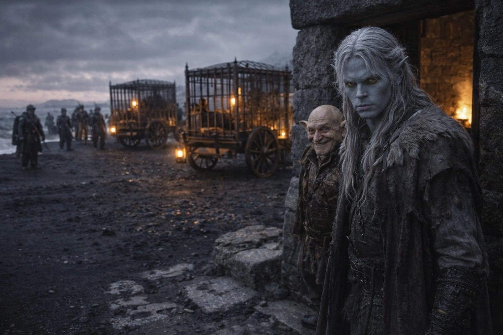
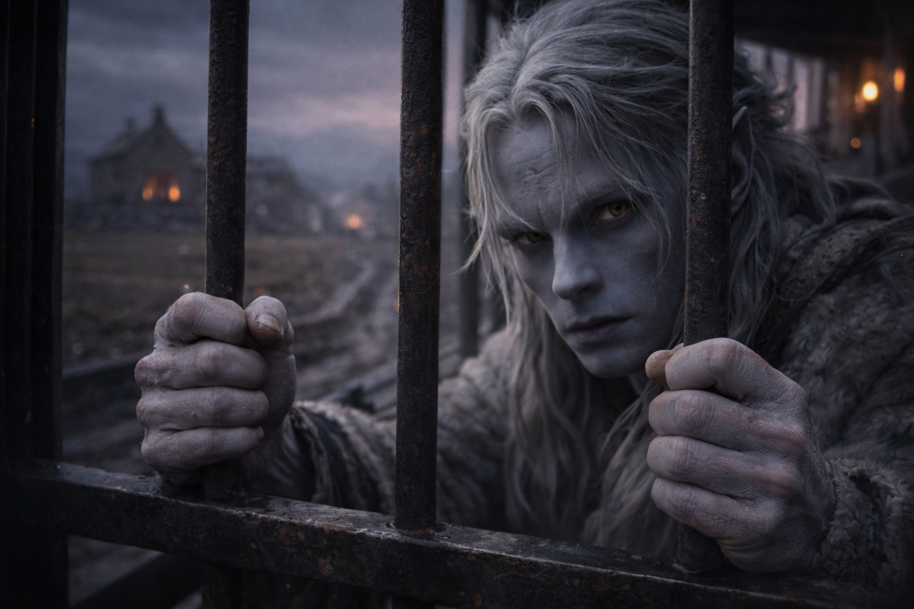

## Capítulo 11 | Parte 4

---

Tres carromatos estaban frente a la casa de Merrik. Las ruedas, ceñidas de hierro, habían abierto surcos profundos en la arena.

Había jaulas atornilladas a dos de las plataformas. Alguien se movió en la más cercana y la cadena de debajo traqueteó.

Drusniel se detuvo en la puerta.

Había siete guardias a la vista. Un octavo rodeó el primer carromato con unos grilletes en la mano.

Merrik estaba junto a Drusniel, lo bastante cerca para sujetarlo si echaba a correr.

—No los esperabas hasta dentro de tres días —dijo Drusniel.

—Esa era su ruta.

—Mandaste a buscarla.

—Después de que decidieras irte.

—¿Cuándo?

—Anoche. Tomaron el camino más corto.

Drusniel miró las jaulas.

—Compradores. Intermediarios. Coleccionistas.

—Cada territorio prefiere palabras distintas.

—Esclavistas sirve.

Merrik se encogió de hombros.

—También es correcto.

Sin sonrisa.

Sin disculpa.

—Me ayudaste a recuperarme.

—Sí.

—¿Por qué?

Merrik lo miró como si la respuesta fuera sencilla.

—La carga sana se vende mejor.

Drusniel miró la mano con la que Merrik le había acercado el odre a la boca.

—Nunca me mentiste.

—Nunca hizo falta. —Merrik se ajustó un puño de la manga—. Hiciste preguntas. Las respondí. Necesitabas comida y refugio. Te di ambas cosas.

—Me dabas de comer para ellos.

—Sí.

Los guardias se repartieron alrededor de la casa. Dos ocuparon el camino; otro se colocó detrás del hombro izquierdo de Drusniel. Los demás se quedaron junto a los carromatos, demasiado separados para que pudiera alcanzarlos a la vez.

Ninguna ruta clara.

—Podría pelear.

—Podrías intentarlo.

El tono de Merrik no cambió.

—Hace cinco días no podías levantar la cabeza. Tu magia aún no ha vuelto. —Merrik señaló los grilletes—. Ellos hacen esto todo el día.

Drusniel lo sabía.

Vio al guardia de detrás afirmar las piernas, preparado para el forcejeo.

Un guardia se acercó.

—Manos.

El guardia le sujetó una muñeca. Drusniel tiró hacia atrás; un segundo hombre le inmovilizó el otro brazo contra el marco.

El hierro se cerró sobre sus muñecas.

Otro guardia le quitó la daga y la mochila, y luego alargó la mano hacia la bolsa que llevaba bajo la camisa.

—Deja el metal —dijo Merrik.

El guardia lo miró.

—Cruzó con eso. Los compradores del este pagan más cuando los supervivientes llegan con lo que llevaban encima.

El guardia retiró la mano.

Drusniel dejó que la bolsa se acomodara bajo la camisa. Mantuvo la vista en el guardia, apartada del metal.

—La segunda jaula —dijo Merrik al jefe—. Dale de comer. Vale menos enfermo.

El jefe asintió.

Lo llevaron al carromato, sujetándolo por ambos brazos. Al llegar al escalón, un guardia lo soltó para abrir la jaula.

Drusniel miró más allá, hacia las rocas. Otro guardia aguardaba en el paso.

Puso un pie en el escalón. Una vez cerrada la puerta, habría menos manos sujetándolo.

Subió.

La puerta se cerró.

Merrik quedó junto al camino mientras la caravana empezó hacia el este.

Drusniel lo vio volverse hacia la casa.

Aún tenía en la boca el sabor del caldo de Merrik.

En la primera curva dejó de mirar la casa y empezó a observar a los guardias.

---

**Fin de Capítulo 11.4 —> 12.1: [La Hierba Donde Cayó: El Despertar](/la-hierba-donde-cayo-el-despertar/)**
