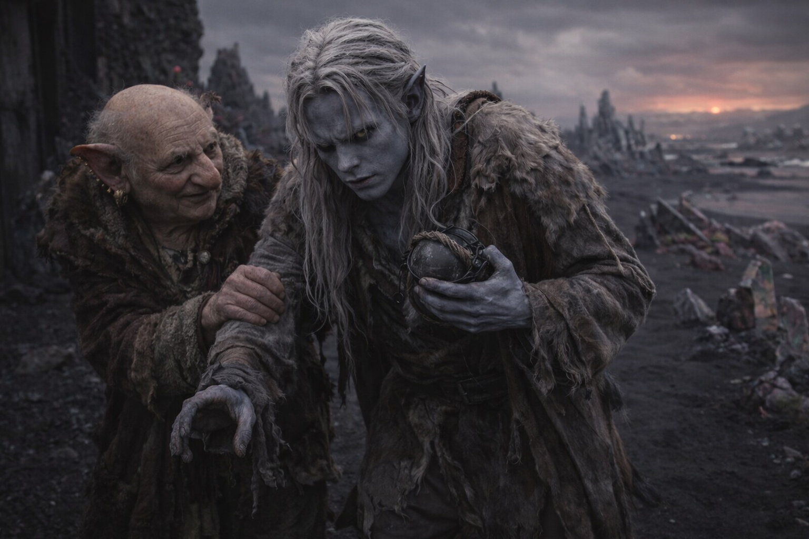

## Capítulo 11 | Parte 2

---

Al tercer día, Drusniel se mantuvo en pie en la puerta de Merrik, con una mano apoyada en la piedra tibia.

Las formaciones de cristal negro no permanecían exactamente donde las recordaba cuando apartaba la vista.

Eligió un cristal partido junto a una cresta baja, miró al este y volvió la vista hacia él.

El cristal partido parecía ahora tres pies más cerca de la cresta.

O la formación se movía o la distancia lo hacía.

Mantuvo la mano en el marco y volvió a probar. La distancia cambió mientras la piedra bajo su palma seguía firme.

—No uses los cristales para orientarte —dijo Merrik.

—¿Qué uso entonces?

—A alguien que conozca los caminos. Hasta que los aprendas tú.

Drusniel podía mantenerse en pie. Podía caminar quizá treinta pasos antes de que le temblaran las piernas. Su magia seguía tan agotada que intentar alcanzar el aire solo le producía presión detrás de los ojos.

Merrik señaló al este.

Más allá de la arena negra, una luz volcánica manchaba el horizonte.

—Szoravel está en algún lugar más allá de los territorios disputados.

—¿Controlados por?

—Tres poderes. Las fronteras cambian.

—¿Caminos?

—Algunos.

—¿Caminos seguros?

Merrik pareció divertido.

—No.

<video controls playsInline preload="metadata" poster="./merrik-points-east_sora.jpg" width="100%">
	<source src="./MerrikStory.mp4" type="video/mp4" />
</video>

—¿Cómo los cruza la gente?

—Pagan una escolta. O a quien controla el camino. A veces a ambos.

—Tienes contactos.

—Tengo gente que responde cuando hago la pregunta correcta.

Drusniel se volvió lo suficiente para verle la cara.

—¿Quién vigila la costa?

Merrik miró hacia el mar.

—Compradores, sobre todo. Intermediarios. Coleccionistas. Cada territorio prefiere palabras distintas.

—¿Para qué?

—Para lo que llega.

—¿Carga?

—A veces.

—¿Personas?

Merrik no dudó.

—A veces.

Drusniel lo miró.

—¿Drow?

—Raros aquí.

—¿Magos?

—Útiles casi en cualquier sitio.

—Valiosos.

—Sí.

La palabra ya había aparecido antes.

Merrik nunca la había ocultado.

—¿Por qué me lo dices?

—Durarás más si sabes a quién evitar.

Merrik miró sus piernas temblorosas. Drusniel apartó la mano de la pared.

—¿Pueden identificar a los supervivientes?

—La gente habla. Aparece un desconocido en una costa vacía, alguien se da cuenta.

—Tú te diste cuenta.

—Vivo aquí.

—¿A quién se lo has contado?

Merrik volvió hacia la casa.

—¿Hoy? A nadie.

Hoy.

Drusniel lo siguió dentro.

Drusniel se detuvo junto a la mochila. La había dejado donde Merrik podía alcanzarla desde su silla.

La puso junto al jergón.

---

**Fin de Capítulo 11.2 —> 11.3: [El Hombre Amable: Las Preguntas](/el-hombre-amable-las-preguntas/)**
