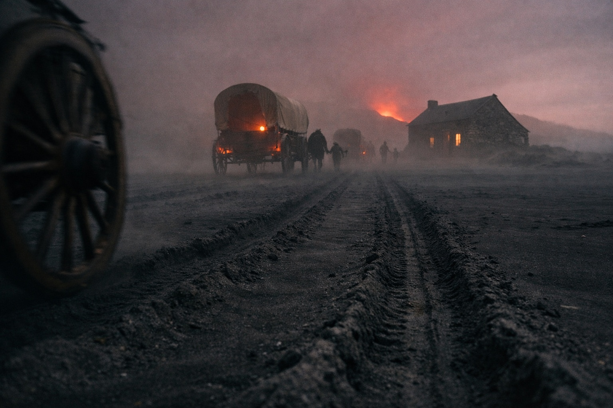

## Capítulo 11 | Parte 3

---

Para el cuarto día, Drusniel podía cruzar la casa sin tocar la pared.

Merrik lo notó.

Por supuesto que lo notó.

—¿Dónde aprendiste aire y agua juntos? —preguntó mientras cortaba carne seca.

Drusniel observó el cuchillo.

—Umbra'kor.

—¿Un solo maestro?

—Principalmente.

—¿Tu familia participaba?

—No.

Treinta y cuatro preguntas desde la playa.

La mayoría durante horas que Drusniel solo recordaba a medias.

Había clasificado las que podía reconstruir.

Habilidades.

Destino.

Historia.

El Nulo.

Las preguntas sobre el Nulo eran las más cuidadosas.

*¿Te molesta ese metal cuando duermes?*

*¿Lo tenías antes del cruce?*

*¿Responde a la magia?*

Drusniel había respondido cada una con suficiente verdad como para terminar la frase.

—Estás más fuerte —dijo Merrik.

—Lo suficiente para viajar.

—Quizá.

—No quizá.

Merrik dejó el cuchillo.

—Hay una caravana que va hacia el este.

Drusniel esperó.

—La esperan dentro de tres días. Quizá cuatro.

—Conveniente.

—Recorren la costa.

—Dijiste que las rutas cambian.

—Cambian.

—Dijiste que la costa está vigilada.

—Lo está.

—Dijiste que los supervivientes son valiosos.

—También es cierto.

Las respuestas de Merrik encajaban.

Ese era el problema.

La bondad y el cálculo no eran opuestos.

—Me iré mañana —dijo Drusniel.

Merrik lo miró durante dos respiraciones.

—¿Solo?

—Si hace falta.

—Mala idea.

—Mía.

Merrik asintió.

—Estarás en el camino con la primera luz.

Totalmente posible.

No era lo mismo que *nos iremos*.

Drusniel lo notó.

Esa noche no durmió.

Merrik se movió por la habitación principal.

Un par de pasos.

Después dos.

Después uno otra vez.

Drusniel esperó hasta que el hogar quedó en silencio.

Sacó el Nulo de la mochila, aseguró la bolsa bajo su camisa y cruzó hasta la puerta lateral.

Su mano se detuvo a una pulgada del pestillo.

Una sombra pasó sobre la fina línea de luz debajo.

No era Merrik.

Drusniel esperó.

La sombra permaneció.

Fue a la ventana trasera.

Otra silueta cruzó fuera.

Dos accesos vigilados.

Posiblemente tres.

La trampa ya estaba cerrada.

Pelear ahora significaba probar magia agotada contra números desconocidos en la oscuridad.

Mal experimento.

Regresó al jergón y se tumbó completamente vestido.

El Nulo presionaba contra sus costillas.

Mantuvo una mano sobre la bolsa.

El sueño llegó de todos modos.

Lo despertaron ruedas antes de que cambiara la luz.

La caravana había llegado tres días antes.

---

**Fin de Capítulo 11.3 —> 11.4: [El Hombre Amable: La Caravana](/el-hombre-amable-la-caravana/)**
