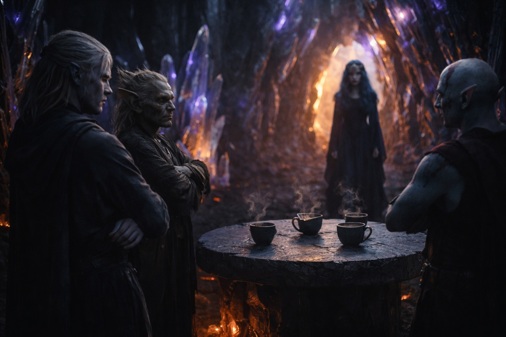
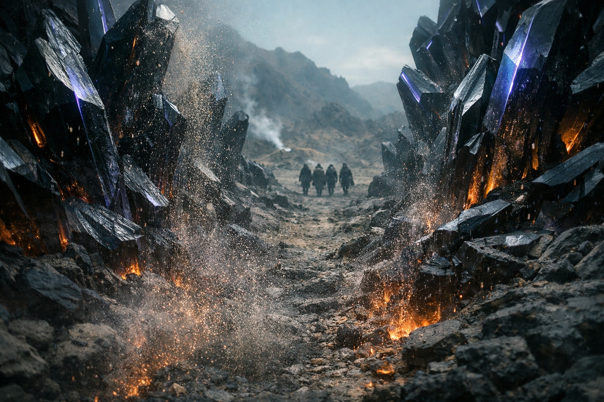

## Capítulo 21 | Parte 3

--- 

Esperaron.

Varesh les cortó las ataduras y señaló las sillas. Drusniel se sentó junto a Srietz. Elion permaneció de pie detrás de ellos, vigilando los huecos entre los cristales.

Las tazas eran de cerámica, oscuras, de factura fina. El líquido en su interior era transparente y olía levemente a mineral, como agua filtrada a través de piedra volcánica. Drusniel no tocó la suya.

—Srietz no bebería eso. —El goblin se apartó de la taza—. Srietz huele los compuestos de esas flores. Algunos paralizan. Si dejas agua aquí el tiempo suficiente, los absorbe.

—Es té —dijo Varesh desde el borde del claro—. Solo té.

—A Srietz lo han envenenado con "solo té" en cuatro ocasiones distintas.

Varesh casi sonrió. —Buen punto.

Los cristales se desplazaron.

No por el viento. No había viento. Las formaciones se inclinaron, una ola de movimiento que viajó desde el borde del claro hacia dentro, agujas rotando sobre sus bases para crear un corredor de piedra desnuda. El movimiento era lento, chirriante, y completamente deliberado.

Nyxara entró por el hueco que los cristales abrieron para ella.

Drusniel había esperado una armadura. Nyxara llevaba un vestido negro y el pelo retirado del rostro. No vio ningún arma.

Atravesó el claro sin guardias. Los cristales giraban a su paso y dirigían la luz hacia ella. Drusniel sentía la vibración a través de la silla.

Mantuvo las manos sobre la mesa.

Se sentó en la silla vacía a la cabecera de la mesa, acomodó las manos en su regazo, y miró a Drusniel con ojos oscuros e inmóviles.

—Eres más joven de lo que esperaba —dijo. Su voz era baja, controlada, el tipo de voz que nunca necesita alzarse porque siempre es escuchada—. Cuando mis exploradores informaron de un drow con afinidad al aire viajando por las tierras en disputa, imaginé a alguien mayor. Más curtido.

—Nos estaba esperando.

—Estaba esperando a alguien. La plataforma volcánica ha estado ruidosa durante semanas. Energía moviéndose por canales antiguos, despertando cosas que prefieren dormir. Y entonces tres viajeros descendieron de la cresta hacia mis campos, y uno de ellos apartó mis flechas con un pensamiento. —Tomó su taza y bebió—. No recibo muchos drow en mi territorio. Casi ninguno con tu talento particular.

—Estamos de paso —dijo Drusniel—. Tenemos asuntos con Szoravel, más allá de las tierras en disputa.

—Szoravel. —Algo cruzó su rostro. No sorpresa. Reconocimiento—. El mago que se sienta entre las grietas. Todos los que pasan por mi territorio van hacia Szoravel o huyen de él. —Dejó la taza—. ¿Cuál de las dos?

—Vamos hacia él.

Nyxara dejó que el silencio se sostuviera durante tres respiraciones antes de responder. No se apresuró a llenarlo, y eso lo descolocó.

—Entonces necesitarán sobrevivir al viaje. —Volvió su atención hacia Srietz—. Tú. Goblin. Conoces estas tierras.

Las orejas de Srietz se aplastaron más. —Srietz tiene... familiaridad.

—Más que familiaridad. Supiste tomar el camino central a través de mis campos. Sabías que el territorio de Vorthrak sería hostil. Has estado aquí antes.

Srietz no dijo nada.

Nyxara miró a Elion, que seguía detrás de ellos.

—Y tú. Eres interesante. —No elaboró. No necesitaba hacerlo. Drusniel captó cómo la mandíbula de Elion se tensaba, la única señal que el cambiaformas se permitía.

—Mis exploradores cometieron un error —continuó Nyxara, volviéndose hacia Drusniel—. Las flechas no estaban autorizadas. Prefiero conocer a los viajeros antes de decidir qué hacer con ellos. Las tierras en disputa son... contenciosas. Tres señores, tres filosofías. Vorthrak toma lo que quiere por la fuerza. Sytherix envenena lo que no puede tomar. Yo prefiero un enfoque diferente.

—¿Cuál?

—Inversión. —Sonrió. La expresión no alcanzó sus ojos—. Invierto en personas y en lo que pueden hacer. A cambio, ellas invierten sus esfuerzos en mis intereses. Un acuerdo mutuo.

No estaba discutiendo para ganar. Estaba fijando los términos. Él reajustó su estimación de ella y mantuvo el rostro inmóvil.

—¿Y si el acuerdo no es mutuo?

—Entonces abandonas mi camino. —Señaló el campo de cristales—. Vorthrak controla el norte. Sytherix controla el sur. Yo controlo el centro. En mi camino, se viaja bajo mis condiciones.

La distinción, comprendió Drusniel, era la diferencia entre respirar mañana o no.

—¿Qué quiere? —preguntó.

Nyxara se reclinó en su silla. Los cristales detrás de ella pulsaron una vez, un destello violeta profundo, aunque nada más había cambiado.

—Una conversación —dijo—. Siéntense. Beban. Hablemos de qué trajo a un drow con magia de aire al peor lugar de Wyrmreach, y qué podría yo hacer al respecto.

---

**Fin de Capítulo 21.3 —> 21.4: [El Jardín Negro: La Dama](/el-jardin-negro-la-dama/)**
