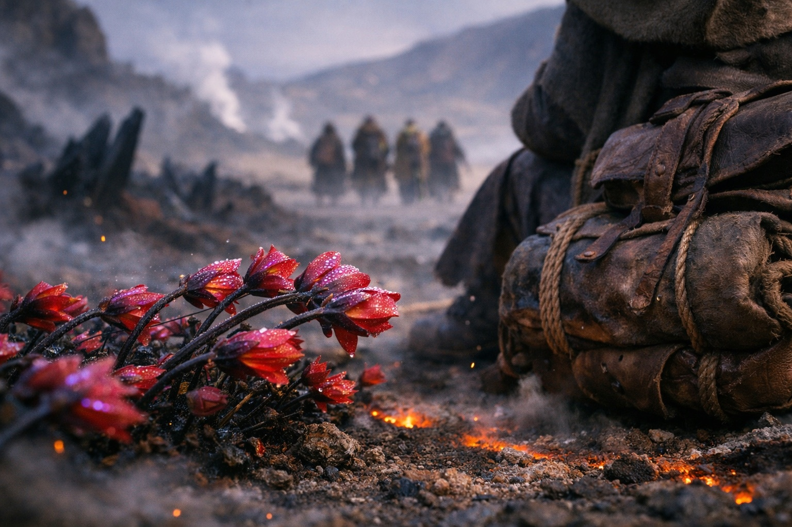

## Capítulo 21 | Parte 4

--- 

La conversación duró dos horas.

Nyxara preguntó por Umbra'kor y después por la superficie. Volvió dos veces a su afinidad con el aire. Todos los magos drow que había conocido en treinta años trabajaban con sombra o tierra.

Drusniel respondió con cuidado. Verdades parciales. Evasivas que sonaban como respuestas. Le habló de las Pruebas de los Nacidos del Crepúsculo sin mencionar el sabotaje. De Wyrmreach sin mencionar la Voz. De Szoravel sin explicar por qué.

Ella le permitió evadir. Eso era lo peligroso. No presionaba. Simplemente anotaba cada evasión, la catalogaba y seguía adelante. Construyendo un mapa de lo que él no decía que probablemente era más valioso que lo que sí.

—Llevas algo —dijo ella.

No era una pregunta.

—Todo el mundo lleva algo.

—No como esto. —Nyxara tocó el borde de su taza—. Cuando entraste en mi territorio, las flores giraron. Giran ante la magia, ante el poder, ante las cosas que me interesan. Pero giraron *con fuerza* hacia ti. Todas. A la vez. Eso es nuevo.

Drusniel mantuvo el rostro inmóvil. El Nulo seguía frío bajo la camisa. Contuvo el impulso de comprobar que estaba cubierto.

—Soy un mago —dijo—. La magia interesa a tus flores.

—La magia es común aquí. Las tierras en disputa rebosan de ella. Mis flores han visto magos, alquimistas, sacerdotes y criaturas que desafían cualquier clasificación. No giran ante magia común. —Hizo una pausa—. Giran ante cosas antiguas. Cosas que recuerdan lo que esta tierra era antes de que los señores la descuartizaran.

Él no dijo nada.

—Guarda tus secretos —dijo ella—. Por ahora. Los secretos son moneda en las tierras en disputa, y prefiero que mis inversiones se aprecien en lugar de gastarse.

La conversación cambió de rumbo. Nyxara expuso la geografía entre su territorio y la posición de Szoravel: cuatro días de viaje a través de tierras que no pertenecían a nadie y a todos. El espacio entre los territorios de los tres señores, sin patrullas y sin estabilidad. Allí vivían cosas que habían sido expulsadas de los tres dominios. Depredadores sin amo. Magia sin reglas.

—No sobrevivirán solos —dijo.

—Hemos sobrevivido hasta aquí.

—Hasta aquí ha sido la parte fácil. —Lo dijo sin burla, lo cual lo hacía peor—. Srietz lo sabe. Pregúntale después, cuando estén solos. Pregúntale qué vive en los espacios vacíos.

No había dicho ese miedo en voz alta. Ella respondió igual.

Drusniel miró a Srietz. Las orejas del goblin estaban casi aplastadas contra su cráneo.

—No necesito tu permiso para cruzar tu territorio —dijo Drusniel—. Ya estamos aquí.

—Sí. Y mis exploradores te detuvieron. —Nyxara se levantó. Las flores se apartaron detrás de ella—. Seguirán a mi guía hasta la frontera. Mis puestos les darán provisiones. Todo lo que observe la guía llegará a mí. Ese es el precio del paso.

—Solo el paso. No juraré servirte.

—No te he pedido un juramento. La magia de aire es rara aquí. Los otros señores no tienen a nadie como tú. Pienso averiguar de qué eres capaz.

Cuatro días bajo vigilancia. Al llegar a la frontera, ella podría saber lo suficiente para usarlo en su contra.

Drusniel pensó en las alternativas. La plataforma volcánica detrás de ellos, intransitable sin provisiones. El territorio de Vorthrak al norte, donde la fuerza era la única moneda y ellos no tenían de sobra. Sytherix al sur, donde los rumores eran peores que la realidad de Vorthrak. Y el espacio sin control entre territorios, donde el silencio de Srietz hablaba por sí solo de lo que aguardaba.

—Mis compañeros se quedan conmigo —dijo Drusniel—. Como grupo. No nos separan.

—No se me ocurriría. —La sonrisa de Nyxara regresó—. ¿Un mago, un cambiaformas y un alquimista que ha sobrevivido las tierras en disputa antes? Sería una tonta si separara esa colección.

Colección. No equipo. No grupo. Colección.

Drusniel escuchó la palabra y la archivó.

—Aceptamos el paso —dijo—. En la frontera, seguiremos por nuestra cuenta.

—Sabio. —Nyxara se volvió para marcharse, luego se detuvo. Lo miró con una expresión donde el cálculo cedía paso a la curiosidad. Curiosidad genuina, que era mucho más peligrosa.

—Una cosa más —dijo—. Un drow con magia de aire, viajando hacia Szoravel, cargando algo lo bastante antiguo como para hacer cantar a mis flores. No eres la primera cosa interesante que pasa por mi territorio. Pero podrías ser la más interesante de este año.

Caminó entre las flores. Los tallos se cerraron tras ella y ocultaron el camino.

Varesh se materializó al borde del claro.

—Se han preparado aposentos —dijo el líder de exploradores—. Descansarán esta noche. Mañana se les asignará un guía para su travesía por el territorio de Lady Nyxara.

—Un guía —dijo Drusniel sin inflexión.

—Un guía. —El tono de Varesh no dejaba lugar a malentendidos—. Lady Nyxara es generosa con su protección. Prefiere asegurarse de que sus inversiones sean... observadas.

Los condujeron a una estructura construida dentro del propio campo de flores, con paredes tejidas de tallos gruesos y suelo cubierto de pétalos secos que crujían bajo los pies. Era cómoda, abastecida, y completamente expuesta a cualquiera que supiera escuchar a través de las flores.

Drusniel eligió un sitio junto a la entrada y dejó la mochila al alcance de la mano.

---

**Fin de Capítulo 21.4 —> 21.5: [El Jardín Negro: Los Términos](/el-jardin-negro-los-terminos/)**
