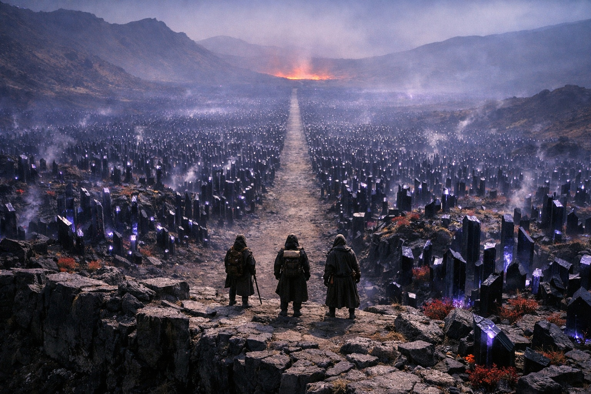
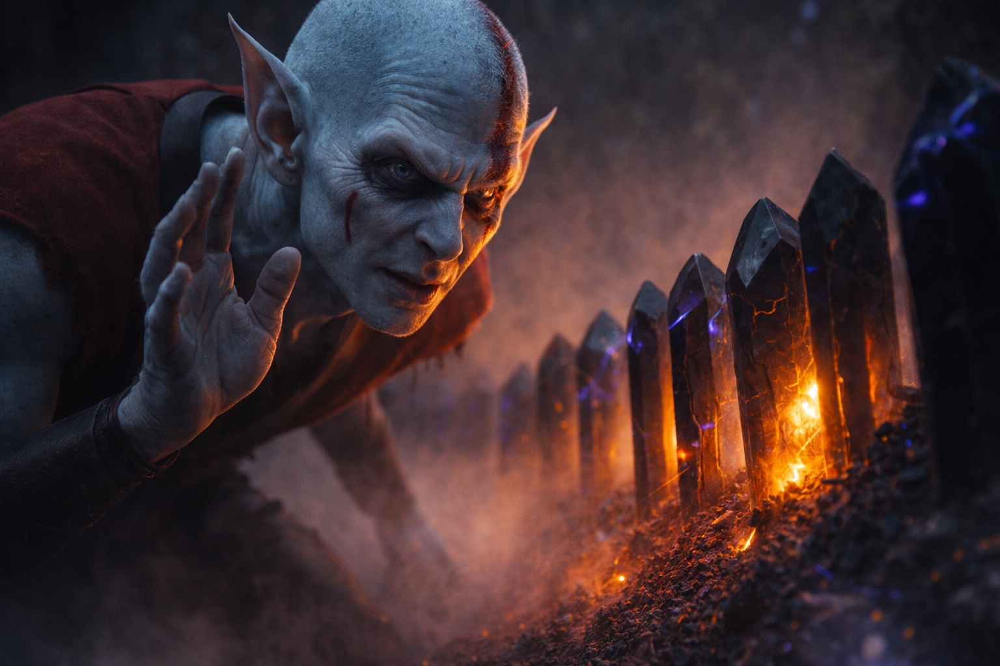
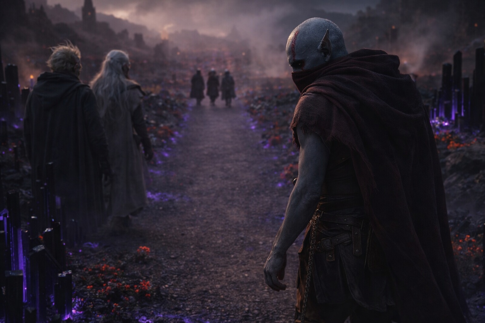

## Capítulo 21 | Parte 1

--- 

El aire tenía un sabor equivocado.

Ya no era azufre. El hedor volcánico se había desvanecido tras ellos durante la primera hora de descenso, reemplazado por algo más dulce, empalagoso, químico. Recubría el fondo de la garganta de Drusniel como jarabe y le hacía lagrimear los ojos. A su lado, Srietz se había cubierto la nariz con la bufanda y respiraba en intervalos superficiales y contados.

—Los niveles de toxinas están elevados —dijo el goblin—. No son letales de inmediato. El riesgo de exposición acumulada aumenta después de cuarenta y ocho horas.

—Entonces tenemos cuarenta y ocho horas para cruzar.

—Srietz preferiría doce.

Los cristales negros crecían en grupos junto al sendero y después en hileras que cruzaban el valle. Sus caras reflejaban la luz volcánica en manchas violetas. Entre ellos crecían flores rojas y salía vapor de las grietas del suelo. Drusniel no oía pájaros ni insectos, solo el zumbido de los cristales.

Drusniel contó las marcas territoriales. Srietz le había enseñado las señales durante su última noche sobre las tierras en disputa, trazando diagramas en la tierra con un palo: tres facciones, tres sistemas de reclamo. Marcas de garras en las piedras significaban Vorthrak. Círculos quemados significaban Sytherix. Y cristales negros, cultivados en formaciones geométricas deliberadas, dispuestos a lo largo de las fronteras como cercas de obsidiana, significaban Nyxara.

Caminaban por el territorio de Nyxara.

—La ruta más rápida a Szoravel pasa por sus tierras —había advertido Srietz—. No la más segura. La ruta más segura añade tres semanas. Por la plataforma volcánica. Srietz calculó el coste de provisiones. Nos moriríamos de hambre el día once.

Así que las tierras de Nyxara sería.

Elion iba en punta, moviéndose con la fluidez económica de alguien que ha pasado décadas navegando el peligro. Se había recuperado lo suficiente de su última transformación para mantener el ritmo, aunque Drusniel notó que aún favorecía la pierna izquierda. El cambiaformas se detenía cada cien pasos, inclinando la cabeza, leyendo el paisaje con sentidos que iban más allá de la vista.

—Nos están observando —dijo Elion.

No era una advertencia. Era una constatación.

—¿Desde cuándo?

—Desde la cresta. Quizá antes. Mantienen distancia. —Señaló una formación de piedra oscura al este, y luego un grupo de cristales que crecían más altos que el resto, dispuestos en un arco preciso orientado no hacia el resplandor volcánico sino hacia el camino—. Posiciones de vigilancia. Las formaciones cristalinas están calibradas para detectar movimiento.

El zumbido cambiaba a medida que avanzaban. Drusniel se detuvo un momento a escuchar y después se apresuró a alcanzar a los otros.

—¿Gente de Nyxara? —preguntó.

Srietz hizo un ruido. —*Todo* lo de Nyxara. La señora de este territorio no distingue entre sirvientes y paisaje. Todo aquí sirve. El suelo, los cristales, el aire. Respiramos su territorio. Ella sabe que estamos aquí.

El camino se estrechó entre muros de piedra negra. Los dedos de Drusniel se crisparon contra su muslo, el pulgar golpeando un ritmo inconsciente contra el índice. Se obligó a detenerse. Obligó a sus manos a colgar sueltas a los costados. El viejo impulso de anclaje, el de trazar piedras, surgió y buscó grietas en los muros de roca. Encontró dos. Las siguió durante tres pasos antes de perder el hilo.

Concentración.

—¿Cuánto falta hasta la frontera con territorio neutral? —preguntó.

—Neutral es una palabra generosa —respondió Srietz—. Ningún territorio en las tierras en disputa es verdaderamente neutral. Pero el espacio entre el control de Nyxara y el reclamo del siguiente señor es de aproximadamente cuatro días de viaje a nuestro ritmo actual.

—¿Y más allá?

—La influencia de Szoravel. No territorio. Influencia. El mago no posee tierra. Ocupa una posición entre reclamos que nadie quiere lo suficiente como para luchar por ella. —Srietz hizo una pausa—. O que todos temen acercarse.

El camino se abrió a una meseta y Drusniel se detuvo.

Los cristales negros llenaban el valle, plantados en hileras rectas de una ladera a otra. Allí le llegaban a la cintura y emitían suficiente luz violeta para distinguir los caminos entre ellos.

Buscó movimiento entre las hileras.

—Srietz objeta —dijo el goblin.

—Lo sé.

—Srietz desea que la objeción quede registrada.

—Registrada.

Elion se agachó al borde de la meseta. —Un solo camino a través del valle. ¿Lo ves? El hueco entre los cristales. Está mantenido. Alguien mantiene ese camino despejado.

Drusniel lo vio. Un corredor estrecho de tierra desnuda que atravesaba el centro del campo de cristales, recto como una regla, lo bastante ancho para tres personas caminando de frente. Una invitación. O un embudo.

—¿Tenemos opción?

—Rodear el valle añade un día y medio y nos lleva por el territorio de Vorthrak —dijo Srietz—. El análisis de Srietz sobre Vorthrak sugiere hostilidad inmediata sin la pretensión de negociación.

—Entonces a través de los cristales.

—A través de los cristales.

El sabor metálico se intensificó al descender. Los cristales se apiñaban a ambos lados del camino. Su zumbido se hizo más grave y Drusniel creyó ver que los más cercanos se inclinaban hacia ellos.

No miró atrás. Lo que fuera que observaba desde la cresta podía esperar.

El camino los llevó más profundo dentro del jardín.

---

**Fin de Capítulo 21.1 —> 21.2: [El Jardín Negro: Los Observadores](/el-jardin-negro-los-observadores/)**
