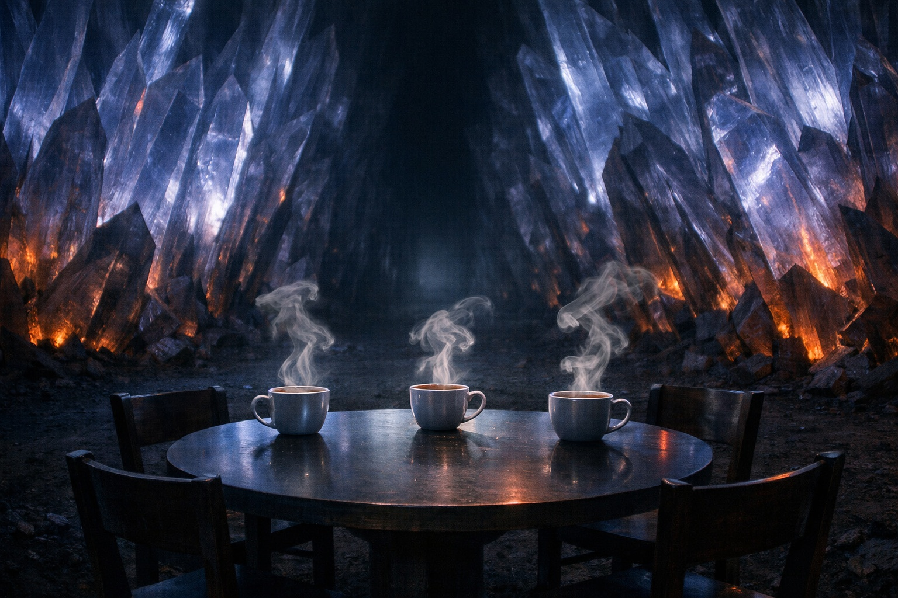

## Capítulo 21 | Parte 2

--- 

Llevaban dos horas en el campo de cristales cuando llegaron las flechas.

Sin aviso. Sin grito. Un momento caminaban por el sendero estrecho entre muros de agujas cristalinas negras, y al siguiente el aire se llenó del silbido de astiles emplumados cortando el aire cargado.

Elion se movió primero. Agarró a Srietz por el cuello de la ropa y los lanzó a ambos de costado entre las formaciones cristalinas. Drusniel sintió el desplazamiento de aire cuando un astil pasó junto a su oreja, tan cerca que le tiró del pelo.

El instinto se disparó antes que el pensamiento.

Sus manos se alzaron y la magia siguió, cruda y sin forma, una explosión de aire que estalló hacia fuera desde sus palmas. Las flechas restantes atraparon la onda y se dispersaron, girando sin control, clavándose en la tierra y las bases de los cristales en lugar de en carne.

El silencio que vino después fue peor que las flechas.

Drusniel seguía con las manos alzadas, rodeado de polvo de cristal. El corazón le golpeaba el pecho y la visión se le estrechó. Cerró los puños hasta que cesó la última corriente de aire.

Demasiado tarde.

Treinta, quizá cuarenta exploradores salieron de los huecos entre las hileras de cristales. La armadura del color de la tierra los había mantenido ocultos. En segundos, sus armas rodearon a los tres viajeros.

*—Alto.*

Una sola voz, clara e imperiosa, cortó a través del revuelo. Los exploradores se congelaron a mitad de movimiento. Todas las armas permanecieron donde estaban, apuntando hacia Drusniel y sus compañeros, pero nada se movió.

La voz habló de nuevo, más cerca esta vez. Tranquila. Casi divertida.

—Ese acaba de mover el viento.

Una figura atravesó el anillo de exploradores. Más alta que las demás, con la misma armadura color tierra pero con una capa que se movía como agua bajo la luz tenue. Su rostro estaba descubierto: rasgos afilados, piel oscura, ojos que lo evaluaban todo sin ceder nada.

La figura miró las manos de Drusniel. Las flechas dispersas clavadas en el suelo. El polvo cristalino que aún flotaba en el aire perturbado.

—Un drow con magia de aire. —La figura inclinó la cabeza—. Qué inusual.

La mente de Drusniel todavía intentaba alcanzar a su cuerpo. El hechizo de pánico había sido involuntario, puro instinto de supervivencia, y ahora cada explorador en el campo lo había presenciado. En las tierras en disputa, donde múltiples facciones rastreaban cada firma mágica, bien podría haber encendido una hoguera.

—Baja las manos —susurró Elion desde algún lugar entre los cristales—. Despacio.

Drusniel bajó las manos.

La figura de la capa lo estudió como un coleccionista estudia un hallazgo inesperado. No con hambre. Con interés. La distinción era delgada pero real.

—Tráiganlos —dijo la figura—. A todos. Vivos.

Los exploradores se movieron. Eficientes, practicados. Srietz fue sacado de entre las formaciones cristalinas, su mochila confiscada, sus protestas ignoradas. Elion emergió con los brazos en alto, el rostro cuidadosamente inexpresivo. Drusniel sintió manos bruscas en sus hombros, girándolo, atando sus muñecas con una cuerda que vibraba tenuemente contra su piel.

—Mis exploradores los confundieron con agentes de un señor rival —dijo la figura, caminando junto a Drusniel mientras los escoltaban más adentro del campo—. Un error honesto. Hemos tenido tres incursiones este mes. La señora de estas tierras es particular con los invitados no anunciados.

—No somos agentes.

—No. Los agentes no lanzan magia de aire por pánico en medio de un campo de cristales. —Una sonrisa fina—. Los agentes están entrenados. Tú, joven drow, reaccionaste por instinto. Lo que significa que o eres muy nuevo en esto o eres muy viejo en otra cosa.

Drusniel no dijo nada. La cuerda le mordía las muñecas.

—Me llamo Varesh. Sirvo a Lady Nyxara, cuyo territorio están cruzando sin permiso. —Varesh caminaba a su lado—. Las flechas fueron un error. La captura no. Comprendes la diferencia.

—Estamos de paso —dijo Drusniel—. No pretendemos quedarnos.

—Las intenciones son irrelevantes en las tierras en disputa. La presencia es lo que importa. Están presentes. Así que pertenecen a quien los encuentre primero. —Varesh señaló adelante—. Afortunadamente para ustedes, Lady Nyxara prefiere la conversación a la ejecución. La mayor parte del tiempo.

El camino se ensanchó al adentrarse en el campo. Los cristales más altos formaban paredes a ambos lados e impedían que Drusniel viera el valle.

Intentó seguir una fractura en la pared de cristal más cercana. Se dividía en grietas demasiado finas para distinguirlas y tuvo que apartar la vista.

Srietz caminaba a su lado, orejas aplastadas, cálculos corriendo detrás de sus ojos.

—Tres salidas —murmuró el goblin—. Todas vigiladas. Srietz recomienda esperar a que eso cambie.

—No planeaba pelear.

—Srietz señala que el hechizo de aire sugiere lo contrario.

Eso era justo.

Más adelante, el corredor de cristales se abría a un claro. El suelo era tierra negra desnuda, apisonada, rodeado de agujas cristalinas que se alzaban a su altura máxima, casi dos metros, facetas inclinadas hacia dentro como un público observando un escenario. En el centro del claro, alguien había colocado una mesa.

Tres sillas. Tres tazas, aún humeando.

El aliento de Srietz se cortó. —Ella lo sabe —susurró—. Sabe exactamente cuántos somos.

Drusniel volvió a contar las tazas. Una para cada uno.

Los cristales zumbaron, un armónico que subió por las plantas de sus pies y se asentó detrás de sus dientes.

Lady Nyxara venía.

---

**Fin de Capítulo 21.2 —> 21.3: [El Jardín Negro: El Jardín](/el-jardin-negro-el-jardin/)**
