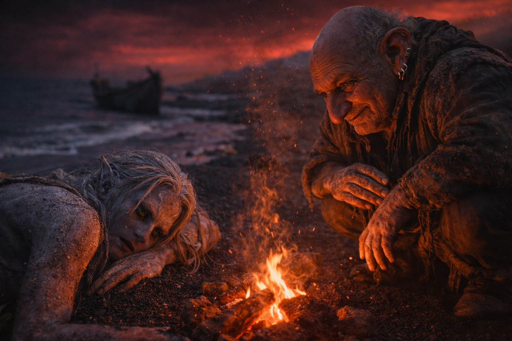
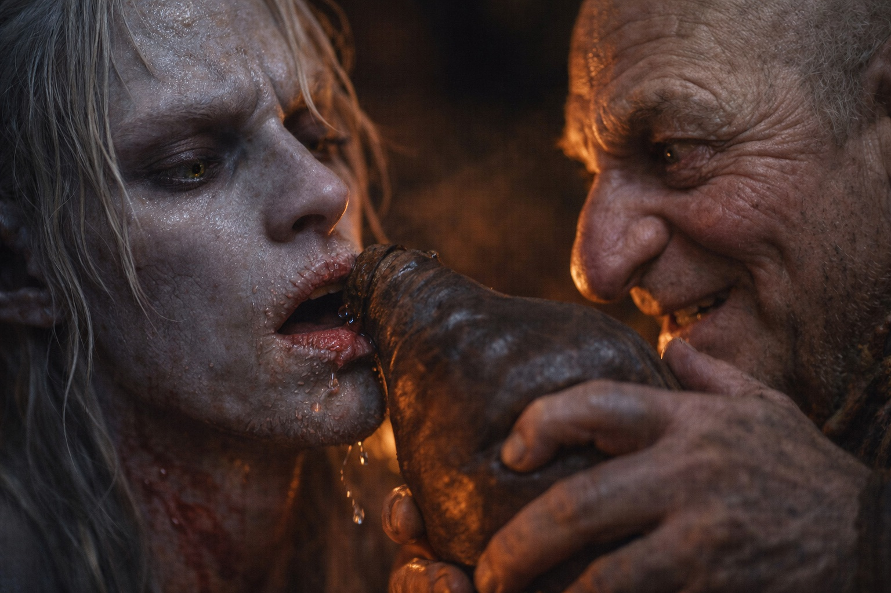
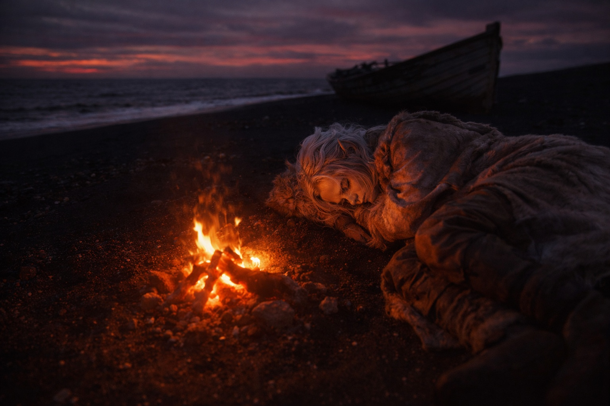

## Capítulo 9 | Parte 5

---

El calor le alcanzó la cara antes de que pudiera abrir los ojos. Algo áspero se le clavaba en la mejilla.

Olió madera ardiendo, con un rastro de azufre que persistía tras cada respiración.

Alguien se movía junto al fuego. A su espalda, el agua lamía el bote.

Drusniel abrió los ojos.

El cielo gris rojizo no había cambiado.

Un hombre estaba agachado junto al fuego.

—No intentes moverte todavía.

La voz del hombre era práctica.

Drusniel lo intentó de todos modos.

Los brazos le temblaron.

—¿Ves? Por eso te lo decía.

Drusniel se dejó caer otra vez.

—El cruce se lleva casi todo lo que la gente lleva dentro —dijo el hombre—. Los que sobreviven suelen necesitar un día antes de poder caminar bien.

Miró hacia el bote reforzado.

—El bote fue una buena idea.

—Agua —consiguió decir Drusniel.

Tenía la garganta en carne viva por horas de aire metálico, respiración desesperada y esfuerzo.

El hombre levantó una ceja.

—¿Después de cruzar eso?

Drusniel lo miró.

—Vale.

Trajo un odre y dejó que Drusniel bebiera poco a poco.

—No eres de aquí.

Drusniel bebió otra vez.

—¿Drow?

Un asentimiento.

—Hace tiempo que no veo uno de los tuyos.

Drusniel probó los dedos.

Se movían.

Despacio.

—¿Dónde?

—Wyrmreach. La costa. Tramo del Carroñero.

El hombre señaló con la barbilla hacia la orilla oscura.

—Aquí llegan cosas.

—Personas.

—A veces.

Drusniel miró tierra adentro.

Formaciones de cristal negro se alzaban entre plantas bajas cuyos colores no podía nombrar. Más lejos, una luz volcánica teñía el horizonte.

—No vayas hacia el resplandor hasta que sepas lo que haces —dijo el hombre.

Drusniel dejó caer la cabeza contra la mochila.

—¿Adónde intentabas ir?

Drusniel buscó en su memoria agotada.

—Szoravel.

El hombre se detuvo con un trozo de madera flotante en la mano.

—¿El mago?

—Sí.

—¿Lo conoces?

—No. Me enviaron.

—Un cruce largo para alguien a quien nunca has conocido.

Drusniel cerró los ojos un segundo.

—Zaelar dijo que Szoravel reconocería la señal del Nulo.

—Hm.

El hombre giró la madera entre los dedos sin mirar la mochila.

El hombre añadió la madera al fuego.

—Szoravel no es fácil de encontrar. Protegido, por lo que he oído.

Nadie había venido a buscarlo, salvo aquel hombre.

Había esperado a alguien que supiera su nombre.

Intentó sentarse.

El hombre extendió una mano, sin tocarlo, solo preparado por si caía.

—Descansa. Lo que hiciste ahí fuera te vació.

—¿Quién eres?

—Merrik.

—¿Por qué estás aquí?

—Trabajo la costa. Salvamento. Restos. A veces personas.

Sirvió caldo en un cuenco y se lo entregó.

Drusniel olió el caldo antes de beber. Carne y hierbas desconocidas; no distinguió mucho más.

Merrik lo notó.

—Buen hábito.

Drusniel tomó un sorbo con cautela.

Caliente.

—¿Por qué ayudarme?

Merrik se encogió de hombros.

—Estás vivo. Eso ya es bastante raro para resultar interesante.

—Interesante.

—Las cosas interesantes son valiosas aquí.

Drusniel bajó el cuenco.

Merrik soltó una risa corta.

—No pongas esa cara. Ahora mismo tu valor consiste sobre todo en que preferiría no ver morir a alguien junto a mi fuego.

Volvió a beber, con el cuenco a la vista de Merrik.

—Duerme —dijo Merrik—. El fuego mantiene alejados a los corredores de costa. Te despertaré si cambia.

Drusniel volvió a tumbarse.

Se volvió para poder ver el fuego y dejó una mano sobre la mochila.

La deuda pulsó una vez bajo sus costillas.

Drusniel esperó un segundo pulso.

Se durmió antes de que llegara.

---

**Fin de Capítulo 9.5 —> 10.1: [El Nudo en Riverhold: El Veterano](/el-nudo-en-riverhold-el-veterano/)**
