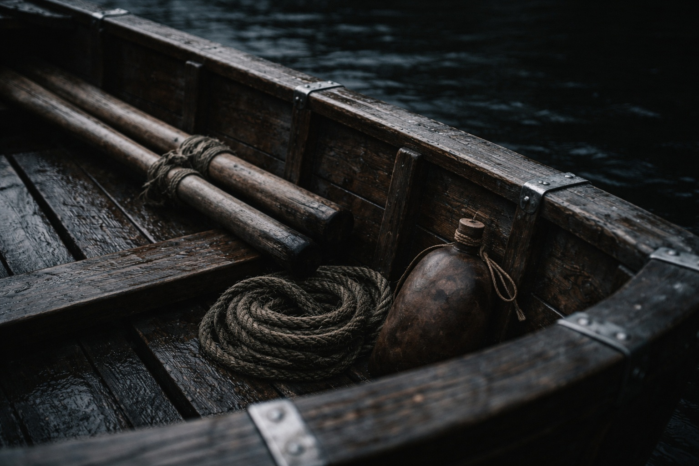
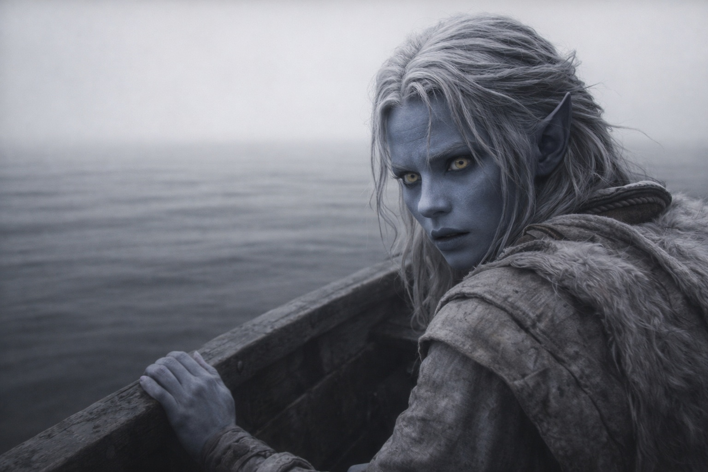
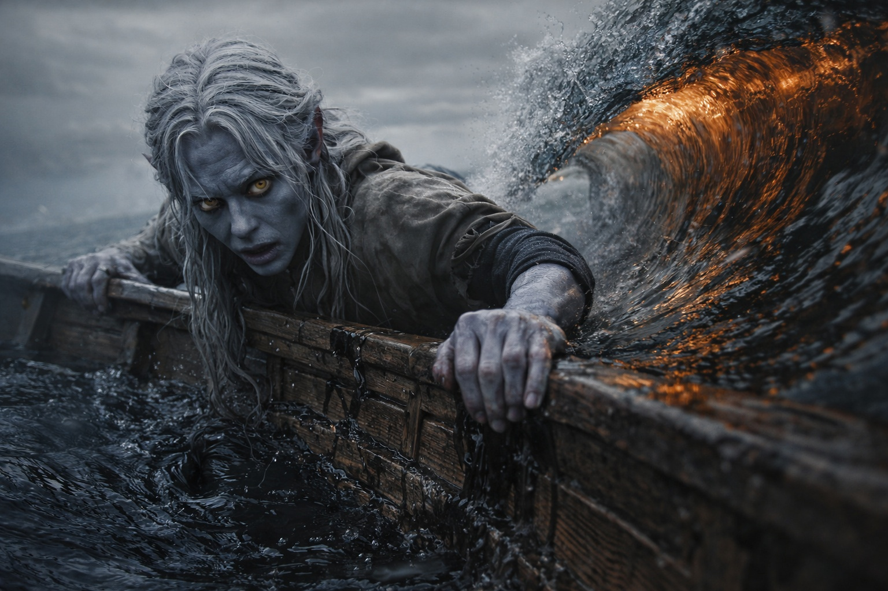

## Capítulo 9 | Parte 1

---

El agua se desplazaba contra las rocas sin que ninguna ola la moviera.

Drusniel se quedó donde la piedra negra se encontraba con el agua negra, el Nulo frío contra su pecho.

Intentó medir la costa lejana.

Una estimación la dejó a dos millas.

La siguiente la hizo cinco.

En la tercera, el horizonte cambió mientras lo miraba.

Dejó de intentarlo.

*Trescientos pasos al norte. Rocas negras con forma de dientes rotos.*

La ruta de Zaelar había sido exacta. La ensenada estaba donde debía estar, escondida detrás de las rocas negras. El bote esperaba dentro de la cueva sobre rodillos de madera.

El bote era pequeño, con sitio para los remos y un rollo de cuerda bajo el asiento. Un odre descansaba encajado junto a ellos.

Suficiente.

Drusniel pasó una mano por el casco ceñido con bandas de metal.

Zaelar había tenido razón sobre el bote.

Eso no lo hacía tener razón sobre nada más.

Lo empujó al agua y subió.

El casco se asentó demasiado despacio y después cayó media pulgada sin aviso.

Drusniel agarró los bordes.

El Nulo pulsó contra su esternón y dejó un dolor helado bajo el metal.

Su percepción del aire se apagó con él.

Buscó una corriente y se detuvo cuando el dolor se agudizó. Zaelar se lo había advertido: usar magia volvería a darles a las protecciones una presencia que encontrar.

Remar era más seguro.

Drusniel remó.

Las primeras diez paladas se comportaron casi con normalidad.

En la undécima, el agua se espesó alrededor de un remo y se volvió ligera alrededor del otro.

El bote giró.

Corrigió.

Veinte paladas después miró atrás y encontró agua abierta donde antes había estado la costa.

No había niebla que la ocultara. Se volvió un poco más para buscarla, hasta que el bote se balanceó bajo su peso.

Quedó una luz gris sin fuente visible. No proyectaba una sombra útil. El horizonte se expandía y contraía en fracciones que podía ver pero no cuantificar.

Drusniel contó paladas de todas formas.

Veintitrés.

Veinticuatro.

Veintitrés.

Se detuvo.

Recordaba haber dado la vigesimocuarta palada. También recordaba que la siguiente había venido antes.

El aire sabía a metal.

Siguió remando.

Una ola se alzó delante sin viento.

Su afinidad con el agua reaccionó antes que su pensamiento.

Drusniel tocó el mar con magia.

Algo respondió al toque.

La atención se cerró alrededor del bote desde abajo.

Cortó el contacto de inmediato.

La ola golpeó de lado.

El casco subió, quedó suspendido en un ángulo que su cuerpo insistía en que debía volcarlo y volvió a caer plano. Agua negra y pesada saltó por la borda y se acumuló alrededor de sus botas.

La presencia debajo permaneció.

Drusniel no volvió a tocar el agua.

Remó hasta que le ardieron los hombros.

Entonces el agua se espesó alrededor de ambos remos a la vez.

El bote casi se detuvo.

Drusniel miró el aire gris que se deslizaba débilmente sobre la popa.

Volvió la mejilla hacia él y esperó a sentir en qué dirección corría.

Atrapó la corriente, la comprimió y la redirigió hacia atrás.

El bote dio un tirón hacia delante.

El dolor le golpeó detrás del esternón al atraer la corriente hacia sí.

La presencia debajo se volvió más precisa.

Soltó la corriente, pero la presión fría de abajo siguió su ritmo.

La ráfaga apenas lo había llevado un poco más lejos. Le temblaban los brazos cuando volvió a tomar los remos.

Algo se movió bajo el casco.

No atacaba.

Lo seguía.

Tiró con cautela. La forma mantuvo la distancia bajo él. Dio otra palada; seguía sin acercarse.

Solo podía avanzar despacio. Apoyó los pies contra las costillas del casco y remó.

---

**Fin de Capítulo 9.1 —> 9.2: [El Mar de Pesadillas: La Cuenta](/el-mar-de-pesadillas-la-cuenta/)**
