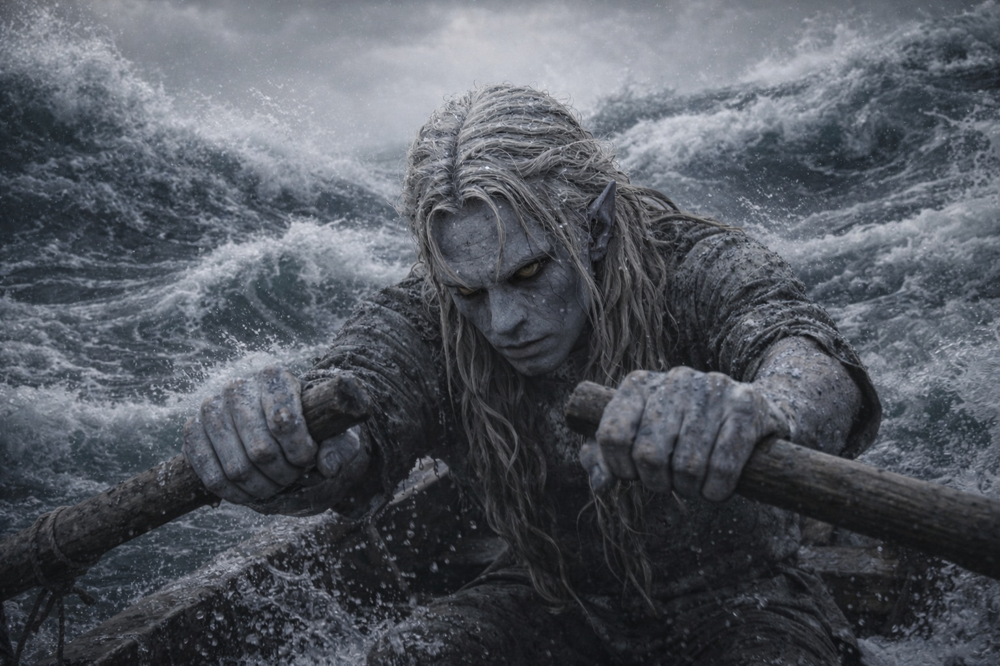
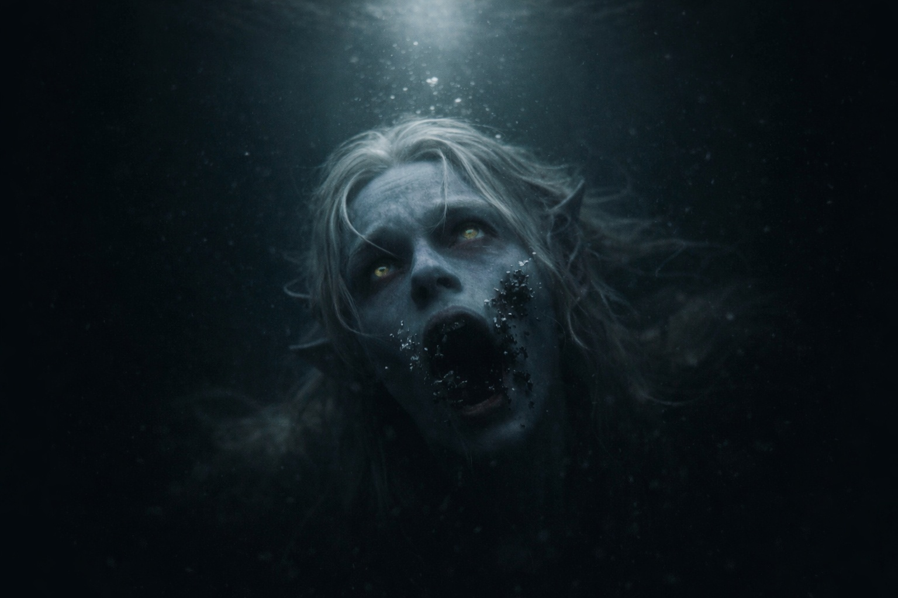
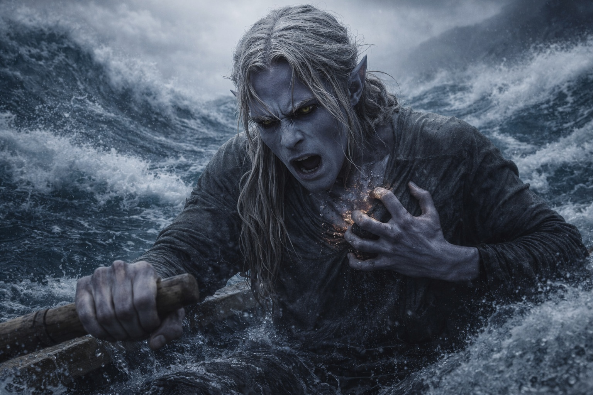

## Capítulo 9 | Parte 3

---

Drusniel ya no sentía las manos.

Podía verlas agarrando los remos.

Era suficiente.

Lo que había bajo el bote estaba subiendo.

La presión le llegó a través del casco antes de que viera ningún cambio en el agua.

Drusniel buscó una corriente.

Casi nada.

Un flujo fino se deslizó sobre la proa.

Lo impulsó a lo largo del casco, intentando orientar la proa hacia la ola.

El vacío interior aumentó con el esfuerzo.

El dolor le atravesó el pecho.

Su magia se vació.

La corriente desapareció.

Una pared de agua negra se alzó delante.

<video controls playsInline preload="metadata" poster="./wall-of-black-water_sora.jpg" width="100%">
	<source src="./DrusnielToweringWaves.mp4" type="video/mp4" />
</video>

Lo de abajo dejó de subir.

Esperaba.

Drusniel metió ambos remos en el agua.

No quedaba nada más que intentar.

Remó hacia la pared.

---

*El bote había desaparecido.*

*El agua negra le llenó los pulmones.*

*No encontraba la superficie. Cada patada lo volvía hacia una oscuridad distinta.*

*Drusniel pateó de todas formas.*

*Nada cambió.*

*La presencia debajo se acercó sin moverse.*

*Su cuerpo convulsionó alrededor de un aliento que no existía.*

*Pensó en Annariel inclinada sobre el pergamino que compartían, esperando a que él terminara de leer.*

*La muchacha del jardín, antes de que la prueba se la llevara.*

*Me fui sin explicarlo.*

*Debí habértelo contado.*

*La oscuridad se cerró alrededor de él.*

*El agua se detuvo contra sus ojos abiertos. Hasta la presión de sus pulmones quedó inmóvil.*

*La Voz habló.*

*Vive. Debes.*

*Las palabras terminaron. El pecho seguía atenazado en torno al aire que no podía tomar.*

*Intentó dar una patada más. Las piernas no se movieron.*

*Sí.*

---

El dolor golpeó bajo sus costillas.

Abrió los ojos.

Los mangos de los remos seguían en sus manos. El agua negra le oscilaba alrededor de las pantorrillas, pero podía respirar.

Miró sus manos y después el mar al otro lado de la borda. No había salido del bote.

Pero algo nuevo pulsó una vez junto a su corazón.

Drusniel se quedó inmóvil.

La presión bajo el casco desapareció.

El depredador había dejado de cazarlo.

El mar no había cambiado.

El bote se desvió de lado de inmediato cuando el agua se espesó bajo un costado y se volvió ligera bajo el otro.

Drusniel agarró el borde antes de caer.

Esperó a que volviera la presión. No volvió, aunque el bote seguía haciendo agua.

Miró los remos.

Intentó levantar el remo izquierdo. Se le resbaló en la palma; enganchó el pulgar sobre el mango y volvió a levantarlo.

El horizonte seguía negándose a ser medido.

Remó.

---

**Fin de Capítulo 9.3 —> 9.4: [El Mar de Pesadillas: Las Profundidades](/el-mar-de-pesadillas-las-profundidades/)**
