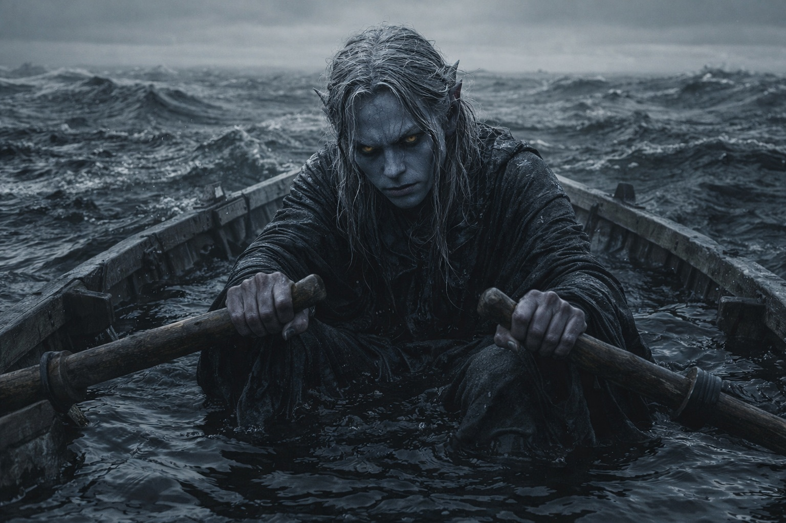
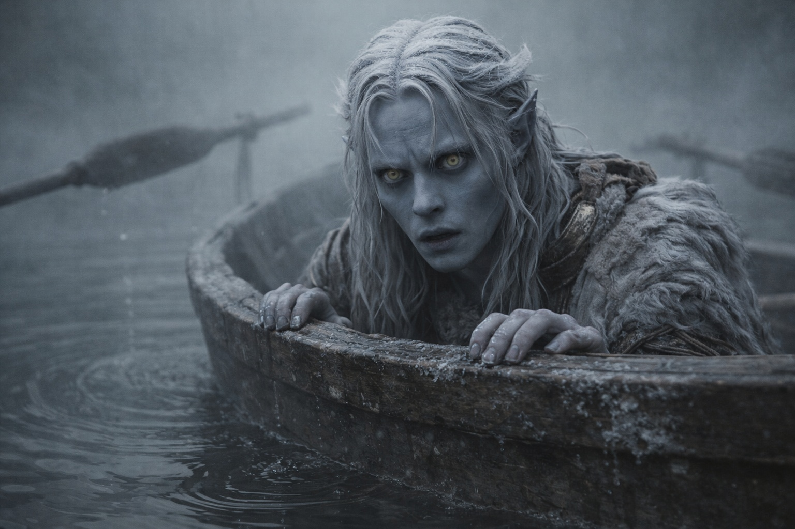

## Capítulo 9 | Parte 2

---

Veinte paladas. Luego una ráfaga de aire.

Ese era el plan.

Remar era silencioso. La magia de aire compraba distancia. El Nulo hacía caro cada trabajo, y cada trabajo le decía a lo que había debajo dónde estaba.

Lo bastante simple para racionarlo.

Drusniel tiró.

Uno.

Dos.

Tres.

A la diecisiete, el remo izquierdo se hundió en una resistencia como alquitrán.

A la dieciocho, ambos remos se movieron como si atravesaran niebla.

A la diecinueve, el bote se deslizó de lado.

Veinte.

Esperó una corriente.

Un flujo débil cruzó la popa.

Drusniel lo atrapó, lo estrechó y lo empujó hacia atrás.

El bote avanzó de golpe.

El Nulo mordió el trabajo.

Sus reservas cayeron más de lo que deberían.

Debajo, la presencia se acercó.

Drusniel soltó el aire.

Otra vez a remar.

Empezó la siguiente cuenta.

Uno.

Dos.

Tres.

Cinco.

Cinco otra vez.

Después cuatro.

Dejó de decir los números en voz alta.

El tiempo no estaba simplemente roto. Era hostil.

Probó con el ritmo.

Tirar. Soltar.

Tirar. Soltar.

Eso duró hasta que una palada exigió la mitad del esfuerzo de la siguiente, después el doble, después ninguno. El mar se negaba a mantener una cadencia estable.

El agua de la ola anterior se movía alrededor de sus botas. Achicó solo lo suficiente para mantener el peso manejable.

Nada de magia de agua.

Aire solo cuando el bote se detuviera.

Remos para todo lo demás.

Ese era el plan revisado.

Una sombra pasó por debajo.

El casco vibró.

Drusniel se quedó inmóvil.

Algo tocó la parte inferior una vez.

Suavemente.

Un golpe.

Su afinidad con el agua intentó alcanzarlo.

Aplastó el impulso.

El bote quedó a la deriva.

La presencia permaneció justo debajo.

Drusniel esperó hasta que una corriente tenue le rozó la mejilla.

Podía usarla.

No debía.

El bote casi se había detenido.

Atrapó la corriente.

Comprimió.

Redirigió.

La popa saltó hacia delante.

La respuesta debajo fue inmediata.

El casco subió una pulgada mientras algo lo seguía.

Drusniel soltó el trabajo.

Demasiado tarde.

Una forma larga se movió bajo el bote, demasiado profunda para ver detalles, demasiado grande para medirla.

Remó.

La base de sus dedos había empezado a sangrar. Cambió el agarre alrededor de la piel abierta y siguió tirando.

Sin costa.

Sin estrellas.

Sin horizonte estable.

Intentó un cálculo más.

Si el siguiente trabajo de aire costaba tanto como el último, quizá le quedaba uno después.

Quizá.

El Nulo pulsó.

Lo de abajo rozó el casco otra vez.

Más fuerte.

Drusniel miró los remos.

—Bien —le dijo al mar.

Remó sin contar.

---

**Fin de Capítulo 9.2 —> 9.3: [El Mar de Pesadillas: El Silencio](/el-mar-de-pesadillas-el-silencio/)**
