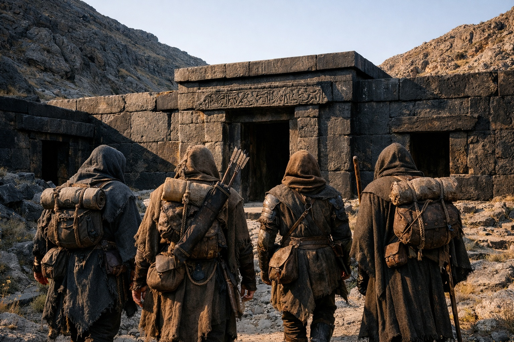
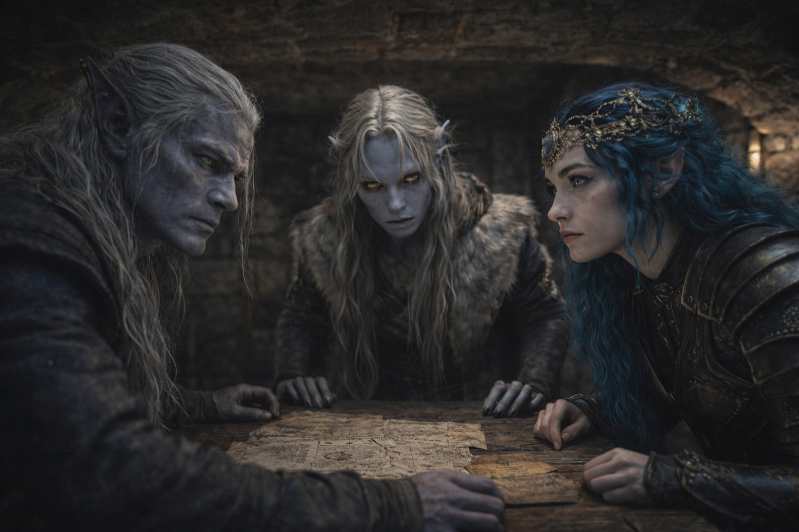
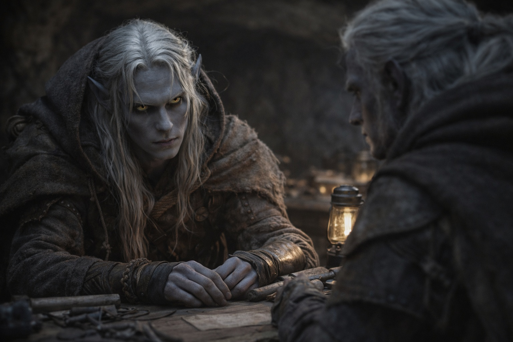

## Capítulo 34 | Parte 1 | El Puesto Avanzado

---

El puesto avanzado era más antiguo que cualquier cosa que Szoravel hubiera construido.

Los muros estaban tallados en basalto negro. Una inscripción desvaída en drow antiguo cubría los dinteles de las puertas estrechas. Drusniel reconocía las letras, pero no podía leerlas.

Dos crestas ocultaban el puesto hasta casi llegar a la entrada. Los vigías podrían haber pasado años allí sin que nadie los viera desde el camino.

Szoravel esperaba dentro.

Había llegado antes que ellos y estaba sentado ante una mesa de piedra. Drusniel se preguntó qué ruta habría seguido.

—La has traído —dijo Szoravel. Sus ojos negros se desviaron hacia Nyxara, que estaba en la puerta.

—Ella vino sola.

—Presencia no prevista. —Volvió a los instrumentos dispuestos sobre la mesa.

Nyxara entró.

Comprobó la altura del techo y la anchura de la puerta. Después eligió un asiento donde se bifurcaban dos corredores, lejos de las vigas y con el espacio abierto a su espalda.

—No fuiste invitada —dijo Szoravel. Estaba mirando los instrumentos.

—¿Desde cuándo controlas los caminos?

—Desde que construí los puestos avanzados a los que conducen.

—No construiste nada. Tus predecesores construyeron. Tú mantienes. Hay una diferencia.

Szoravel no respondió. Drusniel no se quitó la mochila.

Srietz pasó junto a Elion y se detuvo al lado del corredor secundario. Comprobó la salida antes de fijarse en Szoravel. Elion se quedó en la puerta.

—¿Empezamos? —dijo Szoravel. No le estaba hablando a Nyxara.

Sonrió de todas formas.

Szoravel acercó un taburete a la mesa. Nyxara siguió sentada.

Drusniel tocó el Null bajo la camisa. Los dos querían que lo usara. Él aún no había visto a ninguno de los dos hacerlo.

Drusniel se sentó en el banco de trabajo frente a Szoravel.

—Empieza —dijo.

---

**Fin del Capítulo 34.1  —> 34.2: [El Precio de las Respuestas: La Profecía](/el-precio-de-las-respuestas-la-profecia/)**
