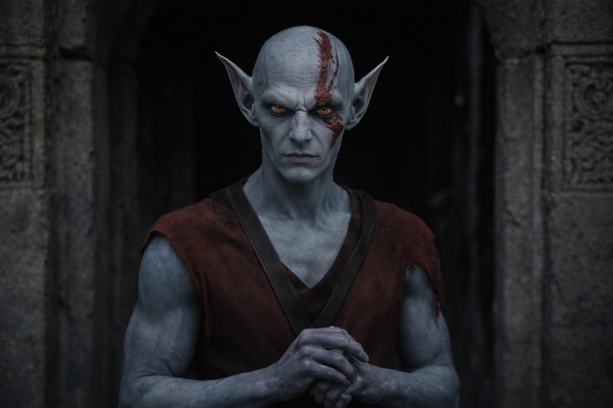
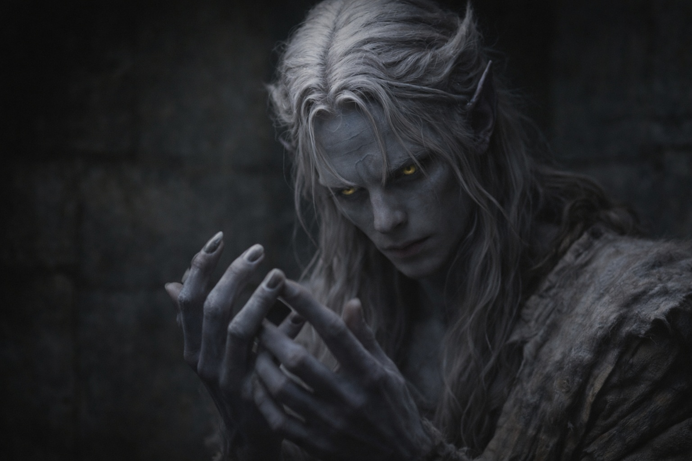

## Capítulo 34 | Parte 4 | La Noche

---

El puesto de avanzada no tenía ventanas.

Drusniel yacía sobre una repisa de piedra en una de las cámaras secundarias, el tipo de espacio diseñado para vigías que dormían por turnos y despertaban al deber. La repisa era lisa, pulida por generaciones de uso. Las paredes eran lisas. El techo era liso. Construcción drow antigua edificada para la función, no la textura, cada superficie nivelada y sellada hasta que la piedra no recordaba nada de las fracturas que alguna vez había contenido.

Presionó los dedos contra la pared. Demasiado lisa. Sin grietas. Sin vetas. Sin fracturas que seguir con los ojos, sin imperfecciones que trazar con el hábito de anclaje que lo había mantenido centrado desde Umbra'kor, desde las pruebas, desde la primera vez que el mundo se había vuelto demasiado grande y había descubierto que seguir una línea en la piedra podía reducirlo a un problema con bordes visibles.

Su mano resbaló de la superficie. Nada a qué aferrarse.

En su lugar, su pulgar comenzó a tamborillear contra sus dedos. Uno, dos, tres, cuatro. Un sustituto. Insuficiente. El tamborilleo no anclaba de la misma forma que el trazado. El trazado imponía orden sobre el caos al seguir un patrón existente. El tamborilleo era un patrón generado de la nada, interno en lugar de externo, y la diferencia importaba de maneras que no podía articular pero sentía en la cualidad específica de su ansiedad, que ya no era del tipo que quería estructura sino del tipo que había dejado de creer que la estructura estuviera disponible.

Catalogó lo que sabía.

La barrera estaba fallando. La degradación se estaba acelerando. Una ventana de renovación se abriría en semanas, posiblemente días. La ventana sería breve. Él era la interfaz compatible. El Nulo era el mecanismo. El procedimiento era posible pero implacable, la diferencia entre renovación y catástrofe determinada enteramente por el momento. Una acción. Dos resultados. El margen entre ellos se medía en horas, y la única persona que podía identificar ese margen con precisión era Szoravel, que estaba planificando en un cronograma que Nyxara había aceptado sin discusión.

Catalogó lo que temía.

La entidad volcánica. La cosa que había percibido en la montaña durante el cruce, vasta y paciente y existiendo a una escala que hacía que la consciencia de Drusniel se sintiera como una grieta en un suelo que se extendía hasta cada horizonte. Si la barrera se abría, eso era lo que atravesaba. No monstruos. No ejércitos. Algo que no necesitaba categorías porque era el espacio que contenía las categorías, el entorno que precedía a la definición.

No podía imaginarlo. La mente se negaba. Lo que había sentido era presión y calor y una consciencia tan grande que su percepción de ella era comparable a la percepción que una célula individual tiene del cuerpo que la contiene. Algo que respiraba en tiempo geológico. Algo que la barrera contenía no porque la barrera fuera más fuerte sino porque la barrera era el límite entre la cosa y todo lo que existía en escalas menores.

Si él fallaba. Si el momento era incorrecto. Si las mediciones de Szoravel estaban desviadas por horas o si la interfaz de Drusniel con el Nulo era insuficiente o si la alineación cambiaba durante el procedimiento, la barrera interpretaría su presencia como brecha. Se abriría. Y la entidad en la montaña atravesaría.

No por mucho tiempo. La barrera se cerraría de nuevo. Szoravel lo había dicho. Pero "brevemente, catastróficamente" fueron las palabras que había usado, y brevemente, a la escala de lo que vivía en la montaña, significaba suficiente. Suficiente para fracturar lo que estuviera del otro lado. Suficiente para cambiar el mundo de maneras que no sanarían.

Y él creía en el deber. Esa era la parte que lo hacía peor, la parte que se asentaba en su pecho junto al miedo como dos objetos ocupando el mismo espacio. Creía que la barrera era sagrada. Creía que los drow existían en relación a ella. Creía que el mantenimiento era propósito y que el propósito justificaba el riesgo, y la creencia era un peso que no podía soltar porque soltarlo significaba convertirse en alguien que no creía, y no sabía quién era esa persona.

El deber era claro. El mecanismo era claro. El momento era claro. El miedo era claro. La creencia era clara. Y en algún lugar dentro de la montaña, algo vasto respiraba en ciclos que no tenían nada que ver con la claridad, y la barrera entre ellos estaba fallando, y la persona responsable de repararla estaba acostada en una repisa de piedra en un puesto de avanzada antiguo presionando los dedos contra paredes demasiado lisas para ofrecer nada.

Su pulgar tamborileó. Uno, dos, tres, cuatro. Uno, dos, tres, cuatro.

Buscó a la Voz.

No deliberadamente. Como buscas una barandilla cuando sientes que te caes, el movimiento instintivo hacia algo que ha estado ahí antes. El espacio detrás de su esternón donde la influencia de la Voz residía, donde las deudas vivían, donde la conexión entre ellos era más fuerte.

Nada.

La Voz estaba en silencio. Había estado en silencio desde la agitación en el campamento de Thornfield, las dos palabras presionadas en su consciencia con el peso de una estación que se aproxima. Casi listo. Casi ahí. Desde entonces, nada. Sin intervenciones. Sin observaciones. Sin deudas cobradas. Solo silencio.

Pero el silencio era diferente ahora. Había sido ausencia. Ahora era paciencia. El silencio de alguien que espera porque la espera casi ha terminado, el silencio de un sistema que se ha posicionado exactamente donde necesita estar y está agotando el reloj hasta que el reloj llegue a cero.

La Voz estaba esperando. Por la ventana. Por el momento. Por que Drusniel se convirtiera en lo que la Voz necesitaba que se convirtiera, fuera lo que fuera, para cualquier propósito hacia el cual las deudas habían estado construyéndose desde el Mar de Pesadillas.

No lo preguntó. La pregunta haría la respuesta real, y la respuesta, sospechaba, eliminaría el último consuelo que tenía: la ficción de que sus decisiones seguían siendo suyas.

Cerró los ojos. Las paredes no ofrecían nada. El techo no ofrecía nada. La repisa era lisa y fría y la oscuridad detrás de sus párpados era la oscuridad particular de los espacios cerrados donde la única compañía era la arquitectura del miedo y el deber que insistía en existir junto a él.

—¿Estás listo?

La voz no era la Voz. Era Elion, de pie en el umbral. Piel gris, ojos ámbar-anaranjados, las marcas rojas en su rostro apenas visibles en la luz tenue. Sostenía su cuerpo como siempre lo sostenía: con precisión, controlado, como si el cuerpo fuera una herramienta que estaba operando en lugar de algo que era.

—No —dijo Drusniel.

—¿Lo estás?

—¿Para qué?

—Para verme convertirme en lo que necesitan que sea.

Elion guardó silencio por un largo rato. El silencio de alguien procesando una pregunta que requería más verdad que consuelo.

—Srietz dice que deberíamos irnos. Esta noche. Sin Nyxara. Sin Szoravel.

—¿Y adónde?

—A cualquier lugar donde la barrera no esté.

Drusniel miró sus manos. Gris oscuro casi negro en la luz tenue. Manos adaptadas. Manos que Wyrmreach ya no rechazaba. Manos que encajaban en el entorno como una llave encaja en una cerradura, no porque la llave eligiera la cerradura sino porque la cerradura era específica y la llave resultó coincidir.

—No hay ningún lugar donde la barrera no esté —dijo—. Ese es el punto.

Elion no discutió. Se quedó de pie en el umbral y no dijo nada, y la nada era la nada de alguien que había hecho su pregunta y recibido la respuesta que esperaba y deseaba no haberla recibido.

Se fue. Drusniel quedó solo en la habitación sin ventanas con las paredes lisas y el pulgar tamborileando y el deber y el miedo y el silencio que estaba esperando algo que no estaba listo para nombrar.

No durmió. Yació en la oscuridad y contó sus latidos y sintió la paciencia de la Voz llenando el espacio donde su silencio solía estar.

---

**Fin del Capítulo 34.4  —> 34.5: [El Precio de las Respuestas: La Interrupción](/el-precio-de-las-respuestas-la-interrupcion/)**
