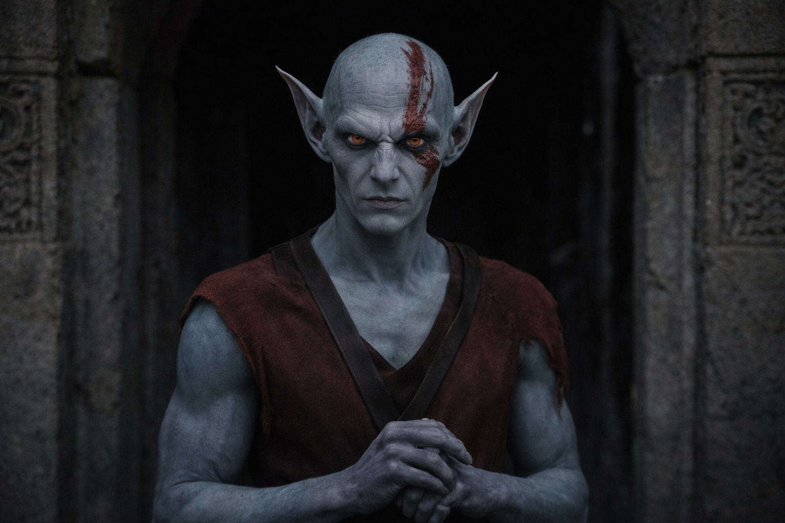
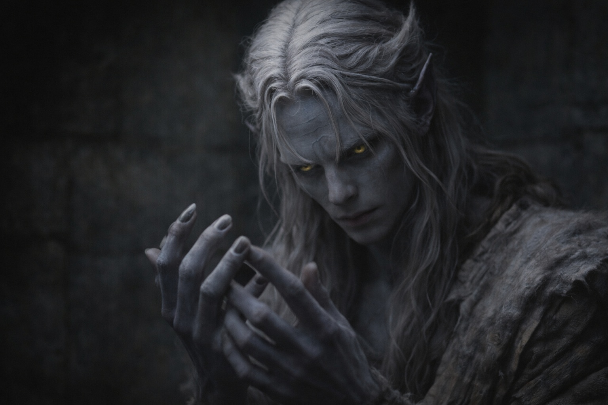

## Capítulo 34 | Parte 4 | La Noche

---

El puesto de avanzada no tenía ventanas.

Drusniel estaba tumbado en una repisa de piedra, en una cámara lateral. Los anteriores ocupantes habían dejado lisa la superficie. La manta apenas la acolchaba.

Apoyó los dedos contra la pared, buscando una grieta que recorrer. No había ninguna a su alcance.

Su mano resbaló de la superficie. Nada a qué aferrarse.

Se tocó cada dedo con el pulgar. Le mantenía la mano ocupada, pero seguía pensando en la mesa de trabajo.

Tres semanas, había dicho Szoravel.

Aún faltaban componentes. Incluso con ellos, equivocarse de momento podía abrir una brecha. Szoravel había ofrecido mediciones, no una demostración de que aquello funcionaría.

Recordó la montaña.

La presencia que había sentido allí era inmensa comparada con la suya. Apenas había soportado el contacto. ¿Qué ocurriría si se abría la barrera?

Apretó más los dedos contra la piedra. Aún recordaba el calor.

Szoravel podía equivocarse por horas. Drusniel podía perder el control a mitad del proceso. No le habían dado ninguna forma de detenerlo una vez iniciado.

Breve. Catastrófico. Esas habían sido las palabras de Szoravel. Drusniel no tenía forma de calcular cuánto podría atravesar la abertura en ese tiempo.

Le habían enseñado a llamar sagrada a la barrera. Eso no le decía si tocarla mataría a más gente que dejarla intacta. Necesitaba las lecturas y necesitaba entenderlas por sí mismo.

Apartó la manta y se incorporó. Por la mañana preguntaría cómo detener el procedimiento.

Su pulgar tamborileó. Uno, dos, tres, cuatro. Uno, dos, tres, cuatro.

Buscó a la Voz.

Contuvo la respiración y prestó atención a la presión fría detrás del esternón.

Nada.

No había hablado desde Thornfield. Casi listo. Casi allí. Recordaba ambas frases con exactitud. Ninguna le decía qué iba a ocurrir.

Esperó hasta que tuvo que respirar.

¿Esperaba el mismo intervalo? No tenía más indicios que aquellas cuatro palabras.

Le debía dos veces. No ofrecería una tercera deuda solo para acabar con el silencio.

Volvió a tumbarse, aún contando las horas que faltaban para la mañana.

—¿Estás listo?

Elion estaba en la puerta. Apenas se distinguían las marcas rojas de su rostro blanco azulado en la penumbra.

—No —dijo Drusniel.

—¿Y tú? —preguntó Drusniel.

—¿Para qué?

—Para quedarte durante las pruebas. No sabemos lo que costarán.

Elion miró hacia el corredor antes de responder.

—Srietz dice que deberíamos irnos. Esta noche. Sin Nyxara. Sin Szoravel.

—¿Y adónde?

—A cualquier lugar donde la barrera no esté.

Drusniel se miró las manos. Había apretado lo bastante para dejar marcas rojas en la piel gris azulada.

—No hay ningún lugar donde la barrera no esté —dijo—. Ese es el punto.

Elion permaneció un momento más en la puerta.

Después se marchó. Drusniel se cubrió los hombros con la manta.

Permaneció despierto, escuchando su propio latido.

---

**Fin del Capítulo 34.4  —> 34.5: [El Precio de las Respuestas: La Interrupción](/el-precio-de-las-respuestas-la-interrupcion/)**
