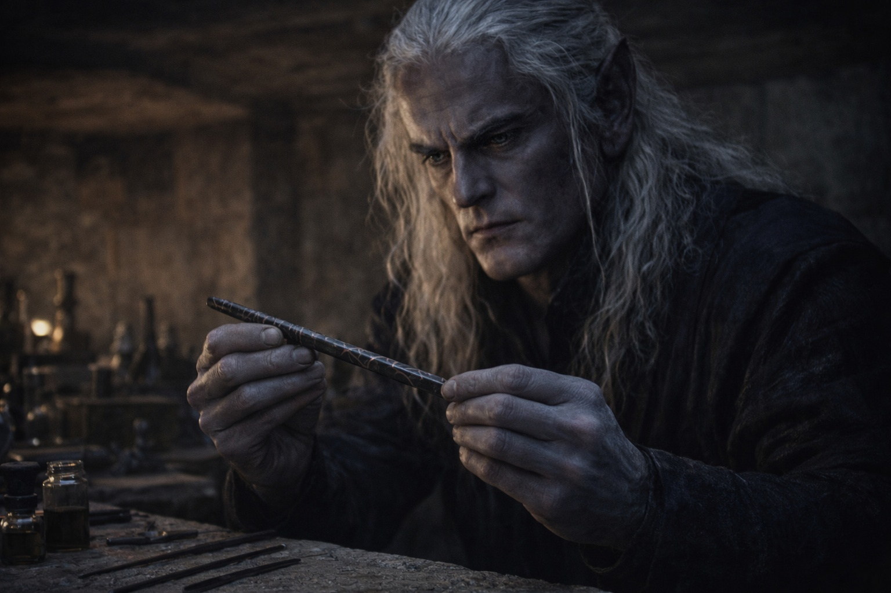

# Capítulo 34.2 | El Precio de las Respuestas: La Profecía

---

Szoravel comenzó con la barrera.

Sin preámbulos. Sin contexto. Abrió como abría todo: a mitad de pensamiento, como si la conversación hubiera estado corriendo en su cabeza y simplemente le estuviera permitiendo a Drusniel unirse en el punto relevante.

—La barrera se degrada en ciclos. Cada ciclo es más largo que el anterior, porque la degradación es exponencial, no lineal. El ciclo actual comenzó a acelerarse hace catorce meses. Al ritmo presente, la barrera alcanzará un fallo crítico dentro del año. —Colocó un instrumento en la mesa de trabajo, una vara delgada de piedra oscura con marcas que pulsaban débilmente—. Esto mide la frecuencia de degradación. Las lecturas se han triplicado desde la última vez que calibré.

—Triplicado —dijo Drusniel.

—Triplicado. La aceleración es consistente con los registros históricos de períodos previos a la renovación. La barrera le está diciendo a quien escuche que requiere mantenimiento. Lo ha estado diciendo por más de un año.

—Y nadie escucha.

—Yo escucho. Tú escuchas. La pregunta es si escuchar se traduce en acción antes de que la ventana se cierre. —Szoravel tomó la vara. La dejó. Preciso—. La barrera requiere renovación por una interfaz compatible. El proceso de renovación es antiguo, documentado en fragmentos, disputado en detalles, pero consistente en sus requisitos fundamentales. —Miró a Drusniel. Sus ojos violeta no contenían nada cálido ni nada cruel. Evaluación. Evaluación pura—. Doble afinidad. Aire y agua. La combinación que corresponde a las frecuencias operativas de la barrera. Tú posees ambas.

—Lo sé.

—Lo sabes porque te lo dije en la torre. Lo que no te dije es la implicación. —Cruzó las manos sobre la mesa de trabajo. Manos viejas. Cicatrizadas. Las manos de alguien que había pasado décadas manipulando cosas que se resistían a ser manipuladas—. Eres el único portador de doble afinidad conocido en Wyrmreach. Posiblemente el único a ambos lados de la barrera. La profecía describe requisitos. Tú los cumples.

La palabra se asentó en el pecho de Drusniel como un peso que había estado cargando sin nombre.

Profecía.

La había temido desde las escrituras de la cueva. Desde los fragmentos de texto en Drow Antiguo que habían descrito a alguien con su perfil exacto realizando algo demasiado importante y demasiado peligroso para nombrarlo con claridad. Se había dicho a sí mismo que era coincidencia. Convergencia. El tipo de patrón que la mente crea cuando mira datos dispersos y quiere una historia.

Pero escucharlo de Szoravel, en el mismo tono clínico que usaba para todo, con la misma ausencia de reverencia o consuelo, era diferente. Szoravel no creía en elegidos. Creía en matrices de compatibilidad.

—Eres suficiente —dijo Szoravel—. No elegido. Suficiente. La distinción importa. A la barrera no le importa el destino. Le importa la alineación de frecuencia y la ejecución procedimental. Tú te alineas. Si ejecutas correctamente, la barrera se renueva.

—¿Y si ejecuto incorrectamente?

Szoravel hizo una pausa. La pausa no fue por efecto. Fue la pausa de un hombre seleccionando precisión de un vocabulario construido para ello.

—El momento lo es todo. La barrera tiene una ventana de renovación. Un período durante el cual su degradación crea un punto de interfaz, un momento de permeabilidad donde un portador compatible con el componente correcto del Nexo puede conectarse al sistema y restaurar su integridad. Acércate durante la ventana y la estabilizas.

—¿Y fuera de la ventana?

—El sistema trata el contacto prematuro como brecha. No distingue intención.

Drusniel sintió el aire abandonar sus pulmones de una manera que no era respiración. —¿Qué sucede?

—La barrera interpreta el contacto como amenaza. Se abre para eliminar la fuente.

—Se abre.

—Se abre. Para cerrarse alrededor de lo que percibe como erróneo. —La voz de Szoravel era firme. La firmeza de alguien que había calculado este resultado años atrás y había vivido con el cálculo desde entonces—. Y todo lo que hay del otro lado atraviesa. Brevemente. Catastróficamente.

La sala estaba en silencio. La piedra antigua de los drow absorbía el sonido como absorbía la luz, tomando todo y sin devolver nada. Nyxara estaba sentada en su posición elegida cerca del punto más amplio de la cámara. Su atención estaba enfocada con la precisión de una hoja siendo afilada. No dijo nada. No necesitaba hacerlo. Su silencio era el silencio particular de alguien que escucha confirmado lo que ya sabía por una fuente que respetaba lo suficiente como para soportar.

—El Nulo —dijo Drusniel—. El artefacto. Ese es el mecanismo.

—La fase de Borrar del Chasis del Nexo. Diseñada para conectarse con el sistema operativo de la barrera durante las ventanas de renovación. En tus manos, con tu afinidad, se convierte en la herramienta que extiende la vida de la barrera o la colapsa. —Szoravel se inclinó ligeramente hacia adelante—. Los parámetros se ingresan en la activación. La alineación es determinada por la intención del portador, su correspondencia de afinidad y el momento relativo al ciclo de degradación. Aciertas el momento y el sistema lee tu intención como mantenimiento. Lo yerras y el sistema lee tu presencia como la amenaza que fue diseñado para contener.

—Misma acción. Diferente momento.

—Misma acción. Diferente momento. Resultado diferente por órdenes de magnitud. —Se reclinó—. Por eso importa la preparación. Por eso insistí en el puesto avanzado en lugar de la torre. La barrera está cerca aquí. Puedo medir su estado directamente. Puedo identificar la ventana. Y puedo entrenarte para conectarte con el Nulo de una manera que maximice la probabilidad de una renovación exitosa.

—Probabilidad.

—No te mentiré sobre certezas. El proceso ha sido realizado exitosamente según los registros históricos. También ha sido realizado sin éxito. La variable siempre es la misma: el momento.

Drusniel miró sus manos sobre la mesa de trabajo. Piel gris oscuro casi negra. Dedos largos. Adaptados a Wyrmreach. Los cristales en su cinturón zumbaban a una frecuencia que coincidía con la vara sobre la mesa, el pulso de degradación de la barrera, el ritmo de un sistema llamando a mantenimiento en un lenguaje que su cuerpo había aprendido a hablar.

Suficiente. No elegido. La profecía describía requisitos, no destino. Y los requisitos le encajaban de la manera en que los cristales encajaban en su cuerpo, no porque fuera extraordinario sino porque era lo que estaba disponible, y al sistema no le importaba la diferencia.

Miró a Nyxara. Ella sostuvo su mirada. Sus ojos oscuros contenían reconocimiento. No lástima. No preocupación. La mirada de alguien que había observado a una herramienta descubrir su función y sentía el respeto particular que viene de ver a alguien aceptar un peso que podría haber rechazado.

—¿Cuándo es la ventana? —preguntó Drusniel.

Szoravel tomó la vara de medición. Las marcas pulsaron.

—Pronto —dijo—. Semanas, no meses. Necesito tiempo para precisarlo más. Pero la degradación se está acelerando. La ventana se abrirá, y cuando lo haga, no permanecerá abierta mucho tiempo.

—¿Cuánto tiempo?

—Horas. Quizás un día. No más.

Horas. Un día. Para realizar un procedimiento que salvaría la barrera o la abriría de par en par. Con un artefacto cuya función apenas comprendía, guiado por un hombre cuyos métodos eran clínicos y cuya calidez estaba ausente, observado por una mujer cuyo silencio se sentía como el cierre de una red.

—Entonces nos preparamos —dijo Drusniel.

Szoravel asintió. El asentimiento de un hombre que había entregado la información y ya estaba planificando la siguiente fase.

Nyxara no dijo nada. No necesitaba hacerlo. Había escuchado lo que había venido a escuchar.

---

*Siguiente: El Precio de las Respuestas: El Plazo*

**Fin del Capítulo 34.2 — continúa en el Capítulo 34.3: [El Precio de las Respuestas: El Plazo](/el-precio-de-las-respuestas-el-plazo/)**