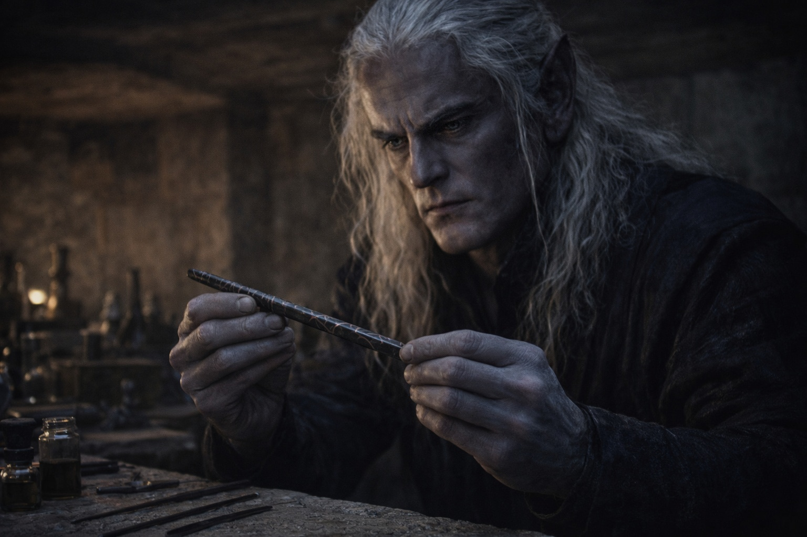

## Capítulo 34 | Parte 2 | La Profecía

---

---

Szoravel comenzó con la barrera.

Dejó entre ambos una varilla fina de piedra oscura. Las marcas de su superficie pulsaban.

—La degradación lleva catorce meses acelerándose. Estimación actual: fallo crítico antes de un año. —Giró la varilla hacia Drusniel—. Estas lecturas se han triplicado desde la última calibración.

—Triplicado —dijo Drusniel.

—Triplicado. Coinciden con los periodos registrados antes de las renovaciones.

—Y has esperado hasta ahora para decírmelo.

—Las afinidades requeridas son aire y agua. Ambas confirmadas en tu evaluación. —Szoravel dejó la varilla—. La preparación sigue incompleta.

—Lo sé.

—Ningún otro portador confirmado disponible. Cumples los requisitos registrados en la profecía.

Drusniel dejó de mirar la varilla.

Profecía.

Recordó las inscripciones de la cueva. Había esperado que la semejanza fuera una coincidencia o un error de lectura.

Szoravel había usado aquella palabra sin siquiera levantar la vista.

—Compatibilidad confirmada —dijo Szoravel—. Ejecución satisfactoria, no.

—¿Y si ejecuto incorrectamente?

Szoravel comprobó una marca de la varilla.

—El contacto queda restringido al intervalo de renovación. Deben verificarse el momento, el apoyo elemental y los componentes necesarios.

—¿Y fuera de la ventana?

—El contacto prematuro consta como una brecha.

Drusniel tomó aire despacio. —¿Qué ocurre?

—El resultado registrado es una apertura.

—Se abre.

—Paso a través de ella. Breve. Catastrófico.

Nyxara observaba desde su asiento junto a la bifurcación. No hizo preguntas.

—El Null —dijo Drusniel—. ¿Basta con eso?

—No. Borrar elimina una firma. No restaura ni estabiliza una barrera. Usarlo sin apoyo es letal. Tus afinidades permiten la preparación; no sustituyen a los componentes que faltan.

—Y aun con ellos, equivocarnos de momento puede matarnos.

—Correcto. Primero, calibración. Mediciones tomadas aquí, cerca de la barrera. Ninguna activación antes de la evaluación.

—Y después de eso, tampoco habrá certeza.

—Ningún resultado garantizado. El momento es uno de los requisitos.

Drusniel apoyó las manos de piel gris azulada sobre la mesa. Los cristales del cinturón zumbaban mientras Szoravel giraba la varilla.

Tenía las afinidades. Seguía sin tener los medios para hacer lo que Szoravel quería.

Miró a Nyxara. Ella le sostuvo la mirada y esperó.

—¿Cuándo es la ventana? —preguntó Drusniel.

Szoravel tomó la vara de medición. Las marcas pulsaron.

—Semanas, no meses. Hacen falta más mediciones. El margen estimado se estrecha.

—¿Cuánto tiempo?

—Horas. Quizás un día. No más.

Dispondría de horas para actuar según unas mediciones que aún no sabía interpretar por sí mismo. Acercó la varilla.

—Entonces nos preparamos —dijo Drusniel.

Szoravel abrió el estuche de instrumentos.

Nyxara le observaba las manos.

---

**Fin del Capítulo 34.2  —> 34.3: [El Precio de las Respuestas: El Plazo](/el-precio-de-las-respuestas-el-plazo/)**
