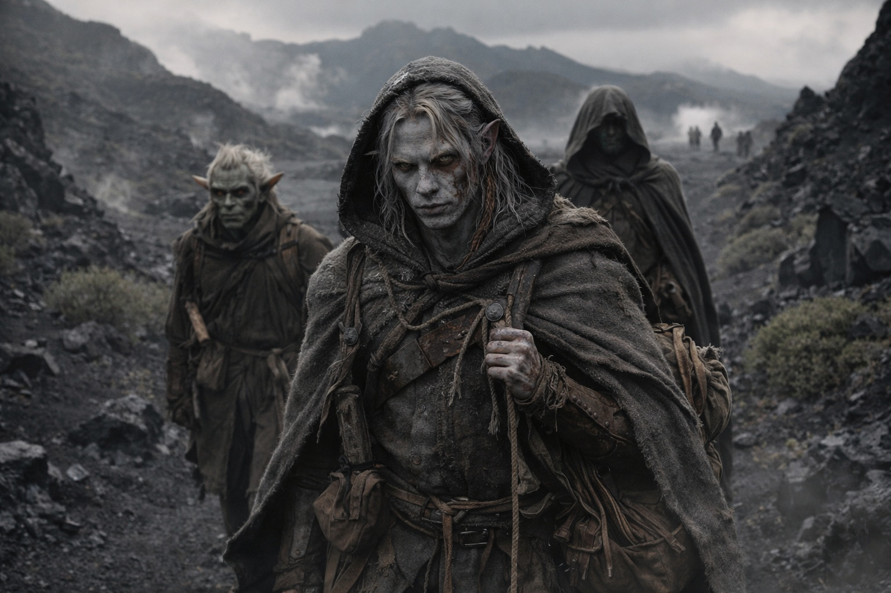
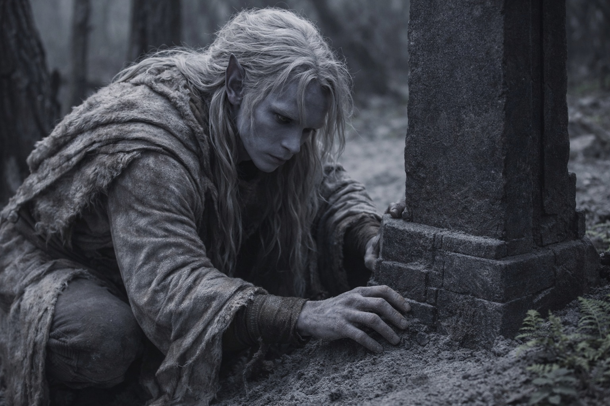
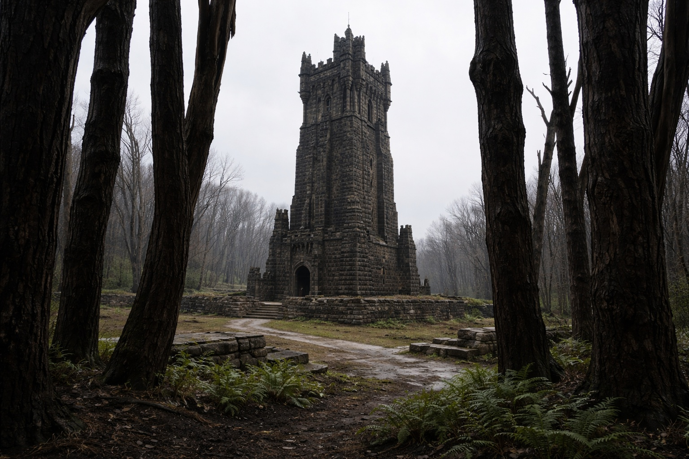
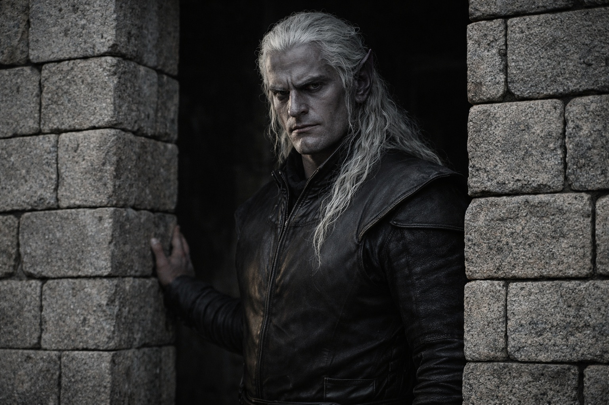
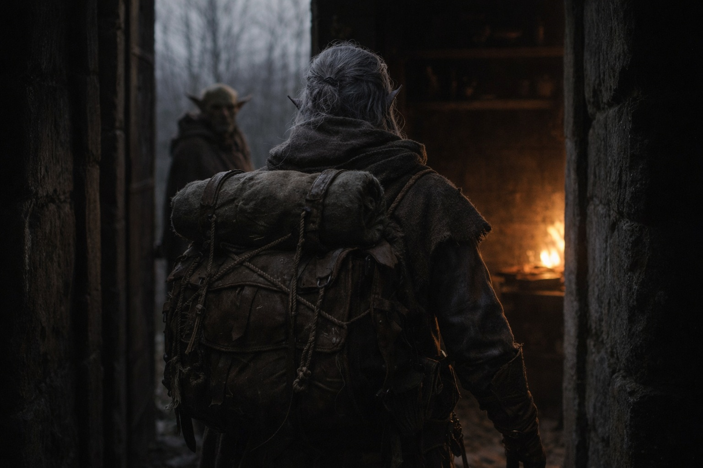

# Capítulo 27.5 | El Precio del Paso: El Otro Lado

---

Caminaba como un hombre que se hubiera tragado una brújula.

Noroeste. A través de los campos de ceniza enfriándose donde la erupción había reconfigurado el terreno en crestas de nueva piedra, negra y vítrea y aún lo suficientemente caliente como para sentirla a través de las suelas de sus botas. Pasando los campos de placas donde los respiraderos térmicos siseaban vapor hacia un cielo que se despejaba más cuanto más se alejaban del núcleo volcánico. Hacia territorio que ninguno de ellos había mapeado, siguiendo un rumbo que Drusniel no podía justificar y no intentaba hacerlo.

Srietz caminaba dos pasos detrás de él y a la izquierda, que era su posición de vigilancia preferida cuando no confiaba en la situación. Elion flanqueaba por la derecha, más lejos, moviéndose con la soltura de alguien cuyo cuerpo tenía opciones que otros no tenían. Ninguno de los dos preguntó a dónde iban. Habían preguntado una vez. La respuesta había sido insuficiente. Preguntar de nuevo no la mejoraría.

El paisaje cambió a medida que avanzaban al noroeste. Los campos de placas volcánicas dieron paso a terreno más antiguo, basalto erosionado hasta convertirse en suelo, vegetación arbustiva abriéndose paso a través de grietas donde siglos de ceniza se habían descompuesto en algo que podía sostener raíces. El aire se enfrió en incrementos. El olor a azufre se desvaneció. Para cuando coronaron la cresta que marcaba el límite entre la zona volcánica activa y lo que hubiera más allá, el aire olía a tierra y cosas verdes y ese tang metálico particular que precede a la lluvia.

Drusniel sentía la dirección en su pecho como había sentido el compuesto en su sangre: una certeza ajena que operaba independientemente de sus pensamientos. No navegaba. Seguía el saber. Sus pies encontraban senderos que parecían cualquier otro tramo de terreno quebrado, pero la dirección siempre estaba allí, constante, jalándolo hacia adelante como un anzuelo clavado detrás de su esternón.

La parte que debería haberle preocupado era lo poco que le preocupaba.

Había estado dentro de la montaña. Algo lo había mirado. Su nariz había sangrado. Había visto visiones de una torre y una figura y un cielo sin ceniza, y ahora caminaba hacia esas visiones con la confianza de un hombre leyendo un sendero bien marcado, y el sendero existía solo en su cuerpo, y su cuerpo había sido manipulado por fuerzas que no podía nombrar, y nada de eso reducía su paso.

La Voz se había ido. Había dejado de buscarla después de la tercera vez en los túneles. El espacio hueco detrás de sus pensamientos permanecía hueco. Había sobrevivido la montaña sin ella. El cruce, la entidad, el regreso por pasajes sellados, todo logrado con las habilidades que había traído a Wyrmreach y las que había construido desde su llegada. Sus dedos. Su entrenamiento. Su disposición a leer la piedra cuando la piedra era lo único que hablaba.

Había sobrevivido por su cuenta. El alivio fue menor de lo que esperaba. Más como descubrir que una herramienta que creía esencial había estado ausente durante un tiempo y el trabajo había continuado de todos modos. No libertad. No pérdida. Recalibración.

Los cristales en su mochila zumbaban. Más tenues ahora, lejos del núcleo de la montaña, pero aún presentes. Los sentía contra su columna a través del cuero, cálidos y vibrando a una frecuencia que parecía sintonizarse con sus pasos. Cada cristal que había cosechado de la cámara llevaba una fracción de la frecuencia de la montaña, y colectivamente producían algo que no amplificaba nada en él sino que suavizaba los bordes de la particular distorsión de Wyrmreach. Los colores se quedaban donde estaban. Las distancias se comportaban. La sutil desorientación que Wyrmreach alimentaba a los recién llegados y nunca dejaba de alimentar del todo era más silenciosa con los cristales cerca.

Una herramienta útil. Una dependencia peligrosa. Averiguaría cuál después.

—Srietz tiene una pregunta —dijo Srietz desde detrás de él.

—Una.

—Cuánto tiempo.

—No lo sé. —Honesto. Podía sentir la dirección y la atracción pero no la distancia en ninguna unidad que pudiera comunicar. "Estamos cerca" era una sensación, no una medida. No lo dijo. Srietz habría preguntado qué significaba "cerca", y él habría tenido que explicar que significaba que el anzuelo en su pecho tiraba más fuerte, y esa no era información que ayudaría a nadie.

—Srietz ajustará sus expectativas a la baja —dijo ella—. Las expectativas de Srietz ya eran bajas.

El terreno cambió de nuevo. Cruzaron hacia lo que alguna vez había sido bosque, los árboles reducidos a troncos negros por alguna erupción anterior, el suelo entre ellos cubierto por una alfombra de ceniza gris y nuevo crecimiento luchando a través de ella. Helechos, mayormente. Plantas pequeñas y resistentes con hojas como cuero. La vida reafirmándose en el espacio entre catástrofes.

Un marcador de piedra.

Drusniel se detuvo. El marcador era un solo bloque de piedra oscura, a la altura de la cintura, medio enterrado en ceniza y maleza. Se arrodilló y despejó la base con las manos. Trabajo drow. Lo reconoció como reconocía su propia letra. Las juntas en la base, donde el marcador se encontraba con una piedra de cimentación enterrada, usaban cortes entrelazados que distribuían el peso a través de la geometría. Sin mortero. Sin adhesivo. La precisión de alguien que entendía que la fricción y el ángulo podían lograr lo que los materiales adhesivos no, dada suficiente paciencia y suficientes siglos.

El artefacto en su mochila se movió. La placa Null, enterrada bajo cristales, rotó contra sus vecinos con un sonido raspante que llamó la atención de Srietz. Ella miró su mochila. Él miró su mochila. Adentro, algo estaba respondiendo a la proximidad.

Se puso de pie y siguió caminando. La dirección se había estrechado de un rumbo general a una orientación específica, como si la brújula en su pecho hubiera ganado resolución. Noroeste se había convertido en este sendero, esta cresta, esta línea particular a través del bosque muerto.

La torre apareció entre los troncos muertos como un barco aparece entre la niebla: pieza por pieza, la realidad ensamblándose a partir de sugerencia. La base primero, piedra oscura, bien mantenida, despejada de escombros. Luego el muro, alzándose. Luego la estructura completa, una torre de antigua construcción drow erguida en un claro de tierra mantenida.

Mantenida. Esa palabra de nuevo. Senderos despejados. Muros reparados a lo largo de sus líneas de grietas por escarcha. Canales de drenaje abiertos. Maleza cortada dentro de la temporada. No naturaleza reclamada sino naturaleza gestionada, por alguien que la había estado gestionando durante mucho tiempo.

El cielo sobre la torre era gris pálido con lluvia sin caer. Lo había visto antes. En la cámara de cristal, a través de una visión que había llegado sin permiso y se había alojado en sus huesos sin consentimiento.

La puerta estaba abierta.

Un drow estaba de pie en la entrada. Más viejo de lo que Drusniel había esperado. Más alto. Ancho como largos años de trabajo físico y disciplina mágica hacen a un cuerpo ancho, no musculoso sino denso, como si su constitución hubiera sido comprimida por el tiempo en algo más concentrado. Su piel era el gris oscuro de la piedra profunda, sus ojos como astillas de obsidiana capturando luz sin devolverla. Estaba de pie en la puerta como había estado en la visión: como un hombre que había estado parado allí tanto tiempo que estar allí se había convertido en una propiedad estructural más que en una elección.

—Eres el encargo de Zaelar —dijo Szoravel.

No una pregunta. Una identificación, como alguien identifica una especie de ave por su patrón de vuelo.

—Llegas tarde.

Su mirada pasó del rostro de Drusniel a la mochila en su espalda. Los cristales zumbaron. La expresión de Szoravel no cambió, pero algo detrás de sus ojos sí, un cambio de atención, un engranaje enganchando.

—Atravesaste la montaña. —Lo dijo como alguien dice "te tiraste de un acantilado". Factual. Observacional. Reservando juicio para cuando los datos estuvieran completos—. Interesante. La mayoría muere ahí dentro.

Drusniel se paró en el umbral. Sus piernas dolían. Sus codos estaban en carne viva. La sangre en su cara se había secado en una costra marrón que tiraba cuando movía la boca. Detrás de él, Srietz se había detenido seis pasos atrás, una mano en su bolsa de cinturón, evaluando la torre y a su ocupante con la sospecha concentrada de alguien cuya supervivencia había dependido de primeras impresiones acertadas.

Szoravel miró a Srietz. A Elion, más atrás, quieto como una respiración contenida. Luego de vuelta a Drusniel.

—Entra —dijo, y se hizo a un lado.

La puerta era oscura. El interior de la torre olía a piedra vieja y algo químico y la calidez seca particular de un fuego que ardía sin comportarse como fuego. Drusniel podía ver el borde de un espacio de trabajo, estantes, herramientas organizadas por un sistema que no reconocía.

Miró atrás una vez. Las orejas de Srietz estaban pegadas. Elion no se había movido. El bosque muerto se erguía detrás de ellos, y más allá los campos volcánicos, y más allá de esos la montaña que había atravesado, cargando cristales que zumbaban y una dirección que lo había traído aquí.

Entró.

---

*Siguiente: La Segunda Sangre: El Costo*

**Fin del Capítulo 27.5 — continúa en el Capítulo 28.1: [La Segunda Sangre: El Costo](/la-segunda-sangre-el-costo/)**
