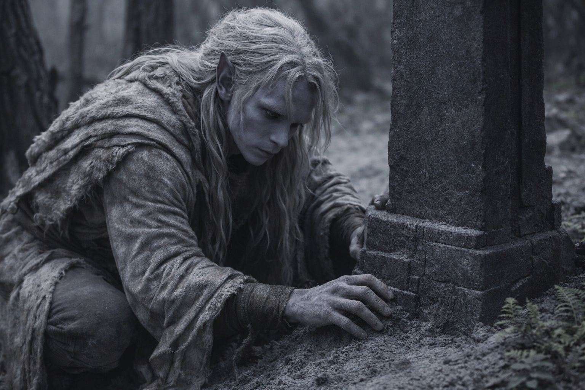
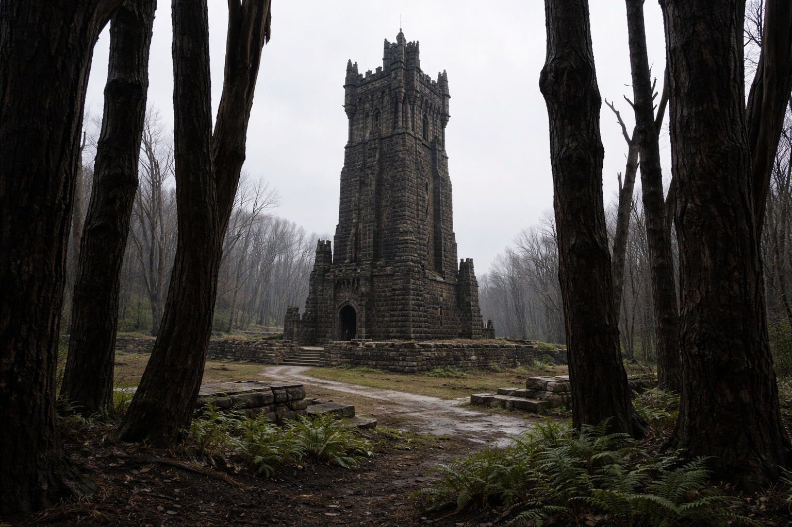
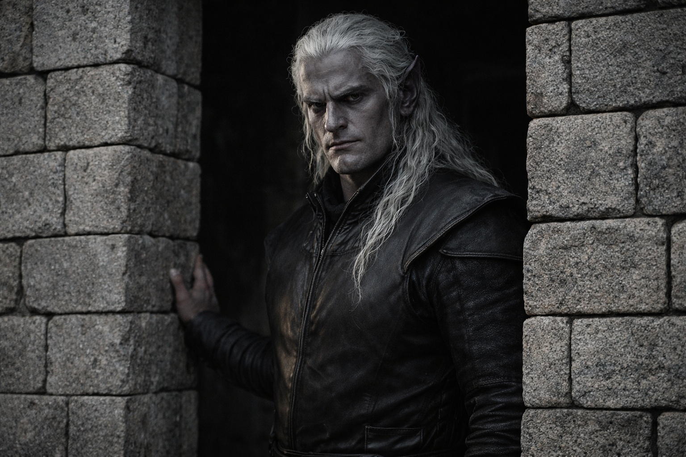
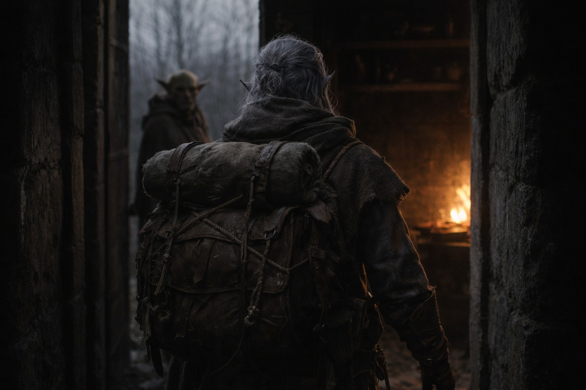

## Capítulo 27 | Parte 5 | El Otro Lado

---

Drusniel seguía girando al noroeste, incluso cuando había terreno más fácil en otra dirección.

Noroeste. A través de los campos de ceniza enfriándose donde la erupción había reconfigurado el terreno en crestas de nueva piedra, negra y vítrea y aún lo suficientemente caliente como para sentirla a través de las suelas de sus botas. Pasando los campos de placas donde los respiraderos térmicos siseaban vapor hacia un cielo que se despejaba más cuanto más se alejaban del núcleo volcánico. Hacia territorio que ninguno de ellos había mapeado, siguiendo un rumbo que Drusniel no podía justificar y no intentaba hacerlo.

Srietz se mantenía dos pasos detrás y a su izquierda. Elion caminaba más lejos, a la derecha. Habían preguntado una vez adónde iba; él solo había podido darles la dirección.

El paisaje cambió a medida que avanzaban al noroeste. Los campos de placas volcánicas dieron paso a terreno más antiguo, basalto erosionado hasta convertirse en suelo, vegetación arbustiva abriéndose paso a través de grietas donde siglos de ceniza se habían descompuesto en algo que podía sostener raíces. El aire se enfrió en incrementos. El olor a azufre se desvaneció. Para cuando coronaron la cresta que marcaba el límite entre la zona volcánica activa y lo que hubiera más allá, el aire olía a tierra y cosas verdes y ese olor metálico que precede a la lluvia.

Seguía sintiendo la atracción en el pecho. En cada giro, comprobaba su dirección con la cresta de delante.

La parte que debería haberle preocupado era lo poco que le preocupaba.

Algo en la cámara le había dado un destino. No sabía nada de él. Y allí estaba, guiando a los otros hacia ese lugar.

La Voz no había respondido en los túneles. Había salido leyendo la piedra y siguiendo el aire.

Había esperado sentir más alivio. Seguía debiéndole dos veces.

Los cristales en su mochila zumbaban. Más tenues ahora, lejos del núcleo de la montaña, pero aún presentes. Los sentía contra su columna a través del cuero, cálidos y vibrando a una frecuencia que parecía sintonizarse con sus pasos. Cada cristal que había cosechado de la cámara llevaba una fracción de la frecuencia de la montaña, y colectivamente producían algo que no amplificaba nada en él sino que suavizaba los bordes de la particular distorsión de Wyrmreach. Los colores se quedaban donde estaban. Las distancias se comportaban. La sutil desorientación que Wyrmreach alimentaba a los recién llegados y nunca dejaba de alimentar del todo era más silenciosa con los cristales cerca.

Una herramienta útil. Una dependencia peligrosa. Averiguaría cuál después.

—Srietz tiene una pregunta —dijo Srietz desde detrás de él.

—Una.

—Cuánto tiempo.

—No lo sé. —Sentía una dirección, no una distancia.

—Srietz ajustará sus expectativas a la baja —dijo—. Las expectativas de Srietz ya eran bajas.

El terreno cambió de nuevo. Cruzaron hacia lo que alguna vez había sido bosque, los árboles reducidos a troncos negros por alguna erupción anterior, el suelo entre ellos cubierto por una alfombra de ceniza gris y nuevo crecimiento luchando a través de ella. Helechos, mayormente. Plantas pequeñas y resistentes con hojas como cuero. La vida reafirmándose en el espacio entre catástrofes.

Un marcador de piedra.

Drusniel se agachó y apartó la ceniza de la base del mojón. Unos cortes encajados lo unían a una piedra de cimentación enterrada. Trabajo drow, la misma construcción que había visto en la visión.

El Null le presionó el pecho al inclinarse. Lo comprobó bajo la camisa. Seguía inerte. Los cristales de la mochila continuaban zumbando.

Se puso de pie y siguió caminando. La dirección se había estrechado de un rumbo general a una orientación específica, como si la brújula en su pecho hubiera ganado resolución. Noroeste se había convertido en este sendero, esta cresta, esta línea particular a través del bosque muerto.

Más allá de los árboles muertos se alzaba una torre de piedra. La reconoció antes de llegar al claro.

Los senderos estaban despejados y los muros reparados. Alguien había cortado la maleza hacía poco.

El cielo sobre la torre era gris pálido con lluvia sin caer. Lo había visto antes. En la cámara de cristal, a través de una visión que había llegado sin permiso y se había alojado en sus huesos sin consentimiento.

La puerta estaba abierta.

Un drow de hombros anchos estaba en la entrada, más alto y mayor que Drusniel. Tenía la piel de un gris ceniza azulado y los ojos negros. Los observó acercarse sin apartarse de la puerta.

—Eres el encargo de Zaelar —dijo Szoravel.

Drusniel se detuvo ante el escalón.

—Llegas tarde.

Szoravel miró la mochila. Los cristales zumbaban.

—Atravesaste la montaña. Deja los cristales en la mesa de dentro.

Drusniel se paró en el umbral. Sus piernas dolían. Sus codos estaban en carne viva. La sangre en su cara se había secado en una costra marrón que tiraba cuando movía la boca. Detrás de él, Srietz se había detenido seis pasos atrás, una mano en su bolsa de cinturón, evaluando la torre y a su ocupante con la sospecha concentrada de alguien cuya supervivencia había dependido de primeras impresiones acertadas.

Szoravel miró a Srietz. A Elion, más atrás, quieto como una respiración contenida. Luego de vuelta a Drusniel.

—Entra —dijo, y se hizo a un lado.

La puerta era oscura. El interior de la torre olía a piedra vieja y algo químico y la calidez seca particular de un fuego que ardía sin comportarse como fuego. Drusniel podía ver el borde de un espacio de trabajo, estantes, herramientas organizadas por un sistema que no reconocía.

Miró atrás una vez. Las orejas de Srietz estaban pegadas. Elion no se había movido. El bosque muerto se erguía detrás de ellos, y más allá los campos volcánicos, y más allá de esos la montaña que había atravesado, cargando cristales que zumbaban y una dirección que lo había traído aquí.

Entró.

---

**Fin del Capítulo 27.5  —> 28.1: [La Segunda Sangre: El Costo](/la-segunda-sangre-el-costo/)**
