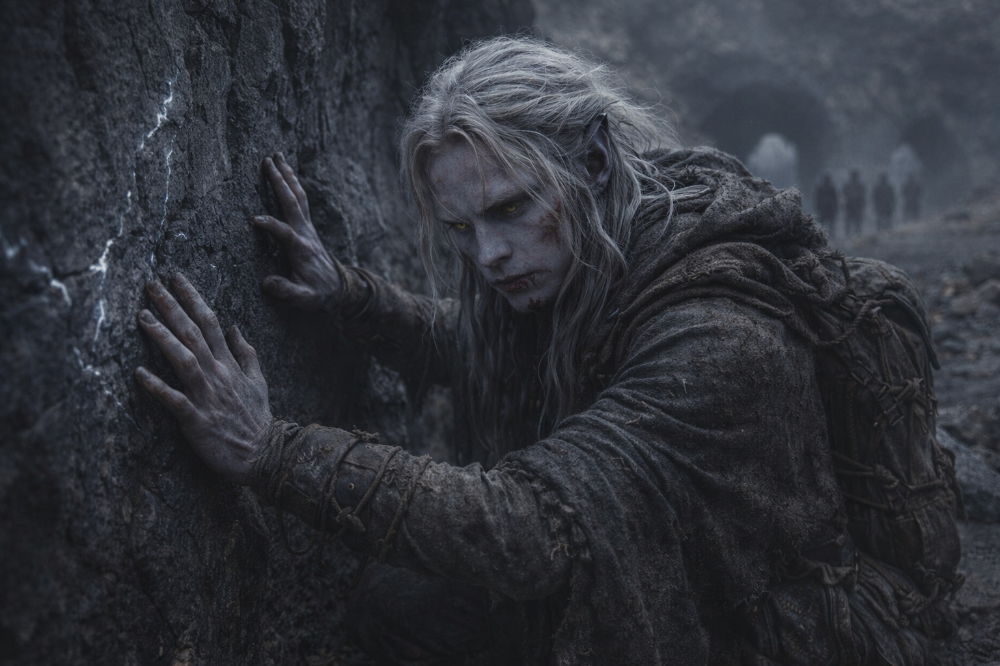
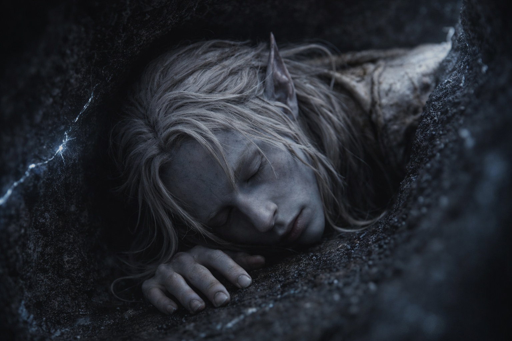
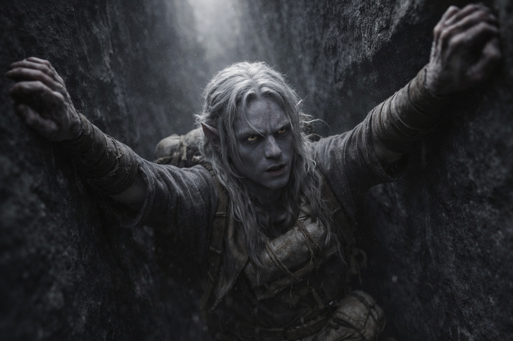
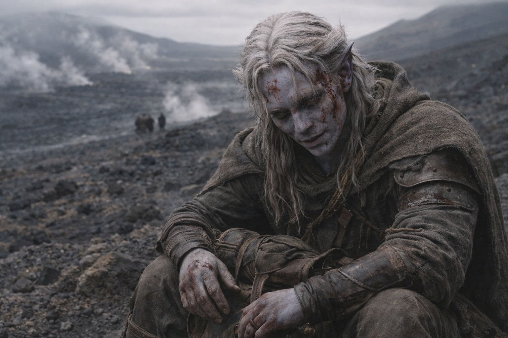
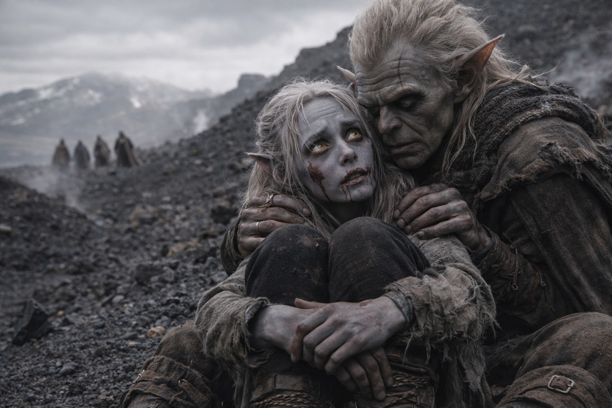

# Capítulo 27.4 | El Precio del Paso: El Regreso

---

El túnel por el que había venido había desaparecido. Sellado por calor y piedra caída, el pasaje reducido a una grieta demasiado estrecha para su brazo.

Se paró frente al bloqueo y dejó que sus dedos le dijeran lo que sus ojos ya sabían. El derrumbe era reciente, los bordes rotos afilados bajo las yemas de sus dedos, la piedra aún caliente por cualquier oleada térmica que hubiera derribado el techo. Polvo fino flotaba en el aire, capturando el tenue brillo azul-blanco de las venas de cristal detrás de él. El compuesto se había disipado por completo. Su cuerpo se movía a su propio ritmo, que era el ritmo de un hombre que había estado corriendo, trepando y sangrando dentro de un volcán durante horas, que era lento.

Se dio la vuelta.

El túnel noroeste estaba abierto. El aire que se movía a través de él era más fresco que cualquier cosa que hubiera sentido desde que entró en la montaña. Ese hecho era suficiente. Aire fresco significaba distancia del núcleo volcánico, y distancia del núcleo significaba más cerca de la superficie, y más cerca de la superficie significaba fuera. La lógica era lineal. Su cuerpo apreciaba lo lineal.

Caminó.

Sin los Caparazones de Fuego, la montaña era suya para leer solo. Su mano izquierda nunca dejó la pared. Cada diez pasos, se detenía, presionaba su palma plana contra la piedra y sentía. Temperatura. Vibración. La tenue presión del aire moviéndose a través de fisuras que no podía ver. Las grietas en el basalto le contaban historias si escuchaba con sus dedos en lugar de sus oídos. Donde las fracturas de estrés irradiaban desde un derrumbe, el camino estaba comprometido. Donde el grano corría liso e ininterrumpido, la piedra había sido estable durante siglos. Donde líneas delgadas de cristal veteaban la roca, la energía volcánica estaba más cerca. Donde las venas se reducían a nada, la superficie estaba más próxima.

Siguió el frío.

Los túneles se ramificaban. Tres veces en la primera hora, según su cálculo aproximado, y cada vez se detenía en la bifurcación, trazaba ambas paredes con ambas manos y elegía el pasaje donde el aire era más fresco contra el dorso de sus nudillos. En la segunda bifurcación, ambos túneles respiraban frío. Se agachó y presionó su mejilla contra el suelo de piedra de cada uno. El izquierdo llevaba una corriente que olía a azufre, tenue pero presente. El derecho no olía a nada. Eligió nada. Azufre significaba respiraderos. Respiraderos significaban actividad.

Los cristales en su mochila zumbaban en cada bifurcación, un cambio sutil de frecuencia que notaba sin comprender. No intentó comprenderlo. Lo notó. Lo archivó. Siguió caminando.

Su cuerpo estaba fallando de las maneras predecibles. Los músculos de sus pantorrillas se habían tensado más allá del punto de incomodidad y hacia el territorio donde cada paso requería negociación. Sus hombros dolían donde las correas de la mochila habían cortado el tejido que no había sido diseñado para horas de carga en túneles construidos para cosas sin omóplatos. Su rodilla derecha chasqueaba con cada zancada, un sonido como un clavo siendo golpeado en madera seca, regular y poco informativo. Desgaste. Fatiga. Nada estructural.

Siguió caminando.

El túnel ascendía. Gradualmente al principio, luego lo suficientemente empinado como para necesitar ambas manos y tener que apoyar su mochila contra la pared detrás de él para evitar que su peso lo jalara hacia atrás. Los cristales se desplazaron y chocaron unos contra otros en el cuero, cálidos contra su columna. La piedra bajo sus manos estaba fría. Realmente fría, no la frescura relativa de ligeramente-menos-caliente. Lo suficientemente fría como para que la humedad se condensara en su superficie e hiciera su agarre incierto.

Estaba cerca.

Un viento lo encontró. No la tenue diferencia de presión que había estado leyendo a través de grietas, sino una corriente propiamente dicha que empujaba contra su cara y traía consigo el olor de ceniza y tierra calcinada y algo debajo de esos, algo que era casi limpio. Aire exterior. Aire que había estado en un cielo y se había movido a través de una atmósfera y había tocado algo que no era piedra.

Lo siguió como un hombre ahogándose sigue la dirección de arriba.

El túnel se estrechó, luego se ensanchó, luego se estrechó de nuevo en un patrón que se sentía orgánico, como si el pasaje hubiera sido tallado por agua que ya no corría allí. Su mano encontró una cornisa. Se impulsó hacia arriba. Otra cornisa. Sus brazos temblaron. Se impulsó de nuevo. El viento crecía más fuerte con cada ascenso, y las venas de cristal en las paredes desaparecieron por completo, reemplazadas por basalto simple, oscuro y frío y bendecidamente ordinario.

Luz.

No el azul-blanco de la luminiscencia cristalina ni el rojo del calor volcánico. Luz gris. Difusa y plana y llegando de una dirección que era inequívocamente arriba. Luz del día filtrada a través de la piedra, encontrando su camino hacia abajo a través de grietas y huecos en la superficie de la montaña, apenas suficiente para ver pero suficiente para saber que el cielo estaba allí, sobre él, alcanzable.

Trepó hacia ella. El pasaje se empinó hasta convertirse en una chimenea casi vertical, y apoyó su espalda contra una pared y sus pies contra la otra y empujó hacia arriba, centímetro a centímetro, la mochila en su pecho ahora, los cristales presionando cálidos contra sus costillas. Sus brazos ardían. Sus piernas temblaban. La luz se intensificaba con cada cuerpo de altitud, y el viento empujaba hacia abajo a su alrededor como si la montaña lo estuviera exhalando.

La apertura era estrecha. Se giró de lado, empujó la mochila primero, luego siguió, la piedra raspando su pecho y espalda y tirando de su ropa, y entonces el cielo estaba allí. Sobre él. A su alrededor. Una extensión gris de nubes que se estiraba en todas direcciones y no contenía nada más extraordinario que nubes, y se paró en la ladera de la montaña y respiró aire que sabía a ceniza y distancia y dejó que sus piernas se doblaran hasta que estaba sentado sobre la grava volcánica con su mochila entre las rodillas.

El mundo fuera de la montaña estaba sin cambios. Los campos de placas volcánicas se extendían en todas direcciones, grises y enfriándose, la evidencia de la erupción reciente visible en flujos frescos que habían reconfigurado el terreno que había estudiado desde arriba. Vapor se elevaba de fisuras en la nueva piedra. El aire era acre y cálido pero un cálido diferente, del tipo que venía de arriba en lugar de abajo.

Su nariz estaba costra de sangre seca. Sus codos estaban en carne viva. Sus manos estaban firmes, aunque no podría haber dicho por qué. Algo sobre los cristales contra su cuerpo, o la dirección alojada en su pecho, o el simple hecho de estar vivo cuando la montaña había ofrecido varias alternativas.

Movimiento abajo. En la ladera debajo de él, donde el terreno se nivelaba en la repisa donde habían acampado antes del cruce, una pequeña figura verde estaba corriendo. Piernas demasiado cortas para la zancada que intentaban, brazos bombeando, equipo rebotando, moviéndose cuesta arriba con la gracilidad desesperada de alguien que había estado observando una entrada de túnel durante horas y había dejado de esperar algo bueno.

Srietz lo alcanzó sin aliento y con los ojos desorbitados. Sus manos encontraron sus hombros y apretaron, luego soltaron, luego apretaron de nuevo, como confirmando solidez.

—¿Qué pasó? —Su voz estaba en un tono alto. Sus orejas estaban pegadas a su cráneo.

Drusniel parpadeó contra la luz del día. La grisura del cielo nublado se sentía cegadora después de los túneles. Detrás de él, en su mochila, los cristales zumbaban.

—Encontré cristales —dijo—. Y sé dónde está Szoravel.

—¿Cómo?

Drusniel se limpió la nariz. La sangre seca se descascaró bajo sus dedos, marrón y quebradiza.

—No puedo explicarlo. Pero lo sé.

Las orejas de Srietz se aplanaron aún más, lo cual él no había creído posible. Sus ojos saltaron de su cara a su mochila a la entrada del túnel detrás de él y de vuelta.

—Srietz no encuentra eso tranquilizador.

—Yo tampoco —dijo Drusniel.

---

*Siguiente: El Precio del Paso: El Otro Lado*

**Fin del Capítulo 27.4 — continúa en el Capítulo 27.5: [El Precio del Paso: El Otro Lado](/el-precio-del-paso-el-otro-lado/)**
