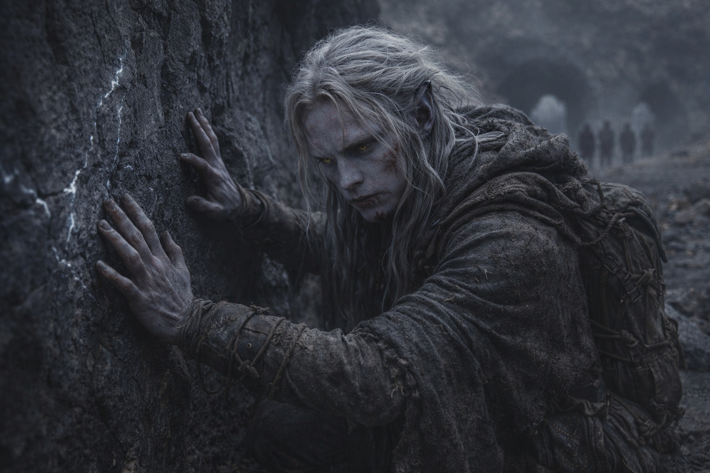
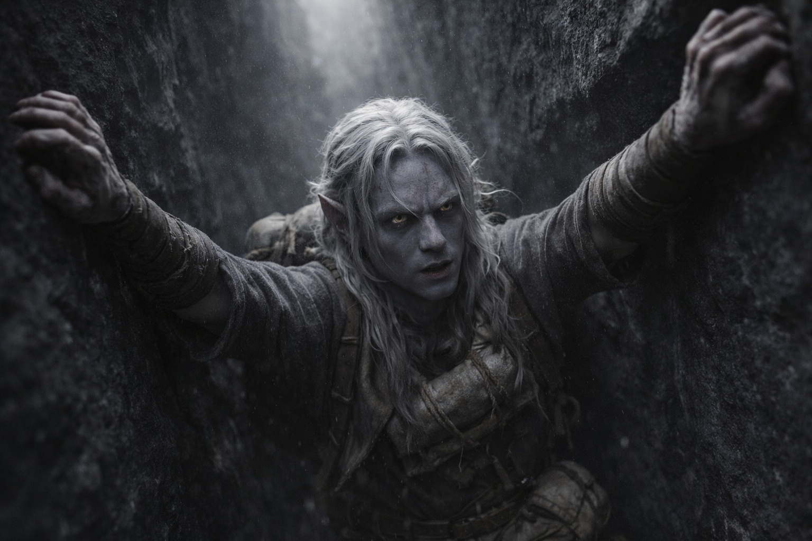
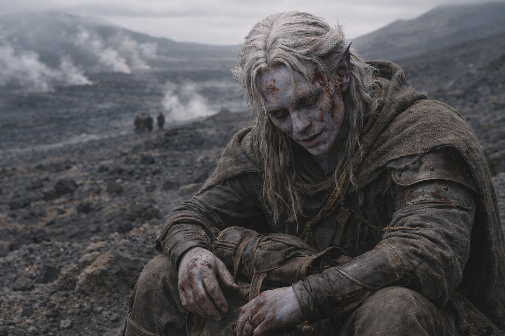

## Capítulo 27 | Parte 4 | El Regreso

---

Un pasaje lateral volvía hacia la ruta por la que había entrado. Fue a comprobarlo y encontró el paso sellado por un derrumbe.

Se paró frente al bloqueo y dejó que sus dedos le dijeran lo que sus ojos ya sabían. El derrumbe era reciente, los bordes rotos afilados bajo las yemas de sus dedos, la piedra aún caliente por cualquier oleada térmica que hubiera derribado el techo. Polvo fino flotaba en el aire, capturando el tenue brillo azul-blanco de las venas de cristal detrás de él. El compuesto se había disipado por completo. Su cuerpo se movía a su propio ritmo, que era el ritmo de un hombre que había estado corriendo, trepando y sangrando dentro de un volcán durante horas, que era lento.

Se dio la vuelta.

Volvió al túnel del noroeste. Corría aire fresco por él. Esperaba que lo llevara a la superficie.

Caminó.

Sin los Escoricáscaras, la montaña era suya para leer solo. Su mano izquierda nunca dejó la pared. Cada diez pasos, se detenía, presionaba su palma plana contra la piedra y sentía. Temperatura. Vibración. La tenue presión del aire moviéndose a través de fisuras que no podía ver. Las grietas en el basalto le contaban historias si escuchaba con sus dedos en lugar de sus oídos. Donde las fracturas de estrés irradiaban desde un derrumbe, el camino estaba comprometido. Donde el grano corría liso e ininterrumpido, la piedra había sido estable durante siglos. Donde líneas delgadas de cristal veteaban la roca, la energía volcánica estaba más cerca. Donde las venas se reducían a nada, la superficie estaba más próxima.

Siguió el frío.

Los túneles se ramificaban. Tres veces en la primera hora, según su cálculo aproximado, y cada vez se detenía en la bifurcación, trazaba ambas paredes con ambas manos y elegía el pasaje donde el aire era más fresco contra el dorso de sus nudillos. En la segunda bifurcación, ambos túneles respiraban frío. Se agachó y presionó su mejilla contra el suelo de piedra de cada uno. El izquierdo llevaba una corriente que olía a azufre, tenue pero presente. El derecho no olía a nada. Eligió nada. Azufre significaba respiraderos. Respiraderos significaban actividad.

En cada cruce cambiaba el zumbido. Siguió eligiendo por el aire y la piedra.

Se le acalambraron las pantorrillas. Las correas le rozaban los hombros en carne viva y la rodilla derecha chasqueaba cada vez que la estiraba. Acortó el paso.

Siguió caminando.

El túnel ascendía. Gradualmente al principio, luego lo suficientemente empinado como para necesitar ambas manos y tener que apoyar su mochila contra la pared detrás de él para evitar que su peso lo jalara hacia atrás. Los cristales se desplazaron y chocaron unos contra otros en el cuero, cálidos contra su columna. La piedra bajo sus manos estaba fría. Realmente fría, no la frescura relativa de ligeramente-menos-caliente. Lo suficientemente fría como para que la humedad se condensara en su superficie e hiciera su agarre incierto.

Estaba cerca.

Una corriente más fuerte le golpeó la cara. Traía ceniza y olor a tierra quemada. Aire del exterior.

Trepó hacia ella.

El túnel se estrechó, luego se ensanchó, luego se estrechó de nuevo en un patrón que se sentía orgánico, como si el pasaje hubiera sido tallado por agua que ya no corría allí. Su mano encontró una cornisa. Se impulsó hacia arriba. Otra cornisa. Sus brazos temblaron. Se impulsó de nuevo. El viento crecía más fuerte con cada ascenso, y las venas de cristal en las paredes desaparecieron por completo, reemplazadas por basalto simple, oscuro y frío y bendecidamente ordinario.

Luz.

La luz gris del día se filtraba por las grietas de arriba. Podía ver la siguiente cornisa.

Trepó hacia ella. El pasaje se empinó hasta convertirse en una chimenea casi vertical, y apoyó su espalda contra una pared y sus pies contra la otra y empujó hacia arriba, centímetro a centímetro, la mochila en su pecho ahora, los cristales presionando cálidos contra sus costillas. Sus brazos ardían. Sus piernas temblaban. La luz se intensificaba con cada cuerpo de altitud, y el viento empujaba hacia abajo a su alrededor como si la montaña lo estuviera exhalando.

Pasó primero la mochila por la abertura y luego se escurrió detrás. La piedra le raspó la espalda. Ya fuera, se sentó en la grava con la mochila entre las rodillas y alzó la vista hacia las nubes.

El mundo fuera de la montaña estaba sin cambios. Los campos de placas volcánicas se extendían en todas direcciones, grises y enfriándose, la evidencia de la erupción reciente visible en flujos frescos que habían reconfigurado el terreno que había estudiado desde arriba. Vapor se elevaba de fisuras en la nueva piedra. El aire era acre y cálido pero un cálido diferente, del tipo que venía de arriba en lugar de abajo.

Su nariz estaba costra de sangre seca. Sus codos estaban en carne viva. Sus manos estaban firmes, aunque no podría haber dicho por qué. Algo sobre los cristales contra su cuerpo, o la dirección alojada en su pecho, o el simple hecho de estar vivo cuando la montaña había ofrecido varias alternativas.

Movimiento abajo. En la ladera debajo de él, donde el terreno se nivelaba en la repisa donde habían acampado antes del cruce, una pequeña figura verde estaba corriendo. Piernas demasiado cortas para la zancada que intentaban, brazos bombeando, equipo rebotando, moviéndose cuesta arriba con la gracilidad desesperada de alguien que había estado observando una entrada de túnel durante horas y había dejado de esperar algo bueno.

Srietz llegó sin aliento y lo agarró por los hombros.

—¿Qué pasó? —Tenía las orejas pegadas al cráneo.

Drusniel parpadeó contra la luz del día. La grisura del cielo nublado se sentía cegadora después de los túneles. Detrás de él, en su mochila, los cristales zumbaban.

—Encontré cristales —dijo—. Y sé dónde está Szoravel.

—¿Cómo?

Drusniel se limpió la nariz. La sangre seca se descascaró bajo sus dedos, marrón y quebradiza.

—No puedo explicarlo. Pero lo sé.

Srietz miró la sangre seca, la mochila y luego la abertura a su espalda.

—Srietz no encuentra eso tranquilizador.

—Yo tampoco —dijo Drusniel.

---

**Fin del Capítulo 27.4  —> 27.5: [El Precio del Paso: El Otro Lado](/el-precio-del-paso-el-otro-lado/)**
