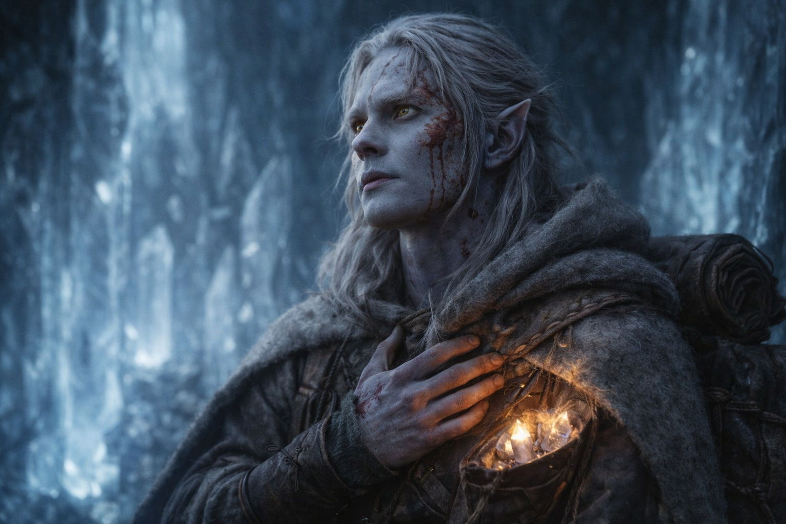
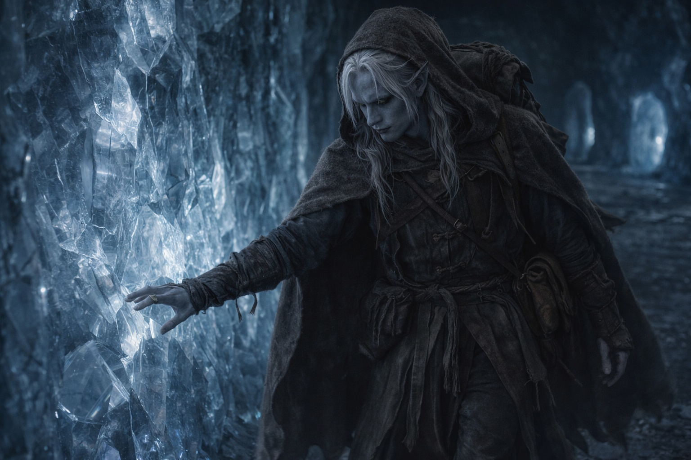

## Capítulo 27 | Parte 3 | El Zumbido

---

Los cristales chocaron entre sí cuando bajó la mochila.

Se sentó contra la pared. La nariz había dejado de sangrar, pero aún notaba el sabor de la sangre y no sentía las yemas de los dedos.

Con siete cristales en la mochila, podía soportar el zumbido de la cámara. Los mantuvo cerca.

Necesitaba otra salida antes de la siguiente erupción. Primero tenía que dejar de temblarle las piernas.

Así que se sentó, y los cristales zumbaron, y la visión llegó sin aviso.

La pared de cristal desapareció. Todavía la sentía contra la espalda, pero ahora veía luz del día.

Una torre. Piedra, antigua, mantenida con el cuidado deliberado de alguien que la había estado manteniendo durante generaciones. La mampostería era trabajo drow. Reconoció la técnica de juntas, cómo los bloques se entrelazaban sin mortero, cada piedra cortada para distribuir la carga a través de fricción y geometría en lugar de adhesivo. El tipo de trabajo que requería o siglos de conocimiento institucional o un solo artesano que había tenido siglos para perfeccionar el método.

El cielo sobre la torre era pálido. No la bruma sulfurosa del interior de Wyrmreach, no el resplandor perpetuo de los campos volcánicos. Un cielo que tenía clima. Las nubes se movían a través de él, grises y delgadas, cargando lluvia que aún no había caído. Más allá de la torre, la tierra estaba cuidada. No cultivada. Mantenida. Senderos despejados de escombros, muros de piedra reparados en sus cimas donde la escarcha los agrietaría, canales de drenaje mantenidos abiertos a través de maleza que alguien había cortado dentro de la temporada.

Alguien estaba en la entrada de la torre. No distinguía su cara.

Noroeste. La dirección le llegó con tanta claridad como la torre, aunque nada de lo que veía podía indicarle dónde estaba.

Otros fragmentos. El interior de la torre, vislumbrado como a través de una ventana que pasaba a velocidad. Estantes de materiales organizados por un sistema que no reconocía. Un espacio de trabajo. Herramientas que parecían alquímicas y herramientas que parecían quirúrgicas y herramientas que parecían nada para lo que tuviera una palabra. Un fuego que ardía sin combustible visible en un hogar construido según especificaciones que ninguna arquitectura estándar produciría.

La figura apareció más cerca. Drusniel se esforzó por verle la cara, pero la imagen no se aclaró.

Entonces terminó. La cámara se reafirmó a su alrededor. Paredes de cristal. Zumbido. El olor de minerales y aire antiguo atrapado. Su mochila contra su espalda, los cristales vibrando suavemente contra su columna a través del cuero.

Seguía sentado donde había estado. Sus ojos estaban húmedos. No sabía cuándo había sucedido eso ni qué significaba, y no intentó averiguarlo. Los limpió como se había limpiado la sangre, con el dorso de la mano, y el gesto fue suficiente.

La dirección permaneció al terminar la visión. Noroeste. Giró la cabeza para comprobarlo. La atracción no cambió.

No lo cuestionó. No porque confiara en visiones, ni en cristales, ni en la montaña, ni en lo que fuera que lo había mirado desde una dirección que no debería existir. No lo cuestionó porque la alternativa era sentarse en una cámara de cristal debajo de un volcán esperando a que la próxima erupción terminara lo que la última había empezado, y una dirección, cualquier dirección, era mejor que eso.

Se levantó demasiado deprisa y tuvo que apoyarse en la pared. Cuando recuperó el equilibrio, examinó las salidas.

Siguió el borde de la cámara, buscando aberturas con las manos y comprobando la piedra a su alrededor.

Tres túneles salían de la cámara. Dos corrían aproximadamente hacia el sur, de vuelta hacia los pasajes de donde había venido. El tercero corría hacia el noroeste.

Presionó su palma contra la piedra en la boca del túnel noroeste. Aire fresco se movió contra su piel desde algún lugar adelante, empujando a través de las grietas en un flujo constante que significaba conexión con un espacio más grande. La temperatura era más baja que la de la cámara. La piedra aquí era más antigua, las venas de cristal más delgadas, lo que significaba que la actividad volcánica era más débil en esa dirección. Piedra más fría, menos cristal, más lejos de la fuente.

Noroeste. Hacia la torre y la figura que esperaba y el cielo que tenía clima.

Se echó la mochila al hombro y entró en el túnel del noroeste. Los cristales zumbaban contra su espalda.

Estaba solo en la montaña con una dirección que no podía explicar y una mochila llena de cristales cálidos y una hemorragia nasal que se había secado marrón en su cara. En algún lugar sobre él, Srietz contaba minutos y se quedaba sin optimismo. En algún lugar adelante, una torre esperaba en un lugar al que la bruma volcánica no podía llegar.

Caminó. Sus dedos trazaron la pared del túnel. Las grietas le dijeron que el camino era sólido.

---

**Fin del Capítulo 27.3  —> 27.4: [El Precio del Paso: El Regreso](/el-precio-del-paso-el-regreso/)**
