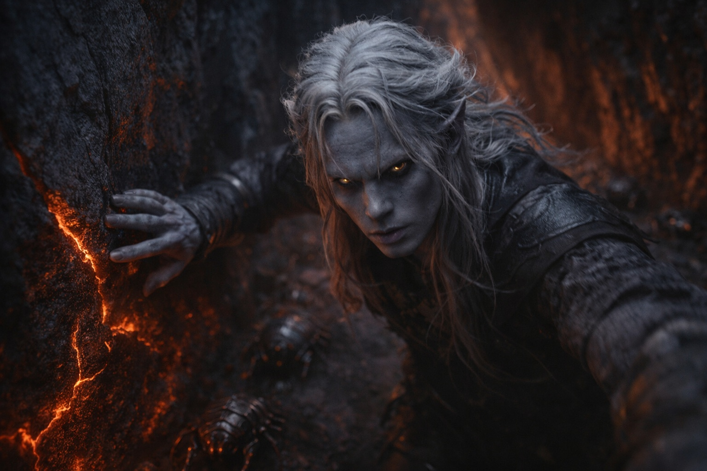
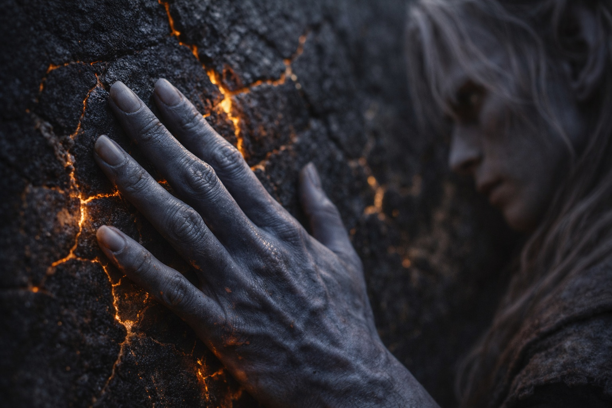
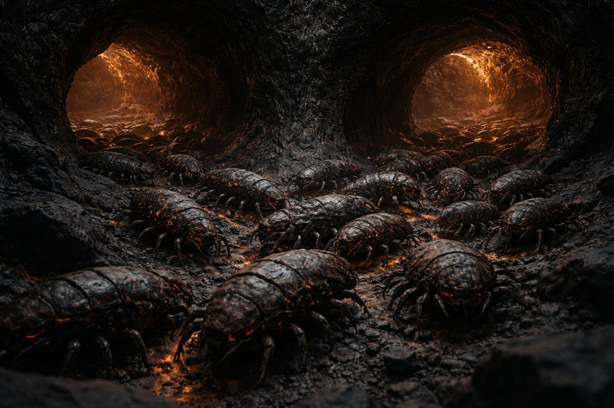
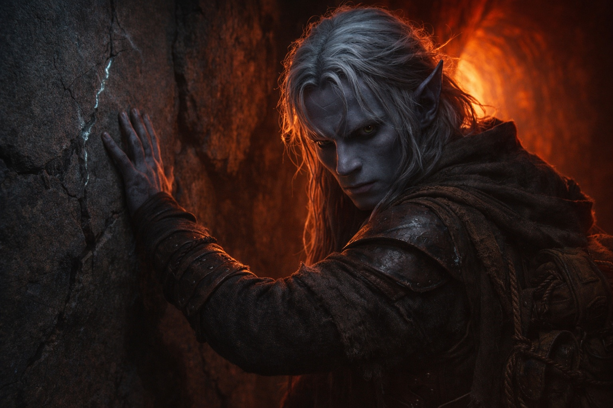

# Capítulo 27.1 | El Precio del Paso: La Boca

---

La oscuridad tenía peso. La sintió asentarse sobre sus hombros en el momento en que el túnel curvó y la luz de la entrada murió.

El compuesto de velocidad convirtió la oscuridad en datos. Sus oídos se volvieron instrumentos. Los Caparazones de Fuego delante de él producían una percusión estratificada: patas blindadas sobre basalto, placas de caparazón desplazándose mientras los cuerpos se comprimían a través de huecos estrechos, el chasquido húmedo de mandíbulas probando la temperatura del aire. Docenas de ellos, moviéndose rápido, y Drusniel corría detrás con su mano izquierda rozando la pared del túnel, los dedos leyendo la piedra.

Fractura ancha, vertical, depósitos minerales en la grieta. Antigua. Estable. La pared aquí había sobrevivido siglos de ciclos térmicos. Buena piedra.

El túnel descendía en un ángulo que se empinaba a medida que avanzaba, cada zancada llevándolo más profundo dentro de la montaña. El calor aumentaba en gradientes que podía medir por el sudor en sus antebrazos. Cálido. Más cálido. La piedra bajo sus dedos pasó de fría a temperatura corporal en treinta pasos.

Contó. Tres minutos desde que la ventana se abrió. Srietz había estimado entre once y trece. El pico del compuesto duraría ocho.

Los Caparazones de Fuego lo guiaron a través de una bifurcación donde tres túneles convergían. No dudaron. La mayoría fluyó hacia la izquierda y abajo, sus cuerpos blindados creando una corriente viva que raspaba las paredes con un sonido como cadenas arrastradas sobre pizarra. Drusniel siguió. Sus dedos encontraron la pared del túnel izquierdo y la trazaron. Fracturas horizontales, depósitos en capas, grano apretado. La piedra aquí estaba comprimida, portante, la arquitectura profunda de una montaña que había pasado milenios aprendiendo a sostener su propio peso.

Seis minutos.

El pasaje se estrechó. Sus hombros rozaban ambas paredes. Se giró de lado y empujó, la piedra caliente presionando contra su pecho y espalda, y sus dedos nunca abandonaron la pared junto a su cara. El patrón de fractura cambió. Grano más fino. Menos depósitos. La piedra aquí era más joven, depositada por flujos más recientes, lo que significaba que estaba menos probada.

Lo archivó y siguió moviéndose.

Los Caparazones de Fuego fluían a través de huecos que no deberían haber admitido nada más grande que un puño, sus cuerpos segmentados comprimiéndose con una eficiencia que parecía líquido vertido por grietas. El cuerpo de Drusniel no se comprimía. Empujó a través de espacios que le arrancaron piel de los codos y dejaron arenilla volcánica entre sus dientes, y el compuesto mantuvo su pulso sin dispararse hacia el pánico porque la química en su sangre no tenía opinión sobre espacios estrechos, solo sobre velocidad.

Siete minutos.

El túnel se abrió. No gradualmente. Las paredes cayeron a ambos lados y el techo desapareció hacia arriba en una oscuridad que sus ojos agudizados por la poción no podían resolver, y el sonido cambió, sus pisadas de repente haciendo eco contra superficies lo suficientemente lejanas como para que el retraso le dijera que la cámara era grande. Quizás cuarenta pasos de ancho. Quizás más.

Los Caparazones de Fuego se esparcieron por el suelo como mercurio derramado, algunos continuando por salidas más pequeñas, otros enrollándose contra las paredes en los grupos que había aprendido a interpretar como comportamiento de descanso. El calor aquí era menor. No cómodo. Sobrevivible.

Venas de cristal en las paredes capturaban cualquier rastro de luz que sus ojos adaptados a la oscuridad pudieran encontrar. Líneas delgadas de algo que no era exactamente reflectante, más como si la piedra estuviera atravesada por un material que sostenía la luz de manera diferente al basalto. Las venas se adentraban más profundo en la montaña, ramificándose y convergiendo, siguiendo un patrón que sus dedos querían trazar.

Nueve minutos.

El suelo tembló.

No la oleada lenta de presión acumulándose hacia la liberación. Una sacudida aguda desde abajo, repentina, como si algo dentro de la montaña hubiera cambiado de posición. Los Caparazones de Fuego se congelaron a media zancada. Todos ellos. Sus cuerpos se pusieron rígidos sobre la piedra, antenas presionadas planas, una quietud colectiva que comunicaba una sola palabra en un lenguaje hecho de ausencia.

Mal.

Una segunda sacudida. Más fuerte. Polvo cayó desde la oscuridad de arriba, partículas finas que se le atraparon en la garganta y sabían a azufre y algo metálico. Una de las venas de cristal en la pared más cercana se agrietó, un sonido limpio como un diapasón golpeado, y una línea delgada como un cabello apareció en su superficie.

Los Caparazones de Fuego comenzaron a excavar.

No la retirada medida que había observado desde la superficie. Esto era frenético. Cuerpos blindados se metieron en huecos entre rocas, en grietas, en cualquier espacio que los aceptara. En segundos el suelo de la cámara estaba vacío excepto por Drusniel y la arenilla aún asentándose desde arriba.

Tenía tiempo. Minutos, al menos. El ciclo no debía alcanzar su pico hasta dentro de tres o cuatro minutos más.

El túnel detrás de él brilló.

Luz roja trepó por el pasaje por el que había venido, no llamas sino el calor mismo haciéndose visible, las paredes de piedra irradiando energía que convertía el aire en algo espeso y tembloroso. La temperatura en la cámara saltó. Diez grados. Veinte. Su piel expuesta cosquilleó, luego ardió.

El ciclo de respiración se había roto. La montaña estaba exhalando temprano, desde canales que no deberían haber estado activos todavía, y la ruta que había tomado para entrar se estaba llenando de energía térmica que convertiría el tejido en carbón antes de que el fuego lo alcanzara.

Buscó la Voz.

El movimiento fue involuntario. Un reflejo tallado en él por meses de crisis, la parte de su mente que había aprendido a esperar una respuesta en la oscuridad. Como buscar una barandilla al borde de una caída. Su consciencia se desplazó hacia adentro, hacia el lugar donde vivía la presencia, el espacio frío detrás de sus pensamientos donde algo había hablado antes.

Nada. No silencio, porque el silencio implicaba una habitación que se había quedado callada. Esto era más vacío. El espacio mismo era hueco, como si lo que lo había ocupado hubiera desaparecido hacía tanto que las paredes habían olvidado su forma.

Estaba solo en la montaña, y la montaña se estaba cerrando.

Si fallaba aquí, Nyxara calcularía la pérdida y seguiría adelante. El pensamiento era frío y útil.

El brillo rojo en el túnel detrás de él se intensificó. Podía sentir su calor contra su espalda, una presión física que se volvería insoportable en minutos. El compuesto estaba empezando a disiparse. También podía sentir eso, un ablandamiento en los bordes de su percepción, la claridad cortante empezando a difuminarse.

Drusniel se volvió hacia la pared de la cámara. Dos grietas corrían desde las venas de cristal hacia piedra más profunda. Sus dedos trazaron ambas.

La grieta izquierda corría hacia arriba, delgada y ramificada, y aire fresco presionaba contra sus yemas desde algún lugar arriba. Conexión con la superficie. Una ruta de escape, quizás, si los pasajes eran lo suficientemente anchos y la piedra aguantaba y la erupción no los sellaba antes de que alcanzara el aire libre.

La grieta derecha se adentraba más profundo en la montaña. Ancha. Cálida. Siguiendo la dirección en que los Caparazones de Fuego habían huido.

Sigue a los pequeños.

Los escritos de las cuevas de otra vida. Instrucciones dejadas por alguien que había sobrevivido esto, o instrucciones dejadas por alguien que había observado a otros intentarlo. No sabía cuál. No importaba. Los Caparazones de Fuego habían ido profundo, y los Caparazones de Fuego seguían vivos después de mil veces mil erupciones.

Eligió más profundo. La luz roja detrás de él llenó la cámara y convirtió su sombra en algo largo y huyendo.

---

*Siguiente: El Precio del Paso: Las Profundidades*

**Fin del Capítulo 27.1 — continúa en el Capítulo 27.2: [El Precio del Paso: Las Profundidades](/el-precio-del-paso-las-profundidades/)**
