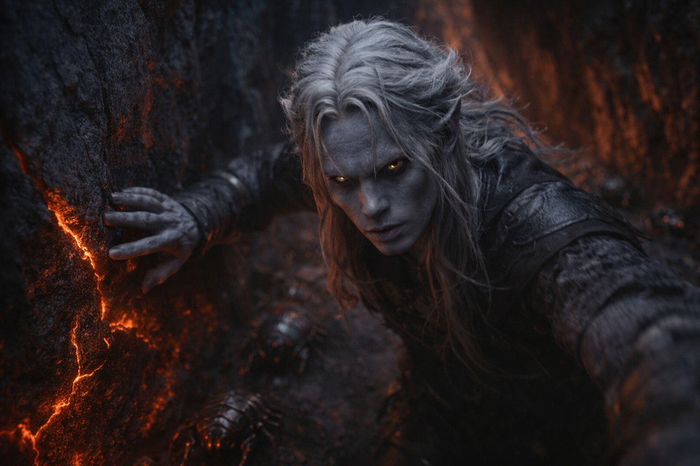
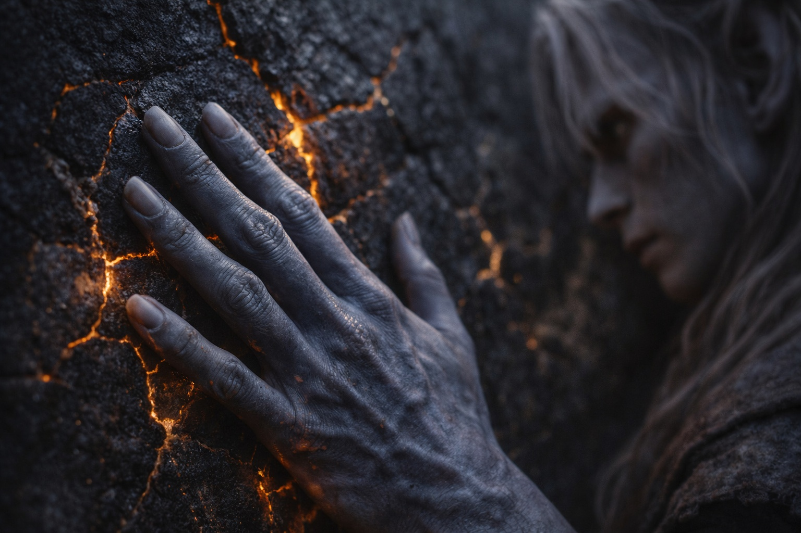
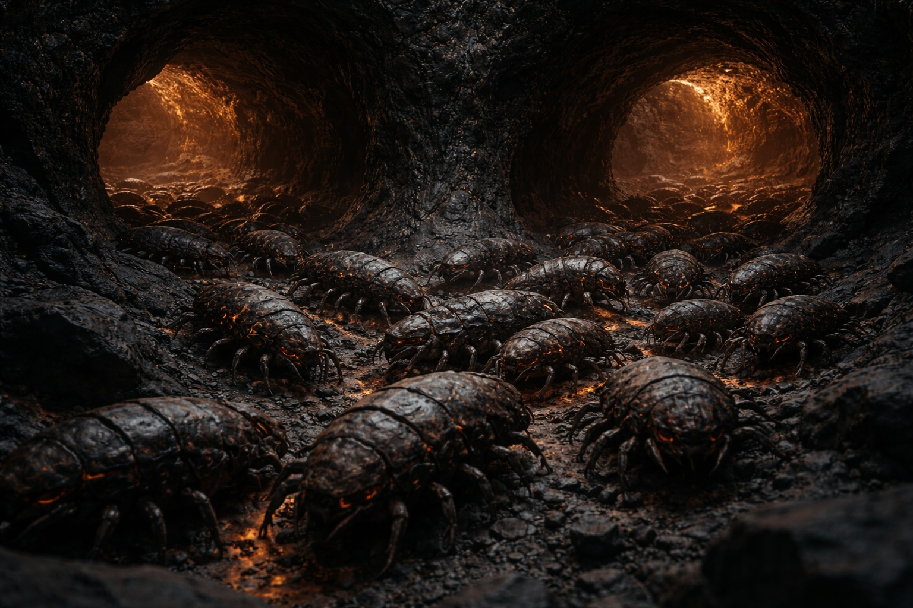
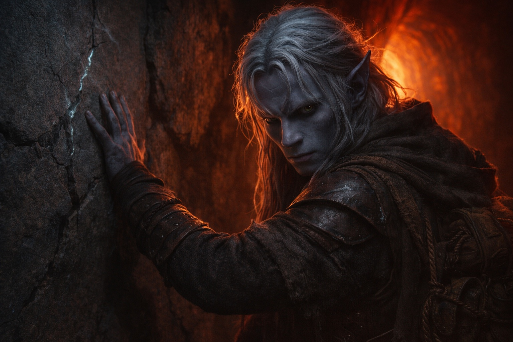

## Capítulo 27 | Parte 1 | La Boca

---

La luz de la entrada desapareció al doblar el recodo. Mantuvo la mano contra la pared.

El compuesto de velocidad le agudizaba el oído. Distinguía las patas de los Escoricáscaras raspando el basalto de los chasquidos de sus caparazones. Docenas corrían delante de él. Los siguió, tanteando la piedra con las yemas.

Fractura ancha, vertical, depósitos minerales en la grieta. Antigua. Estable. La pared aquí había sobrevivido siglos de ciclos térmicos. Buena piedra.

El túnel se hizo más empinado. El sudor le corría por los antebrazos y, en treinta pasos, la pared estaba caliente bajo su mano.

Tres minutos desde que había comenzado el periodo de enfriamiento. Srietz había calculado entre once y catorce. El efecto máximo del compuesto duraría ocho.

En una bifurcación de tres túneles, la mayoría de los Escoricáscaras giró a la izquierda y hacia abajo. Drusniel los siguió. Las fracturas de esta pared eran estrechas y estaban llenas de depósitos minerales. Podía apoyar su peso en ella.

Seis minutos.

El pasaje se estrechó. Sus hombros rozaban ambas paredes. Se giró de lado y empujó, la piedra caliente presionando contra su pecho y espalda, y sus dedos nunca abandonaron la pared junto a su cara. El patrón de fractura cambió. Grano más fino. Menos depósitos. La piedra aquí era más joven, depositada por flujos más recientes, lo que significaba que estaba menos probada.

Lo archivó y siguió moviéndose.

Los Escoricáscaras comprimían sus cuerpos segmentados por huecos apenas mayores que su puño. Drusniel tenía que buscar aberturas más grandes. Incluso esas le dejaban los codos en carne viva. Seguía moviéndose antes de pensar en la posibilidad de quedar atrapado.

Siete minutos.

El túnel se abrió. No gradualmente. Las paredes cayeron a ambos lados y el techo desapareció hacia arriba en una oscuridad que sus ojos agudizados por la poción no podían resolver, y el sonido cambió, sus pisadas de repente haciendo eco contra superficies lo suficientemente lejanas como para que el retraso le dijera que la cámara era grande. Quizás cuarenta pasos de ancho. Quizás más.

Los Escoricáscaras se dispersaron. Algunos tomaron salidas más pequeñas; otros se acurrucaron contra las paredes. La cámara estaba más fresca que el túnel. Aquí podía respirar.

Una luz tenue se veía en las vetas de cristal de las paredes. Se ramificaban y volvían a unirse hacia el interior de la montaña.

Nueve minutos.

El suelo tembló.

La sacudida llegó desde abajo y le hizo doblar las rodillas. Todos los Escoricáscaras se detuvieron, con las antenas pegadas al cuerpo.

Mal.

Una segunda sacudida. Más fuerte. Polvo cayó desde la oscuridad de arriba, partículas finas que se le atraparon en la garganta y sabían a azufre y algo metálico. Una de las venas de cristal en la pared más cercana se agrietó, un sonido limpio como un diapasón golpeado, y una línea delgada como un cabello apareció en su superficie.

Los Escoricáscaras comenzaron a excavar.

No la retirada medida que había observado desde la superficie. Esto era frenético. Cuerpos blindados se metieron en huecos entre rocas, en grietas, en cualquier espacio que los aceptara. En segundos el suelo de la cámara estaba vacío excepto por Drusniel y la arenilla aún asentándose desde arriba.

Tenía tiempo. Minutos, al menos. El ciclo no debía alcanzar su pico hasta dentro de tres o cuatro minutos más.

El túnel detrás de él brilló.

Las paredes del pasaje brillaban en rojo. El aire temblaba sobre la piedra y el calor le quemaba la piel descubierta.

La erupción había empezado antes de tiempo. No podía regresar por ese túnel.

Buscó la Voz.

No había querido hacerlo. Aun así, esperó las palabras, igual que cuando Srietz cayó.

No hubo respuesta.

Estaba solo en la montaña, y la montaña se estaba cerrando.

Si fallaba aquí, Nyxara calcularía la pérdida y seguiría adelante. El pensamiento era frío y útil.

El brillo rojo en el túnel detrás de él se intensificó. Podía sentir su calor contra su espalda, una presión física que se volvería insoportable en minutos. El compuesto estaba empezando a disiparse. También podía sentir eso, un ablandamiento en los bordes de su percepción, la claridad cortante empezando a difuminarse.

Drusniel se volvió hacia la pared de la cámara. Dos grietas corrían desde las venas de cristal hacia piedra más profunda. Sus dedos trazaron ambas.

La grieta izquierda corría hacia arriba, delgada y ramificada, y aire fresco presionaba contra sus yemas desde algún lugar arriba. Conexión con la superficie. Una ruta de escape, quizás, si los pasajes eran lo suficientemente anchos y la piedra aguantaba y la erupción no los sellaba antes de que alcanzara el aire libre.

La grieta derecha se adentraba más profundo en la montaña. Ancha. Cálida. Siguiendo la dirección en que los Escoricáscaras habían huido.

Sigue a los pequeños.

Recordó la inscripción de la cueva. No sabía quién la había dejado, pero los Escoricáscaras habían ido más adentro. Ya habían sobrevivido a esto.

Tomó el pasaje más profundo antes de que el calor lo alcanzara.

---

**Fin del Capítulo 27.1  —> 27.2: [El Precio del Paso: Las Profundidades](/el-precio-del-paso-las-profundidades/)**
