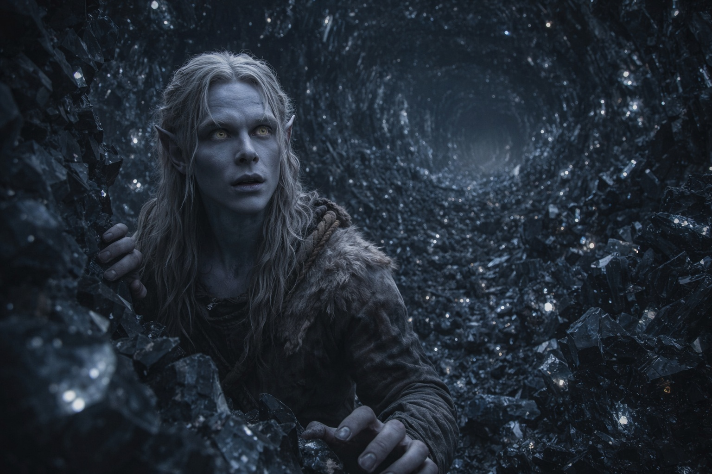
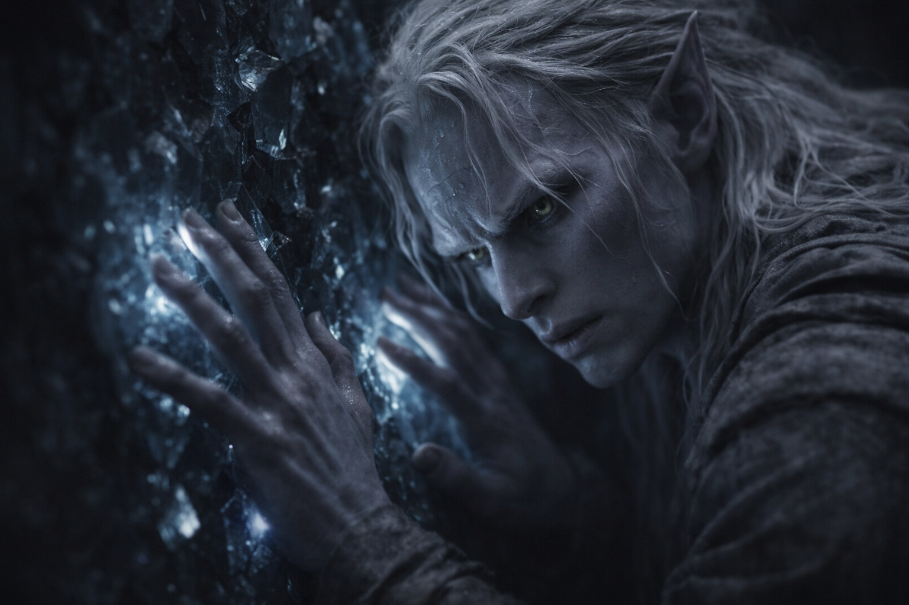
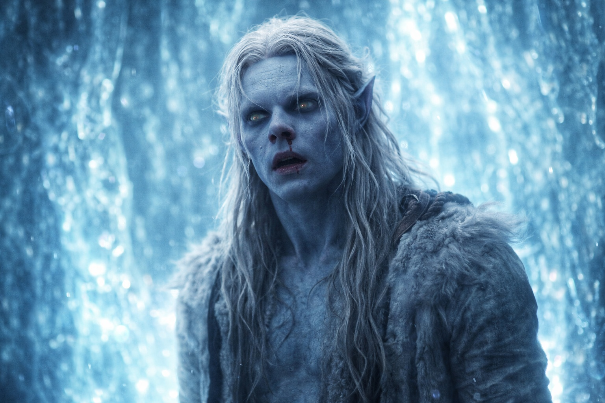

## Capítulo 27 | Parte 2 | Las Profundidades

---

Los hombros se le atascaron en el pasaje estrecho. Se puso de lado y siguió avanzando.

La luz roja lo seguía. El calor le quemaba la espalda y el compuesto perdía efecto. Tenía que tantear apoyos que momentos antes habría visto.

Se adentró más. La grieta que había elegido lo guió a través de un pasaje descendente apenas más ancho que sus hombros, la piedra caliente contra ambos brazos, las venas de cristal engrosándose en las paredes. Lo que habían sido hilos delgados en los túneles superiores ahora eran cuerdas de material oscuro recorriendo el basalto, cada una del ancho de su pulgar, cálidas al tacto y vibrando a una frecuencia demasiado baja para oírse pero presente en sus dientes, su esternón, los pequeños huesos de su oído interno.

Encontró a los Escoricáscaras apiñados en las grietas del siguiente cruce. Solo movieron las antenas cuando pasó junto a ellos.

El pasaje se abrió.

Sus pasos resonaron en un espacio demasiado grande para verlo entero. Solo distinguía unos pasos de suelo y la pared a su lado.

Porque las paredes eran cristal. No veteadas con él. Hechas de él.

Caras de cristal negro cubrían el suelo y las paredes. La luz de depósitos más profundos se reflejaba en sus bordes cuando se movía.

El zumbido le hacía doler los dientes. Apartó la mano de la pared, pero la vibración continuó. Los bordes de su visión palpitaban.

Buscó la Voz de nuevo.

Esperó con la palma contra el pecho.

Nada respondió.

El aire estaba viciado. Respiró despacio hasta que cedió la opresión del pecho.

Su mochila rozó la pared. Una nota clara resonó en la cámara y la vibración de sus huesos cambió.

Dejó de caminar.

La cámara cambió.

Las paredes parecían las mismas. Sin embargo, sentía una presión creciente a su alrededor y no encontraba de dónde venía.

Algo estaba presente que antes no había estado. O siempre había estado, y ahora estaba prestando atención.

Se quedó quieto. El cristal zumbaba. La frecuencia en sus huesos se intensificó, no dolorosamente pero sí con insistencia, como si la vibración estuviera intentando coincidir con algo en él y siguiera encontrando la resonancia equivocada. Su visión pulsó. Los bordes de la cámara se difuminaban y agudizaban en un ritmo que no tenía nada que ver con su latido.

Sabía que lo observaban. La certeza llegó sin palabras ni una imagen que pudiera entender.

Intentó localizar la presencia. En cuanto se concentraba en una parte de la cámara, la sentía también a su espalda. No había una dirección segura hacia la que volverse.

La sangre le llegó al labio superior. Apoyó una mano en la pared para no caer. Todavía podía mover las piernas.

Probó a dar un paso.

La presión cedió. Su visión se estabilizó. No sabía si la presencia se había retirado o si él había dejado de percibirla.

Se limpió la sangre del labio. Su mano tembló. Dejó que temblara porque luchar contra ello costaría energía que no podía permitirse.

Un cristal negro del tamaño de su puño estaba suelto junto a la pared. Lo recogió. Estaba tibio y vibraba en su palma. El dolor de dientes cedió, aunque los dedos se le entumecieron al sujetarlo.

Lo metió en la mochila. Aún le temblaban las manos, pero veía lo bastante bien para examinar el suelo.

Recogió cuatro piezas sueltas más y arrancó dos de un tramo agrietado de la pared. Siete en total. El zumbido disminuía con cada una. Tenía que mirarse los dedos para no dejarlas caer.

Su mochila era pesada. Su nariz había dejado de sangrar. La sangre en su labio se estaba secando, tirando de su piel.

Se agachó bajo el peso de la mochila y esperó hasta poder ponerse de pie sin tambalearse. La montaña volvió a sacudirse sobre él.

---

**Fin del Capítulo 27.2  —> 27.3: [El Precio del Paso: El Zumbido](/el-precio-del-paso-el-zumbido/)**
