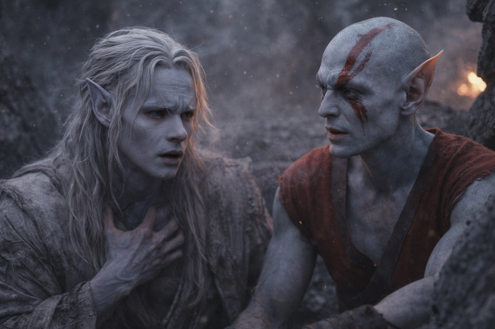
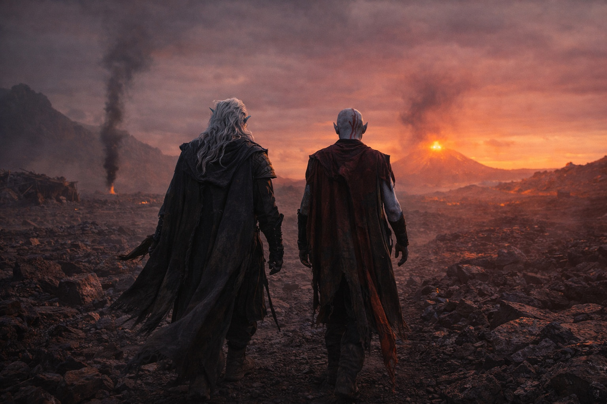

## Capítulo 13 | Parte 5 | El Después

---

La luz cambió sin convertirse en mañana.

Drusniel despertó contra una pared de roca.

Todo dolía.

Elion estaba sentado cerca.

—Te quedaste.

—Volviste por mí.

—¿Nadie había hecho eso antes?

Elion negó con la cabeza.

Drusniel se quitó una escama de óxido de la palma.

—Me trataste como una persona.

—Eres una persona.

Drusniel apartó la mirada primero.

—¿Y ahora? —preguntó Elion.

—Szoravel.

—¿Quién?

—Un mago. Al este. Más allá de los territorios disputados.

—Conozco partes del este.

—¿Por los recuerdos?

—Algunas.

—¿Conoces a Szoravel?

—No.

Drusniel lo miró.

—¿Qué eres?

Elion volvió a estudiar sus manos.

—No lo sé.

—¿Qué puedes hacer?

—Cambiar.

—¿En qué?

—En cosas.

—Específico.

—Lo sé.

Un pequeño movimiento apareció en la esquina de la boca de Elion.

Después desapareció.

—A veces sé cómo se mueve una forma antes de tomarla. Dónde ha estado. Qué la asustó. —Se frotó la muñeca—. Quizá venga de algo que copié. Quizá no. No lo distingo.

—¿Puedes elegir los recuerdos?

—No.

—¿Puedes confiar en ellos?

—No del todo.

Drusniel asintió.

Elion se puso de pie.

—¿Por qué abriste mi jaula?

Drusniel miró las marcas rojas de la muñeca de Elion, donde los barrotes le habían apretado.

—Me quedaban fuerzas para tu cerradura.

—Podías haber seguido de largo.

—Lo sé.

Elion extendió una mano.

—¿Juntos?

Drusniel la tomó.

—Este.

Elion tiró de él hasta ponerlo en pie.

—Este —aceptó—. Caminando libres.

Recogieron el odre, la comida y la manta.

Después empezaron hacia el resplandor volcánico.

---

**Fin de Capítulo 13.5 —> 14.1: [Nombrar Sin Explicar: El Reconocimiento](/nombrar-sin-explicar-el-reconocimiento/)**
