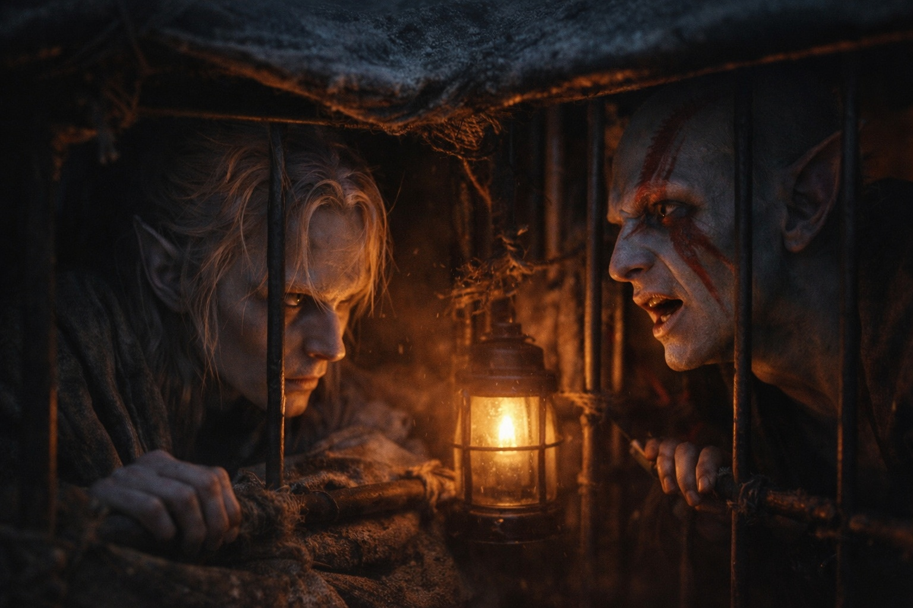
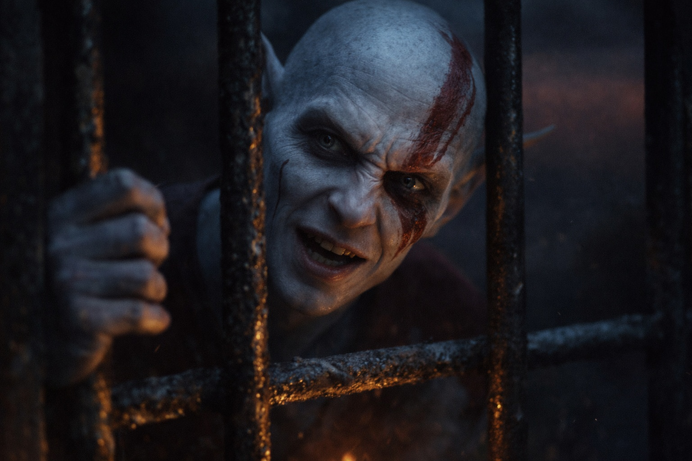

## Capítulo 13 | Parte 2

---

El prisionero de la jaula del fondo habló primero.

—No tienes miedo.

Descanso nocturno.

Dos guardias despiertos.

Los demás junto al fuego.

Drusniel giró hacia la voz.

—¿Debería?

—Todos los demás lo tienen.

La cabeza del prisionero se inclinó más de lo que un cuello debería permitir cómodamente.

—Los guardias. Los otros. Huelen distinto cuando me miran.

—No soy todos los demás.

—No.

Los ojos extraños se estrecharon.

—Cruzaste el Mar de Pesadillas.

Drusniel se quedó inmóvil.

—¿Cómo sabes eso?

El prisionero frunció el ceño.

—Ese es el problema.

—¿Qué problema?

—No son pensamientos. —Buscó las palabras—. Más bien recuerdos. Excepto que no recuerdo haberlos vivido.

Drusniel no dijo nada.

—Un bote. Agua negra. Algo debajo. Después un trato.

La deuda bajo las costillas de Drusniel pulsó una vez.

—¿Recuerdo de quién?

—No lo sé.

—¿Puedes elegir lo que llega?

—No.

—¿Puedes llamar uno de vuelta?

—A veces. Normalmente no.

—¿Llegan cuando tocas algo?

—A veces.

—¿Cuando ves algo?

—A veces.

—Útil.

El prisionero le dirigió una mirada plana.

—No cuando recuerdas morir en un lugar donde nunca has estado.

Justo.

—¿Nombre?

—Elion.

La respuesta llegó de inmediato.

—Ese es mío.

—¿Todo lo demás?

Elion miró sus propias manos.

—Recuerdo jaulas. Correr. Rostros que no conozco. Cuerpos que se sienten familiares hasta que pienso en ellos.

Flexionó dedos que se doblaban un poco demasiado.

—Pero el nombre es mío.

—Drusniel.

Elion lo repitió.

—Nombre antiguo.

—Lengua antigua.

—¿Significado?

—Filo de sombra.

Elion lo consideró.

—Mejor que el mío. No sé qué significa el mío.

Los guardias se movieron junto al fuego.

Menos de un minuto.

—¿Por qué estás aquí? —preguntó Drusniel.

—Fui descuidado.

—¿Haciendo qué?

—Siendo libre.

—¿Cuánto tiempo?

—Tres años.

Elion miró la puerta de la jaula.

—Antes de eso, jaulas.

Diferentes amos, explicó. Diferentes lugares. Recuerdos que empezaban y terminaban entre barrotes.

—Dejé de vigilar las jaulas.

Eso era concreto.

—¿Qué harías si esta se abriera?

Elion lo miró.

Por primera vez, la expresión fue fácil de leer.

—Caminar libre.

---

**Fin de Capítulo 13.2 —> 13.3: [El Que Camina Libre: La Elección](/el-que-camina-libre-la-eleccion/)**
